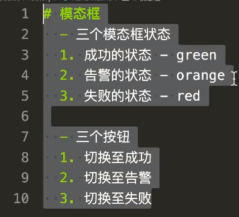
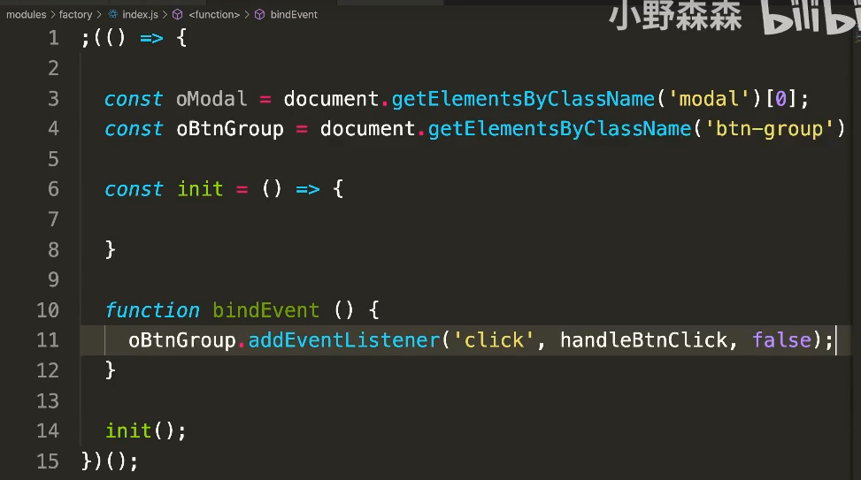
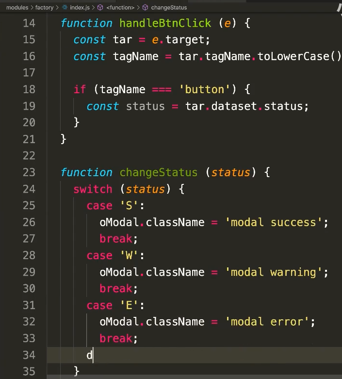

https://www.bilibili.com/video/BV1uy4y1872c

# 1 非常普通的模块方式实现方案

```js
const { resolve } = require('path');
const express = require('express');
const app = express();
app.use('/',express.static(resolve(__dirname, '../modules'));
app.listen(3333);
```








# 2 易扩展，易复用，易维护的工厂模式实现方案


