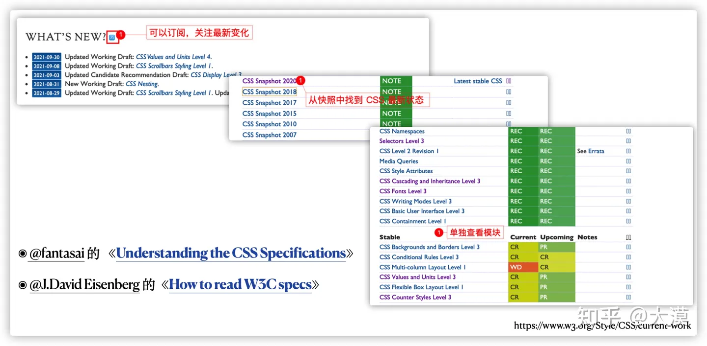
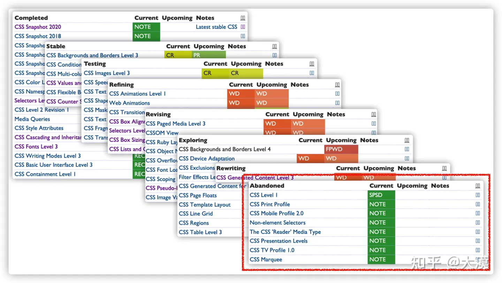
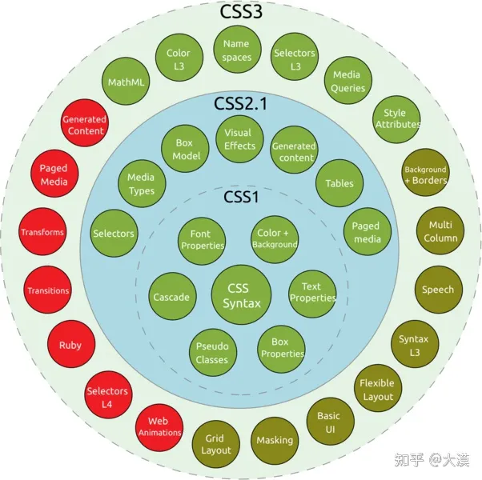
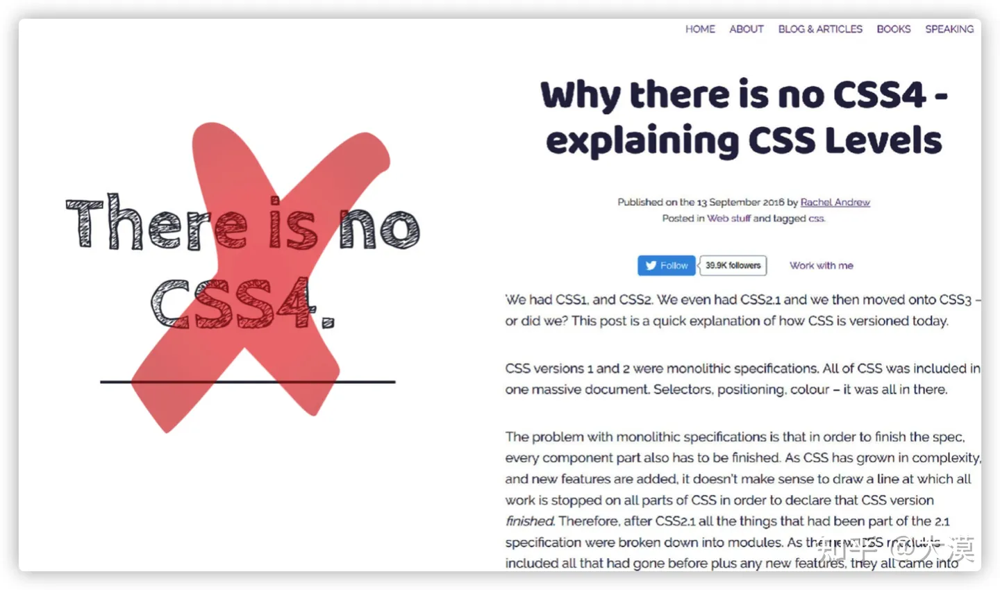
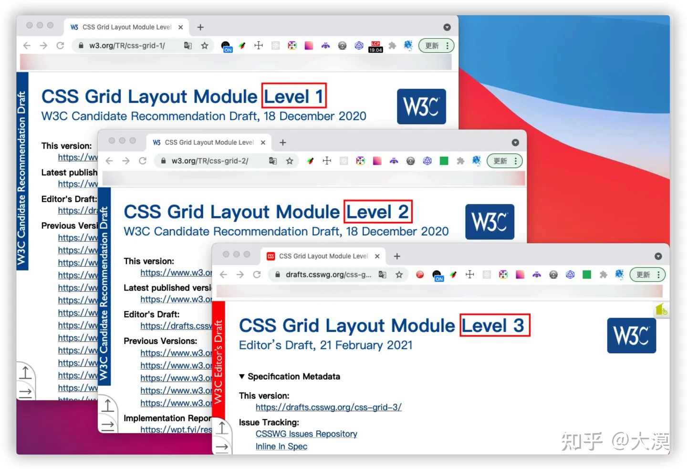

我认识的W3C规范

https://zhuanlan.zhihu.com/p/425615281

在 W3C 中也相应有几个方面的相关规范。我把这些称为是构建 Web 的核心能力： 

- **[CSS ⼯作组](https://link.zhihu.com/?target=https%3A//www.w3.org/Style/CSS/)** 发布 [CSS 2020 技术概览](https://link.zhihu.com/?target=https%3A//www.w3.org/TR/css-2020/)，记录 100 多个 CSS 规范的技术进展
- **[HTML ⼯作组](https://link.zhihu.com/?target=https%3A//www.w3.org/groups/wg/htmlwg)**(HTMLWG) 与**[WHATWG](https://link.zhihu.com/?target=https%3A//whatwg.org/)**合作发布了 2020 版本的[HTML](https://link.zhihu.com/?target=https%3A//html.spec.whatwg.org/review-drafts/2020-01/)与[DOM](https://link.zhihu.com/?target=https%3A//dom.spec.whatwg.org/)正式推荐标准
- **[⽆障碍指南⼯作组](https://link.zhihu.com/?target=https%3A//www.w3.org/WAI/GL/)**发布了[WCAG 3.0](https://link.zhihu.com/?target=https%3A//www.w3.org/TR/wcag-3.0/) ⼯作草案(WD)，除继承[WCAG 2.2](https://link.zhihu.com/?target=https%3A//www.w3.org/TR/WCAG22/)及以前版本([2.1](https://link.zhihu.com/?target=https%3A//www.w3.org/TR/WCAG21/)、[2.0](https://link.zhihu.com/?target=https%3A//www.w3.org/TR/WCAG20/))之外，还⾸次纳⼊ [UAAG 2.0](https://link.zhihu.com/?target=https%3A//www.w3.org/TR/UAAG20/) (⽤户代理⽆障碍指南) 和[ATAG 2.0](https://link.zhihu.com/?target=https%3A//www.w3.org/TR/ATAG20/) (创作⼯具⽆障碍指南) 的内容并进⾏扩展。将提供⼀个新模式来更全 ⾯和灵活地解决 Web ⽆障碍（可访问性）问题

除了这几个方面，还有： 

- **[Web 性能⼯作组](https://link.zhihu.com/?target=https%3A//www.w3.org/webperf/)**继续发布性能监测与优化相关的 API
- **[Web 应⽤⼯作组](https://link.zhihu.com/?target=https%3A//w3c.github.io/webappswg/)**持续客户端应⽤接⼜相关技术讨论，Web 在线编辑相关的技术接⼜，如⾼亮选择、虚拟键盘、内 容选择等，获得越来越多的关注
- **[WPT Web 平台](https://link.zhihu.com/?target=https%3A//wpt.fyi/results/%3Flabel%3Dexperimental%26label%3Dmaster%26aligned)**测试项⽬持续协助标准实现统

> 你可能好奇这里怎么没有 JavaScript 方面的标准呢？是的，JavaScript 相关的标准规范不在 W3C 中，他由单独的组织 ECMA-TC39 来维护，并且相关规范都在 ECMAScript规范中。

# 1.HTML

对于 HTML 来说，一直以来是有两个组织在维护的，即 **[HTML ⼯作组](https://link.zhihu.com/?target=https%3A//www.w3.org/groups/wg/htmlwg)**(HTMLWG) 与**[WHATWG](https://link.zhihu.com/?target=https%3A//whatwg.org/)**。早期他们是两个独立的组织，即使到今天他们也是两个独立的组织，只不过随着后期的发展，有关于 HTML 相关的标准都由 WHATWG 组织来维护和推进。  平时在查阅有关于 HTML 相关规范，我也更喜欢查阅 WHATWG 维护的 HTML 规范。该规范提供了 Web 的 HTML 方面的所有规范，比如 HTML 元素、属性、DOM API 等。在这个规范中可以查阅到你想查阅的资料。也能提供你使用 HTML 标签元素的理论依据。

# 2.CSS

对于 CSS 规范来说，要比 HTML 要复杂的多。不过有关于 W3C 的 CSS 相关的规范都可以在 《[CSS current work & how to participate](https://link.zhihu.com/?target=https%3A//www.w3.org/Style/CSS/current-work)》 中获取。我们在这个页面中可以获取到有关于 CSS 规范的众多信息，或者说所有关于 CSS 规范的信息。  我们可以在这里获取到一些重要信息： 

- 订阅有关于 CSS 最新特性
- 从发布的 CSS 快照报告中获取 CSS 规范发展状态，比如发布 [CSS 2020 技术概览](https://link.zhihu.com/?target=https%3A//www.w3.org/TR/css-2020/)，记录 100 多个 CSS 规范的技术进展
- 从单独的规范模块中查阅 CSS 相关特性

说实话，阅读 CSS 规范是痛苦的，对于一位初次或有一定经验同学来说一样是如此，如果你想更好的掌握阅读 CSS 规范的技巧，那么下面两篇文章就非常值得阅读： 

- @fantasai的《**[Understanding the CSS Specifications](https://link.zhihu.com/?target=https%3A//www.w3.org/Style/CSS/read)**》
- @J.David Eisenberg的《**[How to read W3C specs](https://link.zhihu.com/?target=https%3A//www.alistapart.com/articles/readspec/)**》

在 CSS Current Work 页面有关于功能模块的表格中，至少可以获得三个方面的信息。其一是规范状态（States）： 

- Completed（已完成）
- Stable（稳定）
- Testing（测试）
- Refining（完善）
- Revising（修改）
- Exploring（探索）
- Rewriting（重写）
- Abandoned（废弃）

除了了解规范所处状态之外，还可以知道规范所处的阶段，因为每一个规范成为标准都会经历一个漫长的过程： 

- ① **编辑草案 (ED: Editors’ Draft)**：规范的初始阶段，可能很粗糙，也没有什么要求，也可能不会被⼯作组批准。也是每个修订版本必经阶段，每 次变更都是先从⼀个 ED 中产⽣，然后才发布出来
- ②**[⾸个公开⼯作草案(FPWD:First Public Working Draft)](https://link.zhihu.com/?target=https%3A//www.w3.org/2020/Process-20200915/%23fpwd)**：⼀项规范的⾸个公开发布版本，它应该准备就绪，以接受⼯作组的公开反馈 （**`FPWD`**）
- ③**[⼯作草案(WD: Working Draft)](https://link.zhihu.com/?target=https%3A//www.w3.org/2020/Process-20200915/%23RecsWD)**：在第⼀个 WD 之后，还会有更多的 WD出来。这些 WD 会吸收来⾃⼯作组和社区的反馈，⼀版接着⼀版⼩幅改 进。浏览器⼚商早期实现通常是从这个阶段开始的 (**`WD`**)
- ④ **[候选推荐规范(CR:Candidate Recommendation)](https://link.zhihu.com/?target=https%3A//www.w3.org/2020/Process-20200915/%23RecsCR)**：⼀个相对稳定的版本，此时⽐较适合实现和测试。⼀项规范只有具备⼀套完整的测试套件和 两个独⽴的实现之后，才有可能继续推进到下⼀阶段（**`CR`**）
- ⑤**[候选推荐草案(CRD:Candidate Recommendation Draft)](https://link.zhihu.com/?target=https%3A//www.w3.org/2020/Process-20200915/%23RecsCR)**：CRD 发布在 W3C 的技术报告页⾯(TR)上，以整合⼯作组打算纳⼊后续候选推荐快 照(CRS)的前⼀个候选推荐快照中的变化。可以让⼤家更⼴泛地审查这些变化，并便于参考整合后的规范 (**`CRD`**)
- ⑥**[提名推荐规范(PR:Proposed Recommendation)](https://link.zhihu.com/?target=https%3A//www.w3.org/2020/Process-20200915/%23RecsPR)**：这是 W3C 会员公司对这项规范表达反对意见的最后机会。实际上他们很少在这个阶段提出异 议，因此每个 PR 推进到下⼀阶段（也是最后⼀个阶段）只是时间问题（**`PR`**）
- ⑦**[正式推荐规范(REC:Recommendation)](https://link.zhihu.com/?target=https%3A//www.w3.org/2020/Process-20200915/%23RecsW3C)**：⼀项 W3C 技术规范的最终阶段 （**`REC`**）
- ⑧**[被取代的推荐规范(SPSD:Superseded Recommendation)](https://link.zhihu.com/?target=https%3A//www.w3.org/2020/Process-20200915/%23RecsObs)**：缺少⾜够的市场相关性，被 W3C 推荐的较新版本所取代的规范 （**`SPSD`**）
- ⑨**[⼯作组说明(Note)](https://link.zhihu.com/?target=https%3A//www.w3.org/2020/Process-20200915/%23WGNote)**：不打算成为标准的⽂档。通常记录规范以外的信息，⽐如规范的⽤例及其最佳实践，解释规范被弃⽤的原因等（**`NOTE`**）

对于每一个特性，只有到了 WD 阶段才有浏览器开始实施，当然，很多特性在这个阶段也开始运用到了Web 开发当中。事实如此，即使到今天，CSS 中很多特性都还处于 WD 阶段，但也同时被运用于生产中。换句话说，并不是每个属性只有到了 PR 或 REC 阶段才能被用于生产环境。  以前描述 CSS 都是使用版本号来描述的，比如说 CSS 1.0 ，CSS 2.0， CSS 2.1 和 CSS3 之类：

> 但随着 CSS 的功能模块越来越多，而且每个功能模块发展进度也有所差异。后面定义 CSS 规范就不再以整体版本号来描述了，比如说，以后就不会再有 CSS 4.0 之类的说法了： 

> 详细可阅读 《[Why there is no CSS4 explaining CSS Levels](https://link.zhihu.com/?target=https%3A//rachelandrew.co.uk/archives/2016/09/13/why-there-is-no-css4-explaining-css-levels/)》

基于这些原因，现在 W3C 的 CSS 工作组在维护 CSS 功能模块都是以单独模块的版本来维护，比如 CSS Grid 模块，他分为 Levle1，Level2 和 Level3 之类： 

