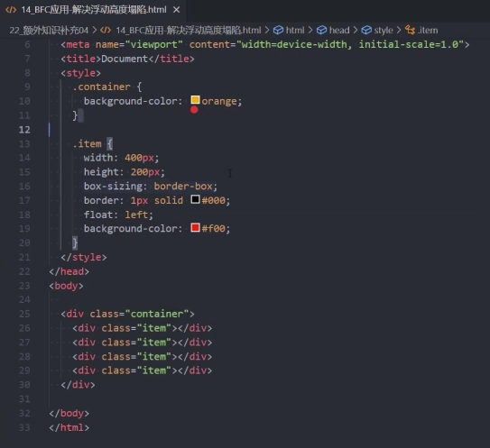
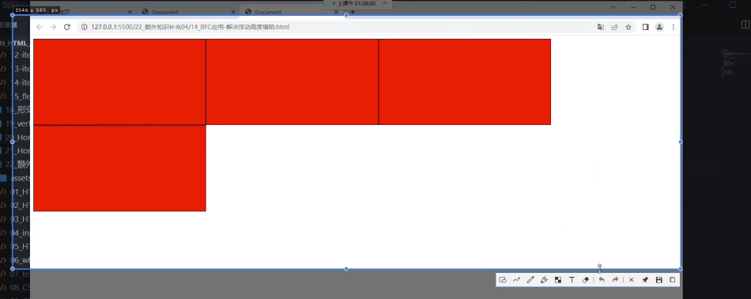
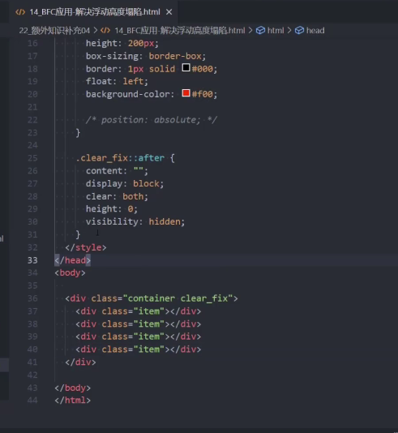
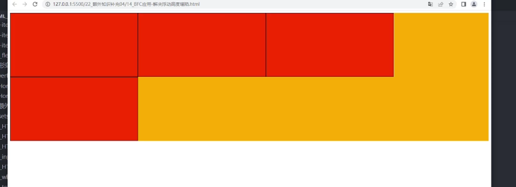
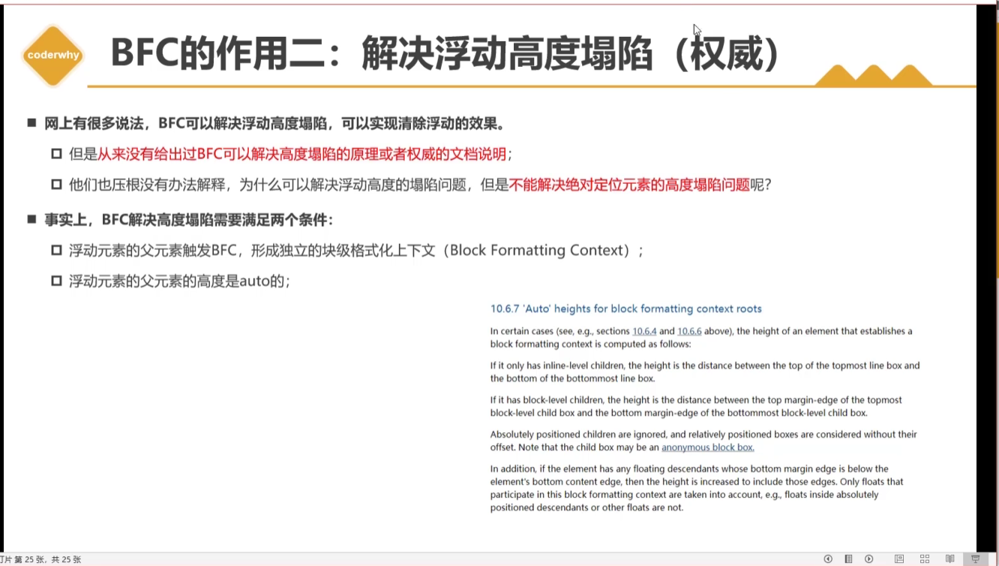

https://www.bilibili.com/video/BV18L4y1N7g3/?spm_id_from=333.880.my_history.page.click&vd_source=a7089a0e007e4167b4a61ef53acc6f7e

**FC：格式化上下文**

看不见父元素的背景色，因为浮动元素脱离标准流，就不会将高度汇报给父元素。所以最终父元素没有高度。

怎么解决高度塌陷的问题？

方案一：最常见的做法是清除浮动

为什么伪元素这个有用？？？

方案二： 给container加’overflow：auto‘

加’overflow：auto‘后会形成一个新的BFC

