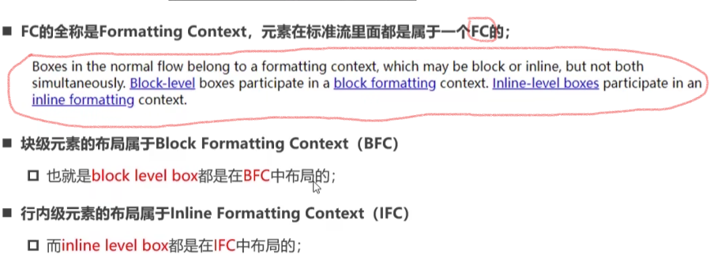
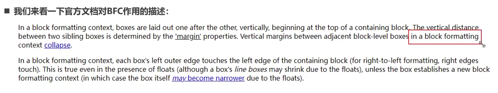
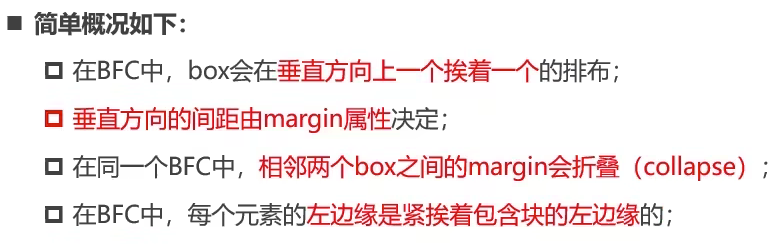
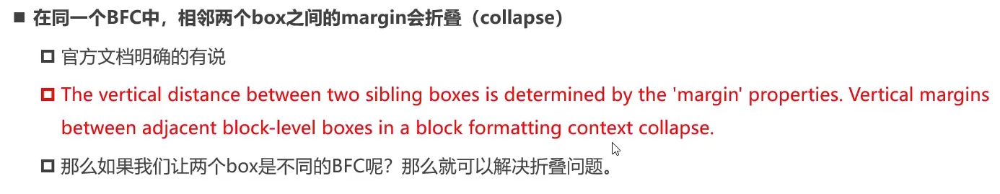
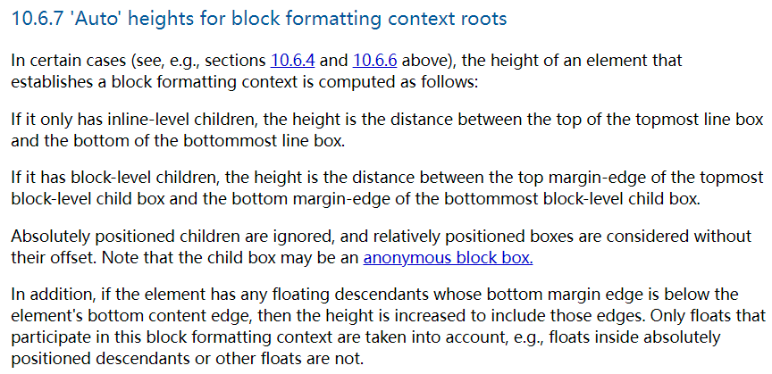

https://www.bilibili.com/video/BV18L4y1N7g3/?spm_id_from=333.880.my_history.page.click&vd_source=a7089a0e007e4167b4a61ef53acc6f7e

 视频2min处正式开始

# 1. **FC——格式化上下文**

# 2. BFC——块级格式化上下文

> [官方文档](https://www.w3.org/TR/CSS2/visuren.html#normal-flow)
>
> [字节跳动前端面试题](https://www.cnblogs.com/yaya-003/p/12652177.html)

2.1 BFC是什么？——块级元素所在的布局就叫BFC

# 3. BFC有什么作用，能解决什么问题？

## 3.1 解决margin的折叠问题

## 3.2 解决浮动高度塌陷问题

### 3.2.1 现象

看不见父元素的背景色，因为**浮动元素脱离标准流**，就不会将高度汇报给父元素。所以最终父元素没有高度。

怎么解决高度塌陷的问题？

### 3.2.2 方案一：清除浮动

为什么伪元素这个有用？？？

### 3.2.3 方案二： 给container加’overflow：auto‘

加’overflow：auto‘后会形成一个新的BFC

https://www.w3.org/TR/CSS2/visudet.html#root-height

