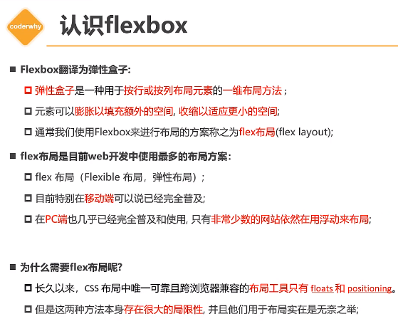
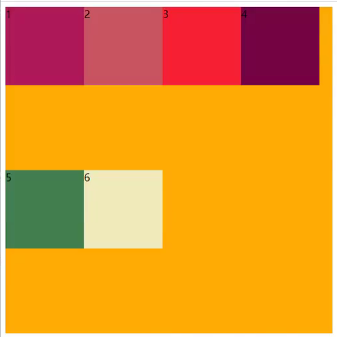
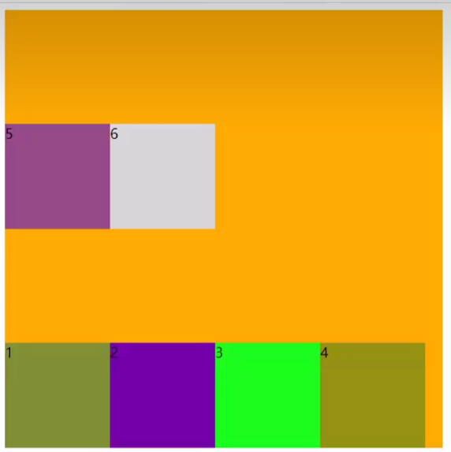
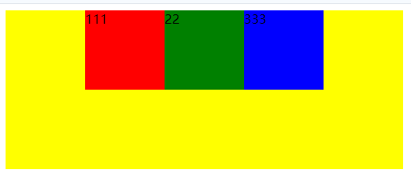
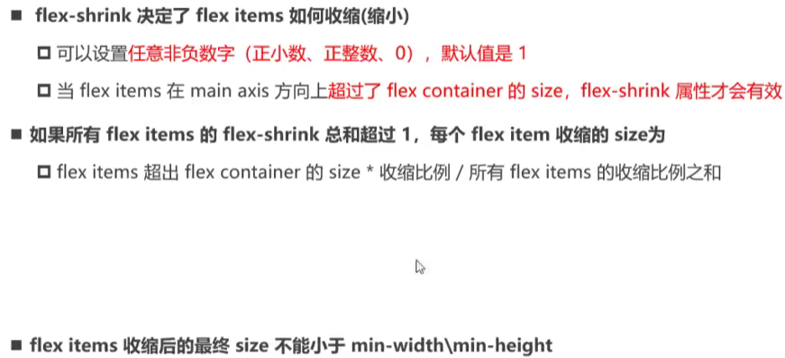
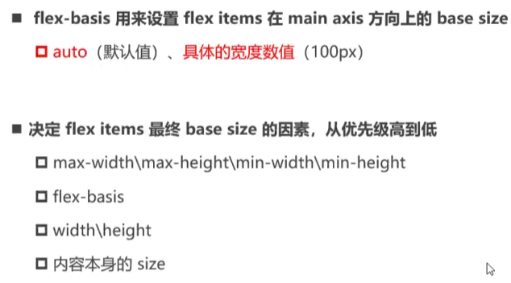
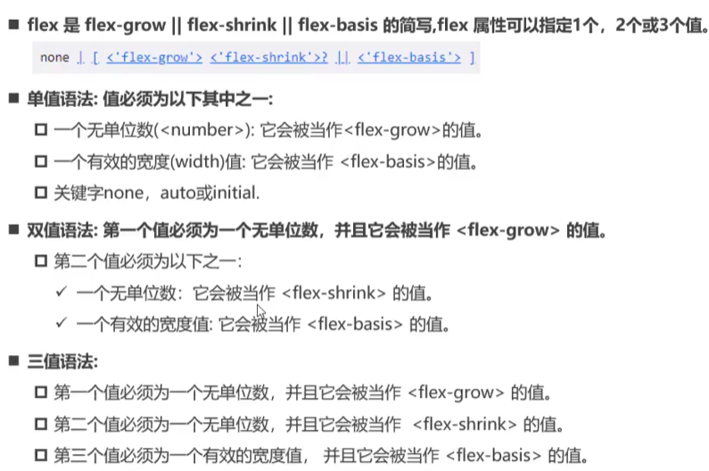

https://www.bilibili.com/video/BV1pK411X7sn/?p=2&spm_id_from=333.880.my_history.page.click

# 1. 认识flex布局和flex布局的由来

| 1.为什么要使用flex布局？ |  |
| :----------------------: | :----------------------------------------------------------: |

# 2. 两个重要概念 container && item


# 3. flex布局模型 主轴 && 交叉轴

|  |  |
| ------------------------------------------------------------ | ------------------------------------------------------------ |

# 4. container  flex-direction 主轴方向

- 决定了元素排布的方向，这种说法是错误的

- flex-direction是决定了**主轴**的方向

| 1.为什么还会有column和column-reverse这两个值？<br>   因为主轴方向还可以朝下方 |  |
| ------------------------------------------------------------ | ------------------------------------------------------------ |

# 5. container  flex-wrap  单行 or 多行展示

| 1.wrap-reverse是什么表现？（见第二张图）<br>                       |  |
| ------------------------------------------------------------ | ------------------------------------------------------------ |

# 6. flex-flow 简写属性


# 6. container   justify-content 决定主轴上item的分布方式


> `justify-content:center`居中对齐时，每一个item之间有空隙吗？——没有
>
> 

# 7. container   align-items 决定交叉轴上item的分布方式


# 8. container  align-content

# [9. item order](https://www.bilibili.com/video/BV1pK411X7sn?p=9&vd_source=a7089a0e007e4167b4a61ef53acc6f7e)


# 10. item align-self

# [11. item flex-grow  flex-shrink](https://www.bilibili.com/video/BV1pK411X7sn?p=11&spm_id_from=pageDriver&vd_source=a7089a0e007e4167b4a61ef53acc6f7e)

|  |  |
| ------------------------------------------------------------ | ------------------------------------------------------------ |

# [12. item flex-basis](https://www.bilibili.com/video/BV1pK411X7sn?p=12&spm_id_from=pageDriver&vd_source=a7089a0e007e4167b4a61ef53acc6f7e)

|  |  |
| ------------------------------------------------------------ | ------------------------------------------------------------ |

 # [13. item flex](https://www.bilibili.com/video/BV1pK411X7sn/?p=13&spm_id_from=pageDriver&vd_source=a7089a0e007e4167b4a61ef53acc6f7e)




> `flex: 1` 相当于：
>
> ```css
> flex-grow: 1;
> flex-shrink: 1; // (默认值)
> flex-basis: 0%;
> ```
>
> 假设你有一个水平排列的容器，其中包含三个子元素：
>
> ```html
> <div style="display: flex;">
>   <div style="flex: 1; background-color: lightcoral;">Box 1</div>
>   <div style="flex: 2; background-color: lightblue;">Box 2</div>
>   <div style="flex: 1; background-color: lightgreen;">Box 3</div>
> </div>
> ```
>
> 在这个例子中：
>
> - `Box 1` 和 `Box 3` 的 `flex` 值都是 1，所以它们会占据相同的空间。
> - `Box 2` 的 `flex` 值为 2，所以它会占据比 `Box 1` 和 `Box 3` 多一倍的空间。
>
> 这个布局的结果是，`Box 1` 和 `Box 3` 占据容器宽度的四分之一，而 `Box 2` 占据容器宽度的一半。


```javascript
checkbox:{
	checked: { val: "1" },
	checkedState: {
		val: "0052",
		font: "Wingdings 2"
	},
	uncheckedState： {
		val: "2610",
		font: "MS Gothic"
	}
}
```

