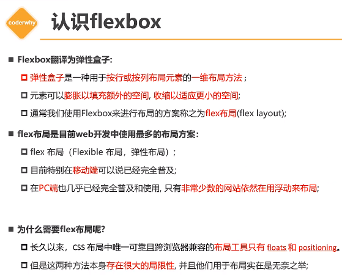
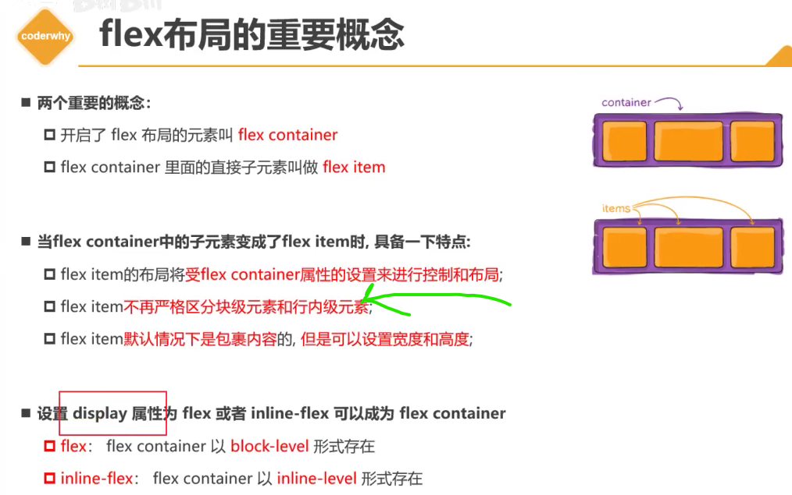
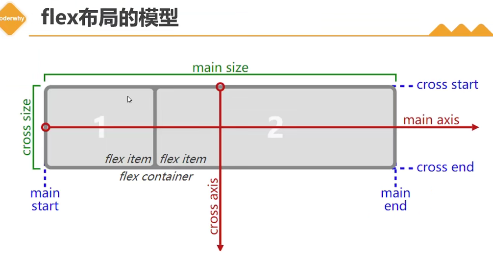
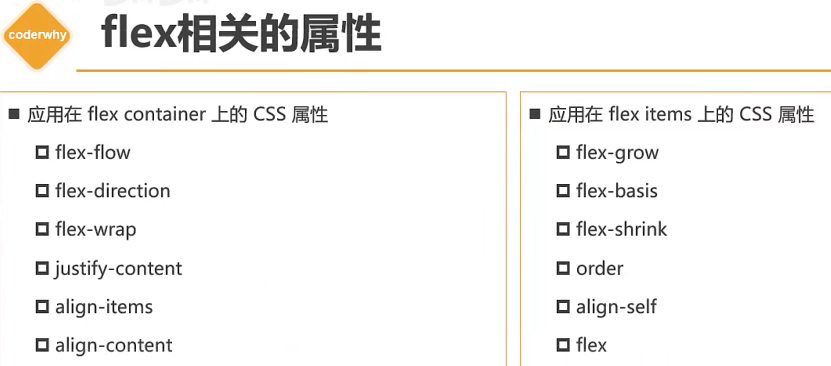
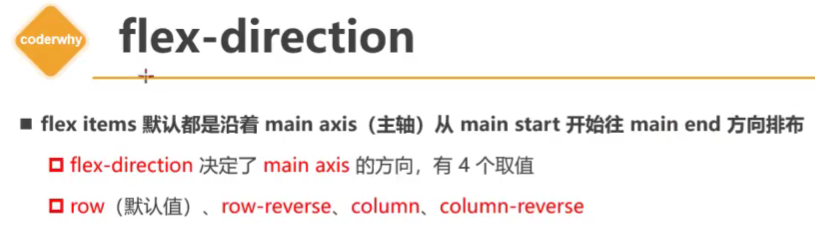
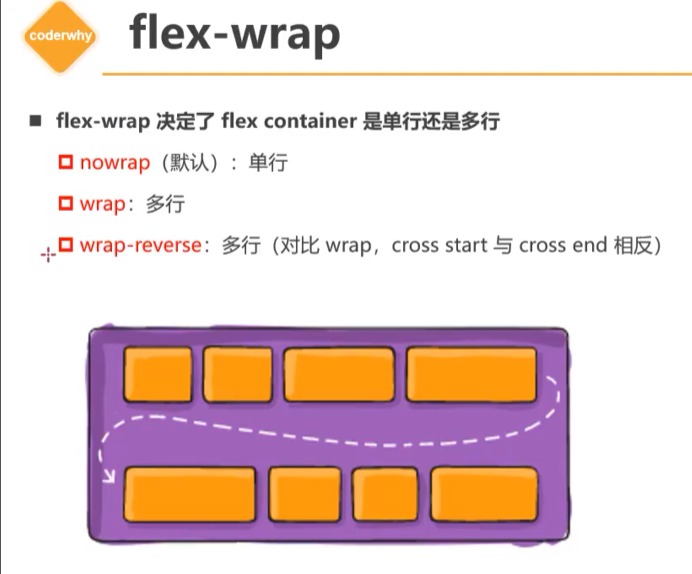
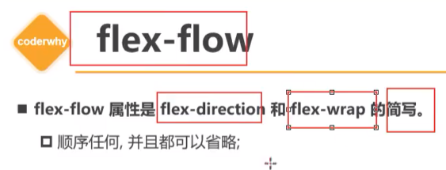
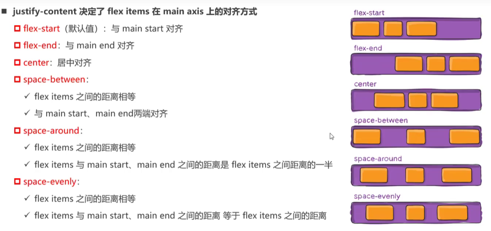
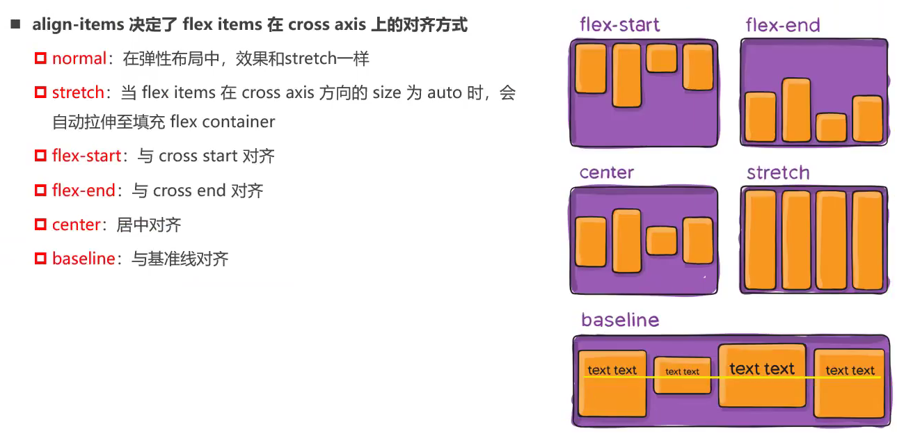

https://www.bilibili.com/video/BV1pK411X7sn/?p=2&spm_id_from=333.880.my_history.page.click

# 1.认识flex布局和flex布局的由来

# 2.两个重要概念-container-item

# 3.flex布局模型-主轴和交叉轴

# 4.container             flex-direction

决定了元素排布的方向，这种说法是错误的。

flex-direction是决定了主轴的方向

# 5.container     wrap      flow

# 6.container      justify-content

# 7.container      align-items

# 8.container      align-content

# 9.item-order

# 10.item-slign-self

