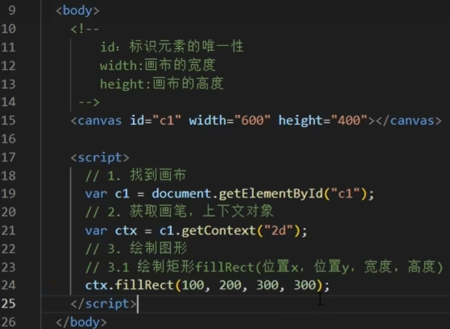
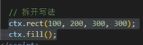
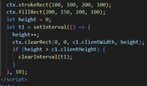

# [1. 初识canvas](https://www.bilibili.com/video/BV1kv4y1D7uS/?spm_id_from=333.337.search-card.all.click&vd_source=a7089a0e007e4167b4a61ef53acc6f7e)





# [2. Canvas上下文对象与浏览器支持](https://www.bilibili.com/video/BV1kv4y1D7uS/?p=2&spm_id_from=pageDriver&vd_source=a7089a0e007e4167b4a61ef53acc6f7e)

# [3. Canvas填充与路径绘制](https://www.bilibili.com/video/BV1kv4y1D7uS/?p=3&spm_id_from=pageDriver&vd_source=a7089a0e007e4167b4a61ef53acc6f7e)

```js
// 路径绘制矩形（x1,y1,矩形宽度，矩形高度）
ctx.strokeRect(100,100,100,100)
// 清除矩形
// ctx.clearRect(起始点x,起始点y,宽，高)
ctx.clearRect(0,0,c1.clientWidth，c1.clientHeigt)
```

| 渐变清除矩形：                                               |                                                              |
| ------------------------------------------------------------ | ------------------------------------------------------------ |
|  |  |

# [4. Canvas绘制圆弧与笑脸](https://www.bilibili.com/video/BV1kv4y1D7uS/?p=4&spm_id_from=pageDriver&vd_source=a7089a0e007e4167b4a61ef53acc6f7e)


# 5. 绘制折线线段

