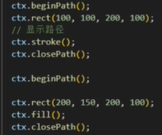
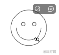

# [1. 初识canvas](https://www.bilibili.com/video/BV1kv4y1D7uS/?spm_id_from=333.337.search-card.all.click&vd_source=a7089a0e007e4167b4a61ef53acc6f7e)


# [2. Canvas上下文对象与浏览器支持](https://www.bilibili.com/video/BV1kv4y1D7uS/?p=2&spm_id_from=pageDriver&vd_source=a7089a0e007e4167b4a61ef53acc6f7e)

# [3. Canvas填充与路径绘制](https://www.bilibili.com/video/BV1kv4y1D7uS/?p=3&spm_id_from=pageDriver&vd_source=a7089a0e007e4167b4a61ef53acc6f7e)

```js
// 路径绘制矩形（x1,y1,矩形宽度，矩形高度）
ctx.strokeRect(100,100,100,100)
// 清除矩形
// ctx.clearRect(起始点x,起始点y,宽，高)
ctx.clearRect(0,0,c1.clientWidth，c1.clientHeigt)
```

| 渐变清除矩形：                                               |                                                              |
| ------------------------------------------------------------ | ------------------------------------------------------------ |
|  |  |

# [4. Canvas绘制圆弧与笑脸](https://www.bilibili.com/video/BV1kv4y1D7uS/?p=4&spm_id_from=pageDriver&vd_source=a7089a0e007e4167b4a61ef53acc6f7e)



arc的使用

[`arc(x, y, radius, startAngle, endAngle, anticlockwise)`](https://developer.mozilla.org/zh-CN/docs/Web/API/CanvasRenderingContext2D/arc)

画一个以（x,y）为圆心的以 radius 为半径的圆弧（圆），从 startAngle 开始到 endAngle 结束，按照 anticlockwise 给定的方向（默认为顺时针）来生成

> **备注：** `arc()` 函数中表示角的单位是弧度，不是角度。角度与弧度的 js 表达式：
>
> **弧度=(Math.PI/180)\*角度。**

https://developer.mozilla.org/zh-CN/docs/Web/API/Canvas_API/Tutorial/Drawing_shapes#%E5%9C%86%E5%BC%A7

# [5. 绘制折线线段](https://www.bilibili.com/video/BV1kv4y1D7uS/?p=5&spm_id_from=pageDriver&vd_source=a7089a0e007e4167b4a61ef53acc6f7e)

https://developer.mozilla.org/zh-CN/docs/Web/API/CanvasRenderingContext2D/lineTo

# [6. arcTo绘制圆弧方式](https://www.bilibili.com/video/BV1kv4y1D7uS?p=6)

https://developer.mozilla.org/zh-CN/docs/Web/API/CanvasRenderingContext2D/arcTo

# [7. 二次贝塞尔曲线实现聊天气泡框](https://www.bilibili.com/video/BV1kv4y1D7uS?p=7&spm_id_from=pageDriver&vd_source=a7089a0e007e4167b4a61ef53acc6f7e)

https://developer.mozilla.org/zh-CN/docs/Web/API/CanvasRenderingContext2D/quadraticCurveTo

# 8. 三次贝塞尔曲线实现献给朋友的爱心

