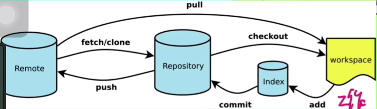

# 1. 基础流程图




> workSpace：工作区
>
> Index：暂存区
>
> Repository：本地仓库
>
> Remote：远程仓库

# 2. 不同环节下回退代码

## 1. 在工作区

```bash
git checkout .
```

- git checkout可以用来切换分支，也可以用来恢复文件的状态
- `git checkout .` 命令用于将工作目录中的所有文件恢复到最新提交的状态。简单来说，它会丢弃你对工作目录中所有文件的修改，让它们回到上一次提交时的状态。这在你不想保留对文件的任何本地更改时非常有用。需要注意的是，这个命令不会影响暂存区中的文件，仅仅是对工作目录中的文件进行操作。

## 2. 在暂存区


# 3. git fetch和git pull的区别


