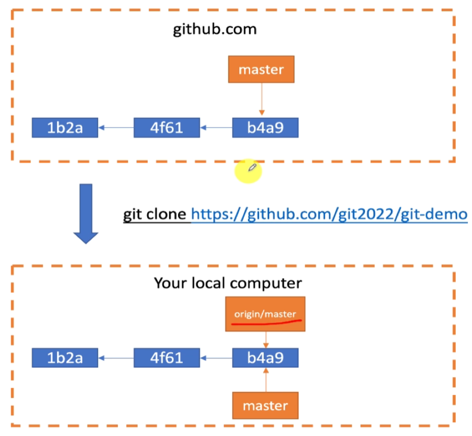
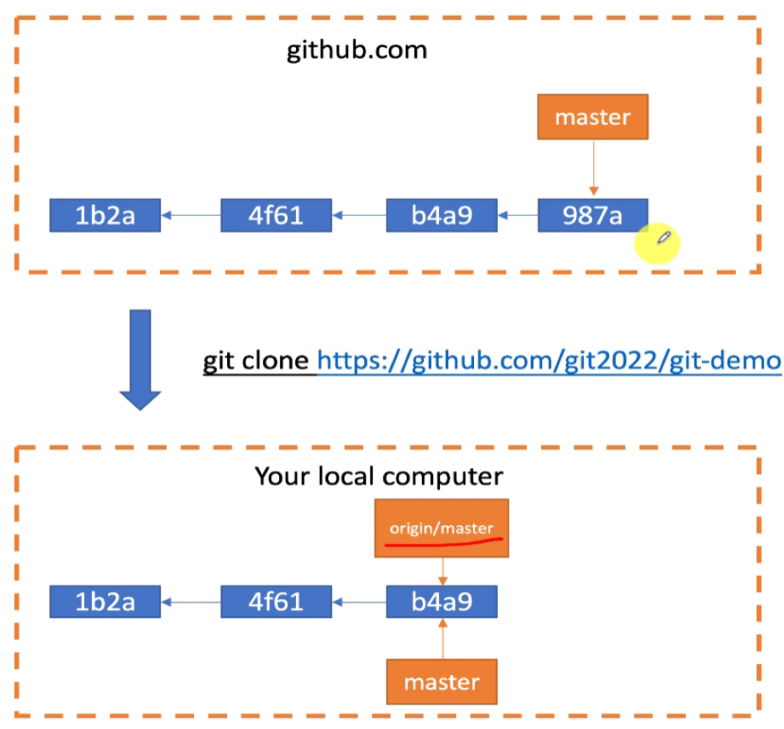
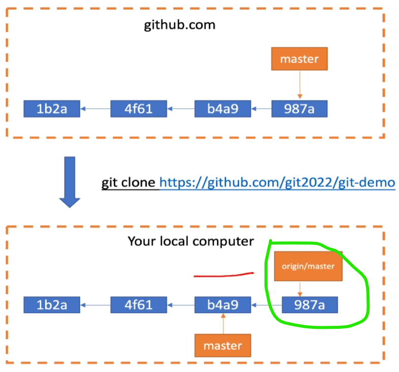
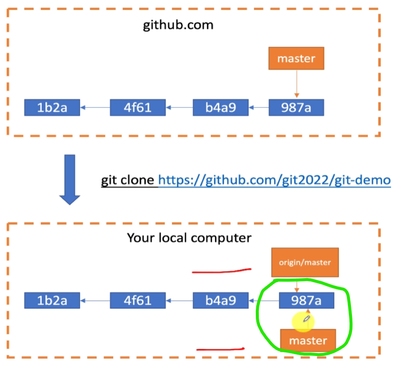

# 1. 基础流程图


> workSpace：工作区
>
> Index：暂存区
>
> Repository：本地仓库
>
> Remote：远程仓库

# 2. 不同环节下回退代码

## 1. 在工作区

```bash
git checkout .
```

- git checkout 可以用来切换分支，也可以用来恢复文件的状态
- `git checkout .` 命令用于将工作目录中的所有文件恢复到最新提交的状态。简单来说，它会丢弃你对工作目录中所有文件的修改，让它们回到上一次提交时的状态。这在你不想保留对文件的任何本地更改时非常有用。需要注意的是，这个命令不会影响暂存区中的文件，仅仅是对工作目录中的文件进行操作。

## 2. 在暂存区

```bash
git reset // 移除暂存区的更改，但保留工作区的更改
git reset --hard // 同时移除暂存区和工作区的更改
```

## 3. 在本地仓库

```bash
git reset --soft HEAD~1 // 移除本地仓库的更改，但保留暂存区和工作区的更改
git reset --hard HEAD~1 // 同时移除本地仓库，暂存区和工作区的更改
git reset --hard <commit_hash> // 丢弃该提交之后的更改
```

> 在 Git 中，HEAD 表示当前分支的最新提交
>
> HEAD~1 表示当前提交的前一个提交

## 4. 在远程仓库

# 3. HEAD 的含义

在 Git 中，`HEAD` 是一个指针，它指向当前检出的分支的最新提交。简而言之，`HEAD` 表示你当前所在的位置或状态。

具体作用包括：

1. **指向当前分支**：`HEAD` 通常指向当前分支的最新提交。例如，如果你在 `main` 分支上工作，那么 `HEAD` 就指向 `main` 分支的最新提交。

2. **记录当前提交**：`HEAD` 记录了你当前工作的提交。这对于执行提交、回退、合并等操作非常重要，因为 Git 需要知道你当前的基准点。

3. **控制工作目录和暂存区**：当你执行如 `git checkout` 或 `git reset` 等命令时，`HEAD` 会更新，影响你工作目录和暂存区的内容。例如，`git checkout` 会更新 `HEAD` 指向的新分支或提交，从而改变工作目录的内容。

4. **分离 HEAD 状态**：当你检出一个具体的提交而不是分支时，`HEAD` 处于“分离头部”状态。这意味着你正在查看一个历史提交，而不是跟随某个分支的最新变化。在这种状态下所做的提交不会更新任何分支，除非你显式地创建一个新分支并将这些提交合并进去。

`HEAD` 是 Git 中非常核心的一个概念，用于跟踪你当前的工作状态和位置。

在 Git 中，你可以使用以下命令查看 `HEAD` 的内容：

1. **查看 `HEAD` 的指向**：

   ```bash
   git symbolic-ref HEAD
   ```

   这将显示当前 `HEAD` 指向的分支名称。例如：`refs/heads/master`

2. **查看 `HEAD` 的提交 ID**：

   ```bash
   git rev-parse HEAD
   ```

   这将显示 `HEAD` 指向的提交的哈希值。例如：`fa26ff022d565e83ae3dc6579f9707be6ef1479c`

3. **查看 `HEAD` 的详细信息**：
   ```bash
   git log -1
   ```
   这将显示 `HEAD` 所指向的最新提交的详细信息。例如：
   
   ```bash
   commit abf50069738192838891c66e68385dfe4c41d6b0 (HEAD -> master, origin/master, origin/HEAD)
   Merge: 86fcdc07 05643f6a
   Author: unknown <2987642862@qq.com>
   Date:   Wed Aug 7 21:03:15 2024 +0800
   
       解决冲突
   ```

# 4. git branch & git branch -r

> https://www.bilibili.com/video/BV1AT4y1w7VR/?spm_id_from=pageDriver&vd_source=a7089a0e007e4167b4a61ef53acc6f7e
>
> git branch只能查看本地分支，无法获取远程仓库的分支

```bash
git branch -r
```

```
// 输出
origin/HEAD -> origin/master // 这是一个指向远程默认分支的符号链接
origin/master
```

```
tree .git
```

# [5. git fetch 和 git pull 的区别](https://www.bilibili.com/video/BV1Ba4y1s7uU/?p=26&spm_id_from=pageDriver)


| 1. someone pushed a new commit to github<br>从左图变成右图   |                                                              |
| ------------------------------------------------------------ | ------------------------------------------------------------ |
|  |  |
| **2. use git fetch to sync remote master**                   | **3. 在master分支，执行git merge origin/master**             |
|  |  |

> **第二步和第三步可以合并成一步完成：git pull**

> 当执行git fetch时，Git会从远程仓库获取最新的提交和分支信息，并更新本地的`remotes/origin/master`引用，但不会自动合并到你的本地分支`master`

看到4min33s处

# 6. origin/master和remotes/origin/master

> `remotes/origin/master` 和 `origin/master` 其实是同一个分支引用的两种不同表示方式
>
> `remotes/origin/master` 是一个**本地 Git 仓库中的引用**，它表示远程仓库 `origin` 上的 `master` 分支的状态。它是本地仓库跟踪远程仓库分支的方式。
>
> `origin/master` 实际上是 `remotes/origin/master` 的简写，用于表示同样的远程跟踪分支，**它指向远程仓库中master分支的最新提交**

# 7. 查看origin/master指向的commit提交

1. **查看 `origin/master` 的当前提交哈希值**:
   
   ```bash
   git rev-parse origin/master
   ```
   
   这条命令会显示 `origin/master` 分支当前指向的 commit 的 SHA-1 哈希值。
   
2. **查看 `origin/master` 的提交日志**:
   ```bash
   git log origin/master
   ```

   这条命令会显示 `origin/master` 分支的提交历史，你可以看到最近的提交及其详细信息。

3. **查看 `origin/master` 指向的提交信息（短格式）**:
   ```bash
   git log -1 --oneline origin/master
   ```

   这条命令会显示 `origin/master` 分支上最新的提交信息的简短版本。

这些命令都假设你已经从远程仓库更新了你的本地引用。如果没有，先运行 `git fetch` 来确保你的本地仓库与远程仓库同步。


