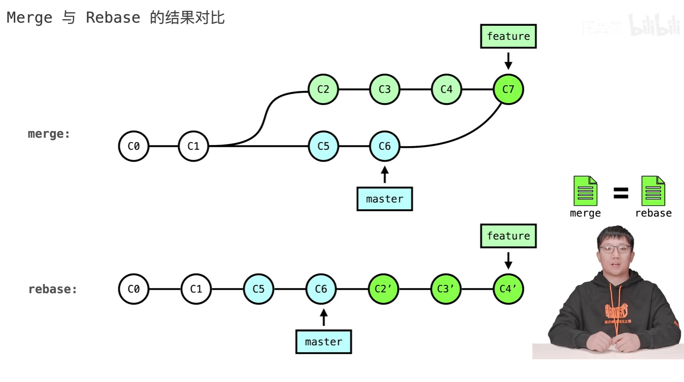

# 1.git rebase

https://www.bilibili.com/video/BV1Xb4y1773F/?spm_id_from=333.337.search-card.all.click&vd_source=a7089a0e007e4167b4a61ef53acc6f7e

merge和rebase都具备整合分支间变更的能力，但二者的实现手段却大不相同

[git rebase](https://juejin.cn/post/6969101234338791432)