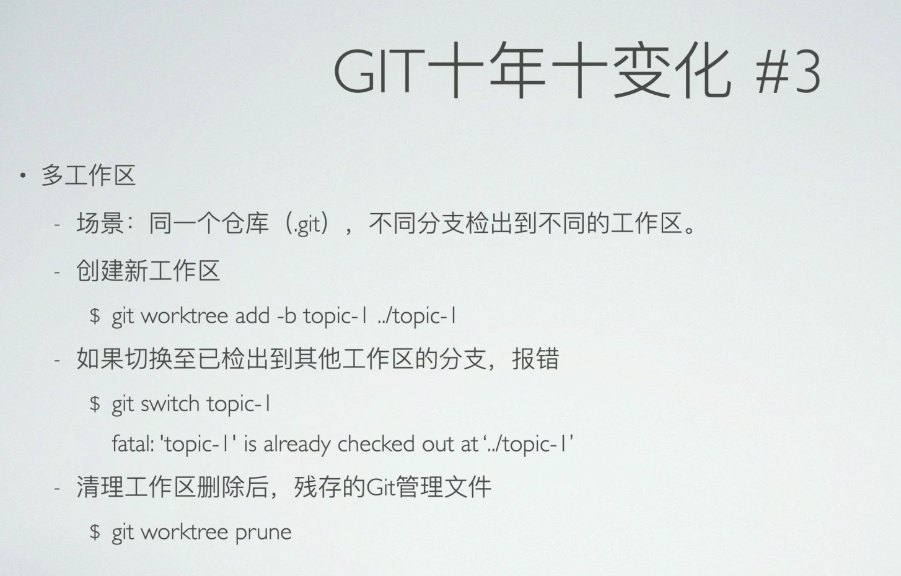
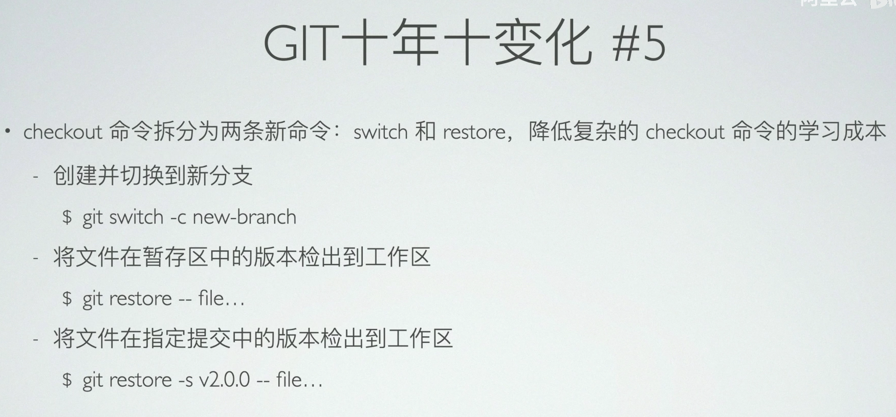
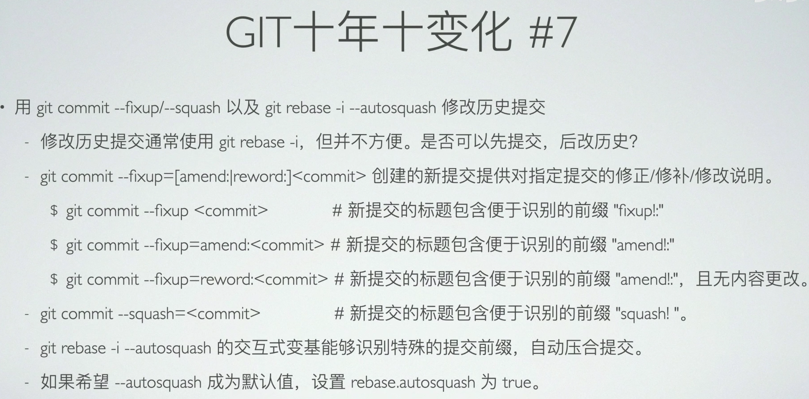
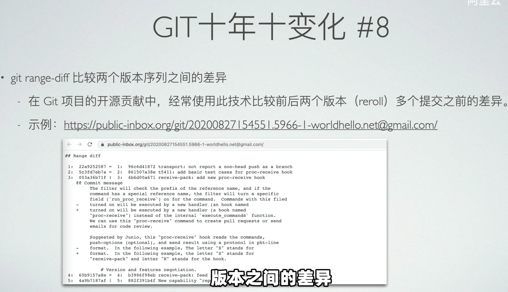
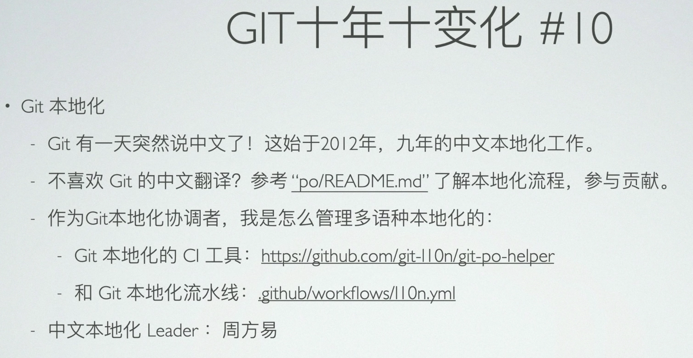

https://www.bilibili.com/video/BV1Vq4y1S7zQ/?spm_id_from=333.999.0.0&vd_source=a7089a0e007e4167b4a61ef53acc6f7e

场景：工作时经常要在不同的分支上切换，有的人选择将一个仓库克隆多份，缺点是占用空间，还有clone出来的不同的工作区各自独立，缺乏联系。而git worktree实现了多个工作区共享同一个本地仓库，不同分支检出到不同的工作区目录中。比如在一个工作区根目录执行，

