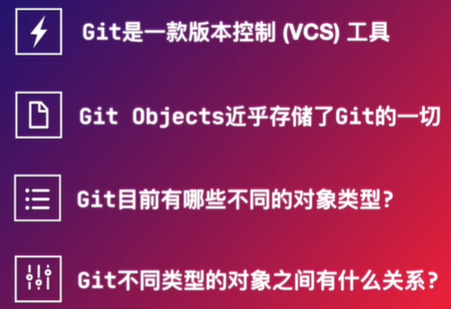
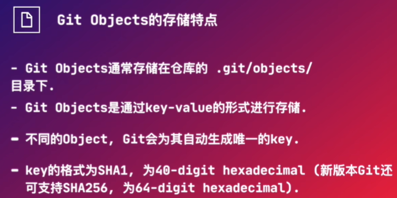
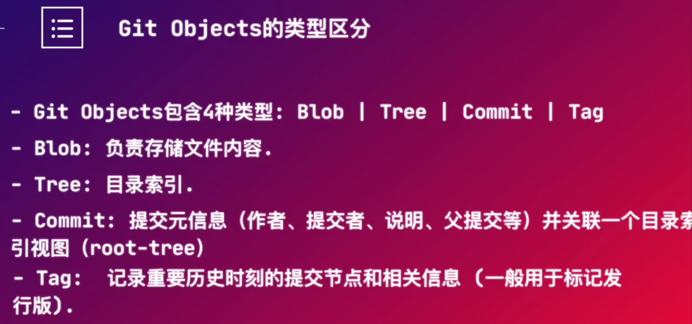
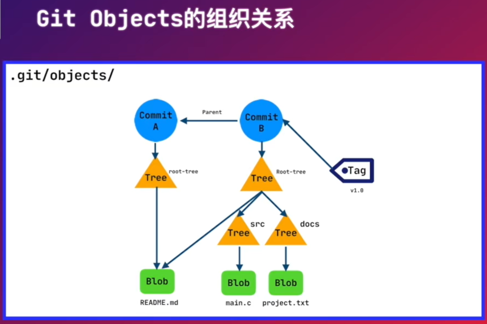
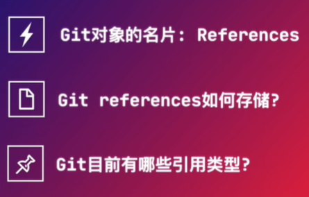
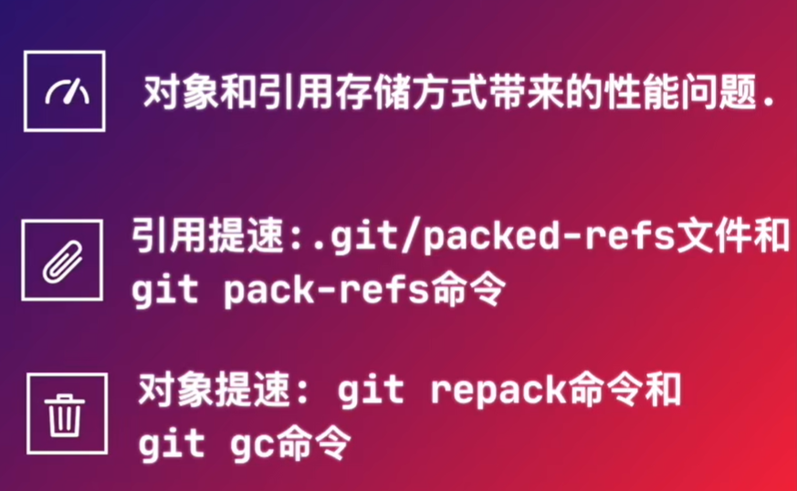
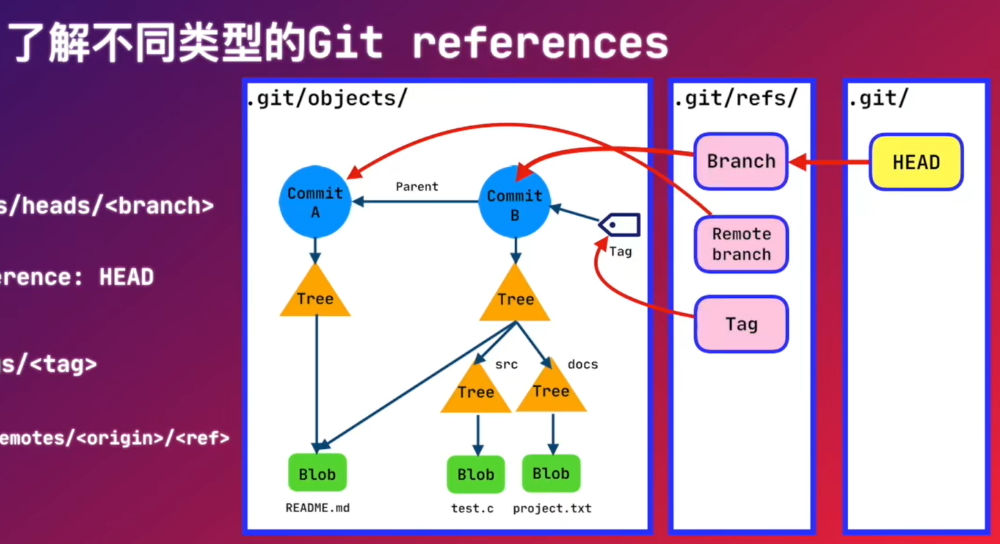
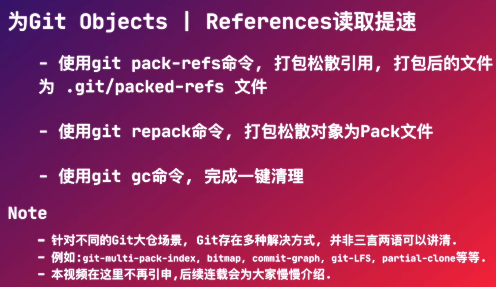

# [1. Git对象和引用原理](https://www.bilibili.com/video/BV1a44y1b7tm/?spm_id_from=333.999.0.0&vd_source=a7089a0e007e4167b4a61ef53acc6f7e)

## 1.1 Git Objects

|  |  |
| ------------------------------------------------------------ | ------------------------------------------------------------ |
|  |  |

## 1.2 Git References

刚才讲到，Git对象是用SHA-1或SHA-256的格式来存储，这种格式的表现形式对于我们使用Git来说非常不方便。引用就是为此而生的。

|  |  |
| ------------------------------------------------------------ | ------------------------------------------------------------ |
|  |  |

Git支持四种默认Builtin reference：

- Branches：分支的引用
- Tags：标签的引用
- Remotes：与远端协作时使用
- Head：符号引用，存储在.git目录下

## 1.3 为Git Objects | References读取提速



# 2. Git原理和Git各命令的原理

Git 是一个分布式版本控制系统，它能够高效地管理源代码的版本历史。Git 的设计初衷是为了处理大型代码库的版本控制，并提供快速的操作和可靠的数据管理。下面详细介绍 Git 的原理和常用命令的工作机制。

### 1. **Git 的基本原理**

#### 1.1 **分布式版本控制**

- **分布式架构**：与集中式版本控制系统不同，Git 是分布式的。每个开发者的工作目录都是一个完整的版本库，包含所有的版本历史和分支信息。
- **本地仓库和远程仓库**：本地仓库是开发者在自己机器上创建的仓库，远程仓库是托管在服务器上的仓库，团队成员可以通过推送（push）和拉取（pull）操作与远程仓库进行同步。

#### 1.2 **数据存储**

- **快照而非差异**：Git 以快照（snapshot）的形式存储数据，每次提交时，Git 会记录当前文件系统的完整快照。如果文件未更改，Git 只会记录指向之前版本的引用，而不是存储重复的数据。
- **对象模型**：Git 的数据模型由四种主要对象构成：Blob（文件内容）、Tree（目录结构）、Commit（提交记录）、Tag（标签）。这些对象通过哈希（SHA-1）进行唯一标识和存储。

#### 1.3 **版本历史和分支管理**

- **提交（Commit）**：每次提交都会生成一个唯一的哈希值，用于标识该提交的快照。提交记录包括作者信息、提交时间、提交信息以及指向前一个提交的指针。
- **分支（Branch）**：分支是一个指向提交记录的可移动指针。Git 的分支非常轻量，可以在不同分支之间快速切换，并且创建和删除分支的操作非常高效。

### 2. **Git 常用命令及其原理**

#### 2.1 **git init**

- **作用**：初始化一个新的 Git 仓库。
- **原理**：创建一个 `.git` 目录，其中包含所有版本控制信息和配置文件。

```bash
git init
```

#### 2.2 **git clone**

- **作用**：克隆一个远程仓库到本地。
- **原理**：下载远程仓库的所有对象和版本历史，并在本地创建一个完整的版本库。

```bash
git clone <repository-url>
```

#### 2.3 **git add**

- **作用**：将文件的更改添加到暂存区（staging area）。
- **原理**：将文件内容的快照放入暂存区，准备在下一次提交时一起记录。

```bash
git add <file>
```

#### 2.4 **git commit**

- **作用**：将暂存区的更改提交到本地仓库。
- **原理**：创建一个新的提交对象，记录当前暂存区的快照，并将其添加到版本历史中。

```bash
git commit -m "commit message"
```

#### 2.5 **git status**

- **作用**：显示当前工作目录和暂存区的状态。
- **原理**：比较当前工作目录与最新提交记录的差异，显示哪些文件被修改、添加或删除。

```bash
git status
```

#### 2.6 **git push**

- **作用**：将本地提交推送到远程仓库。
- **原理**：将本地仓库的提交历史和对象上传到远程仓库，更新远程分支。

```bash
git push origin <branch>
```

#### 2.7 **git pull**

- **作用**：从远程仓库拉取最新的更改并合并到本地分支。
- **原理**：先执行 `git fetch` 拉取远程更新，再执行 `git merge` 合并到本地分支。

```bash
git pull origin <branch>
```

#### 2.8 **git branch**

- **作用**：列出、创建或删除分支。
- **原理**：操作 Git 的分支指针，列出所有分支或创建/删除分支指针。

```bash
git branch
git branch <branch-name>  # 创建新分支
git branch -d <branch-name>  # 删除分支
```

#### 2.9 **git checkout**

- **作用**：切换分支或恢复工作目录中的文件。
- **原理**：移动当前分支指针到指定分支，或恢复指定文件的状态。

```bash
git checkout <branch-name>
git checkout -- <file>  # 恢复文件
```

#### 2.10 **git merge**

- **作用**：将一个分支的更改合并到当前分支。
- **原理**：合并指定分支的提交历史到当前分支，可能会产生合并冲突需要手动解决。

```bash
git merge <branch-name>
```

#### 2.11 **git rebase**

- **作用**：将当前分支的提交应用到另一分支的顶端。
- **原理**：将当前分支的提交“移到”指定分支的最新提交之后，重新应用提交记录。

```bash
git rebase <branch-name>
```

#### 2.12 **git log**

- **作用**：显示提交历史。
- **原理**：遍历提交历史，从当前分支的最新提交开始，向前显示提交记录的哈希值、作者、日期和提交信息。

```bash
git log
```

### 3. **总结**

Git 是一个强大的分布式版本控制系统，通过快照和哈希来管理代码版本。它的常用命令涉及到仓库初始化、克隆、提交、推送、拉取、分支管理、合并等操作，每个命令都有其背后的原理和机制，使得 Git 能够高效地处理版本控制任务。理解这些原理和命令的工作机制有助于更好地掌握 Git 并有效地进行版本管理。