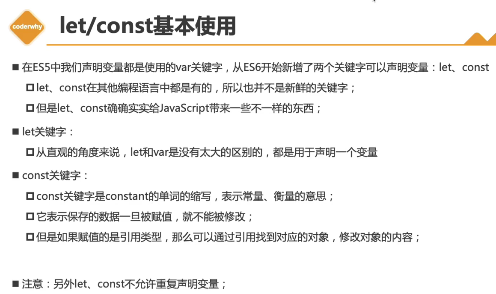
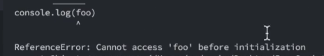
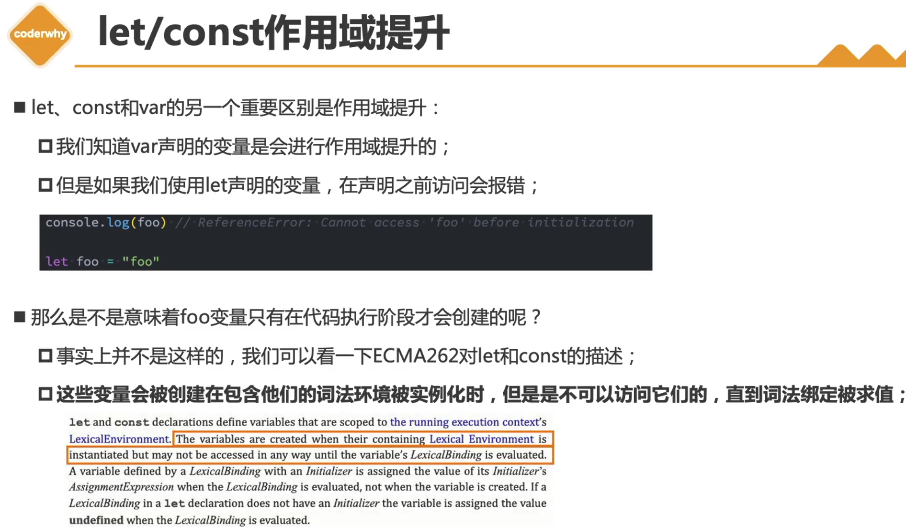
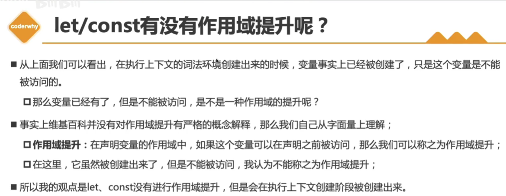
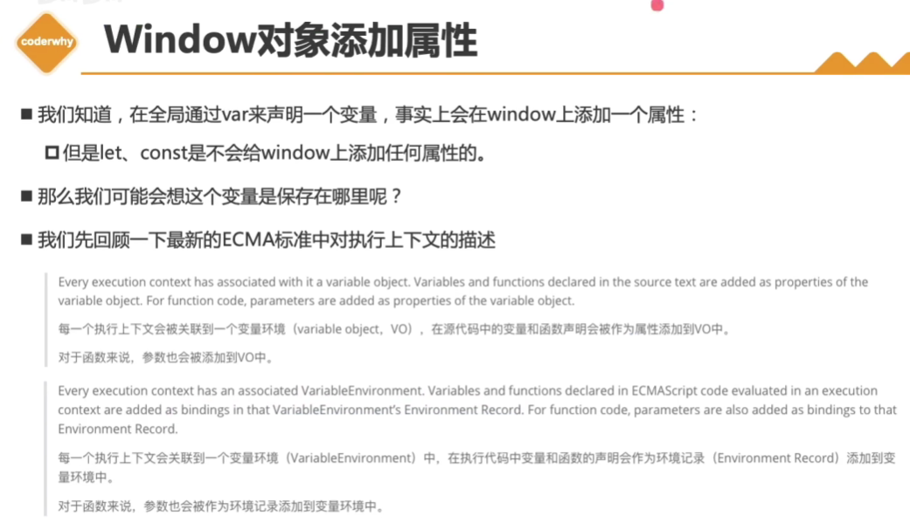
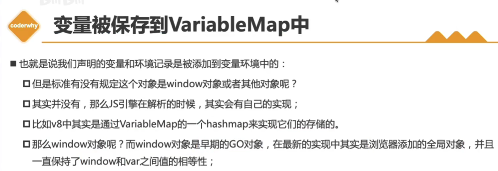
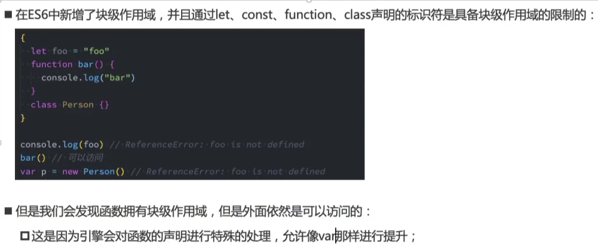

# 1. ECMAScript

https://zhuanlan.zhihu.com/p/367249029

# 2. 扩展运算符

在JavaScript中，`...` 是称为扩展运算符（spread operator）或剩余参数（rest parameters）的语法。

1. **扩展运算符（Spread Operator）**： 用于将一个数组或对象展开。例如，将数组的元素作为单独的参数传递给函数，或将对象的属性展开到另一个对象中。

   ```javascript
   const arr = [1, 2, 3];
   console.log(...arr); // 输出：1 2 3
   
   const obj1 = { a: 1, b: 2 };
   const obj2 = { ...obj1, c: 3 };
   console.log(obj2); // 输出：{ a: 1, b: 2, c: 3 }
   ```

2. **剩余参数（Rest Parameters）**： 用于将多个独立的参数组合成一个数组。通常用于函数参数中。

   ```javascript
   function sum(...args) {
     return args.reduce((acc, curr) => acc + curr, 0);
   }
   
   console.log(sum(1, 2, 3, 4)); // 输出：10
   ```

这两个用法在处理数组和对象时非常有用，使代码更加简洁和易读

# 3. 删除数组中的元素

### 1. 根据索引删除元素

如果你知道要删除的元素的索引，可以使用 `Array.prototype.splice` 方法。

```javascript
const array = [1, 2, 3, 4, 5];
const index = 2; // 要删除的元素的索引
if (index > -1) {
  array.splice(index, 1); // 从索引位置删除一个元素
}
console.log(array); // 输出：[1, 2, 4, 5]
```

### 2. 根据值删除元素

如果你知道要删除的元素的值，可以先找到其索引，然后使用 `splice` 方法。

```javascript
const array = [1, 2, 3, 4, 5];
const value = 3; // 要删除的元素的值
const index = array.indexOf(value);
if (index > -1) {
  array.splice(index, 1);
}
console.log(array); // 输出：[1, 2, 4, 5]
```

### 3. 使用 `filter` 方法创建一个新数组

[filter重写相关](E:\TechDocument\Javascript\09 数组.md)

如果你想删除所有匹配的元素，可以使用 `Array.prototype.filter` 方法创建一个新的数组。

```javascript
const array = [1, 2, 3, 4, 5, 3];
const value = 3;
const newArray = array.filter(item => item !== value);
console.log(newArray); // 输出：[1, 2, 4, 5]
```

### 4. 使用 `Array.prototype.pop` 方法删除最后一个元素

如果你只想删除数组的最后一个元素，可以使用 `pop` 方法。

```javascript
const array = [1, 2, 3, 4, 5];
array.pop();
console.log(array); // 输出：[1, 2, 3, 4]
```

### 5. 使用 `Array.prototype.shift` 方法删除第一个元素

如果你只想删除数组的第一个元素，可以使用 `shift` 方法。

```javascript
const array = [1, 2, 3, 4, 5];
array.shift();
console.log(array); // 输出：[2, 3, 4, 5]
```

### 6. 使用 `Array.prototype.slice` 方法创建一个不包含指定元素的新数组

如果你只想创建一个不包含指定元素的新数组，可以使用 `slice` 和 `concat` 方法。

```javascript
const array = [1, 2, 3, 4, 5];
const index = 2;
const newArray = array.slice(0, index).concat(array.slice(index + 1));
console.log(newArray); // 输出：[1, 2, 4, 5]
```

这些方法可以根据具体需求选择使用。`splice` 方法是最常用的删除数组元素的方法，而 `filter` 方法则适用于创建新数组且不改变原数组的情况。

# 4. hasOwnProperty

`hasOwnProperty`是JavaScript对象的一个方法，用于检查对象自身（而非原型链）是否具有指定的属性。以下是一些示例和用法：

## 基本用法

```javascript
const obj = {
  a: 1,
  b: 2
};

console.log(obj.hasOwnProperty('a')); // true
console.log(obj.hasOwnProperty('c')); // false
```

## 区分自有属性和继承属性

`hasOwnProperty`只会返回对象自身的属性，而不会检查从原型链继承的属性。

```javascript
const obj = {
  a: 1
};

console.log(obj.hasOwnProperty('toString')); // false
console.log('toString' in obj); // true
```

## 用于循环中检查属性

在遍历对象属性时，可以使用`hasOwnProperty`来过滤掉继承的属性。

```javascript
const obj = {
  a: 1,
  b: 2
};

Object.prototype.c = 3;

for (let key in obj) {
  if (obj.hasOwnProperty(key)) {
    console.log(key, obj[key]); // 只会打印 "a 1" 和 "b 2"
  }
}
```

## 结合深拷贝使用的例子

在实现深拷贝时，可以使用`hasOwnProperty`来确保只拷贝对象自身的属性。

```javascript
function deepCopy(obj, hash = new WeakMap()) {
  if (obj === null) return null;
  if (typeof obj !== "object") return obj;
  if (hash.has(obj)) return hash.get(obj);

  let copy = Array.isArray(obj) ? [] : {};
  hash.set(obj, copy);

  for (let key in obj) {
    if (obj.hasOwnProperty(key)) {
      copy[key] = deepCopy(obj[key], hash);
    }
  }

  return copy;
}

const originalObject = { a: 1, b: { c: 2 }, d: function() { return 3; } };
const deepCopiedObject = deepCopy(originalObject);

console.log(deepCopiedObject); // { a: 1, b: { c: 2 }, d: [Function: d] }
```

在以上示例中，`hasOwnProperty`确保只拷贝对象自身的属性，而不会拷贝继承的属性。

# 5. 判断一个对象是数组还是普通对象

在JavaScript中，可以使用多种方法来判断一个对象是数组还是普通对象。以下是一些常见的方法：

## 1. 使用 `Array.isArray`

这是最简单和最可靠的方法，专门用于检查一个对象是否是数组。

```javascript
const arr = [1, 2, 3];
const obj = { a: 1, b: 2 };

console.log(Array.isArray(arr)); // true
console.log(Array.isArray(obj)); // false
```

## 2. 使用 `instanceof` 操作符

`instanceof` 可以用于检查对象是否是某个构造函数的实例。

```javascript
const arr = [1, 2, 3];
const obj = { a: 1, b: 2 };

console.log(arr instanceof Array); // true
console.log(obj instanceof Array); // false
```

## 3. 使用 `Object.prototype.toString`

这种方法可以返回对象的类型信息，包括数组、对象等。

```javascript
const arr = [1, 2, 3];
const obj = { a: 1, b: 2 };

console.log(Object.prototype.toString.call(arr)); // [object Array]
console.log(Object.prototype.toString.call(obj)); // [object Object]

function isArray(input) {
  return Object.prototype.toString.call(input) === '[object Array]';
}

console.log(isArray(arr)); // true
console.log(isArray(obj)); // false
```

[call相关](E:\TechDocument\Javascript\02 call bind apply实现.md)

## 4. 结合以上方法判断类型

你可以使用一个通用的函数来判断对象的类型。

```javascript
function getType(input) {
  if (Array.isArray(input)) {
    return 'Array';
  } else if (input !== null && typeof input === 'object') {
    return 'Object';
  } else {
    return typeof input;
  }
}

const arr = [1, 2, 3];
const obj = { a: 1, b: 2 };
const num = 42;

console.log(getType(arr)); // Array
console.log(getType(obj)); // Object
console.log(getType(num)); // number
```

这些方法可以帮助你准确地判断一个对象是数组还是普通对象。推荐使用 `Array.isArray` 方法，因为它简单、直观且专门用于这个目的。

# 6. var/let/const

## [1. var/let/const的基本使用](https://www.bilibili.com/video/BV1zd4y1X7ky?p=3&vd_source=a7089a0e007e4167b4a61ef53acc6f7e)



## [2. let/const没有作用域提升](https://www.bilibili.com/video/BV1zd4y1X7ky/?p=4&spm_id_from=pageDriver&vd_source=a7089a0e007e4167b4a61ef53acc6f7e)

```javascript
console.log(foo); // undefined
var foo = "foo";
```

用var声明一个变量，这个变量是会进行**作用域提升**的

所以在第二行执行之前，在第一行是可以访问到foo的

因为在对代码进行解析的时候，就已经知道有foo了

```javascript
console.log(foo);
let foo = "foo";
```

会报错：



> 结论：let/const是没有作用域提升的

|  |  |
| ------------------------------------------------------------ | ------------------------------------------------------------ |

- 词法环境（LexicalEnvironment）是指啥？
  - 如果一份代码准备运行，它会先在我们的调用栈中给我们创建一个**执行上下文**，在执行上下文里面，有一个东西叫词法环境（在创建执行上下文的时候，其实会创建一个词法环境）

## [3. let/const和window的关系](https://www.bilibili.com/video/BV1zd4y1X7ky?p=5&vd_source=a7089a0e007e4167b4a61ef53acc6f7e)

|  |  |
| ------------------------------------------------------------ | ------------------------------------------------------------ |

## [4. ES6新增的块级作用域](https://www.bilibili.com/video/BV1zd4y1X7ky?p=6&vd_source=a7089a0e007e4167b4a61ef53acc6f7e)

### 4.1 块级作用域的理解

- 在ES5及之前，在JS中压根没有块级作用域

- ```javascript
  // 块代码
  {
      var foo = 'foo'
  }
  // 在很多语言里面，在块代码的外面是不能访问foo变量的
  // 因为块有自己的作用域，自己的作用域就意味着在自己里面声明的东西只能在自己内部被访问
  ```

- 但是在早期的js里面，没有块级作用域

- 在es5里面，只有两个东西会形成作用域：

  - 全局作用域
  - 函数作用域

- **es6中开始有块级作用域**

- 但是**块级作用域针对var声明的变量是无效的**

- 只对let/const/function/class声明的类型有效

  - 


### 4.2 块级作用域的应用场景

页面中有四个按钮，监听四个按钮的点击，并且输出现在点击的是第几个按钮

## 5. 三者的区别

|       | 是否可以重复声明                                             | 是否有块级作用域                                             | 是否有作用域提升                                             |
| :---- | ------------------------------------------------------------ | ------------------------------------------------------------ | ------------------------------------------------------------ |
| var   | 可以重复声明<br>```var a=12; var a=5;  ```<br>```alert(a); // 5``` | 没有块级作用域<br>块级作用域指在里面定义的变量，在外面用不了 <br/>  ```if (true) { var a=12; } ```<br>```alert(a) // 12``` | 有<br>```console.log(foo); ```<br>```// undefined```<br/>```var foo = "foo";``` |
| let   | 不能重复声明<br>```let a=12; let a=5; alert(a);  ```<br>```// Identifier 'a' has already been declared``` | 有块级作用域<br>```if (true) { let a=12; } alert(a) ```<br>```// a is not defined``` | 没有<br>```console.log(foo); ```<br/>```// 会报错,见下图```<br/>```let foo = "foo";``` |
| const | 不能重复声明                                                 | 有块级作用域                                                 | 没有 |

# [7. ES6 对象字面量增强写法](https://www.bilibili.com/video/BV1zd4y1X7ky?p=1)

# 8. instanceof

`instanceof` 是 JavaScript 中的一个运算符，**用于检测一个对象是否是某个构造函数的实例**。它的语法如下：

```javascript
object instanceof constructor
```

- **`object`**：要测试的对象。
- **`constructor`**：用于检测的构造函数。

`instanceof` 运算符返回一个布尔值，即 `true` 或 `false`，用于指示 `object` 是否是 `constructor` 的实例。

### 工作原理

`instanceof` 运算符会沿着对象的原型链查找，如果找到的原型与构造函数的 `prototype` 属性相同，则返回 `true`，否则返回 `false`。

### 示例

#### 1. 基本使用

```javascript
function Person(name) {
  this.name = name;
}

const john = new Person('John');

console.log(john instanceof Person); // true
console.log(john instanceof Object); // true
```

在这个示例中，`john` 是通过 `Person` 构造函数创建的实例，因此 `john instanceof Person` 返回 `true`。因为所有的对象最终都继承自 `Object`，所以 `john instanceof Object` 也返回 `true`。

#### 2. 使用内置对象

```javascript
const arr = [1, 2, 3];

console.log(arr instanceof Array); // true
console.log(arr instanceof Object); // true
```

数组是 `Array` 的实例，因此 `arr instanceof Array` 返回 `true`。同样，由于所有的数组都是对象，所以 `arr instanceof Object` 也返回 `true`。

#### 3. 自定义对象

```javascript
class Animal {
  constructor(name) {
    this.name = name;
  }
}

class Dog extends Animal {
  constructor(name, breed) {
    super(name);
    this.breed = breed;
  }
}

const myDog = new Dog('Buddy', 'Golden Retriever');

console.log(myDog instanceof Dog);    // true
console.log(myDog instanceof Animal); // true
console.log(myDog instanceof Object); // true
```

在这个示例中，`myDog` 是 `Dog` 的实例，因此 `myDog instanceof Dog` 返回 `true`。由于 `Dog` 继承自 `Animal`，因此 `myDog` 也是 `Animal` 的实例，`myDog instanceof Animal` 返回 `true`。同样，因为所有的对象最终都继承自 `Object`，所以 `myDog instanceof Object` 也返回 `true`。

### 注意事项

1. **与原型链有关**：`instanceof` 运算符会沿着对象的原型链查找，如果在原型链上找到了指定的构造函数的 `prototype` 属性，则返回 `true`。

2. **不同的全局作用域**：在不同的全局作用域（如不同的 `iframe`）中创建的对象，可能会导致 `instanceof` 运算符的结果与预期不同，因为每个全局作用域都有自己的内置对象。

   ```javascript
   const iframe = document.createElement('iframe');
   document.body.appendChild(iframe);

   const iArray = new iframe.contentWindow.Array();

   console.log(iArray instanceof Array); // false
   console.log(iArray instanceof iframe.contentWindow.Array); // true
   ```

3. **Symbol.hasInstance**：可以自定义 `instanceof` 行为，通过为构造函数对象设置 `Symbol.hasInstance` 方法：

   ```javascript
   class MyClass {
     static [Symbol.hasInstance](instance) {
       return Array.isArray(instance);
     }
   }
   
   console.log([] instanceof MyClass); // true
   console.log({} instanceof MyClass); // false
   ```

   在这个示例中，自定义了 `MyClass` 的 `Symbol.hasInstance` 方法，使得 `MyClass` 的 `instanceof` 检查返回 `true`，只要被检查的对象是数组。

### 结论

`instanceof` 运算符是一个强大的工具，用于检查对象与构造函数之间的关系。它在确定对象的类型和继承关系时非常有用，但要注意其行为取决于对象的原型链以及特定情况下的全局作用域差异。通过了解和正确使用 `instanceof`，你可以更好地进行类型检查和继承关系的判断。

# 9. for in循环

`for...in` 循环是 JavaScript 中用于遍历对象属性的语法。它遍历对象的所有可枚举属性，包括继承的属性。以下是对 `for...in` 循环的详细说明和示例：

### 语法

```javascript
for (variable in object) {
  // code to be executed
}
```

- **`variable`**: 用于接收当前遍历到的属性名称（字符串）。
- **`object`**: 要遍历的对象。

### 特点

1. **遍历顺序**:
   - `for...in` 循环遍历对象的属性是按字符串的顺序进行的，可能与属性的定义顺序不同。

2. **继承属性**:
   - `for...in` 循环会遍历对象的所有可枚举属性，包括继承自原型链的属性。

3. **属性可枚举性**:
   - 只有可枚举属性会被 `for...in` 循环遍历。可以通过 `Object.keys(obj)` 或 `Object.getOwnPropertyNames(obj)` 来获取对象自身的属性名数组。

### 示例

#### 基本用法

```javascript
const person = {
  name: 'Alice',
  age: 25,
  occupation: 'Engineer'
};

for (let key in person) {
  console.log(key + ": " + person[key]);
}
// 输出:
// name: Alice
// age: 25
// occupation: Engineer
```

#### 忽略继承属性

如果只想遍历对象自身的属性，可以使用 `hasOwnProperty` 方法：

```javascript
const person = {
  name: 'Alice',
  age: 25,
  occupation: 'Engineer'
};

const proto = { country: 'Wonderland' };
Object.setPrototypeOf(person, proto);

for (let key in person) {
  if (person.hasOwnProperty(key)) {
    console.log(key + ": " + person[key]);
  }
}
// 输出:
// name: Alice
// age: 25
// occupation: Engineer
```

#### 遍历数组

`for...in` 循环也可以用于数组，但推荐使用 `for...of` 循环或数组方法（如 `forEach`、`map`）来处理数组：

```javascript
const arr = [10, 20, 30];

for (let index in arr) {
  console.log(index + ": " + arr[index]);
}
// 输出:
// 0: 10
// 1: 20
// 2: 30
```

#### 注意事项

- `for...in` 循环遍历的是属性名（字符串），而不是数组的索引。因此，它适合用来遍历对象属性，不适合用来遍历数组元素。
- 对于性能和正确性考虑，处理数组时，使用 `forEach`、`map` 或 `for...of` 循环更为合适。

### 总结

`for...in` 循环是遍历对象属性的有效方式，但在处理数组时，应避免使用它，推荐使用其他数组遍历方法。通过理解其行为特性，可以更有效地编写 JavaScript 代码。

