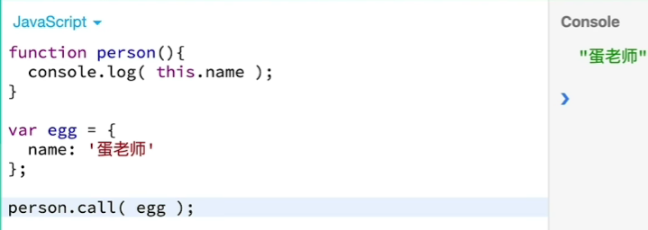
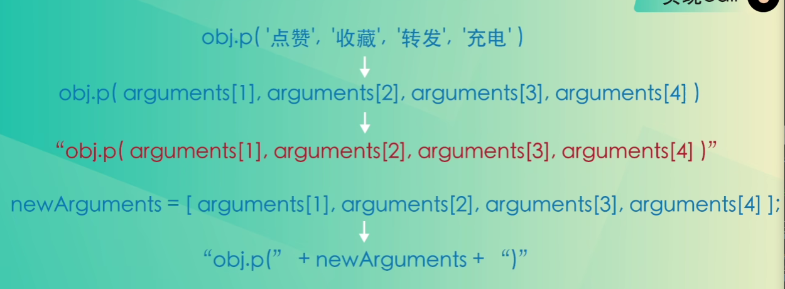
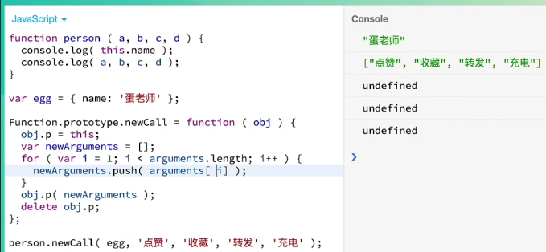
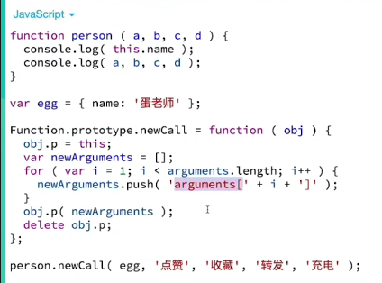

# [1. call](https://www.bilibili.com/video/BV1m54y1q7hc?from=search&seid=8833365694111867782)

## 基本示例

```javascript
function greet(greeting, punctuation) {
  console.log(greeting + ', ' + this.name + punctuation);
}
const person = {
  name: 'Alice'
};
greet.call(person, 'Hello', '!'); // 输出: Hello, Alice!
```


```js
const arr = [1, 2, 3];
console.log(Object.prototype.toString.call(arr)); // [object Array]
```

**`Object.prototype.toString.call(arr)`**：

- `Object.prototype.toString` 是一个原生的 JavaScript 方法，它返回一个表示对象的字符串。

- 当你直接调用 `Object.prototype.toString()` 时，它会返回 `"[object Object]"`。

- 通过使用 `call` 方法，你可以传递一个对象（在这个例子中是 `arr`），来让 `toString` 方法处理这个对象。

- 对于数组，`Object.prototype.toString.call(arr)` 返回的字符串是 `"[object Array]"`。

- ```javascript
  console.log(Object.prototype.toString.call({})); // [object Object]
  console.log(Object.prototype.toString.call([])); // [object Array]
  console.log(Object.prototype.toString.call(new Date())); // [object Date]
  console.log(Object.prototype.toString.call(/regex/)); // [object RegExp]
  ```


## 用于继承和借用方法

`call` 方法常用于实现继承和借用方法

### 借用方法

```javascript
const person1 = {
  name: 'Alice',
  greet: function(greeting) {
    console.log(greeting + ', ' + this.name);
  }
};
const person2 = {
  name: 'Bob'
};
person1.greet.call(person2, 'Hi'); // 输出: Hi, Bob
```

在这个示例中，`person1` 的 `greet` 方法被 `person2` 借用，`this` 指向了 `person2`

### 模拟类继承

```javascript
// 开发者通常遵循一个命名惯例：构造函数的名称使用大写字母开头。而普通函数使用小写字母开头。
function Animal(name) {
  this.name = name;
}
Animal.prototype.speak = function() {
  console.log(this.name + ' makes a noise.');
};
function Dog(name) {
  Animal.call(this, name); // 继承 Animal 的属性
}
// 设置Dog的原型prototype为Animal的一个副本。通过这种方式，Dog的实例将可以访问Animal的原型上的方法，如speak
// Object.create:该方法创建一个新的对象，并将该对象的[[prototype]]指向传入的对象Animal.prototype。即设置Dog原型链的继承
Dog.prototype = Object.create(Animal.prototype);
// 当我们使用Object.create时，Dog.prototype的constructor属性会被重置为Animal。因此这里显式的将Dog.prototype.constructor设置回Dog，以保持构造函数的正确引用
Dog.prototype.constructor = Dog;
Dog.prototype.speak = function() {
  console.log(this.name + ' barks.');
};
const dog = new Dog('Rover');
dog.speak(); // 输出: Rover barks.
```

在这个示例中，`Dog` 构造函数使用 `Animal.call(this, name)` 继承了 `Animal` 的属性。然后通过设置 `Dog.prototype` 为 `Animal.prototype` 的一个新对象，`Dog` 继承了 `Animal` 的方法。

## 实现call

| 1.要模仿call首先要思考call是从哪里来的——Function对象<br>2.Function对象是构造函数，构造函数是有原型对象（Function.prototype）的<br>3.这个原型对象里面就有很多属性可以使用，比如call就是在这个原型对象属性里面来的。<br>4.因此我们要模仿就必须在原型对象里面添加新的和call一样的属性 |  |
| ------------------------------------------------------------ | ------------------------------------------------------------ |

**要把newCall加在函数原型上**

```js
function test(param1, param2) {
    console.log('param1:',param1)
    console.log('param2:',param2)
    console.log('name:',this.name)
}
let obj = {
    name: 'test2'
}
test.call(obj, '测试参数1');
// 输出：
// param1: 测试参数1
// param2: undefined
// name: test2

Function.prototype.myCall = function(newThis, ...arguments) {
    // console.log('arguments:', ...arguments)
    // 本质：把myCall这个函数变成test函数的属性 错误
    // 本质：把myCall这个函数变成obj对象的属性，然后删除该属性 正确
    let _originThis = this; // test
    let _newThis = newThis; // obj
    _newThis.test = _originThis; // obj = {test: test 函数}；
    _newThis.test(...arguments);
    delete _newThis.test;
}

// myCall简化版：
Function.prototype.myCall = function (newThis, ...arguments) {
    // 本质：把test方法变成为obj对象身上的属性
    // newThis就是obj
    // oldThis是test方法
    newThis.test = this;
    newThis.test(...arguments);
    delete newThis.test;
}

test.myCall(obj, 'param1', 'param2')
```



这样的拼接可以执行是因为：**数组和字符串相加的时候数组会调用toString()方法**

但是这里会有一个问题：

这个数组其实会直接显示参数，数组是下面这样子的

```
newArguments = ['点赞', '收藏', '转发', '充电'];
```

字符串拼接起来就会是这样：

```
"obj.p(点赞，收藏，转发，充电)"
```

这些参数就没有了引号，不符合我们要达到的执行语句

我们需要用字符串的形式先隐藏掉这些参数！！！！！



修改for循环里面的语句：



数组就会变成这样：

```
newArguments = ['arguments[1]', 'arguments[2]', 'arguments[3]', 'arguments[4]'] 
```

```
"obj.p(" + newArguments + ")"
```

就会变成：

```
"obj.p(arguments[1], arguments[2], arguments[3], arguments[4])"
```

在JavaScript中，`call` 方法是 `Function.prototype` 上的方法，它允许你调用一个函数，并在调用时指定 `this` 的值和参数。与 `apply` 方法类似，但 `call` 方法的参数是逐个传递的，而 `apply` 方法的参数是以数组的形式传递的。

# 2. apply

`apply` 是 JavaScript 中的一个方法，它允许你调用一个函数，并指定 `this` 关键字的值以及传递给函数的参数。`apply` 方法和 `call` 方法类似，区别在于 `apply` 接受参数数组，而 `call` 接受的是参数列表。

## 示例

### 1. 使用 `apply` 调用函数

```javascript
function greet(name, age) {
  console.log(`Hello, my name is ${name} and I am ${age} years old.`);
}

const person = {
  name: 'John',
  age: 30
};

// 使用 apply 调用函数
greet.apply(person, ['Alice', 25]); // Hello, my name is Alice and I am 25 years old.
```

在这个示例中，`greet` 函数被调用，`this` 值被设置为 `person` 对象，但由于 `greet` 函数内部没有使用 `this`，所以 `person` 对象不影响结果。传递的参数是一个数组 `['Alice', 25]`。

### 2. 合并数组

你可以使用 `apply` 将一个数组合并到另一个数组：

```javascript
const array1 = [1, 2, 3];
const array2 = [4, 5, 6];

// 使用 apply 合并数组
Array.prototype.push.apply(array1, array2);

console.log(array1); // [1, 2, 3, 4, 5, 6]
```

这里我们使用 `Array.prototype.push.apply` 方法将 `array2` 的所有元素添加到 `array1` 中。

### 3. 获取数组中的最大/最小值

你可以使用 `apply` 将数组作为参数传递给 `Math.max` 或 `Math.min` 方法，以便获取数组中的最大或最小值：

```javascript
const numbers = [1, 2, 3, 4, 5];

// 获取数组中的最大值
const max = Math.max.apply(null, numbers);
console.log(max); // 5

// 获取数组中的最小值
const min = Math.min.apply(null, numbers);
console.log(min); // 1
```

在这个示例中，`Math.max` 和 `Math.min` 函数被调用，并将 `numbers` 数组作为参数传递。因为这些函数不关心 `this` 的值，所以传递 `null` 作为 `thisArg`。

## 总结

`apply` 方法在以下场景中特别有用：

1. **函数调用时动态设置 `this` 值**：可以在调用函数时指定 `this` 值。
2. **将数组作为参数传递**：可以将数组元素作为参数传递给函数。
3. **简化代码**：与 `call` 方法相比，当参数已经在一个数组中时，`apply` 可以使代码更简洁。

## 与 `call` 方法的比较

```javascript
// 使用 call
greet.call(person, 'Alice', 25); // Hello, my name is Alice and I am 25 years old.

// 使用 apply
greet.apply(person, ['Alice', 25]); // Hello, my name is Alice and I am 25 years old.
```

`call` 和 `apply` 的区别在于参数传递方式：

- `call` 接受参数列表：
  ```javascript
  func.call(thisArg, arg1, arg2, ...)
  ```

- `apply` 接受参数数组：
  ```javascript
  func.apply(thisArg, [arg1, arg2, ...])
  ```

通过理解和掌握 `apply` 方法，你可以更灵活地调用函数，并在处理函数参数时简化代码。

## 实现apply

```js
function test(param1, param2) {
    console.log('param1:',param1)
    console.log('param2:',param2)
    console.log('name:',this.name)
}
let obj = {
    name: 'test2'
}
test.apply(obj, ['1111', '222']);

Function.prototype.myApply = function(newThis, arguments) {
    console.log('arguments:', ...arguments)
    let _originThis = this; // test
    let _newThis = newThis; // obj
    _newThis.test = _originThis; // obj = {test: test 函数}；
    _newThis.test(...arguments);
    delete _newThis.test;
}

// 简化版：
Function.prototype.myApply = function (newThis, arguments) {
    newThis.test = this;
    newThis.test(...arguments);
    delete newThis.test;
}

test.myApply(obj, ['1111', '222'])
```

# 3. bind

`bind` 方法是 JavaScript 中的一个函数方法，它用于创建一个新的函数，这个函数在调用时将其 `this` 关键字设置为提供给 `bind` 方法的第一个参数，并且在调用新函数时会将提供的参数顺序传递给原函数。

## 示例

### 1. 简单示例

```javascript
function greet() {
  console.log(`Hello, my name is ${this.name}`);
}

const person = {
  name: 'John'
};

const boundGreet = greet.bind(person);
boundGreet(); // Hello, my name is John
```

在这个示例中，`greet` 函数被绑定到 `person` 对象上，所以调用 `boundGreet` 函数时，`this` 的值是 `person` 对象。

### 2. 带有预设参数的 `bind`

```javascript
function greet(greeting, punctuation) {
  console.log(`${greeting}, my name is ${this.name}${punctuation}`);
}

const person = {
  name: 'Alice'
};

const boundGreet = greet.bind(person, 'Hello');
boundGreet('!'); // Hello, my name is Alice!
```

在这个示例中，`greet` 函数被绑定到 `person` 对象上，并预设了第一个参数 `greeting` 的值为 `'Hello'`。调用 `boundGreet` 时，传递的参数 `!` 被作为第二个参数 `punctuation`。

### 3. 偏函数（Partial Function）

`bind` 方法可以用来创建偏函数，即预设部分参数的函数：

```javascript
function multiply(a, b) {
  return a * b;
}

const double = multiply.bind(null, 2);
console.log(double(5)); // 10

const triple = multiply.bind(null, 3);
console.log(triple(5)); // 15
```

在这个示例中，`double` 和 `triple` 函数分别预设了第一个参数为 `2` 和 `3`，调用时只需要提供第二个参数。

## 特点和注意事项

1. **不可更改的 `this` 绑定**：通过 `bind` 方法创建的新函数，其 `this` 绑定是不可更改的。即使使用 `call` 或 `apply` 方法，`this` 的值仍然是最初绑定的值。

2. **部分应用**：可以预设部分参数，但这些参数在调用时不能被更改或覆盖。

3. **函数复用**：`bind` 方法可以让你创建新的函数，而不改变原函数，有助于函数复用。

## 使用场景

1. **确保 `this` 的一致性**：在回调函数中使用 `bind` 确保 `this` 的一致性，尤其是在事件处理程序中。

```javascript
class Button {
  constructor(text) {
    this.text = text;
    this.handleClick = this.handleClick.bind(this); // 绑定 this
  }

  handleClick() {
    console.log(this.text);
  }

  render() {
    const button = document.createElement('button');
    button.innerText = this.text;
    button.addEventListener('click', this.handleClick); // 确保 this 指向实例
    return button;
  }
}

const myButton = new Button('Click me');
document.body.appendChild(myButton.render());
```

2. **借用方法**：将一个对象的方法借用到另一个对象上，确保 `this` 正确指向。

```javascript
const person1 = {
  name: 'Alice',
  greet() {
    console.log(`Hello, my name is ${this.name}`);
  }
};

const person2 = {
  name: 'Bob'
};

const greetBob = person1.greet.bind(person2);
greetBob(); // Hello, my name is Bob
```

通过理解和掌握 `bind` 方法，你可以更灵活地控制 `this` 的值，并在特定上下文中复用函数。

## 实现bind

```JS
function test (param1,param2,param3) {
    console.log('this:',this)
    console.log('param1:',param1)
    console.log('param2:',param2)
    console.log('param3:',param3)
    console.log('name:',this.name);
}
let obj = {
    name: 'chenmeifang'
}
let Fn = test.bind(obj, 'param1', 'param2')
Fn('param3');

Function.prototype.myBind = function (obj, ...arguments) {
    let _originThis = this; // test函数
    let _newThis = obj; // obj对象
    _newThis.test = _originThis; // obj:{test: test函数}
    let outerArguments = arguments;
    let returnFn = function (...arguments) {
        if (this instanceof returnFn) {
            // 是用new执行的
            _originThis.call(_originThis, ...outerArguments, ...arguments)
        } else {
            _newThis.test(...outerArguments, ...arguments)
        }
    }
    return returnFn;
}
let Fn = test.myBind(obj, 'param1', 'param2')
Fn('param3');
```

- 注意：因为函数里面有返回的函数，在执行中很容易造成this的丢失。所以需要提前进行this的保存。

- 注意：bind实际上是具有科里化特性的。我们为返回的函数传入一个参数， 而不是在一开始执行的时候传入参数。也就是bind的第二个括号。！

- ==bind方法有一点很烦人，就是可以**配合new使用**。只不过**this值会失效**。==

- ```js
  function person (a, b, c) {
      console.log(this.name);
      console.log(a, b, c);
  }
  
  var egg = {name: '但老师'}
  var bibi = person.bind(egg, '点赞', '投币');
  var b = new bibi('充电');
  // 输出：undefined, 点赞，投币，充电
  // this.name打印出来是undefined。 可以看出来this值失效了
  ```

- 新的bind方法缺少了**实现new的过程**！

  - 也就是涉及到原型对象的知识了

# 4. 相同和不同

## 相同点

- call，apply，bind都是供函数使用的方法
- call，apply，bind都能改变函数在调用时this的指向

## 不同点

|                 call                  |      |                apply                |                bind                |
| :-----------------------------------: | ---- | :---------------------------------: | :--------------------------------: |
| `function.call(thisArg,arg1,arg2,..)` | 语法 | `function.apply(thisArg,argsArray)` | `function.bind(thisArg,arg1,arg2)` |

# 5. ...arguments

`arguments` 对象是 JavaScript 中的一个**类数组对象**，它包含传递给函数的所有参数。虽然在 ES6 中引入了 `rest` 参数 (`...args`)，但在旧版本的 JavaScript 中，`arguments` 对象是处理不定数量参数的主要方式。

### 1. **`arguments` 的基本用法**

   当你在一个函数内部使用 `arguments` 时，它会包含该函数调用时传入的所有参数。

   ```js
function example() {
    console.log(arguments);
}
example(1, 2, 3);  // 输出: [Arguments] { '0': 1, '1': 2, '2': 3 }
   ```

   - `arguments` 是一个类数组对象，并且具有 `length` 属性，可以通过索引访问每个参数。
   - 例如，`arguments[0]` 表示第一个参数，`arguments.length` 表示传递给函数的参数数量。

   ```js
function example() {
    console.log(arguments[0]);  // 输出第一个参数
    console.log(arguments.length);  // 输出参数个数
}
example(10, 20, 30);  // 输出: 10, 3
   ```

### 2. **类数组对象的性质**

   `arguments` 虽然类似于数组，但它不是一个真正的数组，它是一个类数组对象。可以通过索引访问它的元素，也有 `length` 属性，但它不具备数组的所有方法（如 `map`、`forEach` 等）。

   如果你想使用数组的方法，可以通过将 `arguments` 转换为真正的数组：

   - **方式1：使用 `Array.prototype.slice`**
     
     ```js
     function example() {
       const args = Array.prototype.slice.call(arguments);
       console.log(args);  // 输出: [1, 2, 3]
     }
     example(1, 2, 3);
     ```

   - **方式2：使用 ES6 `Array.from`**
     
     ```js
     function example() {
       const args = Array.from(arguments);
       console.log(args);  // 输出: [1, 2, 3]
     }
     example(1, 2, 3);
     ```

   - **方式3：使用 `...` 展开运算符**
     
     ```js
     function example() {
       const args = [...arguments];
       console.log(args);  // 输出: [1, 2, 3]
     }
     example(1, 2, 3);
     ```

### 3. **`arguments` 与函数参数的关系**

   在非严格模式下，`arguments` 对象和函数参数之间存在双向绑定关系：

   ```js
function example(a, b) {
    console.log(a);  // 输出: 1
    console.log(arguments[0]);  // 输出: 1
    a = 10;
    console.log(a);  // 输出: 10
    console.log(arguments[0]);  // 输出: 10
}
example(1, 2);
   ```

   这种绑定意味着修改函数参数 `a` 会影响 `arguments[0]`，反之亦然。但在严格模式下，参数和 `arguments` 之间的这种绑定被切断，互相之间不再影响。

   **严格模式下的例子：**
   ```js
'use strict';
function example(a, b) {
    console.log(a);  // 输出: 1
    console.log(arguments[0]);  // 输出: 1
    a = 10;
    console.log(a);  // 输出: 10
    console.log(arguments[0]);  // 输出: 1 (与参数 a 不再同步)
}
example(1, 2);
   ```

### 4. **限制**

   虽然 `arguments` 在处理不定数量参数时很有用，但它也有一些缺点和限制：
   1. **不是一个真正的数组**：这意味着它没有数组的方法，需要手动转换为数组。
   2. **不能与箭头函数一起使用**：在 ES6 中，箭头函数没有自己的 `arguments` 对象。如果需要使用类似 `arguments` 的功能，应该使用 `rest` 参数。

   例如：
   ```js
   const example = () => {
     console.log(arguments);  // 会报错，箭头函数没有 arguments
   };
   ```

### 5. **ES6 之后的替代方案：`rest` 参数**

   在 ES6 中，`rest` 参数 (`...args`) 是 `arguments` 的现代替代方案，它具有更灵活、语义更明确的优点，并且是一个真正的数组。

   ```js
function example(...args) {
    console.log(args);  // 输出: [1, 2, 3]，真正的数组
}
example(1, 2, 3);
   ```

   与 `arguments` 不同，`rest` 参数是一个数组，可以直接调用数组的方法，如 `map`、`filter` 等。

### 总结
- `arguments` 是 JavaScript 函数内部的一个类数组对象，包含所有传递给函数的参数。
- 它与函数参数在非严格模式下存在双向绑定，但在严格模式下绑定被切断。
- `arguments` 在 ES6 之后被 `rest` 参数（`...args`）所取代，`rest` 参数更加灵活和现代。
- `arguments` 是类数组，需要转换为真正的数组才能使用数组的各种方法。

# 6. Object.prototype.toString

- `Object.prototype.toString` 是一个原生的 JavaScript 方法，它返回一个表示对象的字符串。

- 当你直接调用 `Object.prototype.toString()` 时，它会返回 `"[object Object]"`。

- 通过使用 `call` 方法，你可以传递一个对象（在这个例子中是 `arr`），来让 `toString` 方法处理这个对象。

- 对于数组，`Object.prototype.toString.call(arr)` 返回的字符串是 `"[object Array]"`。

- ```javascript
  console.log(Object.prototype.toString.call({})); // [object Object]
  console.log(Object.prototype.toString.call([])); // [object Array]
  console.log(Object.prototype.toString.call(new Date())); // [object Date]
  console.log(Object.prototype.toString.call(/regex/)); // [object RegExp]
  ```

### **`Object.prototype.toString` 的详细分析**

`Object.prototype.toString` 是 JavaScript 中一个非常常用的方法，可以用来准确判断值的 **类型**，尤其是在处理对象类型时。这是因为它返回的是一个 **标准化的类型字符串**，可以帮助开发者绕过 JavaScript 中的类型判断陷阱。

------

### **1. `Object.prototype.toString` 的工作原理**

#### **1.1. 方法定义**

`Object.prototype.toString` 是定义在 `Object` 的原型链上的一个方法。它的默认功能是返回一个字符串，表示对象的内部类型。

#### **1.2. 返回的格式**

调用 `Object.prototype.toString` 时，会返回一个类似以下格式的字符串：

```javascript
"[object Type]"
```

- `Type` 是对象的 **内部类型标识**。
- 例如：
  - 对于数组，返回 `"[object Array]"`。
  - 对于日期，返回 `"[object Date]"`。
  - 对于普通对象，返回 `"[object Object]"`。

#### **1.3. 调用方式**

- 如果直接在一个值上调用 `Object.prototype.toString`，通常需要通过 `Function.prototype.call` 或 `Function.prototype.apply` 明确指定 `this` 的上下文。

- 示例：

  ```javascript
  console.log(Object.prototype.toString.call([])); // "[object Array]"
  console.log(Object.prototype.toString.call(new Date())); // "[object Date]"
  console.log(Object.prototype.toString.call({})); // "[object Object]"
  ```

------

### **2. 常见类型判断的局限性**

JavaScript 中的类型判断可以通过 `typeof` 和 `instanceof`，但它们有各自的局限性：

#### **2.1. `typeof` 的问题**

- **能区分基础类型**：`typeof` 对于 `undefined`、`boolean`、`number`、`string` 等基础类型是准确的。

- **无法精确区分对象类型**：所有对象类型（包括数组、日期、正则等）都会被判定为 `"object"`。

- 示例：

  ```javascript
  console.log(typeof []); // "object"
  console.log(typeof new Date()); // "object"
  ```

#### **2.2. `instanceof` 的问题**

- **只能判断实例与构造函数的关系**：`instanceof` 用来判断某个对象是否是某个构造函数的实例。

- **跨 iframe 的问题**：如果对象跨 iframe 创建，`instanceof` 可能失效，因为不同 iframe 有各自的 `Array` 或 `Date` 构造函数。

- 示例：

  ```javascript
  console.log([] instanceof Array); // true
  console.log(new Date() instanceof Date); // true
  ```

------

### **3. 使用 `Object.prototype.toString` 的优点**

`Object.prototype.toString` 不依赖构造函数的实现，也不会受跨 iframe 的限制，因此可以精确区分对象的类型。

#### **3.1. 常见类型判断**

以下是一些常见对象的返回值：

```javascript
console.log(Object.prototype.toString.call(undefined)); // "[object Undefined]"
console.log(Object.prototype.toString.call(null)); // "[object Null]"
console.log(Object.prototype.toString.call("Hello")); // "[object String]"
console.log(Object.prototype.toString.call(123)); // "[object Number]"
console.log(Object.prototype.toString.call(true)); // "[object Boolean]"
console.log(Object.prototype.toString.call([])); // "[object Array]"
console.log(Object.prototype.toString.call({})); // "[object Object]"
console.log(Object.prototype.toString.call(new Date())); // "[object Date]"
console.log(Object.prototype.toString.call(/regex/)); // "[object RegExp]"
console.log(Object.prototype.toString.call(function () {})); // "[object Function]"
console.log(Object.prototype.toString.call(Promise.resolve())); // "[object Promise]"
```

#### **3.2. 判断类型的封装**

我们可以利用 `Object.prototype.toString` 来封装一个通用的类型判断工具：

```javascript
function getType(value) {
  return Object.prototype.toString.call(value).slice(8, -1);
}

console.log(getType([])); // "Array"
console.log(getType({})); // "Object"
console.log(getType(new Date())); // "Date"
console.log(getType(/regex/)); // "RegExp"
console.log(getType(null)); // "Null"
console.log(getType(undefined)); // "Undefined"
console.log(getType(123)); // "Number"
console.log(getType("Hello")); // "String"
console.log(getType(function () {})); // "Function"
console.log(getType(Promise.resolve())); // "Promise"
```

------

### **4. 使用场景分析**

#### **4.1. 深度类型判断**

在复杂项目中，尤其是需要处理多种数据类型时，`Object.prototype.toString` 是判断类型的可靠工具，能够覆盖所有情况。

#### **4.2. 处理多态输入**

当函数支持多种类型输入时，可以通过 `Object.prototype.toString` 精确判断传入的数据类型：

```javascript
function processInput(input) {
  const type = Object.prototype.toString.call(input).slice(8, -1);
  switch (type) {
    case "String":
      console.log("Processing string:", input);
      break;
    case "Number":
      console.log("Processing number:", input);
      break;
    case "Array":
      console.log("Processing array:", input);
      break;
    default:
      console.log("Unsupported type:", type);
  }
}

processInput("hello"); // Processing string: hello
processInput(123); // Processing number: 123
processInput([1, 2, 3]); // Processing array: 1,2,3
```

#### **4.3. 应对跨环境问题**

跨 iframe 或 Web Worker 场景下，由于 `instanceof` 不可靠，可以使用 `Object.prototype.toString` 来统一判断类型。

------

### **5. 局限性**

#### **5.1. 自定义对象的类型**

对于自定义对象，`Object.prototype.toString` 默认返回 `"[object Object]"`，无法直接区分。例如：

```javascript
class Custom {}
const obj = new Custom();
console.log(Object.prototype.toString.call(obj)); // "[object Object]"
```

不过，可以通过修改 `Symbol.toStringTag` 属性来自定义返回值：

```javascript
class Custom {
  get [Symbol.toStringTag]() {
    return "CustomType";
  }
}

const obj = new Custom();
console.log(Object.prototype.toString.call(obj)); // "[object CustomType]"
```

------

### **6. 与其他类型判断方式的对比**

| 判断方式                    | 特点                                            | 局限性                                                       |
| --------------------------- | ----------------------------------------------- | ------------------------------------------------------------ |
| `typeof`                    | 判断基础类型（如 `string`、`number`）非常直观。 | 无法精确区分对象类型，数组、日期等都返回 `"object"`。        |
| `instanceof`                | 判断某个对象是否是某构造函数的实例。            | 跨 iframe 或 Web Worker 会失效。                             |
| `Object.prototype.toString` | 能精确区分所有类型，包括对象、基础类型等。      | 对于自定义类型，返回值可能不直观，需要结合 `Symbol.toStringTag`。 |

------

### **7. 总结**

- **`Object.prototype.toString` 是判断类型的可靠方式**，它返回格式统一的字符串，可以精确区分各种内置对象类型。
- 适合的场景：
  - 判断复杂对象的类型（如 `Array`、`Date`、`Promise` 等）。
  - 应对跨 iframe 或 Web Worker 环境。
  - 实现通用的类型判断工具。
- 局限性：
  - 对自定义对象返回 `"object"`，需要配合 `Symbol.toStringTag` 自定义类型字符串。

掌握并灵活应用 `Object.prototype.toString`，可以让类型判断更准确、更强大，是 JavaScript 开发中的重要技能之一。

