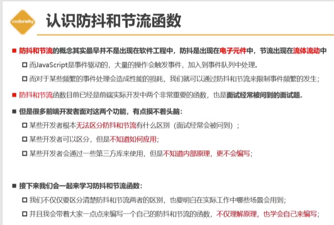
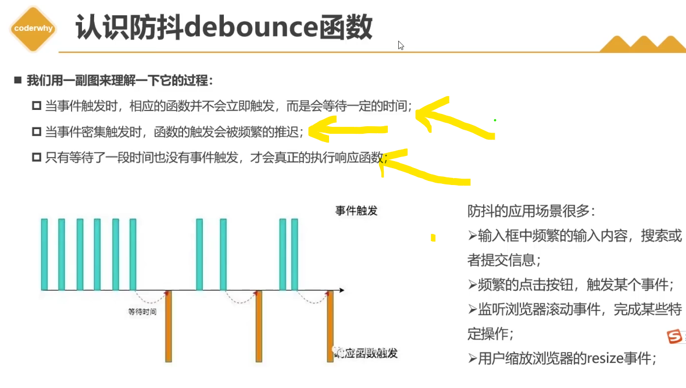
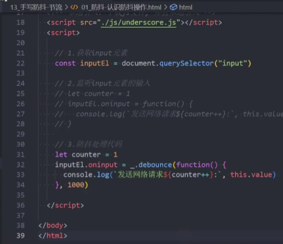
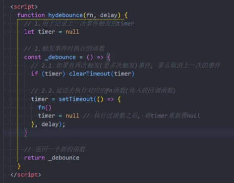
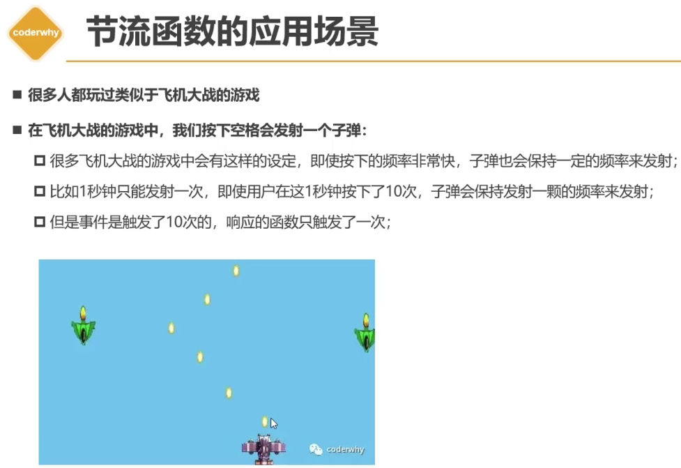

https://www.bilibili.com/video/BV1ky4y1Q7f9/?p=3&spm_id_from=333.880.my_history.page.click&vd_source=a7089a0e007e4167b4a61ef53acc6f7e

# 一 防抖应用场景

==防抖：只有在某个时间内，没有再次触发某个函数时，才真正的调用这个函数==

# 二 手写防抖函数的基本功能实现

# 三 手写防抖函数的this和参数绑定

见code

# 四 手写防抖函数的取消功能实现

# 五 手写防抖函数的立即执行功能

# 六 手动防抖函数的获取返回值

# 七 认识节流函数和应用场景

 

# 八 手写节流函数的基本功能实现

  