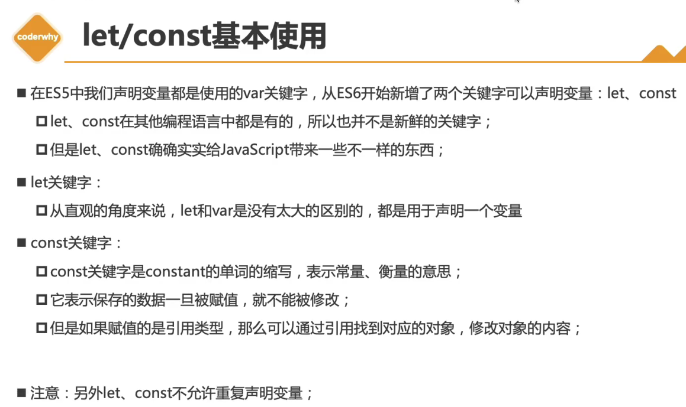
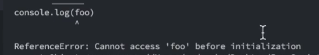
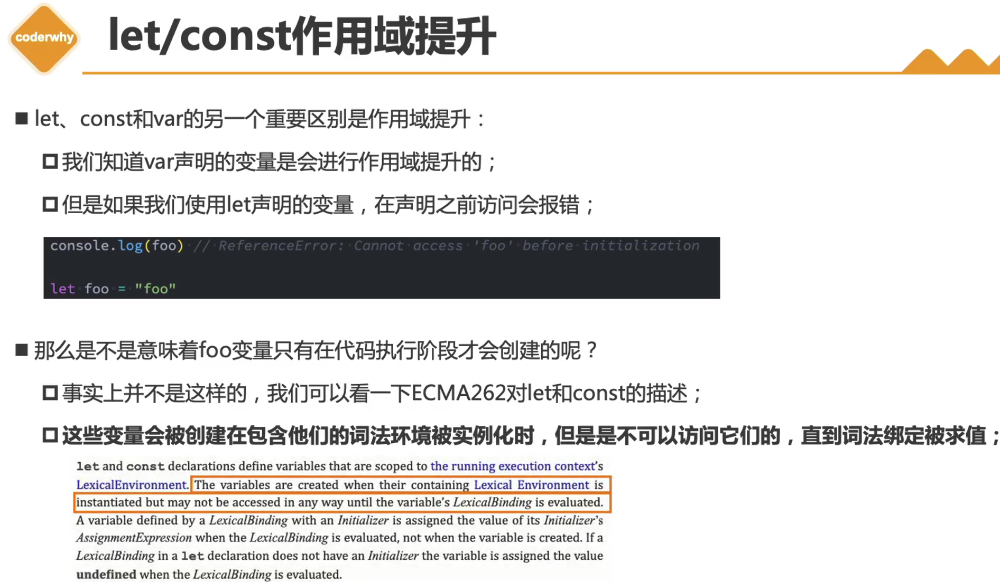
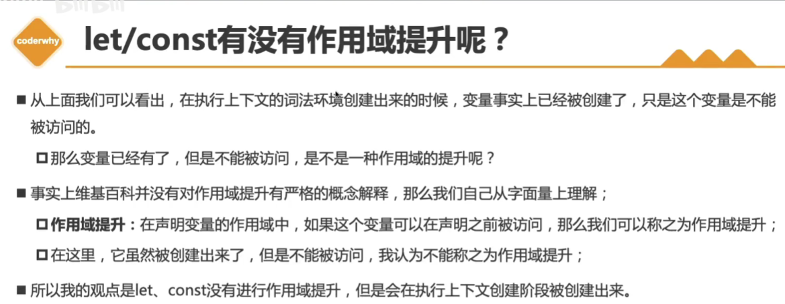
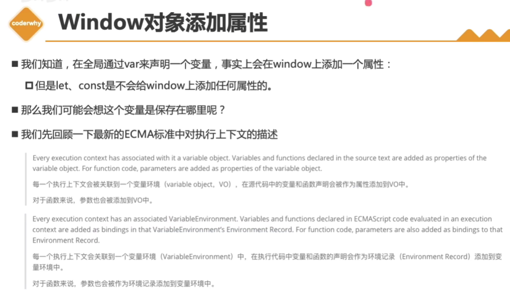

https://www.bilibili.com/video/BV1zd4y1X7ky/?p=4&spm_id_from=pageDriver&vd_source=a7089a0e007e4167b4a61ef53acc6f7e

# 1.var/let/const的基本使用



# 2.let/const的作用域提升

```javascript
console.log(foo); // undefined
var foo = "foo";
```

用var声明一个变量，这个变量是会进行作用域提升的

所以在第二行执行之前，在第一行是可以访问到foo的

因为在对代码进行解析的时候，就已经知道有foo了


```javascript
console.log(foo);
let foo = "foo";
```

会报错：



**结论：let/const是没有作用域提升的**



- [ ] 词法环境（LexicalEnvironment）是指啥？

  如果一份代码准备运行，它会先在我们的调用栈中给我们创建一个执行上下文，

  在执行上下文里面，有一个东西叫词法环境（在创建执行上下文的时候，其实会创建一个词法环境）



# 3.let/const和window的关系




# 4.ES6新增的块级作用域


# 3.var：

**1.可以重复声明**

```js
var a=12; var a=5; alert(a); // 5 
```

2.无法限制修改

```js
PI=3.1415926
```

3.没有块级作用域

```js
{    // 块级作用域是指在这里面定义一个变量，在外面用不了 } 
  if (true) {    var a=12; } alert(a) // 12
```

# 4.let:

**1.不能重复声明**

```js
let a=12; let a=5; alert(a); // Identifier 'a' has already been declared 
```

2.变量

3.有块级作用域

```js
if (true) {    let a=12; } alert(a) // a is not defined
```

# 5.const:

1. **不能重复声明**
2. 常量
3. 有块级作用域


# 字面量的增强

https://www.bilibili.com/video/BV1zd4y1X7ky?p=1

