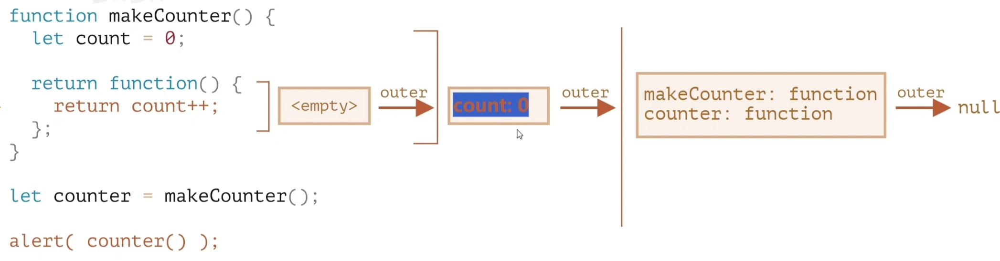
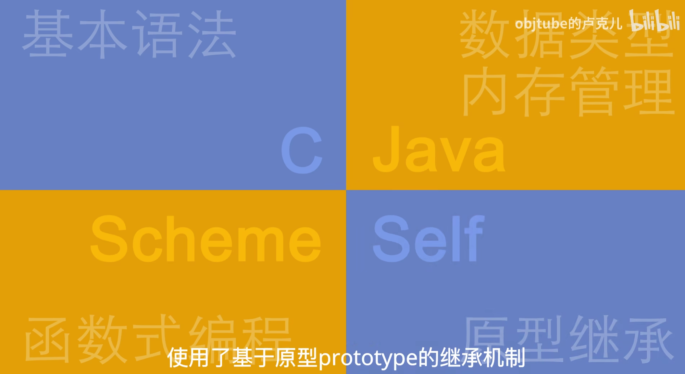
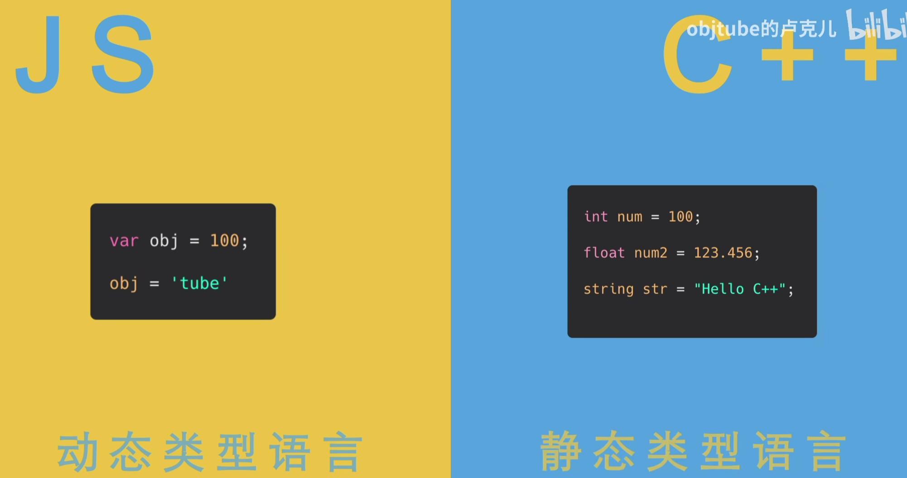
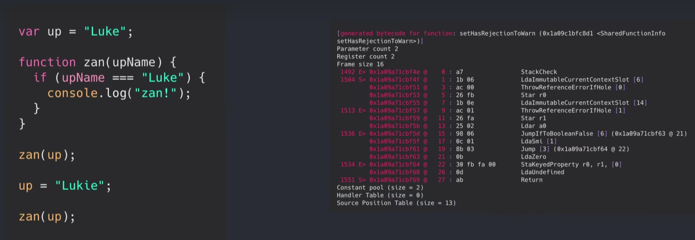
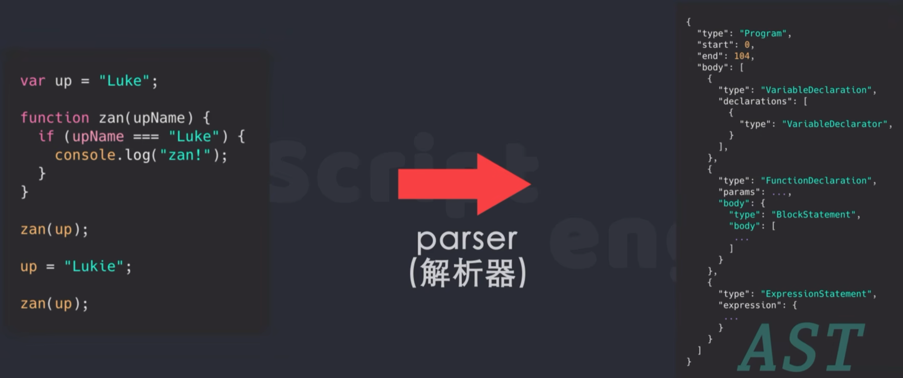
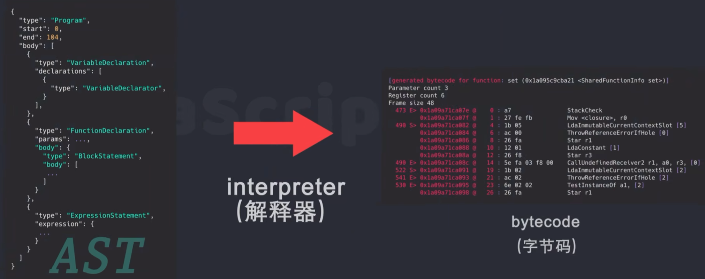
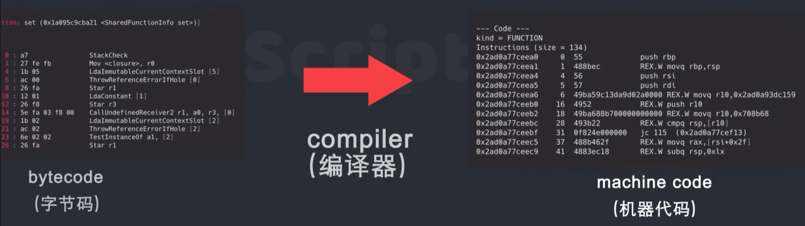

# 1. new的过程

构造函数的执行流程：

```js
function Person (name) {
    this.name = name;
};
var person = new Person('张三');
```

new的过程：

1. 立即创建一个新的对象
2. 将新建的对象设置成为函数中的this
3. 逐行执行函数中的代码
4. 将新建的对象作为返回值返回

**面试题：手写一个new()**

https://juejin.cn/post/7216650471746289701

https://juejin.cn/post/7081885715218300965

# [2. 闭包和词法环境](https://www.bilibili.com/video/BV1PP411t7QX/?spm_id_from=333.337.search-card.all.click&vd_source=a7089a0e007e4167b4a61ef53acc6f7e)

```js
let makeCounter = function () {
    var count = 0;
    return function () {
        return count++;
    };
};
var counter = makeCounter();
alert(counter()); // 输出：0
alert(counter()); // 输出：1
```

- 为什么会记录这个count？？
- 需要了解一个概念，叫做词法环境。用词法环境来解释闭包
  - 所有的函数在‘诞生’时，都会记住创建它们的词法环境（对象）
  - 函数都有名为[[Environment]]的隐藏属性，该属性保存了对创建该函数的词法环境(对象)的引用



# 3. 如何查看函数的名为[[Environment]]的隐藏属性

在 JavaScript 中，`[[Environment]]` 是一个内部属性，代表了函数的词法环境。这个属性是 JavaScript 引擎内部的实现细节，通常是不可直接访问的。

然而，你可以间接地了解函数的词法环境的一些特性，比如使用 `Function.prototype.toString` 方法查看函数的源代码，但这并不能直接显示 `[[Environment]]` 属性。下面是一些可能对你有帮助的工具和技巧：

1. **查看闭包的上下文**：如果函数有闭包，你可以通过在函数内部访问外部变量来查看函数的环境。示例：

    ```javascript
    function outer() {
        let outerVar = 'I am outer';
        function inner() {
            console.log(outerVar); // 可以访问外部函数的变量
        }
        return inner;
    }

    const innerFunction = outer();
    innerFunction(); // 输出 'I am outer'
    ```

2. **使用 `debugger` 语句**：你可以在函数中插入 `debugger` 语句，运行时浏览器的开发者工具会暂停执行，这样你可以检查函数的环境。

    ```javascript
    function myFunction() {
        let localVar = 'I am local';
        debugger; // 在这里调试
    }
    ```

3. **使用开发者工具**：大多数现代浏览器的开发者工具允许你在调试时查看函数的词法环境。你可以通过设置断点并在断点处查看作用域链来间接了解 `[[Environment]]`。

4. **使用 JavaScript 引擎的特性**：一些高级调试工具和引擎提供了对这些内部特性的访问，但这通常是特定于实现的，不是通用的。

虽然直接访问 `[[Environment]]` 可能不切实际，但理解函数的作用域和闭包是很重要的，能够帮助你在实际编程中处理函数环境的问题。

# [4. JS是如何运行的](https://www.bilibili.com/video/BV1vh411Z7QG/?spm_id_from=333.337.search-card.all.click&vd_source=a7089a0e007e4167b4a61ef53acc6f7e)

|  |  |
| ------------------------------------------------------------ | ------------------------------------------------------------ |

- 现代的JavaScript引擎都使用了一项技术——Just-In-Time Compilation(运行时编译)，即在运行阶段生成机器代码，而不是提前生成
- JIT把代码的运行和生成机器代码是结合在一起的
- 在运行阶段收集类型信息，然后根据这些信息编译生成机器码
- 之后再运行这些代码时，就直接使用生产好的机器代码



- JS是一门高级语言，它被计算机CPU执行前，需要通过某种程序，将JS转换成低级的机器语言并执行，这种程序就被称作为JavaScript引擎

- 和其他语言相比，JS有许多执行引擎：

  - 谷歌Chrome使用的V8引擎
  - webkit使用的JavaScriptCore
  - Mozilla的SpiderMonkey

- 这些引擎编译JS的大致流程：

- | 1.首先将JS源码通过解析器，解析成抽象语法树AST                |  |
  | ------------------------------------------------------------ | ------------------------------------------------------------ |
  | 2.通过解释器将**AST**编译成**字节码bytecode**。（字节码是跨平台的一种中间表示，不同于最终的机器代码，字节码与平台无关，能够在不同操作系统上运行） |  |
  | 3.**字节码**最后通过编译器生成**机器代码**。（由于不同的处理器平台使用的机器代码会有差异，所以编译器会根据当前平台来编译出相应的机器代码） |  |

