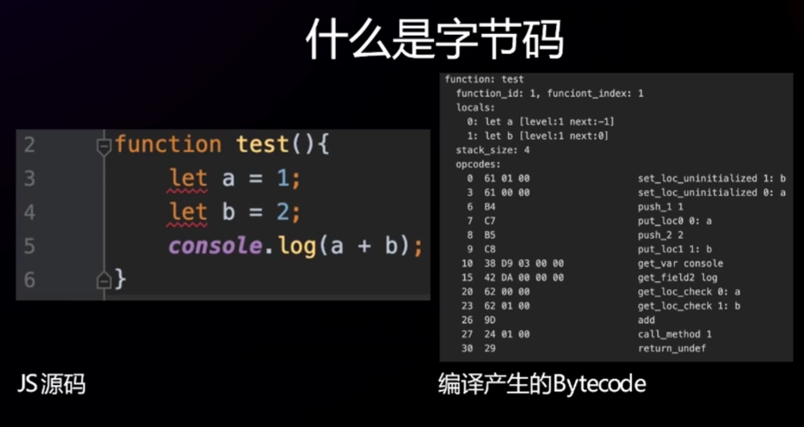
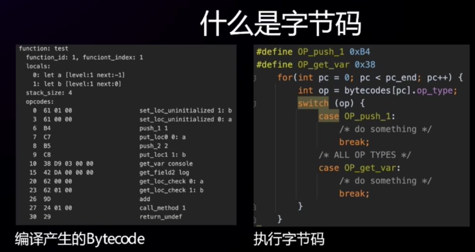

https://www.bilibili.com/video/BV1cd4y1p7SP/?p=2&spm_id_from=pageDriver&vd_source=a7089a0e007e4167b4a61ef53acc6f7e

# 1. JavaScript原理——V8引擎执行代码的流程


V8引擎本身是跨平台的


词法分析

语法分析

**字节码**是跨平台的

# 2. JavaScript原理——v8引擎的模块和概念理解


# 3. JavaScript原理——ECMA文档版本说明


# 4. JS执行原理——执行前创建全局对象 


# 5. JS执行原理——全局代码执行前后的流程


**任何代码的执行都要先创建一个执行上下文，执行上下文是放在执行上下文栈中的**


**代码在真正的开始执行之前（代码在真正的开始进入到执行上下文里面之前），代码需要先经过JS引擎的解析翻译**


**执行一段代码的时候，先要对这段代码进行翻译，翻译的时候发现有变量message，num1，num2等，会把他们保存在VO对象中**

**把一段代码放到执行上下文中执行之前，会先创建一个VO对象（也不一定是创建，可能是关联），每一个执行上下文都会关联一个VO对象**

 ==对于全局上下文来说，VO(Variable Object)就是GO(Global Object——window)==


**JS引擎会对函数进行特殊的处理，如果发现声明是一个函数，会提前把函数对象创建出来**


# 6. JS执行原理——函数代码执行前后的流程


在**创建一个函数**的时候，就会创建一个AO对象吗？

这两者之间是没有关系的，==只有**函数执行的时候**才会创建它对应的AO==

关于AO和作用域链这两点还需要再看一下视频！！！！

# 7. 函数代码相互调用的过程

# 8. 变量查找的作用域链顺序

**作用域和作用域链**

```javascript
var message = 'Global message';
function foo() {
    var message = 'foo message'
    function bar(){
        var message = 'bar message';
        console.log(message);
    }
    return bar;
}
var bar = foo();
bar();
```

查找变量的顺序：

1.在执行上下文中优先去自己的VO对象中去查找

2.如果在自己的VO对象中找不到，就通过作用域链去查找


**当进入一个执行上下文时，作用域链会被创建，执行上下文会关联这个被创建的作用域链**

**函数的作用域链在函数被解析创建的时候就已经决定了**


函数的Scope chain对象是在函数被解析创建的时候被创建的

执行上下文的Scope chain对象是在函数差不多开始执行的时候（即进入一个执行上下文的时候）去关联了Scope chain对象

# 9. 作用域面试题的解析

# 10. 面试真题

```javascript
function Foo() {
    getName = function(){ console.log(1); };
    return this;
}
Foo.getName = function() {     console.log(2); };
Foo.prototype.getName = function(){     console.log(3); };
var getName = function() {     console.log(4);  };
function getName(){ 
 console.log(5); 
}

Foo.getName(); // 2
getName(); // 4
Foo().getName(); // 3 错误；Foo()执行后return的this是window，随后要执行window.getName();
getName(); // 1

// 预测输出：2 4 3 1
// 实际输出： 2 4 1 1
```

# [11. 编译技术概述](https://www.bilibili.com/video/BV1eL411z7fH?spm_id_from=333.788.videopod.sections&vd_source=a7089a0e007e4167b4a61ef53acc6f7e)


# [12. JS编译技术](https://www.bilibili.com/video/BV1xh4y187gE?spm_id_from=333.788.player.switch&vd_source=a7089a0e007e4167b4a61ef53acc6f7e)

## **JS不是一门解释语言吗？它跟编译有什么关系？**

- JS被认为是一门解释语言，但该定义有些模糊。JS的执行方式可以是解释的，也可以是编译的，取决于JS引擎的实现
- 早期JS引擎通常以逐行解释的方式执行代码——意味着它们在运行时逐行读取和执行代码
- 现代JS引擎（如chrome的V8和Firefox的SpiderMonkey）使用**即时编译技术**——代码在首次执行时被编译为机器码，然后直接执行，这样可以提高执行效率

因此，尽管JS具有解释语言的特征，但现代实现使得它在性能上更接近于编译语言


## **JS这门语言是怎么执行起来的？**

JS的执行过程主要主要依赖于浏览器或NodeJs中的JS引擎。现代JS引擎，如Chrome的V8引擎，采取了一些复杂的步骤来高校执行JS代码

- **解析（Parsing）**
  - JS引擎读取整个JS代码，将其转化为AST抽象语法树。这个过程包括两个主要步骤：
    - **词法分析（Lexical Analysis）**：将源代码分割成小的单位(称为标记或**Tokens**)，如关键字、变量、操作符等
    - **语法分析（Syntax Analysis）**：根据JS的语法规则将这些**标记**组织成一颗树状结构(AST)
- **编译（Compilation）**
  - 在现在JS引擎中，**即时编译(JIT)**技术被用于编译JS代码。引擎会将AST转化为**字节码**或者**机器码**，之后交由CPU执行。V8引擎使用的两种编译器：
    - **Ignition（解释器）**：首先将AST转换成字节码并解释执行
    - **TurboFan（优化编译器）**：在代码执行过程中，如果某些代码路径被多次执行，TurboFan会将这些热点代码优化为机器码，从而提升执行效率
- **执行（Execution）**
  - 一旦代码被编译成字节码或机器码，JS引擎就会将其交由CPU执行。在执行过程中，JS引擎负责管理以下部分：
    - 内存分配：为变量，对象等分配内存
    - 作用域和上下文管理：处理闭包，块级作用域，函数作用域等
    - 垃圾回收：通过垃圾回收机制（如标记-清除算法），自动释放不再使用的内存，防止内存泄漏
- **优化（Optimization）**
  - 在执行过程中，V8的TurboFan会动态分析代码，检测哪些部分执行频繁，并应用各种优化技术（如内联函数，删除未使用代码，消除冗余运算等），使代码运行得更快。如果发现代码路径不再符合优化条件，TurboFan还可以进行反优化，将其还原为字节码进行解释

## **什么是字节码，长什么样？**

|  |  |
| ------------------------------------------------------------ | ------------------------------------------------------------ |

## 为什么需要字节码


17min处


