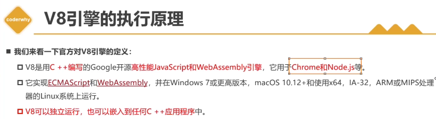
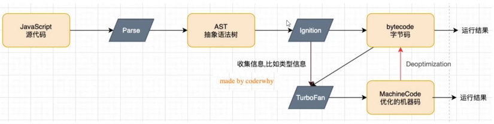
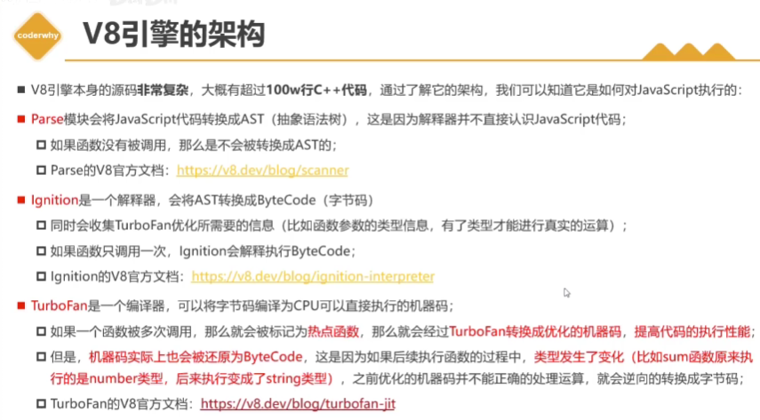
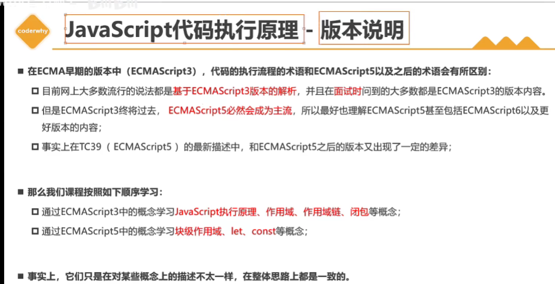
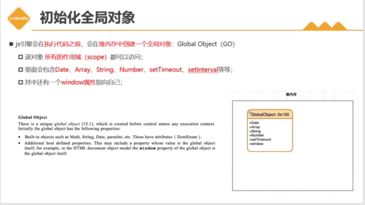
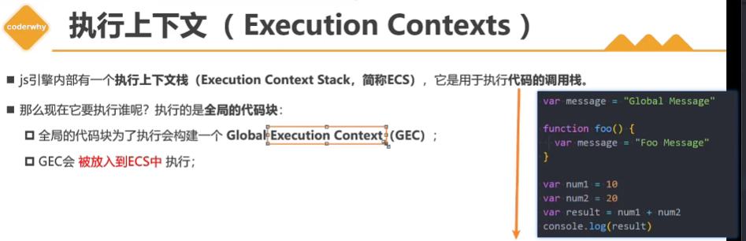
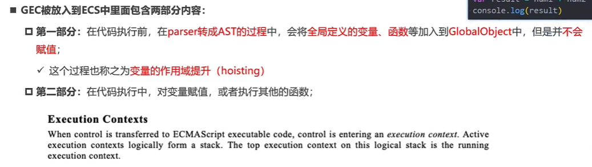
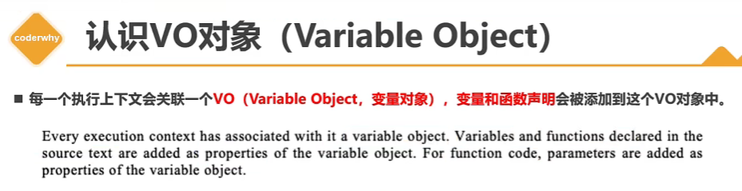
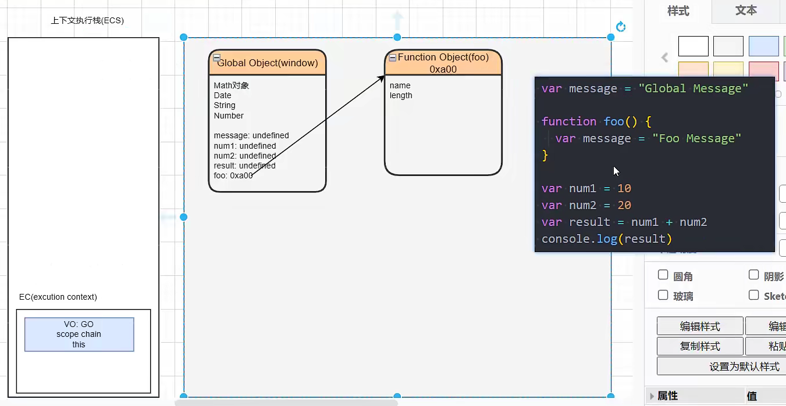

https://www.bilibili.com/video/BV1cd4y1p7SP/?p=2&spm_id_from=pageDriver&vd_source=a7089a0e007e4167b4a61ef53acc6f7e

# 1. JavaScript原理——V8引擎执行代码的流程

V8引擎本身是跨平台的

词法分析

语法分析

**字节码**是跨平台的

# 2. JavaScript原理——v8引擎的模块和概念理解

# 3. JavaScript原理——ECMA文档版本说明

# 4. JS执行原理——执行前创建全局对象

# 5. JS执行原理——全局代码执行前后的流程

 ==对于全局上下文来说，VO(Variable Object)就是GO(Global Object——window)==

# 6. JS执行原理——函数代码执行前后的流程

