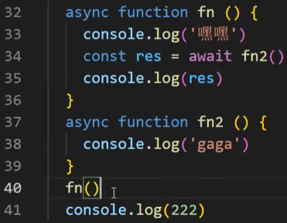

https://www.bilibili.com/video/BV1dM4y1D73D/?spm_id_from=333.788.recommend_more_video.8&vd_source=a7089a0e007e4167b4a61ef53acc6f7e

# 1. 计算体系结构和学习方法

# 3. 操作系统的进程和线程理解

# 4. JavaScript单线程-事件队列-循环

==当开启一个定时器的时候，真正计时的操作并不是由Javascript线程来执行的，而是由浏览器中别的线程来执行的==

# 5. Javascript单线程-宏任务和微任务

 **微任务优先级高**

# 6. Javascript代码的执行顺序——面试题一

https://www.bilibili.com/video/BV1K4411D7Jb/?spm_id_from=333.337.search-card.all.click&vd_source=a7089a0e007e4167b4a61ef53acc6f7e

**The Event Loop**

# [7. 宏任务和微任务是什么](https://www.bilibili.com/video/BV17A411f7Q9/?spm_id_from=pageDriver&vd_source=a7089a0e007e4167b4a61ef53acc6f7e)

> 宏任务：主线程要执行的代码，setTimeout等属于宏任务，上一个宏任务执行完，才会考虑执行下一个宏任务
>
> 微任务：promise.then .catch的内容，属于微任务

# [8. 宏任务，微任务练习题](https://www.bilibili.com/video/BV1HP4y1k7RF/?spm_id_from=pageDriver&vd_source=a7089a0e007e4167b4a61ef53acc6f7e)

|  |  |
| ------------------------------------------------------------ | ------------------------------------------------------------ |
| 输出：1， 3， 1000， 2                                       | 输出：111， 222                                              |
|                                                              | async 可以用于修饰一个函数，表示一个函数是异步的 async 只有在遇到了await开始，才是异步的开始 |
|  |  |
| 输出： 222， 1                                               | 输出：333, 222,1                                             |
| 从await开始异步 **await下面的内容可以理解为是.then里面的内容**（即第24行代码） |                                                              |
|  |  |
| 输出：嘿嘿，gaga, 222, undefined                             |                                                              |

# 9. async/await是什么

# 10. 相较于Promise，async/await有什么优势

