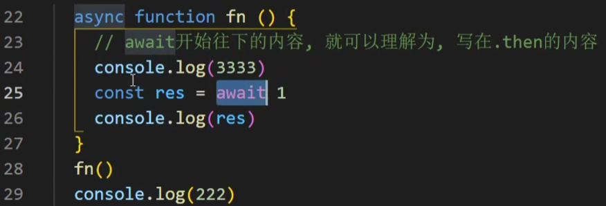

https://www.bilibili.com/video/BV1dM4y1D73D/?spm_id_from=333.788.recommend_more_video.8&vd_source=a7089a0e007e4167b4a61ef53acc6f7e

# 1. 计算体系结构和学习方法

# 3. 操作系统的进程和线程理解


# 4. JavaScript单线程-事件队列-循环


==当开启一个定时器的时候，真正计时的操作并不是由Javascript线程来执行的，而是由浏览器中别的线程来执行的==


# 5. Javascript单线程-宏任务和微任务

 **微任务优先级高**


# 6. Javascript代码的执行顺序——面试题一


https://www.bilibili.com/video/BV1K4411D7Jb/?spm_id_from=333.337.search-card.all.click&vd_source=a7089a0e007e4167b4a61ef53acc6f7e

**The Event Loop**

# [7. 宏任务和微任务是什么](https://www.bilibili.com/video/BV17A411f7Q9/?spm_id_from=pageDriver&vd_source=a7089a0e007e4167b4a61ef53acc6f7e)

> 宏任务：主线程要执行的代码，setTimeout等属于宏任务，上一个宏任务执行完，才会考虑执行下一个宏任务
>
> 微任务：promise.then .catch的内容，属于微任务


# [8. 宏任务，微任务练习题](https://www.bilibili.com/video/BV1HP4y1k7RF/?spm_id_from=pageDriver&vd_source=a7089a0e007e4167b4a61ef53acc6f7e)

|  |  |
| ------------------------------------------------------------ | ------------------------------------------------------------ |
| 输出：1， 3， 1000， 2                                       | 输出：111， 222                                              |
|                                                              | async 可以用于修饰一个函数，表示一个函数是异步的<br>async 只有在遇到了await开始，才是异步的开始 |
|  |  |
| 输出： 222， 1                                               | 输出：333, 222,1                                             |
| 从await开始异步<br>**await下面的内容可以理解为是.then里面的内容**（即第24行代码） |                                                              |
|  |  |
| 输出：嘿嘿，gaga, 222, undefined                             |                                                              |

# 9. async/await是什么


# 10. 相较于Promise，async/await有什么优势


# 11. 宏任务和微任务划分的依据

### 1. **宏任务（Macro Task）**

**宏任务是由宿主环境（如浏览器、Node.js）提供的任务**。在事件循环的每一轮中，只有一个宏任务会被执行，然后才会检查微任务队列。

#### **常见的宏任务**：
- `setTimeout`
- `setInterval`
- `setImmediate` (Node.js)
- I/O 操作
- UI 渲染（浏览器环境）
- 事件处理程序

#### **执行顺序**：
1. 执行一个宏任务。
2. 检查并执行所有在此期间产生的微任务。
3. 如果微任务队列为空，事件循环将进入下一轮，继续处理下一个宏任务。

### 2. **微任务（Micro Task）**

微任务是在当前宏任务执行结束后立即执行的任务，它们在同一轮事件循环中会优先于下一个宏任务执行。**微任务通常由语言本身或 API 产生**，通常是为了确保一些操作在当前事件循环周期结束前完成。

#### **常见的微任务**：
- `Promise` 的 `.then()`、`.catch()` 和 `.finally()` 回调
- `MutationObserver`
- `queueMicrotask`
- `process.nextTick` (Node.js)

#### **执行顺序**：
1. 执行当前宏任务。
2. 在同一轮事件循环中，清空所有的微任务队列。
3. 如果微任务产生了新的微任务，这些任务也会在同一轮事件循环中继续执行，直到微任务队列被完全清空。
4. 事件循环进入下一轮，执行下一个宏任务。

### 3. **划分依据**：

- **执行时机**：微任务总是在当前宏任务完成之后立即执行，保证任务的“紧急性”，而宏任务是在微任务队列清空之后才会被执行。

- **优先级**：微任务的优先级高于宏任务。即使一个新的宏任务已经准备好，事件循环也会优先执行微任务队列中的所有任务。

- **来源**：**宏任务通常是由宿主环境产生，而微任务通常由 JavaScript 引擎和语言本身产生（如 `Promise`）**

  。

### 4. **执行顺序示例**

```javascript
console.log('script start');

setTimeout(function() {
    console.log('setTimeout');
}, 0);

Promise.resolve().then(function() {
    console.log('Promise 1');
}).then(function() {
    console.log('Promise 2');
});

console.log('script end');
```

**执行顺序**：
1. `script start` (同步代码)
2. `script end` (同步代码)
3. `Promise 1` (微任务)
4. `Promise 2` (微任务)
5. `setTimeout` (宏任务)

在这个例子中，`setTimeout` 被认为是宏任务，而 `Promise.then` 回调是微任务。微任务会在当前宏任务结束后立即执行，因此 `Promise 1` 和 `Promise 2` 在 `setTimeout` 之前执行。


