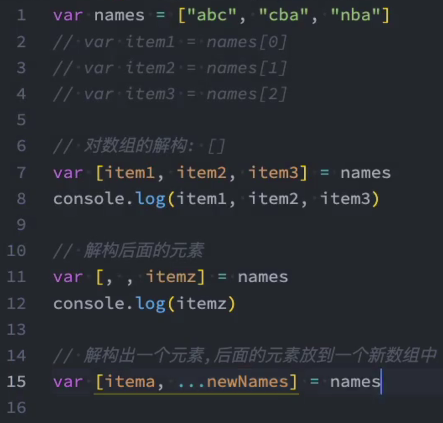
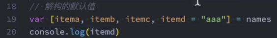

# 1.slice  

这个数组方法在vue中没有被改写！vue改写的那七个方法都是会更改原数组的！

```javascript
arrayObject.slice(start, end);
```

可从已有数组中返回选定的元素，**返回一个新数组**，包含从start到end（不包含该元素）的数组元素

注意：**该方法不会改变原数组，而是返回一个子数组**，如果想删除数组中的一段元素，应该使用Array.splice()方法。

- start参数：必须，规定从何处开始选取，如果为负数，规定从数组尾部算起的位置，-1是指最后一个元素。-2 指倒数第二个元素，以此类推。
- end参数：可选（如果该参数没有指定，那么切分的数组包含从start倒数组结束的所有元素，如果这个参数为负数，那么规定是从数组尾部开始算起的元素）。

```js
var arr = new Array(3)
arr[0] = "George"
arr[1] = "John"
arr[2] = "Thomas"
document.write(arr.slice(1) + "<br />")
```

输出：

```js
John,Thomas
```

# 2.splice

splice() 方法向/从数组中添加/删除项目，然后返回被删除的项目。

注意：该方法会改变原始数组

```js
arrayObject.splice(index,howmany,item1,.....,itemX)
```

| 参数              | 描述                                                         |
| :---------------- | :----------------------------------------------------------- |
| index             | 必需。整数，规定添加/删除项目的位置，使用负数可从数组结尾处规定位置。 |
| howmany           | 必需。要删除的项目数量。如果设置为 0，则不会删除项目。       |
| item1, ..., itemX | 可选。向数组添加的新项目。                                   |

返回值：

| 类型  | 描述                                 |
| :---- | :----------------------------------- |
| Array | 包含被删除项目的新数组，如果有的话。 |

```js
var arr = new Array(6);
arr[0] = "George"
arr[1] = "John"
arr[2] = "Thomas"
arr[3] = "James"
arr[4] = "Adrew"
arr[5] = "Martin"
arr.splice(2,0,"William")
document.write(arr + "<br />") // => George,John,William,Thomas,James,Adrew,Martin
```

# 3.shift

删除并返回数组的第一个元素

# 4.unshift

向数组的开头添加一个或更多元素，并返回新的长度

 # 5.push

向数组的末尾添加一个或更多元素，并返回新的长度

```js
let arr = [1];
let res = arr.push(2)
console.log('res:',res) // =>
```

返回值是数组的长度，不是true or false！

# 6.pop

删除并返回数组的最后一个元素

# 7.forEach

forEach会改变原来的数组吗？

会。并且forEach没有返回值！

```js
let nums = [1,2,34,55,1]
const newNums = nums.forEach((n, i) => {
    return nums.indexOf(n) === i; // 这个return出去的东西到哪去了？？？
})
console.log('newNums:',newNums) // undefined
```

# 8.filter

filter会改变原来的数组吗？

不会。filter从数组或者集合中筛选出符合条件的数据，最后的返回值是满足条件的数据组成的数组或者集合

```js
let nums2 = [1,2,34,55,1]
const newNums2 = nums2.filter((n, i) => {
    return nums2.indexOf(n) === i; // 这个return出去的东西到哪去了？？？
})
console.log('nums：',nums) // => nums： [ 1, 2, 34, 55, 1 ]
console.log('newNums2:',newNums2) // => newNums2: [ 1, 2, 34, 55 ]
```

---


https://www.bilibili.com/video/BV1Qy4y1v7KD?p=3&t=312

以前有很多浏览器是es3环境，不支持es5，所以重写这些数组方法是有意义的。

# 第一节 深拷贝函数封装

深拷贝优化

# 第二节 重写forEach

forEach会改变原来的数组，并且没有返回值。

```js
Array.prototype.myForEach = function (fn) {
    let arr = this;
    for(let i = 0; i < arr.length; i++) {
        fn(arr[i],i,arr)
    }
}
arr.myForEach(function(item, index, array){
    // console.log('this:', this);
    console.log('item:', item.name);
    // console.log('array:', array);
})
```

第二个参数可以用来改变this指向。

forEach没必要深拷贝，因为它不返回一个新的数组。

# 第三节 重写map

为什么要考虑深拷贝的问题？？？
因为希望在改变新的数组（对象）的时候，不改变原数组（对象）

==map会返回一个新的数组==

其实map是可以当成forEach用的，就是在map的回调函数里面不返回。

但是在工程化里面 eslint会提醒你return

```js
let arr = [
    {
        name: 'name1',
        age: '18',
        extra: {
            extra: 'extra'
        }
    },
    {
        name: 'name2',
        age: '18'
    },
    {
        name: 'name3',
        age: '18'
    },
    {
        name: 'name4',
        age: '18'
    }
]
var obj = {
    name: 'testName',
    age: 3
}
var newArray = arr.map(function (item, index, array) {
     console.log('this:',this)
     item.age += 100;
     return item
 }, obj)
console.log(newArray)

Array.prototype.myMap = function (cb) {
    var _arr = this;
    var _len = _arr.length;
    var _arg2 = arguments[1] || window;
    var _newArr = [];
    for(var i = 0; i < _len; i++) {
         _item = deepClone(_arr[i]); // deepClone函数省略了！！
         _newArr.push(cb.apply(_arg2, [item, i, _arr])); 
    }
    return _newArr; 
}
var newArray = arr.myMap(function (item, index, array) {
    console.log('this:',this)
    item.age += 100;
    item.test = 'test';
    item.extra = {
        extra2: 'extra2'
    }
    return item
}, obj)
console.log(arr)

```

# 第四节 重写filter

```js
let arr = [
    {
        name: 'name1',
        age: '18',
        extra: {
            extra: 'extra'
        }
    },
    {
        name: 'name2',
        age: '18'
    },
    {
        name: 'name3',
        age: '18'
    },
    {
        name: 'name4',
        age: '18'
    }
]
var obj = {
    name: 'testName',
    age: 3
}

var newArr = arr.filter(function (item, index, array) {
    return false; // 如果return的是true，那么每一项item都会到新的数组里面去
    // return true;
    // return item.age > 25;
})
console.log('newArr:', newArr)

Array.prototype.myFilter = function (cb) {
    var _arr = this;
    var _len = _arr.length;
    var _arg2 = arguments[1] || window;
    var _newArr = [];
    var _item;
    for (var i = 0; i < _len; i++) {
        _item.deepClone(_arr[i]);
        cb.apply(_arg2, [_item, i, _arr]) ? _newArr.push(_item) : ''; 
    }
    return _newArr;
}
```

https://www.bilibili.com/video/BV1BZ4y1g7CK

# 第五节 重写every 

==返回值不是数组。是true 或者 false。所以不用考虑深拷贝。==

34 25 21 28

第113行：false（==只要110行有一次返回了false，那every返回的结果就是false==）

# 第六节 重写some

==只要有一个满足真就返回some==

# 第七节 重写reduce和reduceRight

==reduce返回值：一个新数组==

prev参数

第二个参数（第142行的initialValue）必填！！！！

```
//=> { }  undefined   undefined   undefined
```

```
//=> { }  { }  { }  { } 
```

==第一次循环：prev就是initialValue==

==第二次循环：prev就是第一次循环的返回值==

```
// => [1,2,3,4]
```

`问题：`initialValue是不是也变成[1,2,3,4]了！！！我觉得是的！！！！

```js
let arr = [
    {
        name: 'name1',
        age: '18',
        extra: {
            extra: 'extra'
        }
    },
    {
        name: 'name2',
        age: '18'
    },
    {
        name: 'name3',
        age: '18'
    },
    {
        name: 'name4',
        age: '18'
    }
]
var initialValue = [];
var i = 0;
// var newArr = arr.reduce(function(prev, item, index, arr){
//     i++;
//     prev.push(i);
//     return prev
// }, initialValue)

Array.prototype.myReduce = function (fn, initialValue) {
    let arr = this;
    let length = arr.length;
    for(let i = 0; i < length; i++) {
        initialValue = fn(initialValue, arr[i], i, arr);
    }
    return initialValue;
}
var newArr = arr.myReduce(function(prev, item, index, arr){
    i++;
    prev.push(i);
    return prev
}, initialValue)

console.log('newArr:',newArr);
console.log('initialValue:',initialValue)
```

# 1.数组的解构赋值

如何实现解构出一个元素，后面的元素放到一个新数组中？







