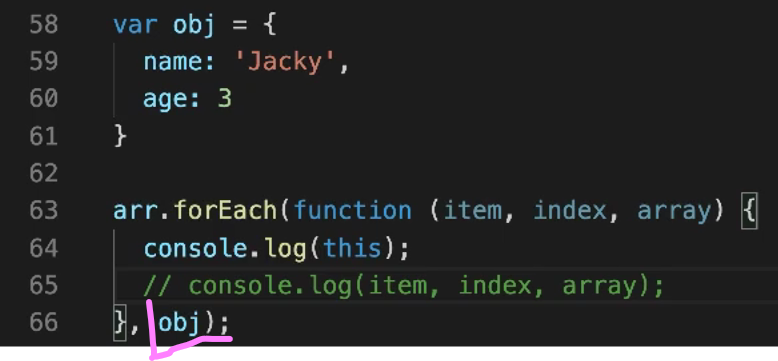
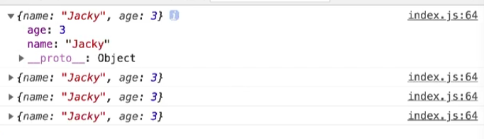
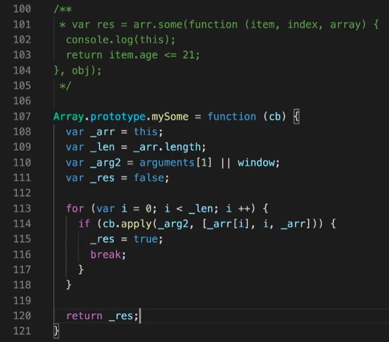
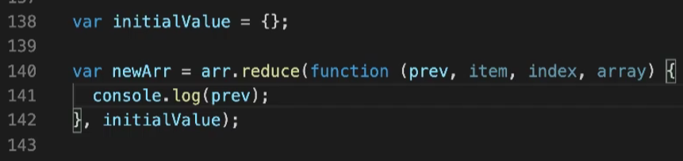
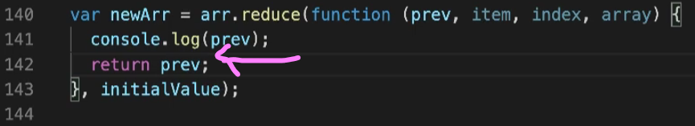
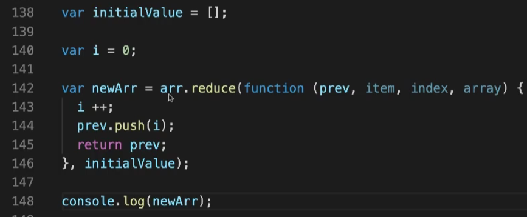
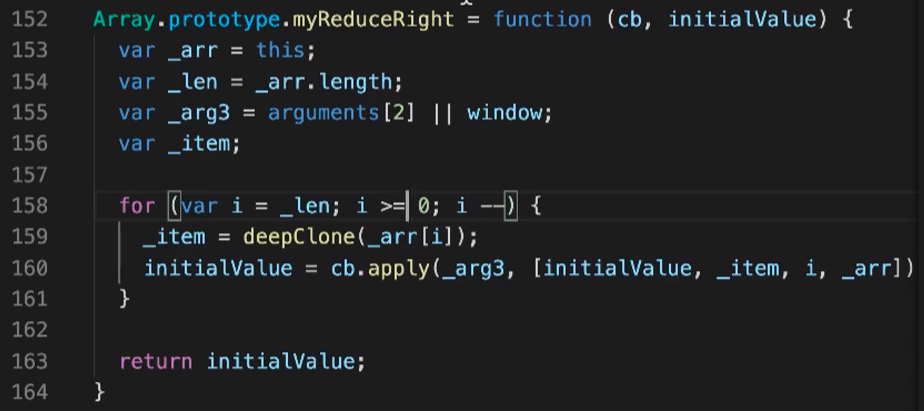

# 1. slice  

这个数组方法在vue中没有被改写！vue改写的那七个方法都是会更改原数组的！

> 该方法既可用于数组，也可用于字符串

```javascript
arrayObject.slice(start, end);
```

可从已有数组中返回选定的元素，**返回一个新数组**，包含从start到end（不包含该元素）的数组元素

注意：**该方法不会改变原数组，而是返回一个子数组**，如果想删除数组中的一段元素，应该使用Array.splice()方法。

- start参数：必须，规定从何处开始选取，如果为负数，规定从数组尾部算起的位置，-1是指最后一个元素。-2 指倒数第二个元素，以此类推。
- end参数：可选（如果该参数没有指定，那么切分的数组包含从start倒数组结束的所有元素，如果这个参数为负数，那么规定是从数组尾部开始算起的元素）。

```js
var arr = new Array(3)
arr[0] = "George"
arr[1] = "John"
arr[2] = "Thomas"
document.write(arr.slice(1) + "<br />")
```

输出：

```js
John,Thomas
```

# 2. splice

splice() 方法向/从数组中添加/删除项目，然后返回被删除的项目。

注意：该方法会改变原始数组

```js
arrayObject.splice(index,howmany,item1,.....,itemX)
```

| 参数              | 描述                                                         |
| :---------------- | :----------------------------------------------------------- |
| index             | 必需。整数，规定添加/删除项目的位置，使用负数可从数组结尾处规定位置。 |
| howmany           | 必需。要删除的项目数量。如果设置为 0，则不会删除项目。       |
| item1, ..., itemX | 可选。向数组添加的新项目。                                   |

返回值：

| 类型  | 描述                                 |
| :---- | :----------------------------------- |
| Array | 包含被删除项目的新数组，如果有的话。 |

```js
var arr = new Array(6);
arr[0] = "George"
arr[1] = "John"
arr[2] = "Thomas"
arr[3] = "James"
arr[4] = "Adrew"
arr[5] = "Martin"
arr.splice(2,0,"William")
document.write(arr + "<br />") // => George,John,William,Thomas,James,Adrew,Martin
```

# 3. shift

删除并返回数组的第一个元素

# 4. unshift

向数组的开头添加一个或更多元素，并返回新的长度

 # 5. push

向数组的末尾添加一个或更多元素，并返回新的长度

```js
let arr = [1];
let res = arr.push(2)
console.log('res:',res) // =>
```

返回值是数组的长度，不是true or false！

# 6. pop

删除并返回数组的最后一个元素

# [7. forEach和重写forEach](https://www.bilibili.com/video/BV1Qy4y1v7KD?p=2&vd_source=a7089a0e007e4167b4a61ef53acc6f7e)

> forEach会改变原来的数组，并且没有返回值。

```js
let nums = [1,2,34,55,1]
const newNums = nums.forEach((n, i) => {
    return nums.indexOf(n) === i; // 这个return出去的东西到哪去了？？？
})
console.log('newNums:', newNums) // undefined
```

```js
// forEach重写
Array.prototype.myForEach = function (fn) {
    let arr = this;
    let length = arr.length;
    let _this = arguments[1] || window;
    for(let i = 0; i < length; i++) {
        fn.apply(_this, [arr[i], i, arr])
    }
}
arr.myForEach(function(item, index, array){
    console.log('this:', this);
    console.log('item:', item.name);
    console.log('array:', array);
})
```

forEach方法的第二个参数可以用来改变this指向。

|  |  |
| ------------------------------------------------------------ | ------------------------------------------------------------ |

forEach没必要深拷贝，因为它不返回一个新的数组。

> 面试相关：forEach函数的原理是什么？为什么下面的代码不会无限循环？
>
> ```js
> let numbersOne = [1, 2, 3];
> numbersOne.forEach((number, index) => {
>     console.log(number);
>     numbersOne.push(number + 3)
> })
> console.log('numbersOne的最终结果：', numbersOne)
> ```
>
> https://www.bilibili.com/video/BV1Sb421B7aw/?spm_id_from=333.999.0.0&vd_source=a7089a0e007e4167b4a61ef53acc6f7e
>
> [ECMA中对forEach的定义](https://tc39.es/ecma262/#sec-array.prototype.foreach)
>
> 

# 8. filter

filter会改变原来的数组吗？

不会。filter从数组或者集合中筛选出符合条件的数据，最后的返回值是满足条件的数据组成的数组或者集合

```js
let nums2 = [1,2,34,55,1]
const newNums2 = nums2.filter((n, i) => {
    return nums2.indexOf(n) === i; // 这个return出去的东西到哪去了？？？
})
console.log('nums：',nums) // => nums： [ 1, 2, 34, 55, 1 ]
console.log('newNums2:',newNums2) // => newNums2: [ 1, 2, 34, 55 ]
```

---

# 9. 数组的解构赋值

如何实现解构出一个元素，后面的元素放到一个新数组中？

```js
var names = ["abc", "cba", "nba"]
// var item1 = names[0]
// var item2 = names[1]
// var item3 = names[2]

// 对数组的解构
var [item1, item2, item3] = names
console.log(item1, item2, item3)

// 解构后面的元素
var [,, itemz] = names;
console.log(itemz)

// 解构出一个元素，后面的元素放到一个新数组中
var [items, ...newNames] = names

// 解构的默认值
var [itema, itemb, itemc, itemd = "aaa"] = names
console.log(itemd)
```

# [10. 深拷贝函数封装](https://www.bilibili.com/video/BV1Qy4y1v7KD?p=1&vd_source=a7089a0e007e4167b4a61ef53acc6f7e)

> 自己封装的代码见数组code文件夹

以前有很多浏览器是es3环境，不支持es5，所以重写这些数组方法是有意义的。

在JavaScript中，对对象进行深拷贝有多种方法。以下是几种常见的方法：

## 1. 使用JSON方法

这是最简单和最常用的方法之一，但是有一些限制，比如不能处理函数和循环引用。

```javascript
const originalObject = { a: 1, b: { c: 2 } };
const deepCopiedObject = JSON.parse(JSON.stringify(originalObject));

console.log(deepCopiedObject); // { a: 1, b: { c: 2 } }
```

## 2. 使用递归方法

这种方法可以处理循环引用和函数。

```javascript
function deepCopy(obj, hash = new WeakMap()) {
  if (obj === null) return null;
  if (typeof obj !== "object") return obj;
  if (hash.has(obj)) return hash.get(obj);

  let copy = Array.isArray(obj) ? [] : {};
  hash.set(obj, copy);

  for (let key in obj) {
    if (obj.hasOwnProperty(key)) {
      copy[key] = deepCopy(obj[key], hash);
    }
  }

  return copy;
}

const originalObject = { a: 1, b: { c: 2 }, d: function() { return 3; } };
const deepCopiedObject = deepCopy(originalObject);

console.log(deepCopiedObject); // { a: 1, b: { c: 2 }, d: [Function: d] }
```

## 3. 使用Lodash库的`_.cloneDeep`方法

Lodash是一个强大的JavaScript实用工具库，提供了深拷贝的功能。

首先需要安装Lodash库：

```bash
npm install lodash
```

然后使用`_.cloneDeep`方法进行深拷贝：

```javascript
const _ = require('lodash');

const originalObject = { a: 1, b: { c: 2 } };
const deepCopiedObject = _.cloneDeep(originalObject);

console.log(deepCopiedObject); // { a: 1, b: { c: 2 } }
```

## 4. 使用结构化克隆算法

现代浏览器中可以使用`structuredClone`方法，它是基于结构化克隆算法的，可以处理循环引用和复杂对象。

```javascript
const originalObject = { a: 1, b: { c: 2 } };
const deepCopiedObject = structuredClone(originalObject);

console.log(deepCopiedObject); // { a: 1, b: { c: 2 } }
```

每种方法都有其优缺点，选择哪种方法取决于你的具体需求和对象的复杂性。如果对象中包含函数或者循环引用，递归方法和Lodash的`_.cloneDeep`方法会更适合。

# [11. 重写map](https://www.bilibili.com/video/BV1Qy4y1v7KD?p=3&spm_id_from=pageDriver&vd_source=a7089a0e007e4167b4a61ef53acc6f7e)

> map方法会返回一个新的数组
>
> 为什么要考虑深拷贝的问题？
>
> ​	因为希望在改变新的数组（对象）的时候，不改变原数组（对象）

```js
let arr = [
    {
        name: 'name1',
        age: '18',
        extra: {
            extra: 'extra'
        }
    },
    {
        name: 'name2',
        age: '18'
    },
    {
        name: 'name3',
        age: '18'
    },
    {
        name: 'name4',
        age: '18'
    }
]
var obj = {
    name: 'testName',
    age: 3
}
var newArray = arr.map(function (item, index, array) {
     console.log('this:', this);
     item.age += 100;
     return item;
 }, obj)
console.log(newArray)

// 重写map
Array.prototype.myMap = function (cb) {
    var _arr = this;
    var _len = _arr.length;
    var _arg2 = arguments[1] || window;
    var _newArr = [];
    var item;
    for(var i = 0; i < _len; i++) {
         _item = deepClone(_arr[i]); // deepClone函数省略了！
         _newArr.push(cb.apply(_arg2, [item, i, _arr])); 
    }
    return _newArr; 
}

var newArray = arr.myMap(function (item, index, array) {
    console.log('this:',this)
    item.age += 100;
    item.test = 'test';
    item.extra = {
        extra2: 'extra2'
    }
    return item
}, obj)
console.log(arr)
```

# [12. 重写filter](https://www.bilibili.com/video/BV1Qy4y1v7KD?p=4&spm_id_from=pageDriver&vd_source=a7089a0e007e4167b4a61ef53acc6f7e)

> filter方法会返回一个新的数组

```js
let arr = [
    {
        name: 'name1',
        age: '18',
        extra: {
            extra: 'extra'
        }
    },
    {
        name: 'name2',
        age: '18'
    },
    {
        name: 'name3',
        age: '18'
    },
    {
        name: 'name4',
        age: '18'
    }
]
var obj = {
    name: 'testName',
    age: 3
}

var newArr = arr.filter(function (item, index, array) {
    return false; // 如果return的是true，那么每一项item都会到新的数组里面去
    // return true;
    // return item.age > 25;
})
console.log('newArr:', newArr)

Array.prototype.myFilter = function (cb) {
    var _arr = this;
    var _len = _arr.length;
    var _arg2 = arguments[1] || window;
    var _newArr = [];
    var _item;
    for (var i = 0; i < _len; i++) {
        _item = deepClone(_arr[i]);
        cb.apply(_arg2, [_item, i, _arr]) ? _newArr.push(_item) : ''; 
    }
    return _newArr;
}
```

# [13. 重写every ](https://www.bilibili.com/video/BV1BZ4y1g7CK?p=1)

> 返回值不是数组。是true 或者 false。所以不用考虑深拷贝。
>
> 只要有一次返回了false，那every返回的结果就是false

|  |  |
| ------------------------------------------------------------ | ------------------------------------------------------------ |

# [14. 重写some](https://www.bilibili.com/video/BV1BZ4y1g7CK?p=2&vd_source=a7089a0e007e4167b4a61ef53acc6f7e)

> 只要有一个满足真就返回some

见上一节

# [15. 重写reduce和reduceRight](https://www.bilibili.com/video/BV1BZ4y1g7CK?p=3&vd_source=a7089a0e007e4167b4a61ef53acc6f7e)

> reduce方法的返回值是回调函数最终返回的累积值
>
> reduce是从前到后遍历，reduceRight是从后到前遍历

|  |  |
| ------------------------------------------------------------ | ------------------------------------------------------------ |
| 输出： { }  undefined   undefined   undefined<br>第二个参数（第142行的initialValue）必填！！！！？？ | 输出：{ }  { }  { }  { }                                     |
| <br>输出：[1,2,3,4] |  |

> 第一次循环：prev参数就是initialValue
>
> 第二次循环：prev参数就是第一次循环的返回值

```js
var initialValue = [];
var i = 0;
// 重写
Array.prototype.myReduce = function (fn, initialValue) {
    let _arr = this;
    let _len = _arr.length;
    let _arg2 = arguments[2] || window;
    let _item;
    for(let i = 0; i < _len; i++) {
        _item = deepClone(_arr[i])
        initialValue = fn.apply(_arg2, [initialValue, _item, i, _arr]);
    }
    return initialValue;
}
// 注：arr可以直接用前面几节的数据
var result = arr.myReduce(function(prev, item, index, arr){
    i++;
    prev.push(i);
    return prev
}, initialValue)

console.log('result:',result);
console.log('initialValue:',initialValue);
```

# 16. reduce 将二维数组转化为一维数组

https://www.jianshu.com/p/e375ba1cfc47

# 17. reduce 将多维数组转化为一维数组

https://www.jianshu.com/p/e375ba1cfc47

# 18. Array()

`Array()` 构造函数在 JavaScript 中是自 ECMAScript 1 (ES1) 标准以来就存在的方法，也就是说，它是 JavaScript 最早版本的一部分。

### 详细说明

`Array` 构造函数可以用来创建数组。其使用方式如下：

1. **创建空数组**

```javascript
let arr = new Array();
console.log(arr); // []
```

2. **通过指定长度创建数组**

```javascript
let arr = new Array(5);
console.log(arr); // [ <5 empty items> ]
```

3. **通过指定元素创建数组**

```javascript
let arr = new Array(1, 2, 3);
console.log(arr); // [1, 2, 3]
```

### 历史背景

`Array` 构造函数自 JavaScript 首次发布以来就存在，并在 ECMAScript 1 (ES1) 中正式定义。这意味着它是 JavaScript 语言的核心部分，并且自 1997 年起一直存在。

### 其他数组创建方式

除了 `Array` 构造函数，现代 JavaScript（ES6/ES2015及以后）还引入了一些其他方法来创建数组，例如 `Array.of()` 和 `Array.from()`。

1. **`Array.of()`**
   - 创建一个具有可变数量参数的新数组实例，而不考虑参数的数量或类型。

```javascript
let arr = Array.of(7);
console.log(arr); // [7]

let arr2 = Array.of(1, 2, 3);
console.log(arr2); // [1, 2, 3]
```

2. **`Array.from()`**
   - 从类数组对象或可迭代对象创建一个新的数组实例。

```javascript
let arr = Array.from('foo');
console.log(arr); // ["f", "o", "o"]

let set = new Set([1, 2, 3]);
let arr2 = Array.from(set);
console.log(arr2); // [1, 2, 3]
```

### 总结

`Array` 构造函数是 JavaScript 中最基础和最早的方法之一，属于 ECMAScript 1 标准的一部分。尽管如此，现代 JavaScript 提供了更多的方法来创建数组，使得开发者在处理数组时有更多的选择和灵活性。


