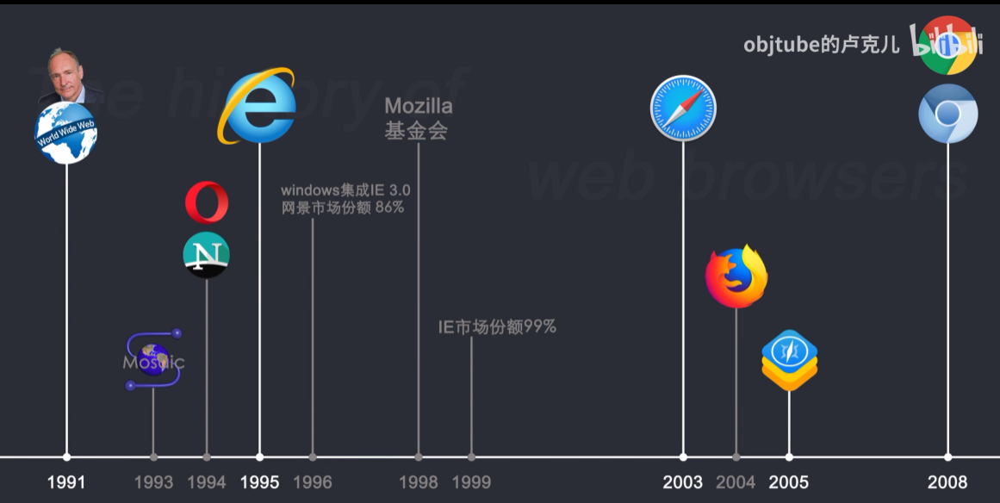
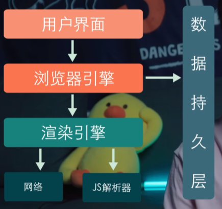

# 1.互联网是如何运作的

# 2.[浏览器是如何运作的](https://www.bilibili.com/video/BV1x54y1B7RE/?spm_id_from=333.880.my_history.page.click&vd_source=a7089a0e007e4167b4a61ef53acc6f7e)

## 2.1 浏览器的发展史

## 2.2 用户界面

## 2.3 浏览器引擎

用于在用户界面和渲染引擎之间传递数据

## 2.4 渲染引擎

- 负责渲染用户请求的页面内容
- 是一个浏览器的核心
- 往往把渲染引擎称为浏览器的内核

### 2.4.1 网络模块

负责网络请求

### 2.4.2 JS解析器

用于解析和执行JS 

# 3.根据==进程==功能不同来拆分浏览器

## 3.1 浏览器进程

负责控制Chrome浏览器除标签页外的用户界面，包括地址栏，书签，后退和前进按钮，以及负责与浏览器的其他进程协调工作

- ==**UI线程**==

## 3.2 缓存进程

## 3.3 网络进程

负责发起接受网络请求

## 3.4 渲染器进程

用来控制显示tab标签内的所有内容

## 3.5 插件进程

负责控制网站使用的所有插件，例如flash，这里的插件并不是指Chrome市场里面安装的扩展

## 3.6 GPU进程

负责整个浏览器界面的渲染

# 4.在浏览器地址栏里输入内容时，浏览器内部发生的事

1. 当在地址栏输入地址时，==浏览器进程==的==UI线程==会捕捉输入内容
2. 如果访问的是网址，则==UI线程==会启动一个==网络线程==来请求DNS进行域名解析，接着开始连接服务器获取数据
3. 如果你的输入不是网址，而是一串关键词，浏览器就知道你是要搜索，于是就会使用默认配置的搜索引擎来查询
4. 当==网络线程==获取到数据后，会通过safeBrowsing来检查站点是否是恶意站点，如果是，则会提示个警告页面，告诉你整个站点有安全问题
5. 10min处

