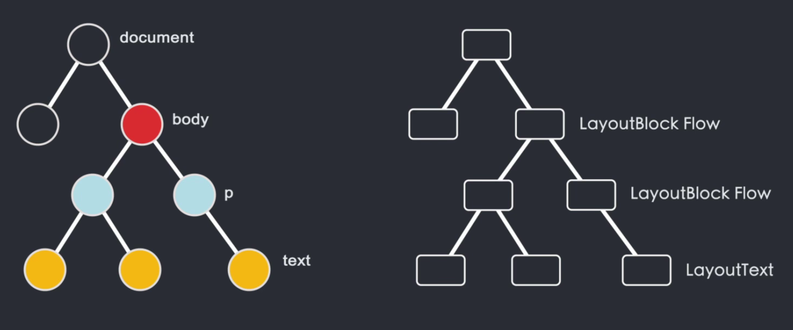

# 1.互联网是如何运作的

# 2.[浏览器是如何运作的](https://www.bilibili.com/video/BV1x54y1B7RE/?spm_id_from=333.880.my_history.page.click&vd_source=a7089a0e007e4167b4a61ef53acc6f7e)

## 2.1 浏览器的发展史

## 2.2 用户界面

## 2.3 浏览器引擎

用于在用户界面和渲染引擎之间传递数据

## 2.4 渲染引擎

- 负责渲染用户请求的页面内容
- 是一个浏览器的核心
- 往往把渲染引擎称为浏览器的内核

### 2.4.1 网络模块

负责网络请求

### 2.4.2 JS解析器

用于解析和执行JS 

# 3.根据==进程==功能不同来拆分浏览器

## 3.1 浏览器进程

负责控制Chrome浏览器除标签页外的用户界面，包括地址栏，书签，后退和前进按钮，以及负责与浏览器的其他进程协调工作

- ==**UI线程**==

## 3.2 渲染器进程

用来控制显示tab标签内的所有内容

渲染器进程的核心就是任务就是把html，css，js，image等资源渲染成用户可以交互的web页面

## 3.3 缓存进程

## 3.4 网络进程

负责发起接受网络请求

## 3.5 插件进程

负责控制网站使用的所有插件，例如flash，这里的插件并不是指Chrome市场里面安装的扩展

## 3.6 GPU进程

负责整个浏览器界面的渲染

# 4.在浏览器地址栏里输入内容时，浏览器内部发生的事

1. 当在地址栏输入地址时，==浏览器进程==的==UI线程==会捕捉输入内容
2. 如果访问的是网址，则==UI线程==会启动一个==网络线程==来请求DNS进行域名解析，接着开始连接服务器获取数据
3. 如果你的输入不是网址，而是一串关键词，浏览器就知道你是要搜索，于是就会使用默认配置的搜索引擎来查询
4. 当==网络线程==获取到数据后，会通过safeBrowsing来检查站点是否是恶意站点，如果是，则会提示个警告页面，告诉你这个站点有安全问题，浏览器会阻止你的访问，当然你也可以强行继续访问。safeBrowsing是谷歌内部的一套站点安全系统，通过检测该站点的数据来判断是否安全。比如通过查看该站点的IP是否在谷歌的黑名单之内
5. 当返回数据准备完毕，并且安全校验通过时，==网络线程==会通知==UI线程==我就要准备好了，该你了
5. 然后==UI线程==会创建一个==渲染器**进程**==来渲染页面，==浏览器进程==通过IPC管道将数据传递给==渲染器进程==，正式进入渲染流程
5. ==渲染器进程==接收到的数据也就是html，==渲染器进程==的==主线程==将html进行解析，构造DOM（文档对象模型）数据结构
5. html首先经过tokeniser标记化，通过词法分析将输入的html内容解析成多个标记，根据识别后的标记进行DOM树构造，在DOM树构造过程中会创建document对象，然后以document为根节点的DOM树不断进行修改，向其中添加各种元素。
5. html代码中往往会引入一些额外的的资源，比如图片，CSS，JS脚本等，图片和CSS这些资源需要通过网络下载或者从缓存中直接加载，这些资源不会阻塞html的解析，因为它们不会影响DOM的生成。
5. 但当HTML解析过程中遇到script标签，就会停止html解析流程，转而去加载解析并且执行JS
5. 在html解析完成后，会获得一个DOM tree， 但我们还不知道DOM树上的每个节点应该长什么样子，==主线程==需要解析CSS，并确定每个DOM节点的计算样式
5. 在知道DOM结构和每个节点的样式后，接下来需要知道每个节点需要放在页面上的哪个位置，也就是节点的坐标以及该节点需要占用多大的区域，这个阶段被称为**layout布局**，==主线程==通过遍历dom和计算好的样式来生成Layout Tree，Layout Tree上的每个节点都记录了x,y坐标和边框尺寸。这里需要注意的一点是：DOM Tree和Layout Tree并不是一一对应的。设置了display：none的节点不会出现在Layout Tree上
5. 
5. 14min处

