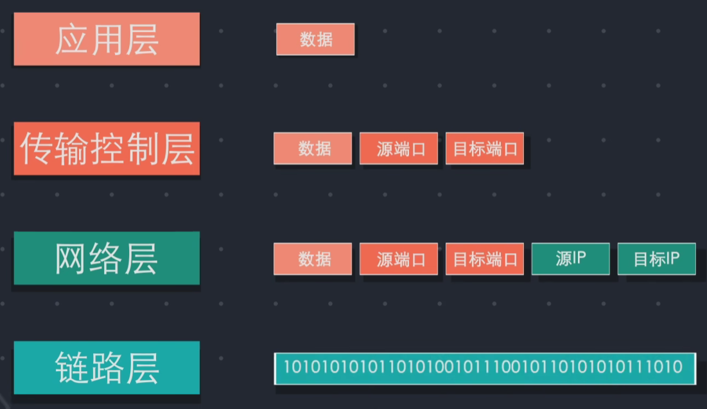
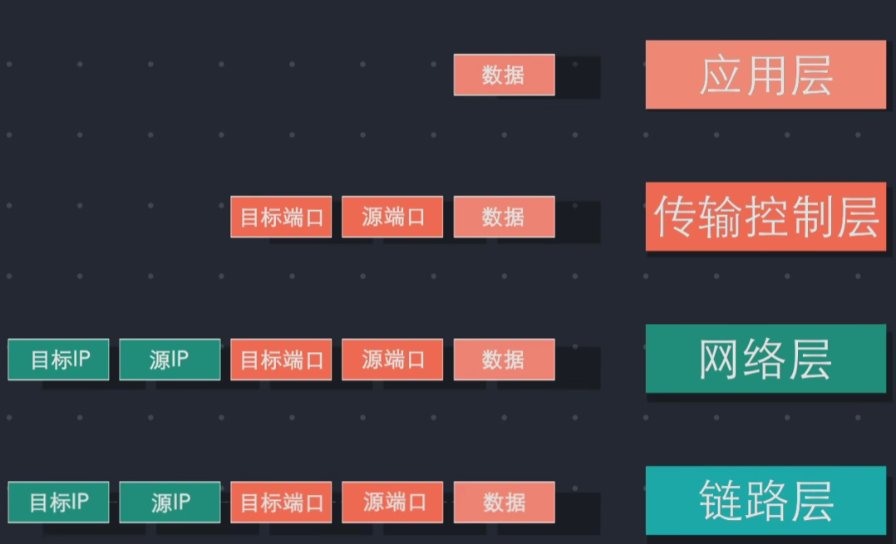
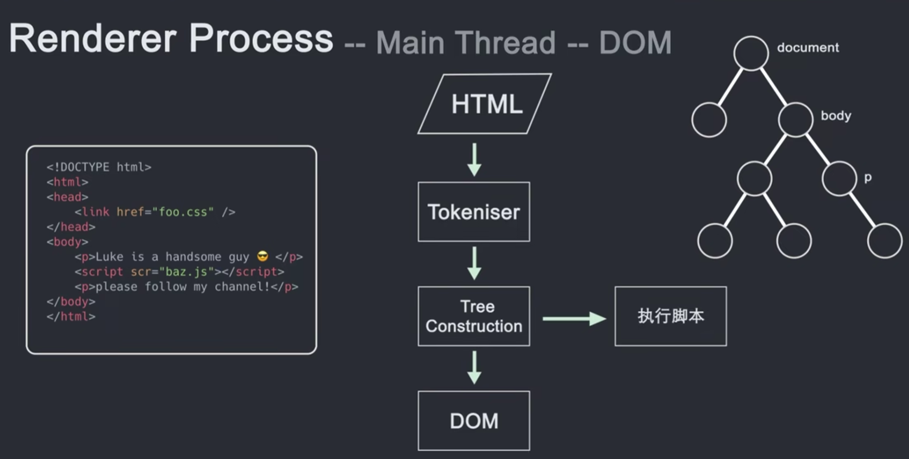
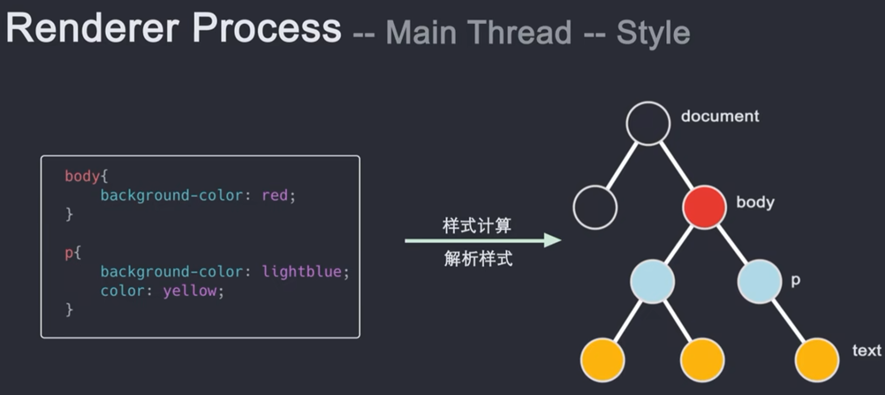
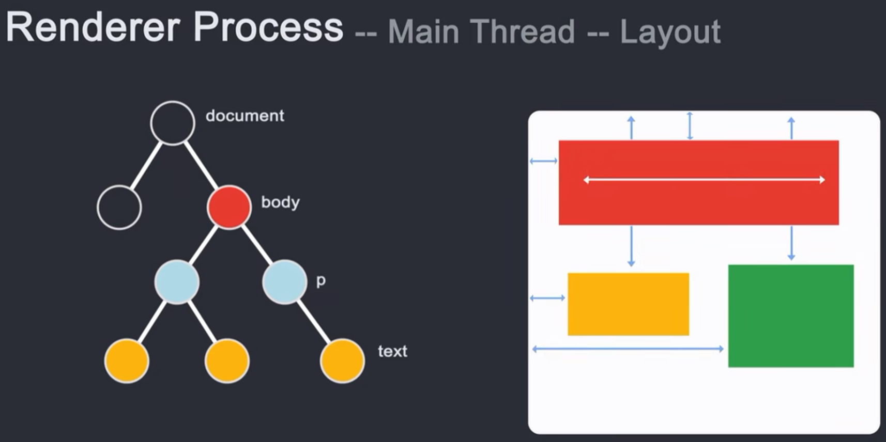
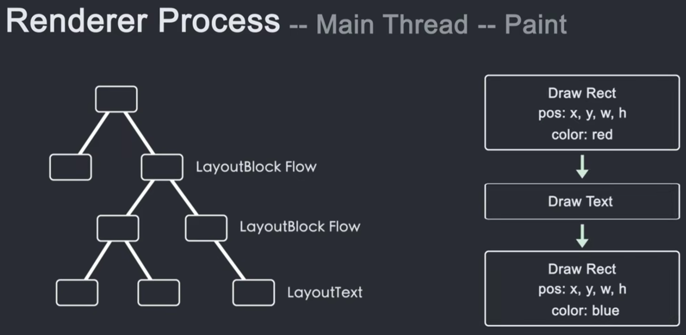

# 0. 在浏览器地址栏输入url后发生的事情

在浏览器地址栏首次输入 URL 并按下 Enter 键后，浏览器会执行一系列步骤来加载网页。以下是这些步骤的详细说明：

### 1. **URL 解析**

- **解析 URL**: 浏览器首先解析输入的 URL，分解为协议（如 `http`、`https`）、主机名（如 `www.example.com`）、端口（如果有的话）、路径（如 `/index.html`）和查询参数（如 `?search=term`）。

### 2. **检查缓存**

- **查找缓存**: 浏览器检查本地缓存，看是否已有该 URL 对应的资源（如 HTML 文件、图片、CSS 文件等）。如果缓存中有匹配的资源，浏览器可以直接使用它来提高加载速度。

### 3. **DNS 解析**

- **DNS 查询**: 如果缓存中没有匹配的资源，**浏览器会查询 DNS 服务器将域名解析为 IP 地址**。这包括以下步骤：
  - **本地缓存**: 浏览器检查操作系统和浏览器的本地 DNS 缓存。
  - **DNS 解析**: 如果本地缓存中没有 IP 地址，浏览器会向 DNS 服务器发起查询，可能涉及多个 DNS 服务器，直到找到正确的 IP 地址。

### 4. **建立 TCP 连接**

- **TCP 三次握手**: 浏览器使用解析到的 IP 地址与目标服务器建立 TCP 连接。这个过程包括三次握手（SYN、SYN-ACK、ACK），确保可靠的连接。

### 5. **进行 HTTPS 握手（如果使用 HTTPS）**

- **SSL/TLS 握手**: 如果 URL 使用 HTTPS，浏览器会进行 SSL/TLS 握手，建立安全的加密连接。包括：
  - **协商加密算法**: 服务器和浏览器协商使用的加密算法。
  - **证书验证**: 验证服务器的 SSL/TLS 证书是否有效。

### 6. **发送 HTTP 请求**

- **构造 HTTP 请求**: 浏览器向服务器发送 HTTP 请求，包括请求方法（如 `GET`、`POST`）、请求 URL、请求头（如 `User-Agent`、`Accept`）等。

### 7. **服务器处理请求**

- **服务器响应**: 服务器处理请求并生成响应。响应包含状态码（如 200、404、500）、响应头和响应体（即请求的资源内容）。

### 8. **接收和处理响应**

- **解析响应**: 浏览器接收服务器的响应，解析响应头和响应体。响应体可能是 HTML、CSS、JavaScript、图片等资源。

### 9. **构建和渲染页面**

- **解析 HTML**: 浏览器将 HTML 文档解析为 DOM（文档对象模型）树。
- **解析 CSS**: 浏览器将 CSS 文件解析为 CSSOM（CSS 对象模型）树。
- **构建渲染树**: 将 DOM 和 CSSOM 结合，生成渲染树。
- **布局计算**: 浏览器计算页面中每个元素的位置和尺寸。
- **绘制页面**: 根据布局信息将内容绘制到屏幕上。

### 10. **执行 JavaScript**

- **执行脚本**: 浏览器执行页面中的 JavaScript 代码，这可能会修改 DOM、CSSOM 或触发其他网络请求。

### 11. **处理用户交互**

- **事件处理**: 页面加载完成后，浏览器会处理用户的交互（如点击、滚动、输入等）。

### 总结

从首次输入 URL 到网页在浏览器中显示，经历了 URL 解析、DNS 查询、TCP 连接、HTTPS 握手（如适用）、HTTP 请求和响应处理、页面渲染和 JavaScript 执行等步骤。每个步骤都是现代网页浏览器为了确保快速、安全和可靠地加载网页而精心设计的。

# [1. 互联网是如何运作的](https://www.bilibili.com/video/BV1Rz4y197Jd/?spm_id_from=333.788.recommend_more_video.0&vd_source=a7089a0e007e4167b4a61ef53acc6f7e)

| 1. 当电脑连入互联网，电脑会获得一个编号地址 Internet Protocol address(IP地址) |                                                              |
| ------------------------------------------------------------ | ------------------------------------------------------------ |
|  |  |
|                                                              |  |
|                                                              |                                                              |
|                                                              |                                                              |

# 2. [浏览器是如何运作的](https://www.bilibili.com/video/BV1x54y1B7RE/?spm_id_from=333.880.my_history.page.click&vd_source=a7089a0e007e4167b4a61ef53acc6f7e)

## 2.1 浏览器的发展史

|  | 简化的浏览器结构图：<br> |
| ------------------------------------------------------------ | ------------------------------------------------------------ |

## 2.2 用户界面

> 用于展示除标签页窗口之外的其他用户界面内容

## 2.3 浏览器引擎

用于在用户界面和渲染引擎之间传递数据

## 2.4 渲染引擎

> 负责渲染用户请求的页面内容
>
> 渲染引擎是一个浏览器的核心，往往把渲染引擎称为浏览器的内核

| 不同浏览器使用的内核：<br> |  |
| ------------------------------------------------------------ | ------------------------------------------------------------ |

### 2.4.1 网络模块

> 负责网络请求
>

### 2.4.2 JS解析器

> 用于解析和执行JS 
>

## 2.5 数据持久层

> 帮助浏览器存储各种数据，比如cookie等等

# 3. 根据进程功能不同来拆分浏览器

> 浏览器是运行在操作系统上的一个应用程序。
>
> 每个应用程序必须至少启动一个进程来执行其功能。
>
> 每个程序往往需要运行很多任务，进程就会创建一些线程来帮助它去执行这些小的任务


| 1. 浏览器进程 ？？ | 负责控制Chrome浏览器除标签页外的用户界面，包括地址栏，书签，后退和前进按钮<br>负责与浏览器的其他进程协调工作<br>有一个UI线程 |
| ------------------ | ------------------------------------------------------------ |
| 2. 网络进程        | 负责发起接受网络请求                                         |
| 3. GPU进程         | 负责整个浏览器界面的渲染                                     |
| 4. 插件进程        | 负责控制网站使用的所有插件，例如flash，这里的插件并不是指Chrome市场里面安装的扩展 |
| 5. 渲染器进程      | 用来控制显示tab标签内的所有内容<br>渲染器进程的核心任务：把html，css，js，image等资源渲染成用户可以交互的web页面 |
| 6. 缓存进程        |                                                              |

## 3.2 渲染器进程（多个）

- 每个Tab标签创建一个渲染进程


- 重排和重绘属于这个进程里的知识点

# 4. 在浏览器地址栏里输入内容时，浏览器内部发生的事

| 1. ==浏览器进程==的==UI线程==会捕捉输入内容<br>    若输入是网址，==UI线程==会启动一个==网络线程==来请求DNS进行域名解析，接着开始连接服务器获取数据<br>    若输入不是网址，而是一串关键词，浏览器就知道你是要搜索，就会使用默认配置的搜索引擎来查询 |  |
| ------------------------------------------------------------ | ------------------------------------------------------------ |
| 2. 当==网络线程==获取到数据后，会通过safeBrowsing来检查站点是否是恶意站点<br>    若是，则会提示个警告页面，告诉你这个站点有安全问题，浏览器会阻止你的访问，当然你也可以强行继续访问。<br>    safeBrowsing是谷歌内部的一套站点安全系统，通过检测该站点的数据来判断是否安全。比如通过查看该站点的IP是否在谷歌的黑名单之内 |  |
| 3. 当返回数据准备完毕，并且安全校验通过时，==网络线程==会通知==UI线程==我就要准备好了，该你了 |  |
| 4. ==UI线程==会创建一个==渲染器**进程**==来渲染页面，==浏览器进程==通过IPC管道将数据传递给==渲染器进程==，正式进入渲染流程 |  |
| 5. ==渲染器进程==接收到的数据是html，==渲染器进程==的==主线程==将html进行解析，构造DOM（文档对象模型）数据结构<br>    html首先经过Tokeniser标记化，通过词法分析将输入的html内容解析成多个标记，根据识别后的标记进行DOM树构造，在DOM树构造过程中会创建document对象，然后以document为根节点的DOM树不断进行修改，向其中添加各种元素。<br>   html代码中往往会引入额外资源，比如图片，CSS，JS脚本等，图片和CSS这些资源需要通过网络下载或者从缓存中直接加载，这些资源不会阻塞html的解析，因为它们不会影响DOM的生成.<br>   但当HTML解析过程中遇到script标签，就会停止html解析流程，转而去加载解析并且执行JS |  |
| 6. 在html解析完成后，会获得一个DOM Tree， 但不知道DOM树上的每个节点长什么样子，==渲染器进程的主线程==需要解析CSS，并确定每个DOM节点的计算样式 |  |
| 7. 在知道DOM结构和每个节点的样式后，接下来需要知道每个节点需要放在页面上的哪个位置，也就是节点的坐标以及该节点需要占用多大的区域，这个阶段被称为**layout布局**。<br> |  |
| 8. ==主线程==通过遍历dom和计算好的样式来生成Layout Tree，Layout Tree上的每个节点都记录了x,y坐标和边框尺寸。<br>    注意：DOM Tree和Layout Tree并不是一一对应的。设置了display：none的节点不会出现在Layout Tree上.<br>    这样还不够，还需要知道以什么样的顺序绘制这个节点 |  |
| 9. 为了保证在屏幕上展示正确的层级，主线程遍历Layout Tree创建一个绘制记录表（Paint Record），该表记录了绘制的顺序 |  |

# [5. 浏览器是如何进行界面渲染的](https://www.bilibili.com/video/BV1LY41197HX/?spm_id_from=333.337.search-card.all.click&vd_source=a7089a0e007e4167b4a61ef53acc6f7e)


1. 获取HTML文件并进行解析，生成一颗DOM Tree
2. 解析CSS，生成样式规则（Style Rules）
3. 根据DOM树和样式规则，生成一颗渲染树（Render Tree）、
4. 进行布局（Layout），即为每个节点分配一个在屏幕上应显示的确切坐标位置
5. 进行绘制（Paint），遍历渲染树节点，调用GPU（图形处理器）将元素呈现出来

# [6. 什么是重排（回流reflow），重绘（repaint）](https://www.bilibili.com/video/BV1WP411Z75i/?spm_id_from=333.337.search-card.all.click&vd_source=a7089a0e007e4167b4a61ef53acc6f7e)

> 重绘：某些元素的外观被改变，例如：元素的背景色
>
> 重排（回流reflow）：指部分或整个渲染树需要重新分析，并且节点的尺寸需要重新计算。表现为**重新生成布局，重新排列元素**
>

# 7. 触发重排的条件

任何页面布局和几何属性的改变都会触发重排，比如：

1、页面渲染初始化；

2、添加或删除可见的DOM元素；

3、元素位置的改变，或者使用动画；

4、元素尺寸的改变——宽度，高度，边距，填充，边框；

5、浏览器窗口尺寸的变化——resize事件发生时；

6、内容的改变——比如文本的改变或图片大小改变而引起的计算值宽度和高度的改变；

7、读取某些元素属性：（offsetLeft/Top/Height/Width,　clientTop/Left/Width/Height,　scrollTop/Left/Width/Height,　width/height,　getComputedStyle(),　currentStyle(IE))

# [8. 浏览器对重排重绘的优化](https://www.bilibili.com/video/BV1g8411A7Rq/?spm_id_from=pageDriver&vd_source=a7089a0e007e4167b4a61ef53acc6f7e)


- 所以浏览器会维护1个队列，把所有会引起重排（回流）、重绘的操作放入这个队列，等队列中的操作到了一定的数量或者到了一定的时间间隔，浏览器就会flush队列，进行一个批处理。这样就会让多次的回流、重绘变成一次回流重绘

|  | 结果：直接显示一个400*400的盒子<br>如果想实现结果2中的过渡效果，应该怎么做？<br> |
| :----------------------------------------------------------: | ------------------------------------------------------------ |

- 虽然有了浏览器的优化，但有时候我们写的一些代码可能会强制浏览器提前flush队列，这样浏览器的优化可能起不到作用了


- 比如**当你请求向浏览器获取一些样式信息的时候（为了保证获取结果的准确性），就会让浏览器flush队列**。比如以下属性或方法：

  - offsetTop、offsetLeft、offsetWidth、offsetHeight  https://blog.csdn.net/jinxi1112/article/details/90692484 

  - scrollTop、scrollLeft、scrollWidth、scrollHeight https://blog.csdn.net/gang_gang_gang/article/details/4233044 

  - clientTop、clientLeft、clientWidth、clientHeight

  - getComputedStyle()

  - getBoundingClientRect()


# [9. 重排重绘角度，应该如何优化页面渲染的性能](https://www.bilibili.com/video/BV1Jv4y117uf/?spm_id_from=pageDriver&vd_source=a7089a0e007e4167b4a61ef53acc6f7e)

减少重绘和重排就是要减少对渲染树的操作，则我们可以合并多次的DOM和样式的修改，并减少对style样式的请求

- 集中修改样式（这样可以尽可能利用浏览器的优化机制，一次重排重绘就完成渲染）

- 尽量避免在遍历循环中，进行元素offsetTop等样式值的获取操作

- 如果需要创建多个DOM节点，可以使用**DocumentFragment**创建完后一次性的加入document；

  - 

- ~~直接改变元素的className——不要一条一条地修改 DOM 的样式，可以先定义好 css 的 class，然后修改 DOM 的 className~~

- ~~display：none；先设置元素为display：none；然后进行页面布局等操作；设置完成后将元素设置为display：block；这样的话就只引发两次重绘和重排；~~

- ~~使用cloneNode(true or false) 和 replaceChild 技术，引发一次回流和重绘；~~

- ~~将需要多次重排的元素，position属性设为absolute或fixed，元素脱离了文档流，它的变化不会影响到其他元素；~~

- // domParent为已渲染节点

  let child1 = document.createElement('div');

  let child2 = document.createElement('div');

  domParent.appendChild(child1);

  child1.appendChild(child2);

  // 上述会导致浏览器重新渲染两次

```javascript
// domParent为已渲染节点
let child1 = document.createElement('div');
let child2 = document.createElement('div');
child1.appendChild(child2);
domParent.appendChild(child1);
// 在child1还没渲染到页面上，把child2加进去，只会渲染一次
```

fontsize改变会引起重排吗？会

Outline改变会引起重排吗？https://www.pianshen.com/article/97421888871/ 为什么outline-width不会引起回流而border-width会引起？

* 轮廓（outline）是绘制于元素周围的一条线，位于边框边缘的外围，可起到突出元素的作用
* 在浏览器里，当鼠标点击或使用Tab键让一个链接或者一个radio获得焦点的时候，该元素将会被一个轮廓虚线框围绕。这个轮廓虚线框就是 outline
* border 可应用于几乎所有有形的 html 元素，而 outline 是针对链接、表单控件和 ImageMap 等元素设计
* outline 的效果将随元素的 focus 而自动出现，相应的由 blur 而自动消失。这些都是浏览器的默认行为，无需 JavaScript 配合 CSS 来控制
* outline 是不占空间的，不会像 border 那样影响元素的尺寸或者位置，既不会增加额外的 width 或者 height
