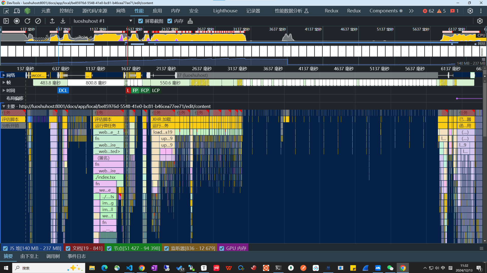
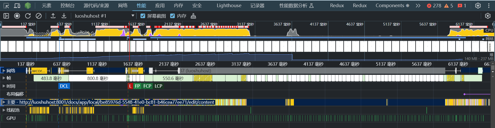
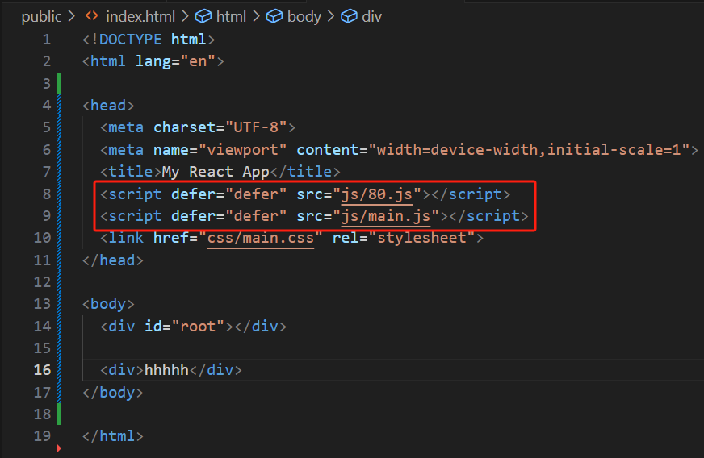
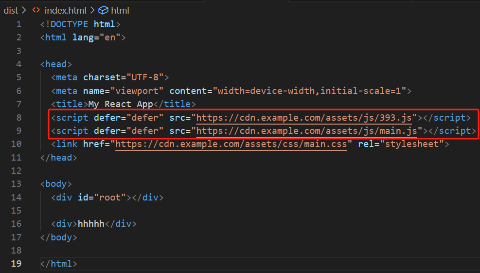

# [1. performance面板](https://blog.csdn.net/qq_35577655/article/details/89674967)

https://www.bilibili.com/video/BV1SG4y1z78t/?spm_id_from=333.337.search-card.all.click&vd_source=a7089a0e007e4167b4a61ef53acc6f7e


在 Chrome `Performance`（性能）面板中，四条不同颜色的垂直虚线代表了页面加载过程中的关键性能指标

1. **黄色虚线**：**Request Start (请求开始)**
   
   - 黄色虚线表示浏览器发出第一个网络请求的时间点，即从浏览器发出获取资源请求的那一刻。这个时间点标志着加载开始
   - 
   
1. **蓝色虚线**：**[DOMContentLoaded 事件](#6.-domcontentloaded事件)**
   
   - 这条线表示 `DOMContentLoaded` 事件触发的时间点，即浏览器已完成解析 HTML 文档并构建了 DOM 树，但外部资源（如样式表、图片）可能尚未完全加载
   
2. **绿色虚线**：**FP/FCP/LCP**
   
   - **FP：First Paint**。首次绘制。它表示浏览器首次在屏幕上绘制任何内容的时间点，这通常包括背景颜色或页面的框架结构，但不一定包含实际的页面内容
   
   - **FCP：First Contentful Paint**。首次内容绘制。是页面中第一个实际内容(如文本，图片，SVG等)绘制到屏幕上的时间点。比FP更有意义
   
   - **LCP：Largest Contentful Paint**。LCP记录的是用户在视口中看到的最大内容元素（如图像，视频或文本块）的渲染时间
   
   - LCP 和 FCP 的区别
   
     | 指标         | LCP（Largest Contentful Paint）                | FCP（First Contentful Paint）                        |
     | ------------ | ---------------------------------------------- | ---------------------------------------------------- |
     | **定义**     | 渲染视口中最大的可见内容元素的时间             | 页面首次呈现任何内容的时间                           |
     | **测量内容** | 最大内容元素（如图像、视频或文本块）           | 文本、图像等任何内容（可包括较小的内容）             |
     | **用户感知** | 反映用户看到主要内容的时间，影响用户的整体体验 | 反映页面开始呈现内容的时间，用户第一次感知页面的开始 |
     | **目标值**   | 理想情况下应在 2.5 秒内                        | 理想情况下应在 1 秒内                                |
   
3. **红色虚线**：**L（Onload事件）**
   
   - 表示页面主要资源的加载完成

# 2. 如何在perfomance面板中查看FCP值

1. **查看 FCP 值**：
   - 在录制结果中，向下滚动，找到名为 **“Timings”**（时间线）的小节。
   - 在这个部分，你可以看到多个关键性能指标的标记，其中包括 **FCP**。
   - `FCP` 通常会标记为 **“First Contentful Paint”**，它表示网页中第一个内容（如文本、图像）绘制到屏幕上的时间点。
2. **FCP 值的位置**：
   - 在“Timings”部分的时间轴上，找到 FCP 的标记，它通常用蓝色小圆点标出。
   - 你可以直接在时间轴上查看 FCP 的具体时间（以毫秒为单位）。鼠标悬停在 FCP 标记上，你可以看到一个提示框显示详细信息，包括具体的 FCP 时间。

提示：**FCP（首次内容绘制）** 是衡量网页加载时用户首次能看到有用内容的时间，它是页面体验优化中的重要指标之一

# 3. 各种优化

https://web.dev/articles/user-centric-performance-metrics?utm_source=devtools&hl=zh-cn

# 4. 性能文档

https://developer.chrome.com/docs/lighthouse/performance/first-contentful-paint?utm_source=devtools&hl=zh-cn

# 5. load事件

https://developer.mozilla.org/en-US/docs/Web/API/Window/load_event

**The `load` event is fired when the whole page has loaded, including all dependent resources such as stylesheets, scripts, iframes, and images, except those that are [loaded lazily](https://developer.mozilla.org/en-US/docs/Web/Performance/Lazy_loading#images_and_iframes).** This is in contrast to [`DOMContentLoaded`](https://developer.mozilla.org/en-US/docs/Web/API/Document/DOMContentLoaded_event), which is fired as soon as the page DOM has been loaded, without waiting for resources to finish loading.

# 6. DOMContentLoaded事件

https://developer.mozilla.org/en-US/docs/Web/API/Document/DOMContentLoaded_event

The **`DOMContentLoaded`** event fires **when the HTML document has been completely parsed**, and all deferred scripts (省略了一些内容，需查看原链接) have downloaded and executed. **It doesn't wait for other things like images, subframes, and async(异步) scripts to finish loading.**

`DOMContentLoaded` does not wait for stylesheets to load, however deferred scripts *do* wait for stylesheets, and the `DOMContentLoaded` event is queued after deferred scripts. Also, scripts which aren't deferred or async (e.g. `<script>`) will wait for already-parsed stylesheets to load.

A different event, [`load`](https://developer.mozilla.org/en-US/docs/Web/API/Window/load_event), should be used only to detect a fully-loaded page. It is a common mistake to use `load` where `DOMContentLoaded` would be more appropriate.


DOMContentLoaded事件：

- 初始的HTML被完全加载和解析完成后触发，而无需等待样式表，图片和子资源的加载
- “当初始的HTML被完全加载和解析完成”**并不意味着DOM已经显示在页面中**。
- DOMContentLoaded事件只表示浏览器已经将HTML解析成了DOM树，JS已经可以安全地访问和操作这些DOM元素。但是浏览器不一定完成了页面的渲染。页面上可能还在加载其他资源（如图片，样式表等），因此页面可能尚未完全显示出来

# 7. 首屏加载过慢

通过Lighthouse和Performance面板定位并分析首屏加载过慢的问题。一般首屏加载过慢是怎么引起的？怎么解决？

# 8. 一系列性能优化指标中，哪一项是最需要优化的

在前端性能优化中，最需要优化的指标往往与用户体验最直接相关。以下是一些关键性能指标，以及对它们重要性的分析：

------

### 1. **首屏加载时间（First Paint, FP / First Contentful Paint, FCP）**

- **定义**：浏览器在屏幕上绘制第一个像素或内容的时间。
- **重要性**：直接影响用户对页面加载速度的感知。如果页面在几秒内没有任何变化，用户可能会失去耐心。
- 优化方向：
  - 减少关键资源大小（如 CSS、JS）。
  - 优化关键路径的加载顺序。
  - 使用懒加载和代码分割。

------

### 2. **首次交互时间（First Input Delay, FID）**

- **定义**：用户第一次与页面交互（如点击按钮、输入文字）到浏览器响应这次交互的时间。
- **重要性**：如果页面看起来加载完成，但无法交互，用户体验会非常差。
- 优化方向：
  - 减少主线程阻塞（如减少长任务）。
  - 优化 JavaScript 执行效率。
  - 延迟加载不重要的脚本。

------

### 3. **可交互时间（Time to Interactive, TTI）**

- **定义**：页面完全加载并且可以交互的时间。
- **重要性**：它综合了页面的加载速度和交互性能，是衡量整体性能的关键指标。
- 优化方向：
  - 减少 JavaScript 的解析和执行时间。
  - 尽量延迟或异步加载非关键资源。
  - 使用现代框架（如 React 的 SSR + Hydration）提升页面响应速度。

------

### 4. **总阻塞时间（Total Blocking Time, TBT）**

- **定义**：从 FCP 到 TTI 之间，主线程被任务阻塞的总时间。
- **重要性**：直接反映页面的响应能力。高 TBT 会导致卡顿和延迟感。
- 优化方向：
  - 拆分长任务为更小的任务。
  - 使用 Web Worker 将计算密集型任务移出主线程。

------

### 5. **累积布局偏移（Cumulative Layout Shift, CLS）**

- **定义**：页面在加载过程中布局发生变化的总和。
- **重要性**：频繁的布局偏移会让用户感到困惑或误操作。
- 优化方向：
  - 设置明确的宽高属性，避免图片、广告等加载时的布局抖动。
  - 避免动态插入 DOM 元素导致布局变化。

------

### 哪个指标最需要优化？

**答案**：**优先优化对用户体验影响最大的指标**，这通常取决于具体场景：

1. **对电商、内容消费类网站**：
   - **首屏加载时间（FCP）** 和 **可交互时间（TTI）** 是核心指标，因为用户需要快速看到内容并能开始浏览。
2. **对工具型应用（如表单、仪表板）**：
   - **首次交互时间（FID）** 和 **总阻塞时间（TBT）** 更重要，因为用户期望快速响应。
3. **对动画或内容密集型页面**：
   - **累积布局偏移（CLS）** 是关键，良好的视觉稳定性提升体验。

------

### 综合建议

如果不确定优先级，建议从以下流程入手：

1. **检测工具**：使用 Lighthouse、WebPageTest 或 Chrome DevTools 分析性能瓶颈。
2. **综合优化**：优先解决 FCP、TTI 和 FID，逐步改善 TBT 和 CLS。
3. **定期监控**：持续监控这些指标，确保优化效果稳定。

# 9. 在线文档协同编辑系统，一般来说那个指标最重要

对于在线文档协同编辑系统，最重要的性能指标通常涉及到 **用户交互的流畅性** 和 **实时性**。以下是一些关键指标，并针对在线文档协同编辑系统的特点分析它们的重要性：

------

### 1. **首次交互时间（FID, First Input Delay）**

- **重要性**：对于协同编辑系统，用户需要快速响应操作，比如点击、输入、编辑等。如果用户无法快速交互，系统会显得迟钝，影响使用体验。
- 优化方向：
  - 优化页面加载，确保 UI 元素可以在用户点击时立即响应。
  - 处理主线程上的阻塞任务（例如长时间运行的 JavaScript）以减少延迟。

### 2. **可交互时间（TTI, Time to Interactive）**

- **重要性**：协同编辑系统依赖于多个模块和组件快速加载和交互。一旦页面加载完成，用户需要能够即时进行编辑、协作和实时更新，因此 TTI 的优化非常关键。
- 优化方向：
  - 确保核心交互功能（如编辑框、工具栏等）尽早加载并可交互。
  - 延迟加载不必要的模块，保证核心功能先行。

### 3. **实时响应性能（包括总阻塞时间TBT和延迟）**

- 重要性：协同编辑系统的一个关键特性是 实时协作。当多个用户同时编辑文档时，系统需要快速响应每个用户的输入，避免输入延迟或不同步的情况。
  - **TBT（总阻塞时间）**：需要确保后台任务、同步操作等不阻塞主线程，使得界面始终保持流畅响应。
  - **实时性**：操作时，用户的输入、文档修改需要快速反馈给其他参与者，确保协作同步。
- 优化方向：
  - 减少同步操作对 UI 线程的阻塞。
  - 优化消息传递和文档同步策略，例如通过 WebSocket 或其他高效通信协议快速同步数据。
  - 使用缓存机制和增量更新减少每次编辑时的数据传输量，避免不必要的延迟。

### 4. **首屏加载时间（FCP, First Contentful Paint）**

- **重要性**：首屏的加载时间直接影响到用户对页面的首次体验。对于在线文档协同编辑系统，首屏包括文档的加载和编辑界面显示。加载太慢会导致用户等待，影响体验。
- 优化方向：
  - 优化网络请求，减少初始加载所需的资源量。
  - 使用服务端渲染（SSR）或静态预渲染技术，提高首屏加载速度。
  - 通过懒加载和代码分割，确保文档内容和编辑功能尽快呈现。

### 5. **累积布局偏移（CLS, Cumulative Layout Shift）**

- **重要性**：协同编辑系统需要避免布局偏移，尤其是当用户在进行编辑时。如果界面布局发生偏移，可能会导致用户操作错误或失去焦点。
- 优化方向：
  - 确保所有组件尺寸都固定，避免动态变化导致布局抖动。
  - 对动态内容（如图片、广告等）设定明确的宽高。

### 6. **网络延迟和协作同步**

- **重要性**：在线文档协同编辑系统需要高度依赖网络和实时同步技术。如果系统的实时更新存在延迟，协作的顺畅性就会受到影响。
- 优化方向：
  - 实现高效的实时数据同步机制，如使用 WebSocket、长轮询等低延迟的通信技术。
  - 使用增量更新和局部更新策略减少全局更新带来的延迟。

------

### 综合考虑

**最需要优化的指标**：

1. **首次交互时间（FID）** 和 **可交互时间（TTI）**：因为用户在文档协作过程中频繁与界面交互，任何延迟都会严重影响用户体验。
2. **实时响应性能（TBT、延迟）**：协同编辑需要确保实时更新和同步，延迟和阻塞会直接影响多人编辑的体验。
3. **网络延迟和协作同步**：实时同步对于协同编辑系统至关重要，确保数据的即时更新和流畅的多人协作是优化的核心。

------

### 结论：

对于在线文档协同编辑系统，最重要的优化指标是 **首次交互时间（FID）** 和 **可交互时间（TTI）**，这直接影响用户的操作体验。同时，**实时响应性能** 和 **网络延迟优化** 也是必须关注的重点，以保证多用户同时编辑时的流畅性和同步性。

# 10. performance面板分析



从您提供的 `Performance` 面板截图来看，我们可以结合 Chrome 开发者工具的指标，逐步分析瓶颈，并找到项目优化的切入点。以下是系统化的分析步骤和优化方向：

------

### 1. **总体观察**

- **顶部区域**显示了 **CPU** 使用情况（黄色区域）和 **网络活动**。这里可以判断是否存在过多的计算任务或网络请求。
- 时间轴显示页面加载阶段，包括 DCL (DOMContentLoaded)、FP (First Paint)、LCP (Largest Contentful Paint) 等重要性能指标。重点关注：
  - **DCL**：483.8 毫秒
  - **LCP**：550.6 毫秒
- **关键问题**：从截图可以看出，页面在 2137 毫秒之后还有明显的 CPU 密集型任务，可能是页面加载后执行了额外的脚本或渲染任务。

------

### 2. **任务分布与瓶颈分析**

#### **任务瀑布图**

- 下方的 任务瀑布图 分为：
  1. **评估脚本**（Evaluate Script）：反映执行的 JavaScript 脚本。
  2. **XHR 加载**：表示网络请求，可能是接口调用。
  3. **帧渲染和布局**：反映了渲染树的更新情况。
- 问题点：
  - **JavaScript 占用时间过多**：长时间的黄色块说明主线程被阻塞。
  - **XHR 加载**：部分网络请求可能在长时间任务中被延迟，导致后续任务积压。

#### 优化方向：

- 分析 `index.tsx` 中的 JavaScript 逻辑，寻找是否有不必要的复杂运算或同步操作。
- 检查是否有可异步加载的非关键脚本。
- 合理优化 网络请求：
  - 是否可以减少接口调用数量。
  - 请求的数据是否可以缓存或合并。

------

### 3. **查找高耗时函数**

#### **调用栈分析**

- 找到任务瀑布图中耗时最长的黄色块，并展开调用栈，具体查看：
  - 哪些函数调用占用了较多时间。
  - 是否存在性能不佳的操作（例如：DOM 操作、复杂循环、JSON 解析等）。
- 结合 文件名 定位：
  - `index.tsx`：检查主渲染逻辑，可能是初始化阶段的瓶颈。
  - `/ts` 文件：这些可能是业务代码，优化计算密集型逻辑。

#### 优化方向：

- 将计算任务放入 `Web Worker` 中，避免阻塞主线程。
- 减少渲染的频率（如防抖、节流）。
- 检查是否有重复执行的代码或冗余逻辑。

------

### 4. **布局和渲染优化**

- 从 帧渲染和布局部分（蓝色区域）可以观察：
  - 是否有频繁的布局（Layout）和绘制（Paint）操作。
  - 是否存在不必要的重排（Reflow）或重绘（Repaint）。
- 问题点：
  - 如果存在频繁的黄色块或蓝色块，说明可能是复杂 DOM 操作导致的布局和渲染问题。

#### 优化方向：

- 避免频繁修改 DOM 或修改会导致重排的属性（如 `width`、`height`）。
- 对复杂动画使用 `will-change` 和 GPU 加速。

------

### 5. **网络请求优化**

- 查看网络请求（XHR 加载块），观察：
  - 是否有请求较慢的接口。
  - 是否有多个重复或不必要的请求。

#### 优化方向：

- 启用 HTTP/2 或 HTTP/3 以提高请求并发效率。
- 使用 CDN 缓存静态资源。
- 合并小请求或引入请求批处理机制。

------

### 6. **具体优化策略总结**

1. **JavaScript 优化**：
   - 分析高耗时函数，优化复杂逻辑。
   - 延迟加载非必要的模块（如动态 `import`）。
   - 使用代码分割（Code Splitting）和 Tree Shaking 减少打包体积。
2. **网络请求优化**：
   - 减少接口数量，检查重复请求。
   - 引入缓存机制（例如 HTTP 缓存、服务端缓存）。
3. **渲染性能优化**：
   - 避免不必要的 DOM 修改。
   - 减少动画造成的重绘和重排。
4. **主线程优化**：
   - 使用 Web Worker 处理计算密集型任务。
   - 对频繁触发的事件添加防抖或节流。

# Performance面板中的网络，帧，时间，布局偏移，主要，线程池，GPU分别是用来分析什么的，怎么分析



### 1. **网络（Network）**

**作用**：

- 显示页面加载过程中所有网络请求的时间轴，包括 XHR 请求、静态资源加载（如 CSS、JS 文件）、图片加载等。

**分析方法**：

- 查看请求时长：识别哪些请求耗时较长，可能需要优化。
  - 使用缓存减少重复加载。
  - 将静态资源放置在 CDN 上。
- **请求顺序**：检查关键资源是否被延迟加载，尽量确保页面的关键资源（如 HTML、CSS 和首屏 JS）优先加载。
- 阻塞和队列：通过 Queueing查看请求是否因为网络并发限制被阻塞。
  - 启用 HTTP/2 可以减少队列延迟。

------

### 2. **帧（Frames）**

**作用**：

- 展示页面的帧率（FPS），用来评估页面的流畅性和动画性能。

**分析方法**：

- **绿色（60 FPS）**：性能理想。
- **黄色或红色**：帧率降低，可能是长时间的 JavaScript 任务、频繁的重绘（Repaint）或重排（Reflow）导致。
- **掉帧现象**：当帧率低于 60FPS 时，页面可能会卡顿，尤其是在动画和用户交互场景中。

**优化建议**：

- 减少主线程的阻塞任务，使用 `requestAnimationFrame` 优化动画。
- 对于复杂动画，启用 GPU 加速（如 `transform` 和 `opacity` 属性）。
- 使用节流（Throttle）或防抖（Debounce）减少事件处理频率。

------

### 3. **时间（Timings）**

**作用**：

- 显示页面加载中的关键性能指标，如：
  - **FP（First Paint）**：首次绘制。
  - **FCP（First Contentful Paint）**：首次内容绘制。
  - **LCP（Largest Contentful Paint）**：最大内容绘制。
  - **DCL（DOMContentLoaded）**：DOM 树加载完成。
  - **Load**：页面完全加载。

**分析方法**：

- 检查这些指标的时间点，定位页面的加载瓶颈。
- 如果 LCP时间过长：
  - 检查是否有大的图片或字体文件延迟了渲染。
  - 优化关键资源的加载顺序。
  - 使用延迟加载（Lazy Loading）非关键内容。

------

### 4. **布局偏移（Layout Shift）**

**作用**：

- 用于捕捉页面的 **Cumulative Layout Shift (CLS)**，衡量页面的视觉稳定性。
- 显示哪些 DOM 元素引起了布局的变化。

**分析方法**：

- 如果 CLS 值过高，检查是否存在：
  - 图片没有明确的宽高（或 aspect-ratio）。
  - 字体加载导致文字布局变化。
  - 动态加载的内容没有占位符。

**优化建议**：

- 为图片和视频设置固定宽高。
- 在加载自定义字体时使用 `font-display: swap` 避免延迟渲染。

------

### 5. **主要（Main）**

**作用**：

- 反映页面主线程的执行情况，展示 JavaScript 脚本的执行时间、任务分布和阻塞情况。

**分析方法**：

- **黄色块（Script Evaluation）**：主线程被 JavaScript 阻塞，查看长时间运行的脚本或高频执行的函数。
- **蓝色块（Rendering）**：主线程用于布局和绘制任务。
- **紫色块（Task）**：主线程的事件处理逻辑。
- 查找 **长任务（Long Task）**，即执行时间超过 50 毫秒的任务，重点优化。

**优化建议**：

- 将复杂计算逻辑放入 `Web Worker` 中，避免阻塞主线程。
- 使用 `lazy-load` 或 `code-splitting` 减少主线程的初始负载。

------

### 6. **线程池（Threads）**

**作用**：

- 显示页面中其他线程（如 Web Workers）的活动情况。

**分析方法**：

- 查看 Worker 线程是否正在执行高频或耗时的任务。
- 如果主线程负载高，可以尝试将部分逻辑转移到 Worker 中。

------

### 7. **GPU**

**作用**：

- 显示页面中 GPU 的使用情况，如渲染、动画、视频播放等任务。

**分析方法**：

- 检查动画或渲染是否使用了 GPU 加速。
  - 如果 GPU 活跃区域较少，可能需要检查是否未正确启用硬件加速。
- 对比 GPU 和主线程的时间轴，判断瓶颈是否在 GPU 渲染上。

**优化建议**：

- 对复杂动画使用 `transform` 或 `opacity` 属性触发硬件加速。
- 避免在 GPU 上渲染频繁变化的图形。

------

### 总结：如何全面分析

1. 页面加载性能

   ：

   - 从 **网络** 和 **时间** 模块分析加载阶段的瓶颈（资源加载顺序、接口请求、关键渲染时间）。

2. 渲染流畅性

   ：

   - 从 **帧** 和 **布局偏移** 模块分析动画和交互卡顿问题。

3. 主线程性能

   ：

   - 从 **主要** 模块分析长任务和 JavaScript 阻塞问题。

4. 多线程与硬件加速

   ：

   - 从 **线程池** 和 **GPU** 模块分析是否合理利用多线程和硬件加速。

根据以上模块的数据，逐步定位问题，选择合适的优化策略即可！

# visibilitychange事件

`visibilitychange` 是一种浏览器事件，用于检测网页的**可见性状态**发生变化。它通常用于优化页面行为，比如在页面不可见时暂停动画、减少资源消耗，或者恢复活动状态。

------

### **1. 触发条件**

- 页面变为不可见：
  - 用户切换到另一个浏览器标签页。
  - 浏览器窗口最小化。
  - 系统锁屏或切换到其他应用。
- 页面变为可见：
  - 用户重新切换回该页面标签。
  - 从最小化状态恢复浏览器窗口。
  - 系统从锁屏恢复。

------

### **2. 配合 Document 的 `visibilityState` 属性**

`visibilitychange` 事件会触发，但具体页面的可见性状态可以通过 `document.visibilityState` 获取：

- 值：
  - `"visible"`：页面可见。
  - `"hidden"`：页面不可见。
  - （某些浏览器中还有可能是 `"prerender"` 或 `"unloaded"`，用于特殊场景。）

------

### **3. 示例代码**

以下是一个简单示例，用 `visibilitychange` 检测页面的状态：

```javascript
document.addEventListener("visibilitychange", () => {
  if (document.visibilityState === "visible") {
    console.log("页面可见了，恢复活动！");
    // 恢复动画、重启计时器、继续播放视频等
  } else if (document.visibilityState === "hidden") {
    console.log("页面不可见，节约资源！");
    // 暂停动画、清理定时器、暂停播放视频等
  }
});
```

------

### **4. 实际应用场景**

1. **优化资源消耗**：
   - 暂停计时器或动画，避免对不可见页面进行无意义的渲染和计算。
   - 停止 AJAX 请求以节省网络流量。
2. **改善用户体验**：
   - 当页面再次变为可见时，重新开始播放视频或音乐。
   - 恢复暂停的功能，如定时器或状态更新。
3. **分析用户行为**：
   - 统计用户在页面的实际停留时间，准确评估页面使用情况。

------

### **5. 注意事项**

1. **兼容性**：
   - `visibilitychange` 事件和 `document.visibilityState` 在大多数现代浏览器中都受支持，包括 Chrome、Firefox、Edge 和 Safari。
   - 在某些移动设备浏览器上，锁屏可能不会触发 `visibilitychange`。
2. **性能优化**：
   - 避免在事件中执行复杂逻辑，建议分支判断后调用具体函数，保持响应迅速。
3. **与其他事件结合**：
   - 如果需要检测是否与用户主动交互，还可以配合 `blur` 和 `focus` 事件使用。

------

### **6. 示例：页面计时器优化**

以下示例展示了如何在页面不可见时暂停计时器，页面可见时恢复：

```javascript
let timer;
let count = 0;

function startTimer() {
  timer = setInterval(() => {
    console.log(`计时中：${++count}`);
  }, 1000);
}

function stopTimer() {
  clearInterval(timer);
  console.log("计时暂停");
}

document.addEventListener("visibilitychange", () => {
  if (document.visibilityState === "visible") {
    startTimer(); // 页面可见时恢复计时
  } else {
    stopTimer(); // 页面不可见时暂停计时
  }
});

// 初始化计时器
startTimer();
```

运行此代码时，可以观察到切换标签页或最小化窗口时，计时器会自动暂停，回到页面时继续计时。

# [CDN](https://www.bilibili.com/video/BV1jS4y197zi/?spm_id_from=333.337.search-card.all.click&vd_source=a7089a0e007e4167b4a61ef53acc6f7e)

什么是CDN？CDN能为我们做什么？我们为什么要了解他？


# CDN

### **1. 什么是 CDN？**

CDN（**Content Delivery Network**，内容分发网络）是一种通过分布在全球各地的服务器节点，将用户请求的内容分发到离用户最近的节点进行加载的技术和服务。

#### **主要作用**

1. 加速内容加载：用户从距离自己最近的 CDN 节点获取内容，降低了网络延迟。？？？？？
2. **减轻源服务器压力：CDN 缓存了源站的静态资源，减少对源站的直接访问**。
3. 提高资源可用性：如果某个节点故障，CDN 可以将请求转发到其他可用节点。
4. 提供高并发支持：分布式网络可以轻松应对大规模访问请求。

------

### **2. 项目中 CDN 的常见使用场景**

#### **(1) 静态资源托管**

- **静态文件**（如 CSS、JS、图片、视频、字体等）通常存储在 CDN 中，客户端访问这些资源时会从 CDN 节点加载。
- [**注意：通常情况下，HTML文件并不会被托管在CDN上**](#HTML 与 CDN)
- 优势：
  - 提高加载速度。
  - 减轻服务器负担。
  - 节约带宽。

示例：

```html
<link rel="stylesheet" href="https://cdn.example.com/css/style.css">
<script src="https://cdn.example.com/js/app.js"></script>
```

#### **(2) 第三方库的引用**

- 项目中会引用一些开源库（如 jQuery、React、Bootstrap 等）的 CDN 地址。
- 优势：
  - 减少打包体积。
  - 提高首次加载效率（用户可能已经缓存了这些公共库）。

示例：

```html
<script src="https://cdn.jsdelivr.net/npm/react@17.0.2/umd/react.production.min.js"></script>
<script src="https://cdnjs.cloudflare.com/ajax/libs/jquery/3.6.0/jquery.min.js"></script>
```

#### **(3) 图片与视频资源**

- 项目中图片和视频通常使用 CDN 服务，以优化加载速度。
- CDN 提供了**图片处理能力**（如裁剪、压缩、格式转换），减少开发者负担。

示例：

```html

<video src="https://cdn.example.com/videos/tutorial.mp4" controls></video>
```

#### **(4) API 加速**

- 如果项目有跨地区用户，可以通过 CDN 将 API 的数据分发到离用户最近的节点，降低延迟。

示例：

```javascript
fetch("https://cdn.example.com/api/data").then(res => res.json());
```

------

### **3. 如何在项目中集成 CDN？**

#### **(1) 使用 CDN 托管静态资源**

1. 将静态文件上传到 CDN 服务（如阿里云 OSS、腾讯云 COS、AWS S3）。
2. 配置 CDN 服务以缓存这些资源。
3. 在 HTML、CSS、JavaScript 中通过 CDN 地址引用资源。

#### **(2) 配置 Webpack 输出到 CDN**

在前端工程化中，可以配置 Webpack 将构建后的文件路径替换为 CDN 地址。

```javascript
// webpack.config.js
module.exports = {
  output: {
    publicPath: "https://cdn.example.com/", // 设置公共路径为 CDN
  },
};
```

#### **(3) 配置服务器支持 CDN**

如果后端控制静态资源路径，可以修改代码让 CDN 地址替代本地资源。

示例（Koa 配置静态资源）：

```javascript
const staticPath = 'https://cdn.example.com';
app.use(async (ctx) => {
  ctx.body = `<script src="${staticPath}/js/app.js"></script>`;
});
```

------

### **4. 常见的 CDN 服务**

1. 国内
   - 阿里云 CDN
   - 腾讯云 CDN
   - 七牛云
   - 又拍云
2. 国外
   - Cloudflare
   - AWS CloudFront
   - Akamai
   - Fastly
3. 免费 CDN
   - jsDelivr（适合开源库）
   - UNPKG（Node.js 包资源）

------

### **5. 注意事项**

1. **缓存刷新问题**：

   - CDN 对资源进行了缓存，如果需要更新文件，可以使用版本号或文件哈希值：

     ```html
     <script src="https://cdn.example.com/js/app.js?v=1.2.3"></script>
     ```

   - 或者在 Webpack 中启用文件名哈希：

     ```javascript
     output: {
       filename: "[name].[contenthash].js",
     },
     ```

2. **资源权限设置**：

   - 配置 CDN 时，要确保静态资源是公开访问的，否则用户可能无法加载。

3. **HTTPS 支持**：

   - 确保 CDN 提供 HTTPS，以避免因混合内容问题导致资源被阻止加载。

4. **监控与日志**：

   - 使用 CDN 服务提供的监控工具，查看资源的访问量、延迟和缓存命中率，方便优化

# CDN原理

### **CDN 的原理**

CDN（内容分发网络）的核心原理是通过将资源（如 HTML、CSS、JS 文件、图片、视频等）缓存到全球分布的边缘服务器上，让用户从离自己最近的服务器获取内容，从而加速内容加载，减轻源服务器的压力。

以下是 CDN 的主要工作原理和过程：

------

### **1. CDN 的架构**

CDN 通常由三种服务器组成：

- **源站服务器**： 存放网站的原始资源，如静态文件或动态内容。
- **边缘服务器**： 分布在全球各地的数据中心，缓存源站的内容，离用户更近。
- **调度系统**： 负责将用户请求引导到最佳的边缘服务器上。

------

### **2. CDN 的工作流程**

#### **(1) DNS 调度与就近分配**

当用户访问某个网站（如 `www.example.com`）时，域名解析会将请求引导到一个 CDN 节点：

1. 用户输入 URL 后，DNS 查询开始。
2. CDN 提供商接管该域名解析，并通过智能调度系统将请求分配到**离用户最近**的边缘服务器（基于地理位置、网络延迟等）。
3. 用户的请求被引导到最近的 CDN 节点。

#### **(2) 边缘缓存机制**

1. 首次访问：
   - 如果边缘服务器上没有请求的资源，它会从源站拉取内容，返回给用户，同时缓存一份。
   - 缓存时，CDN 会遵循源站的缓存策略（如 HTTP Header 中的 `Cache-Control`、`Expires`）。
2. 后续访问：
   - 其他用户访问同样的资源时，直接从缓存中读取，大大加速响应速度。

#### **(3) 缓存更新与失效**

1. 缓存的资源有一定的生存时间（TTL，Time To Live）。

2. 如果源站资源发生更新，可以通过以下方式让缓存失效：

   - **主动刷新**：CDN 提供刷新缓存的接口或管理后台。

   - 版本号或文件哈希：通过 URL 参数或文件名变化强制更新：

     ```html
     <script src="https://cdn.example.com/js/app.js?v=2.0.0"></script>
     ```

#### **(4) 动态内容分发**

对于动态内容（如 API 请求或用户个性化内容），CDN 直接将请求转发到源站处理，同时优化传输路径。

#### **(5) 安全防护**

CDN 提供了一些额外的功能：

- **DDoS 防护**：通过流量清洗机制抵御分布式拒绝服务攻击。
- **HTTPS 加速**：为网站提供快速、安全的 HTTPS 服务。
- **WAF（Web 应用防火墙）**：阻挡恶意请求。

------

### **3. CDN 的关键技术**

#### **(1) 缓存技术**

- 边缘服务器会缓存用户请求的资源（静态文件）。
- 缓存策略通过 HTTP 响应头控制：
  - `Cache-Control`、`Expires`：定义缓存的生存时间。
  - `ETag`、`Last-Modified`：通过对比资源版本决定是否重新拉取。

#### **(2) 调度系统**

CDN 的调度系统通过以下方式选择最佳节点：

- **用户地理位置**： 根据用户的 IP 地址选择最近的边缘服务器。
- **实时网络状态**： 监测各节点的负载和网络延迟，将流量分配到最优的节点。
- **智能 DNS**： 通过 DNS 解析，将用户请求导向合适的 CDN 节点。

#### **(3) 负载均衡**

- 如果某个节点流量过高或不可用，CDN 会自动切换到其他可用节点。

#### **(4) 数据压缩与优化**

- CDN 对传输的数据进行压缩（如 Gzip、Brotli）或格式优化（如 WebP 格式的图片），以减小传输数据量，提高加载速度。

#### **(5) 协议优化**

- 支持 HTTP/2、QUIC 等协议，提升并发请求效率，降低延迟。

------

### **4. 示例：请求资源的全过程**

以用户访问 `https://cdn.example.com/js/app.js` 为例：

1. DNS 解析：用户输入 URL 后，DNS 查询将域名解析到 CDN 的边缘服务器。
2. 请求分配：CDN 调度系统将请求分配到离用户最近的节点。
3. 缓存检查：
   - 如果该节点已缓存 `app.js`，直接返回缓存内容。
   - 如果未缓存，则向源站拉取 `app.js`，返回给用户并缓存。
4. 响应用户：用户快速收到资源，完成页面加载。

------

### **5. CDN 的优势**

| 优势               | 说明                                                   |
| ------------------ | ------------------------------------------------------ |
| **性能提升**       | 用户从最近的节点获取资源，减少网络延迟，优化加载速度。 |
| **减轻服务器负载** | 静态资源缓存于 CDN 节点，减少源站压力和带宽成本。      |
| **高可用性**       | 分布式架构提供故障切换机制，保证服务稳定。             |
| **抗攻击能力**     | 防护 DDoS 攻击，隐藏源站 IP，保障资源安全。            |
| **全球分发能力**   | 遍布全球的节点支持跨地区访问，提升国际用户体验。       |

------

### **6. 总结**

CDN 的原理核心是通过**就近缓存**、**智能调度**和**负载均衡**技术，让用户快速、安全地获取资源，是现代 Web 性能优化的关键工具。在实际项目中，合理配置 CDN 能显著改善用户体验和系统的稳定性。

# 在前端为React，后端为Koa的项目中，一般如何使用CDN

在前后端分离的项目中（前端使用 React，后端使用 Koa），**CDN** 通常用于加速静态资源的加载和减轻后端服务器的负载。以下是使用 CDN 的典型方法和流程：

------

### **1. 前端如何使用 CDN**

#### **(1) 打包后的静态资源上传到 CDN**

React 项目通常在构建后生成静态文件（如 `index.html`、`main.js`、`styles.css`）。这些文件可以上传到 CDN，以提高访问速度。

**配置流程：**

1. **修改 React 项目中的 `publicPath`**： 在 React 项目中，通过 Webpack 的配置（或 `vite.config.js`）指定静态资源的 `publicPath`（即资源的基准路径），让生成的文件指向 CDN 地址。

   示例（Webpack 配置）：

   ```javascript
   output: {
       path: path.resolve(__dirname, 'dist'),
       filename: '[name].[contenthash].js',
       publicPath: 'https://cdn.example.com/react-app/' // 替换为你的 CDN 地址
   }
   ```

2. **构建项目**： 执行 `npm run build` 或 `yarn build` 生成生产环境的静态文件。

3. **上传到 CDN**： 使用 CDN 服务商提供的工具（如七牛云、阿里云 OSS、AWS S3 等）将 `dist` 文件夹的内容上传到 CDN。

4. **调整 HTML 文件**： 确保 `index.html` 中的静态资源引用路径指向 CDN。例如：

   ```html
   <script src="https://cdn.example.com/react-app/main.js"></script>
   ```

------

#### **(2) 使用第三方库的 CDN 资源**

在 React 项目中，可以通过 CDN 加载第三方库（如 `React`、`React-DOM`）以减少打包体积。

**配置方法：**

1. **移除依赖的打包**： 修改 Webpack 配置，将这些库标记为外部依赖：

   ```javascript
   externals: {
       react: 'React',
       'react-dom': 'ReactDOM'
   }
   ```

2. **在 HTML 文件中引入 CDN**： 在 `public/index.html` 中添加对应的 CDN 引用：

   ```html
   <script src="https://unpkg.com/react@17/umd/react.production.min.js"></script>
   <script src="https://unpkg.com/react-dom@17/umd/react-dom.production.min.js"></script>
   ```

------

### **2. 后端如何配合使用 CDN**

#### **(1) 静态资源代理**

如果 Koa 服务已经托管了一些静态资源，可以让 Koa 配置将请求重定向到 CDN，从而减轻服务器压力。

**示例代码：**

```javascript
const Koa = require('koa');
const app = new Koa();

app.use(async (ctx, next) => {
    if (ctx.path.startsWith('/static')) {
        // 重定向到 CDN
        ctx.redirect(`https://cdn.example.com${ctx.path}`);
    } else {
        await next();
    }
});

app.listen(3000, () => {
    console.log('Server is running on http://localhost:3000');
});
```

------

#### **(2) 设置 CORS 和缓存头**

后端返回资源时，可以设置适当的 CORS 和缓存头，让 CDN 能正确缓存和分发内容。

**示例：**

```javascript
app.use(async (ctx, next) => {
    ctx.set('Access-Control-Allow-Origin', '*'); // 跨域支持
    ctx.set('Cache-Control', 'max-age=31536000'); // 长时间缓存
    await next();
});
```

------

### **3. CDN 的典型使用场景**

#### **(1) React 静态文件的加速**

- React 打包后的 `index.html`、`JS`、`CSS`、`图片`等资源可以直接托管到 CDN 上，用户通过访问 CDN 获取文件，提升加载速度。

#### **(2) 图片、视频等多媒体资源加速**

- 图片或视频等大文件可以上传到 CDN，避免消耗 Koa 后端服务器的带宽。

  示例：

  - React 前端可以通过 CDN 地址直接引用：

    ```jsx
    
    ```

#### **(3) API 静态响应的缓存**

- 如果某些后端接口返回静态数据（如商品列表、配置项），可以通过 CDN 缓存接口响应，减少 Koa 的请求压力。

  **配置方式：**

  - CDN 配置缓存策略，让指定 API 的响应被缓存。
  - 例如：请求 `/api/products` 时，CDN 返回缓存的数据。

#### **(4) Koa 服务的 SPA 路由支持**

- React 的 SPA 项目需要前端路由（如 React Router）支持，这通常要求所有路径都指向 `index.html`。如果部署在 CDN，可以让 CDN 处理路由规则：

  **CDN 配置回源规则：**

  - 所有未匹配的路径（如 `/about`、`/user/123`）回源到 `index.html`。

  或者在 Koa 中实现：

  ```javascript
  const serve = require('koa-static');
  const path = require('path');
  
  app.use(serve(path.join(__dirname, 'dist')));
  
  app.use(async (ctx) => {
      ctx.type = 'html';
      ctx.body = fs.createReadStream(path.join(__dirname, 'dist/index.html'));
  });
  ```

------

### **4. 配合使用的注意事项**

#### **(1) 配置文件版本管理**

- 为避免浏览器缓存旧资源，可以给静态文件添加版本号或哈希：

  ```bash
  main.abc123.js
  styles.def456.css
  ```

#### **(2) 监控 CDN 状态**

- 使用 CDN 提供的监控工具，观察缓存命中率、流量和性能。

#### **(3) 安全设置**

- 在 CDN 配置中限制访问来源，避免恶意盗链：
  - 设置防盗链规则（如限制 HTTP Referer）。
  - 开启 HTTPS，防止传输数据被劫持。

#### **(4) 源站保护**

- 配置源站白名单，禁止非 CDN 节点直接访问源站。

------

### **5. 使用 CDN 的完整流程示例**

1. 前端：
   - React 项目通过 Webpack 配置 `publicPath`，生成指向 CDN 的资源路径。
   - 打包后上传静态资源到 CDN。
2. 后端：
   - Koa 代理静态资源到 CDN。
   - 设置 CORS 和缓存策略。
3. 用户访问：
   - 静态资源从 CDN 加载。
   - Koa 提供的 API 接口处理动态数据。

------

通过使用 CDN，不仅可以优化用户访问的速度，还能降低后端服务器的负载，提升项目的整体性能和可用性。

# webpack output publicPath

webpack中的output那一项的publicPath是干嘛用的，是怎么工作的

```js
output: {
    path: path.resolve(__dirname, 'dist'),
    filename: '[name].[contenthash].js',
    publicPath: 'https://cdn.example.com/react-app/' // 替换为你的 CDN 地址
}
```

Webpack 的 `output.publicPath` 是一个用于指定**资源加载路径**的配置项，主要用于指定打包生成的静态资源在运行时的访问基础路径（Base Path）。它的设置直接影响到项目中动态加载的资源（如图片、CSS、JS 等）的路径。

------

### **1. `publicPath` 的作用**

1. **资源路径的前缀**
   - `publicPath` 决定了 Webpack 打包后生成的静态文件在 HTML 或代码中如何被引用。
   - 它是为打包后的资源（如 JS 文件、CSS 文件或图片等）生成的 URL 添加一个前缀路径。
2. **适配不同的部署环境**
   - 在开发环境（本地开发服务器）和生产环境（线上部署）中，静态资源的访问路径通常不同。通过 `publicPath`，可以灵活调整资源的加载路径。

------

### **2. `publicPath` 是如何工作的**

当 Webpack 构建项目时，它会在输出的文件中插入资源加载路径。`publicPath` 指定的路径会作为这些资源路径的前缀。

#### **工作原理：**

- **编译时：** Webpack 会根据 `publicPath` 配置，将资源路径写入到生成的文件中（如 JS 文件引用的图片路径）。
- **运行时：** Webpack 的运行时代码（例如懒加载模块）会根据 `publicPath` 来动态加载模块和资源。

------

### **3. `publicPath` 的常见用法**

#### **(1) 根路径 `/`**

将资源路径配置为**相对根路径**，通常用于开发环境或简单的线上部署。

示例：

```javascript
module.exports = {
  output: {
    publicPath: '/',
    path: path.resolve(__dirname, 'dist'),
    filename: 'bundle.js',
  },
};
```

运行效果：

- 假设 HTML 文件路径为 `http://localhost:8080/index.html`。

- 所有静态资源都会以 /为前缀，生成类似：

  ```html
  <script src="/bundle.js"></script>
  ```

------

#### **(2) 相对路径 `./`**

将资源路径配置为相对于 HTML 文件的路径，通常用于本地文件直接打开的场景。

示例：

```javascript
module.exports = {
  output: {
    publicPath: './',
    path: path.resolve(__dirname, 'dist'),
    filename: 'bundle.js',
  },
};
```

运行效果：

- 假设 HTML 文件路径为 `file:///path/to/index.html`。

- 资源路径会生成类似：

  ```html
  <script src="./bundle.js"></script>
  ```

------

#### **(3) 绝对路径（如 CDN 地址）**

如果将静态资源部署到 CDN，可以将 `publicPath` 设置为对应的 CDN 地址。

示例：

```javascript
module.exports = {
  output: {
    publicPath: 'https://cdn.example.com/assets/',
    path: path.resolve(__dirname, 'dist'),
    filename: 'bundle.js',
  },
};
```

运行效果：

- 所有资源都会指向 CDN 地址：

  ```html
  <script src="https://cdn.example.com/assets/bundle.js"></script>
  ```

------

#### **(4) 配合动态加载（如 `import()` 和懒加载）**

当项目中使用动态加载（`import()`）时，Webpack 运行时会根据 `publicPath` 加载模块。

示例代码：

```javascript
module.exports = {
  output: {
    publicPath: '/static/',
    path: path.resolve(__dirname, 'dist'),
    filename: '[name].js',
  },
};

// 在项目代码中：
import('./moduleA').then(module => {
  module.default();
});
```

生成效果：

- import() 加载的模块路径会变成：

  ```
  /static/moduleA.js
  ```

------

### **4. `publicPath` 的使用场景**

#### **(1) 本地开发环境**

开发环境通常使用 Webpack Dev Server，`publicPath` 一般配置为 `/`，指向本地服务器的根路径。

```javascript
module.exports = {
  output: {
    publicPath: '/',
  },
  devServer: {
    contentBase: './dist',
    publicPath: '/',
  },
};
```

------

#### **(2) 部署到子目录**

如果项目部署在服务器的子目录下（如 `https://example.com/app/`），需要设置 `publicPath`：

```javascript
module.exports = {
  output: {
    publicPath: '/app/',
  },
};
```

生成的资源路径：

```html
<script src="/app/main.js"></script>
```

------

#### **(3) 使用 CDN**

如果静态资源需要通过 CDN 加速，可以将 `publicPath` 指向 CDN 地址：

```javascript
module.exports = {
  output: {
    publicPath: 'https://cdn.example.com/',
  },
};
```

------

### **5. 注意事项**

1. **HTML 文件路径一致性** 如果 `publicPath` 设置为绝对路径（如 `https://cdn.example.com/`），那么 HTML 文件也应该能访问该路径，否则资源会加载失败。
2. **生产和开发环境的差异**
   - 开发环境一般使用 `/` 或相对路径（`./`）。
   - 生产环境一般使用 CDN 或服务器部署路径。
3. **与 `HtmlWebpackPlugin` 配合**
   - `HtmlWebpackPlugin` 会自动使用 `publicPath`，因此无需手动调整生成的 HTML 文件中的资源路径。
4. **动态设置 `publicPath`**
   - Webpack 支持在运行时动态设置 `__webpack_public_path__`，用于复杂场景（如根据环境动态加载资源）。

------

### **总结**

- `publicPath` 的核心作用是**指定资源加载的基础路径**。
- 它在开发环境和生产环境中扮演着关键角色，确保资源能在正确的路径加载。
- 根据不同部署场景（根路径、子目录、CDN），灵活配置 `publicPath`，可以优化静态资源加载效率和正确性。

# webpack output publicPath

**设置publicPath前**   VS  **设置`publicPath: 'https://cdn.example.com/assets/'`后**





# HTML 与 CDN

通常情况下，**HTML 文件并不会被托管在 CDN 上**，而是托管在服务器上（例如 Nginx、Apache、或者云端存储服务）。原因和考量如下：

------

### **1. 为什么 HTML 文件通常不托管在 CDN 上？**

1. **HTML 文件更新频率较高**
    HTML 文件通常作为入口文件，承载页面的整体结构和框架。它的内容可能会因为功能更新、SEO 优化、数据变更等频繁修改。
   - 将 HTML 文件托管到 CDN 后，每次更新都需要刷新 CDN 的缓存，否则用户可能会访问到旧版本的 HTML 文件。
   - 相比之下，将 HTML 托管在服务器上更便于动态管理和即时生效。
2. **HTML 通常需要配合动态渲染**
   - 如果项目中使用 SSR（服务端渲染）或动态模板引擎（如 EJS、Pug），HTML 文件是动态生成的，包含用户定制化的内容（如用户登录状态、个性化推荐等），这无法通过 CDN 提供。
   - CDN 的强项是提供静态资源缓存，而动态渲染的 HTML 不适合这种场景。
3. **缓存策略不同**
   - 静态资源（如 JS、CSS、图片）通常通过 CDN 设置长时间的缓存策略（如 `Cache-Control: max-age=31536000`），确保内容尽量从 CDN 加载，减少请求到源服务器。
   - HTML 文件却需要快速响应用户更新（设置较短的缓存策略，甚至每次请求都重新获取），CDN 缓存可能会导致延迟更新。
4. **CDN 更适合大文件或热点资源**
   - CDN 的优势在于分发带宽大、延迟低的文件（如图片、视频、字体等），而 HTML 文件体积通常很小，利用 CDN 的收益不明显。

------

### **2. 有哪些情况 HTML 文件会托管在 CDN 上？**

尽管大多数场景下 HTML 文件不适合放在 CDN 上，但在以下情况下，可以考虑托管到 CDN 上：

#### **(1) SPA 或纯静态站点**

- 对于前端单页应用（SPA）或完全静态站点（如用工具生成的静态博客），HTML 文件本身就是静态资源，可以与 CSS、JS 一起托管到 CDN 上。
- 例如：
  - 使用 `AWS S3 + CloudFront` 托管静态站点。
  - 使用 `Netlify` 或 `Vercel` 托管静态内容。
- 这些情况下，可以将 HTML 文件托管到 CDN，并设置较短的缓存时间（如 `max-age=60` 或 `no-cache`），确保更新及时。

#### **(2) 非动态 HTML 文件**

- 如果 HTML 文件是完全静态的，并且不依赖任何动态内容（例如一个简简单单的宣传页面），托管到 CDN 上是完全可以的。
- 同样，需要通过 `Cache-Control` 控制缓存策略，避免内容更新延迟。

#### **(3) 灾备场景**

- 有些系统会将 HTML 文件备份到 CDN 上，作为备用路径。如果主服务器宕机，HTML 文件可以通过 CDN 提供服务。

------

### **3. 如果 HTML 文件不托管在 CDN 上，通常如何部署？**

1. **静态文件托管到 CDN**
    CSS、JS、图片等静态资源托管到 CDN，HTML 中通过 `publicPath` 指定资源路径为 CDN 地址。例如：

   ```html
   <link rel="stylesheet" href="https://cdn.example.com/styles.css">
   <script src="https://cdn.example.com/app.js"></script>
   ```

2. **HTML 文件托管在源服务器**
    HTML 文件通常由 Web 服务器（如 Nginx、Apache）直接托管，或通过云端存储服务（如 AWS S3）直接提供。

3. **动态渲染场景**
    如果 HTML 需要动态生成，服务器端（如 Koa、Express、Django）会负责渲染，然后发送到客户端。

------

### **4. 总结：是否需要将 HTML 文件托管到 CDN？**

- **不适合托管到 CDN 的场景：**
  - 需要动态渲染（如个性化内容、SSR）。
  - 频繁修改 HTML 文件（如需要快速更新并立即生效）。
  - 文件更新后不希望受 CDN 缓存影响。
- **适合托管到 CDN 的场景：**
  - 静态 HTML 文件，尤其是 SPA 或纯静态站点。
  - 希望提升全球访问速度（如海外用户多）。

通常的最佳实践是：

1. 将 HTML 文件托管在 Web 服务器上，确保更新及时。
2. 将 CSS、JS、图片等静态资源托管到 CDN 上，提高加载速度并减轻服务器压力。

# Web-Worker

### **Web Worker是什么**

**Web Worker** 是一种在浏览器中运行的 JavaScript 线程，允许在后台线程中执行任务，而不会阻塞主线程（UI线程）。这意味着你可以在 Web Worker 中进行密集型计算任务或处理耗时的操作，而不会影响页面的响应性，从而提供更好的用户体验。

#### **核心特点：**

1. **并行处理：**
   - Web Worker 可以在单独的线程中执行 JavaScript 代码，这与主线程并行执行。这样，主线程可以继续处理用户界面和其他任务，而 Worker 线程处理后台的计算。
2. **非阻塞性：**
   - 由于 Web Worker 在独立线程中运行，它不会影响页面的渲染和交互，避免了由于长时间计算任务造成的卡顿现象。
3. **消息传递机制：**
   - Web Worker 和主线程之间通过 **消息传递** 进行通信，主线程通过 `postMessage` 向 Worker 发送数据，Worker 也通过 `postMessage` 将结果发送回主线程。
4. **无法直接访问 DOM：**
   - Web Worker 不允许直接操作 DOM，因为它在独立的线程中运行。它的作用是进行计算或数据处理，处理完成后将结果传递回主线程，由主线程负责更新 DOM。

------

### **Web Worker的使用场景：**

1. **计算密集型任务：**
   - 执行大量的循环、图像处理、数据分析等任务，可以通过 Web Worker 将这些计算放到后台，避免阻塞主线程。
2. **并行处理：**
   - 对于某些任务，可以将工作分割成多个部分，交给不同的 Worker 线程来并行处理，加速整体处理速度。
3. **数据处理：**
   - 在前端应用中，处理大型数据集（如 CSV 文件的解析、JSON 数据的转换等）时，可以通过 Worker 将这些处理放到后台，提升应用性能。

------

### **Web Worker的基本用法**

#### 1. **创建 Worker**

- 创建 Worker 时，需要指定一个脚本文件。脚本文件中的代码将在 Worker 线程中执行。

```javascript
// 创建一个新的 Worker
const worker = new Worker('worker.js');
```

#### 2. **在 Worker 中执行代码**

- Worker 文件中可以包含任意 JavaScript 代码，通常执行长时间的任务。

```javascript
// worker.js
onmessage = function(e) {
  console.log('Worker received message:', e.data);
  // 执行一些耗时操作
  postMessage('Task complete');
}
```

#### 3. **主线程与 Worker 通信**

- 主线程通过 `postMessage` 发送数据到 Worker，Worker 使用 `postMessage` 将结果返回给主线程。

```javascript
// 主线程
worker.postMessage('Start task');

// 接收来自 Worker 的消息
worker.onmessage = function(e) {
  console.log('Main thread received:', e.data);
}
```

#### 4. **终止 Worker**

- 如果 Worker 的任务完成，或者不再需要该 Worker，可以通过 `terminate()` 方法终止它。

```javascript
worker.terminate();
```

#### 5. **错误处理**

- 可以通过 `onerror` 捕获 Worker 中的错误。

```javascript
worker.onerror = function(error) {
  console.error('Error in worker:', error.message);
};
```

------

### **Web Worker的限制：**

1. **无法访问 DOM：**
   - Worker 只能处理计算任务，不能直接修改 DOM。需要通过消息传递机制与主线程进行交互来更新页面内容。
2. **只能执行 JavaScript：**
   - Worker 只能执行 JavaScript 代码，不支持直接操作浏览器中的其他 API，如 `localStorage` 或 `window`。
3. **跨域限制：**
   - Worker 加载的脚本需要遵守同源策略。如果想要加载跨域的 Worker 脚本，必须配置 CORS。
4. **资源消耗：**
   - 每个 Worker 都需要独立的线程，如果创建过多的 Worker 可能会影响浏览器性能。

------

### **总结**

- **Web Worker** 是一种在浏览器中创建后台线程来执行 JavaScript 代码的机制，使得计算密集型任务不会阻塞主线程。
- 它通过 **消息传递** 机制与主线程进行通信，能够提高前端应用的性能，尤其在需要处理大量数据或执行复杂计算时。
- 虽然 Web Worker 功能强大，但它不能直接访问 DOM，需要通过主线程来更新页面元素。

Web Worker 适合用在处理大量计算或数据处理时，尤其是在需要保持页面响应性的情况下。

# 瀑布图

瀑布图怎么看，右上角有的有红色图标是什么意思

