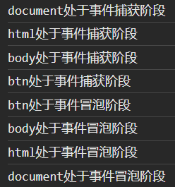

# 1. [事件流](https://www.cnblogs.com/stfei/p/9134222.html)的概念

HTML中与javascript交互是通过事件驱动来实现的，例如鼠标点击事件、页面的滚动事件onscroll等等，可以向文档或者文档中的元素添加事件侦听器来预订事件。想要知道这些事件是在什么时候进行调用的，就需要了解一下“事件流”的概念。

**事件流描述的是从页面中接收事件的顺序。**

# 2.  "DOM2事件流"规定的事件流包括的三个阶段：

1. 事件捕获——true
2. **处于目标阶段** 
3. 事件冒泡——false

# 3. addEventListener

addEventListener是DOM2级事件新增的指定事件处理程序的操作，该方法接收3个参数：

- 要处理的事件名，
- 作为事件处理程序的函数
- 一个布尔值（默认是**==false==**）
  - **如果是true，表示在捕获阶段调用事件处理程序；**
  - **如果是false，表示在冒泡阶段调用事件处理程序**

# 4. document，documentElement，document.body三者间的关系：

- document代表的是整个html页面

- document.documentElement代表是的<html>标签

- document.body代表的是<body>标签

# 5. 示例代码

````js
window.onload = function(){
    var oBtn = document.getElementById('btn');
    oBtn.addEventListener('click',function(){
        console.log('btn处于事件捕获阶段'); 
    }, true);
    oBtn.addEventListener('click',function(){
        console.log('btn处于事件冒泡阶段');
    }, false);
    document.addEventListener('click',function(){
        console.log('document处于事件捕获阶段');
    }, true);
    document.addEventListener('click',function(){
        console.log('document处于事件冒泡阶段');
    }, false);
    document.documentElement.addEventListener('click',function(){
        console.log('html处于事件捕获阶段');
    }, true);
    document.documentElement.addEventListener('click',function(){
        console.log('html处于事件冒泡阶段');
    }, false);
    document.body.addEventListener('click',function(){
        console.log('body处于事件捕获阶段');
    }, true);
    document.body.addEventListener('click',function(){
        console.log('body处于事件冒泡阶段');
    }, false);
};
````

猜测输出顺序：

btn处于事件捕获阶段 | body处于事件捕获阶段 | html处于事件捕获阶段 | document处于事件捕获阶段

document处于事件冒泡阶段 | html处于事件冒泡阶段 | body处于事件冒泡阶段 | btn处于事件冒泡阶段

猜测错误

实际输出顺序：

出现上图结果的原因是：在标准的“DOM2级事件”中规定，事件流首先是经过事件捕获阶段，接着是处于目标阶段，最后是事件冒泡阶段


# 6. 为什么document对象最先接收到click事件

这块可能得看英文官方文档了

# 7. 其他1

https://www.cnblogs.com/starof/p/4066381.html

**事件流描述的是从页面中接收事件的顺序。**

事件传播的顺序对应浏览器的两种事件流模型：捕获型事件流和冒泡型事件流。

==**冒泡型事件流**==：事件的传播是从**最特定**的**事件目标**到最不特定的**事件目标**。即从DOM树的叶子到根。**【推荐】**

==**捕获型事件流**==：事件的传播是从**最不特定**的**事件目标**到最特定的**事件目标**。即从DOM树的根到叶子。事件捕获的思想就是不太具体的节点应该更早接收到事件，而最具体的节点最后接收到事件。

# 8. 什么是事件委托

https://www.cnblogs.com/lauzhishuai/p/11263210.html

* 事件委托：事件代理
* 事件委托：委托它们的父级代为执行事件
* JavaScript高级程序设计上讲：事件委托就是利用事件冒泡(**事件委托的原理——事件冒泡**)，只指定一个事件处理程序，就可以管理某一类型的所有事件

# 9. 为什么要用事件委托

https://www.cnblogs.com/lauzhishuai/p/11263210.html

一般来说，dom需要有事件处理程序，我们都会直接给它设事件处理程序就好了，那如果是很多的dom需要添加事件处理呢？

* `情景`：比如我们有100个li，每个li都有相同的click点击事件，可能我们会用for循环的方法，来遍历所有的li，然后给它们添加事件，那这么做会有什么影响呢？
* `影响`：在JavaScript中，添加到页面上的事件处理程序数量将直接关系到页面的整体运行性能，~~因为需要不断的与dom节点进行交互，访问dom的次数越多，引起浏览器重绘与重排的次数也就越多，就会延长整个页面的交互就绪时间~~
* `原因`：每个函数都是对象，都会占用内存，对象越多，性能越差


* 上面的描述：“因为需要不断的与dom节点进行交互，访问dom的次数越多”描述不准确，**是因为必须实现指定所有事件处理程序，才导致DOM访问次数较多**

* ==问题==:  为什么访问dom的次数越多，页面的交互就绪时间越长

  

* 这就是为什么性能优化的主要思想之一就是减少DOM操作（是不是也可以理解成减少dom的访问？）的原因；如果要用事件委托，就会将所有的操作放到js程序里面，与dom的操作就只需要交互一次，这样就能大大的减少与dom的交互次数，提高性能。

# 10. 事件委托的实现

```html
<!DOCTYPE html>
<html lang="en">
<head>
    <meta charset="UTF-8">
    <meta http-equiv="X-UA-Compatible" content="IE=edge">
    <meta name="viewport" content="width=device-width, initial-scale=1.0">
    <title>Document</title>
</head>
<body>
    <ul id="ul1">
        <li></li>
        <li></li>
        <li></li>
        <li></li>
        <li></li>
        <li></li>
        <li></li>
        <li></li>
        <li></li>
        <li></li>
        <li></li>
        <li></li>
        <li></li>
        <li></li>
        <li></li>
        <li></li>
        <li></li>
        <li></li>
        <li></li>
        <li></li>
        <li></li>
        <li></li>
        <li></li>
        <li></li>
        <li></li>
        <li></li>
        <li></li>
        <li></li>
        <li></li>
        <li></li>
        <li></li>
        <li></li>
        <li></li>
        <li></li>
        <li></li>
        <li></li>
        <li></li>
        <li></li>
        <li></li>
        <li></li>
        <li></li>
        <li></li>
        <li></li>
        <li></li>
        <li></li>
        <li></li>
        <li></li>
        <li></li>
        <li></li>
        <li></li>
        <li></li>
        <li></li>
        <li></li>
        <li></li>
        <li></li>
        <li></li>
        <li></li>
        <li></li>
        <li></li>
        <li></li>
        <li></li>
        <li></li>
        <li></li>
        <li></li>
        <li></li>
        <li></li>
        <li></li>
        <li></li>
        <li></li>
        <li></li>
        <li></li>
        <li></li>
        <li></li>
        <li></li>
        <li></li>
        <li></li>
        <li></li>
        <li></li>
        <li></li>
        <li></li>
        <li></li>
        <li></li>
        <li></li>
        <li></li>
        <li></li>
        <li></li>
        <li></li>
        <li></li>
        <li></li>
        <li></li>
        <li></li>
        <li></li>
        <li></li>
        <li></li>
        <li></li>
        <li></li>
        <li></li>
        <li></li>
        <li></li>
        <li></li>
    </ul>
    <script>
        let lis = document.querySelectorAll('li');
        console.log('lis:',lis);
        lis.forEach(ele => {
            ele.addEventListener('click', () => {
                console.log('dianjil1')
            })
        })
        
        var oUl = document.getElementById("ul1");
        oUl.onclick = function(){
            alert(123);
        }
    </script>
</body>
</html>
```


