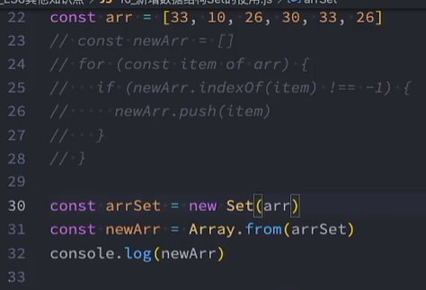

# [1. 八进制-二进制-连接符](https://www.bilibili.com/video/BV1zd4y1X7ky/?p=15&spm_id_from=pageDriver&vd_source=a7089a0e007e4167b4a61ef53acc6f7e)

# [2. 新增Symbol类型的使用](https://www.bilibili.com/video/BV1zd4y1X7ky/?p=16&spm_id_from=pageDriver&vd_source=a7089a0e007e4167b4a61ef53acc6f7e)

# [3. 新增数据结构Set](https://www.bilibili.com/video/BV1zd4y1X7ky/?p=17&spm_id_from=pageDriver&vd_source=a7089a0e007e4167b4a61ef53acc6f7e)

