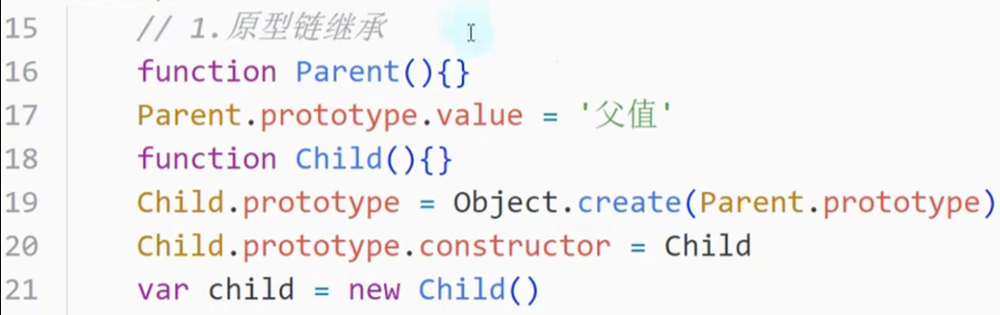

# 1. \__proto__

在 JavaScript 中，`__proto__` 属性是一个非标准的、历史遗留的属性，它指向对象的原型。尽管现代 JavaScript 推荐使用 `Object.getPrototypeOf` 和 `Object.setPrototypeOf` 方法来操作对象的原型，但了解 `__proto__` 的工作机制依然很重要。以下是关于 `__proto__` 属性的详细介绍：

### 1. **基本概念**

- `__proto__` 是一个内部属性，它指向对象的原型对象。
- 该属性在对象创建时自动存在，用于访问和修改对象的原型链。

**示例**:
```javascript
const obj = {
  a: 1
};

// 创建一个新对象，其原型是 obj
const newObj = Object.create(obj);

// 访问 newObj 的原型
console.log(newObj.__proto__ === obj); // true
```

### 2. **历史背景**

- `__proto__` 是早期 JavaScript 引擎的实现特性，用于让开发者能够访问和修改对象的原型链。
- 它是浏览器兼容性的解决方案，但在 ECMAScript 规范中并没有被正式标准化。

### 3. **使用 `__proto__`**

**访问原型**:
```javascript
const person = {
  name: 'Alice'
};

const employee = Object.create(person);
console.log(employee.__proto__ === person); // true
```

**修改原型**:
```javascript
const animal = {
  makeSound: function() {
    console.log('Some sound');
  }
};

const dog = {};
dog.__proto__ = animal;
dog.makeSound(); // 'Some sound'
```

### 4. **与标准方法的对比**

**使用 `Object.getPrototypeOf`**:
- 推荐使用 `Object.getPrototypeOf` 来获取对象的原型。

**示例**:
```javascript
const obj = {};
console.log(Object.getPrototypeOf(obj)); // Object.prototype
```

**使用 `Object.setPrototypeOf`**:
- 推荐使用 `Object.setPrototypeOf` 来设置对象的原型。

**示例**:
```javascript
const animal = {
  makeSound: function() {
    console.log('Some sound');
  }
};

const dog = {};
Object.setPrototypeOf(dog, animal);
dog.makeSound(); // 'Some sound'
```

### 5. **`__proto__` 的兼容性**

- 尽管 `__proto__` 在现代 JavaScript 环境中已经被广泛支持，但它并不是官方 ECMAScript 规范的一部分，因此在未来版本中可能会被移除。
- 使用 `__proto__` 可能导致代码不符合标准，建议使用标准的 `Object.getPrototypeOf` 和 `Object.setPrototypeOf`。

### 6. **性能问题**

- 直接操作 `__proto__` 可能会导致性能问题，因为它会影响原型链的解析过程。
- 现代 JavaScript 引擎已经对原型链的性能进行了优化，但仍然建议使用标准的方法来操作原型链，以避免潜在的性能问题。

### 7. **安全性和最佳实践**

- 避免使用 `__proto__` 来修改对象的原型，因为它可能导致意外的副作用。
- 使用标准的 `Object.create`、`Object.getPrototypeOf` 和 `Object.setPrototypeOf` 方法来处理对象原型链，确保代码的可维护性和兼容性。

### 总结

- `__proto__` 是一个非标准的、历史遗留的属性，用于访问和修改对象的原型链。
- 推荐使用标准方法 `Object.getPrototypeOf` 和 `Object.setPrototypeOf` 来处理对象的原型。
- 虽然 `__proto__` 在现代环境中被广泛支持，但为了确保代码的可维护性和未来兼容性，最好使用标准的方法。

# 2. JS的继承方式

https://www.bilibili.com/video/BV1fx4y1p7UN/?spm_id_from=333.999.0.0&vd_source=a7089a0e007e4167b4a61ef53acc6f7e

## 2.1 原型链继承

每个对象都有一个\__proto__属性



## 2.2 构造函数继承

## 2.3 组合式继承

## 2.4 class类继承


https://www.bilibili.com/video/BV1YP4y1n72d?spm_id_from=333.337.search-card.all.click


# 继承


怎么样把两个构造函数继承在一起？

 ```javascript
 People.prototype = Object.create(Animal.prototype);[49min处up主并没有意识到这个错误！！！！]
 Peolpe.prototype.constructor = People;
 ```

https://developer.mozilla.org/zh-CN/docs/Web/JavaScript/Reference/Global_Objects/Object/create

如果你希望能继承到多个对象，则可以使用混入的方式。

# 多态

https://www.cnblogs.com/aliwa/p/6440945.html


