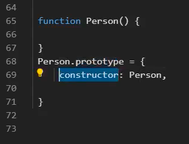
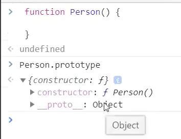

# 1. \__proto__

在 JavaScript 中，`__proto__` 属性是一个非标准的、历史遗留的属性，它指向对象的原型。尽管现代 JavaScript 推荐使用 `Object.getPrototypeOf` 和 `Object.setPrototypeOf` 方法来操作对象的原型，但了解 `__proto__` 的工作机制依然很重要。以下是关于 `__proto__` 属性的详细介绍：

### 1. **基本概念**

- `__proto__` 是一个内部属性，它指向对象的原型对象。
- 该属性在对象创建时自动存在，用于访问和修改对象的原型链。

**示例**:
```javascript
const obj = {
  a: 1
};

// 创建一个新对象，其原型是 obj
const newObj = Object.create(obj);

// 访问 newObj 的原型
console.log(newObj.__proto__ === obj); // true
```

### 2. **历史背景**

- `__proto__` 是早期 JavaScript 引擎的实现特性，用于让开发者能够访问和修改对象的原型链。
- 它是浏览器兼容性的解决方案，但在 ECMAScript 规范中并没有被正式标准化。

### 3. **使用 `__proto__`**

**访问原型**:
```javascript
const person = {
  name: 'Alice'
};

const employee = Object.create(person);
console.log(employee.__proto__ === person); // true
```

**修改原型**:
```javascript
const animal = {
  makeSound: function() {
    console.log('Some sound');
  }
};

const dog = {};
dog.__proto__ = animal;
dog.makeSound(); // 'Some sound'
```

### 4. **与标准方法的对比**

**使用 `Object.getPrototypeOf`**:
- 推荐使用 `Object.getPrototypeOf` 来获取对象的原型。

**示例**:
```javascript
const obj = {};
console.log(Object.getPrototypeOf(obj)); // Object.prototype
```

**使用 `Object.setPrototypeOf`**:
- 推荐使用 `Object.setPrototypeOf` 来设置对象的原型。

**示例**:
```javascript
const animal = {
  makeSound: function() {
    console.log('Some sound');
  }
};

const dog = {};
Object.setPrototypeOf(dog, animal);
dog.makeSound(); // 'Some sound'
```

### 5. **`__proto__` 的兼容性**

- 尽管 `__proto__` 在现代 JavaScript 环境中已经被广泛支持，但它并不是官方 ECMAScript 规范的一部分，因此在未来版本中可能会被移除。
- 使用 `__proto__` 可能导致代码不符合标准，建议使用标准的 `Object.getPrototypeOf` 和 `Object.setPrototypeOf`。

### 6. **性能问题**

- 直接操作 `__proto__` 可能会导致性能问题，因为它会影响原型链的解析过程。
- 现代 JavaScript 引擎已经对原型链的性能进行了优化，但仍然建议使用标准的方法来操作原型链，以避免潜在的性能问题。

### 7. **安全性和最佳实践**

- 避免使用 `__proto__` 来修改对象的原型，因为它可能导致意外的副作用。
- 使用标准的 `Object.create`、`Object.getPrototypeOf` 和 `Object.setPrototypeOf` 方法来处理对象原型链，确保代码的可维护性和兼容性。

### 总结

- `__proto__` 是一个非标准的、历史遗留的属性，用于访问和修改对象的原型链。
- 推荐使用标准方法 `Object.getPrototypeOf` 和 `Object.setPrototypeOf` 来处理对象的原型。
- 虽然 `__proto__` 在现代环境中被广泛支持，但为了确保代码的可维护性和未来兼容性，最好使用标准的方法。

# 2. JS的继承方式

https://www.bilibili.com/video/BV1fx4y1p7UN/?spm_id_from=333.999.0.0&vd_source=a7089a0e007e4167b4a61ef53acc6f7e

## 2.1 原型链继承

每个对象都有一个\__proto__属性


## 2.2 构造函数继承


## 2.3 组合式继承——原型链继承+构造函数继承


感觉这个不太对！！！！

## 2.4 class类继承


https://www.bilibili.com/video/BV1YP4y1n72d?spm_id_from=333.337.search-card.all.click





# 继承


怎么样把两个构造函数继承在一起？

 ```javascript
 People.prototype = Object.create(Animal.prototype);[49min处up主并没有意识到这个错误！！！！]
 Peolpe.prototype.constructor = People;
 ```

https://developer.mozilla.org/zh-CN/docs/Web/JavaScript/Reference/Global_Objects/Object/create

如果你希望能继承到多个对象，则可以使用混入的方式。

# [4. 多态](https://www.cnblogs.com/aliwa/p/6440945.html)

非多态代码示例：

```js
var makeSound = function(animal) {
    if(animal instanceof Duck) {
        console.log('嘎嘎嘎');
    } else if (animal instanceof Chicken) {
        console.log('咯咯咯');
    }
}
var Duck = function(){}
var Chiken = function() {};
makeSound(new Chicken());
makeSound(new Duck());
```

多态的代码示例：

```js
var makeSound = function(animal) {
    animal.sound();
}

var Duck = function(){}
Duck.prototype.sound = function() {
    console.log('嘎嘎嘎')
}
var Chiken = function() {};
Chiken.prototype.sound = function() {
    console.log('咯咯咯')
}

makeSound(new Chicken());
makeSound(new Duck());
```

# 5. 多态

在 JavaScript 中，多态是面向对象编程中的一个重要概念，它允许对象以不同的形式出现。通过多态，你可以用相同的接口调用不同的对象方法，而这些对象可能有不同的内部实现。在 JavaScript 中，多态通常通过继承和方法重写来实现。

### 示例：JavaScript 类的多态

下面是一个简单的示例，演示如何在 JavaScript 类中实现多态。我们将定义一个基类 `Shape` 和两个子类 `Circle` 和 `Rectangle`，它们都重写了基类中的 `area` 方法，从而表现出不同的行为。

```javascript
// 定义基类 Shape
class Shape {
  // 基类中的方法
  area() {
    throw new Error("Method 'area()' must be implemented.");
  }
}

// 定义子类 Circle，继承自 Shape
class Circle extends Shape {
  constructor(radius) {
    super();
    this.radius = radius;
  }

  // 重写 area 方法
  area() {
    return Math.PI * this.radius * this.radius;
  }
}

// 定义子类 Rectangle，继承自 Shape
class Rectangle extends Shape {
  constructor(width, height) {
    super();
    this.width = width;
    this.height = height;
  }

  // 重写 area 方法
  area() {
    return this.width * this.height;
  }
}

// 使用多态
const shapes = [
  new Circle(5),
  new Rectangle(10, 20)
];

shapes.forEach(shape => {
  console.log(`Area: ${shape.area()}`);
});
```

### 解释

1. **基类 `Shape`**：
   - 定义了一个 `area` 方法，这个方法在基类中只是抛出一个错误，提示子类必须实现这个方法。
   
2. **子类 `Circle`**：
   - 继承自 `Shape` 类，并实现了 `area` 方法，计算圆的面积。

3. **子类 `Rectangle`**：
   - 继承自 `Shape` 类，并实现了 `area` 方法，计算矩形的面积。

4. **多态**：
   - 在 `shapes` 数组中，我们存储了不同的 `Shape` 对象（一个圆和一个矩形）。通过遍历 `shapes` 数组，并调用 `shape.area()` 方法，我们展示了多态的特性。尽管调用的都是 `area` 方法，但每个对象都根据自己的类型（`Circle` 或 `Rectangle`）执行不同的实现。

### 结论

在 JavaScript 中，通过使用继承和方法重写，你可以实现类的多态。每个子类可以提供自己的方法实现，而你可以通过基类的引用来调用这些方法，展现不同的行为。这种方式使得你的代码更加灵活和易于扩展。


