https://www.bilibili.com/video/BV1Kt411w7MP/?spm_id_from=trigger_reload

# 2 面向对象编程介绍

封装性

继承性

多态性

# 3 类和对象

# 4 创建类和生成实例

在类里面所有的函数都不需要加function，多个方法之间不需要添加逗号

new 会自动的调用constructor（）

# 5 类中添加共有方法

# 6 类的继承

# 7 super调用父类普通函数以及继承中属性查找原则

super关键字除了可以调用父类的构造函数之外，还可以调用父类的普通函数。

输出：我是儿子

就近原则

# 8 super必须放到子类this之前

# 9 使用类三个注意点

sing方法属于类里面，也就是说 属于实例对象

# 11 面向对象tab栏——思路分析以及布局介绍

# 12 面向对象tab栏——模块划分

# 23 构造函数和原型导读

https://www.bilibili.com/video/BV1Kt411w7MP?p=23&vd_source=a7089a0e007e4167b4a61ef53acc6f7e

- 类和class是es6新增的

- 在es6之前，**通过构造函数和原型来模拟类的实现**
- 

# [24 利用构造函数创建对象](https://www.bilibili.com/video/BV1Kt411w7MP?p=24&spm_id_from=pageDriver&vd_source=a7089a0e007e4167b4a61ef53acc6f7e)

| 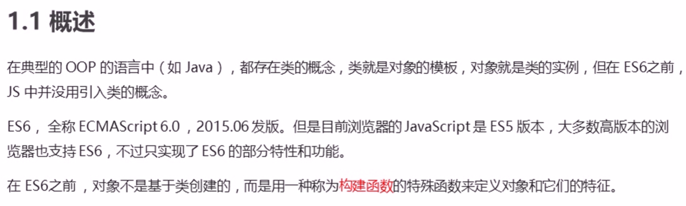 | 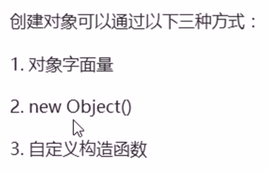 |
| ------------------------------------------------------------ | ------------------------------------------------------------ |
|  | 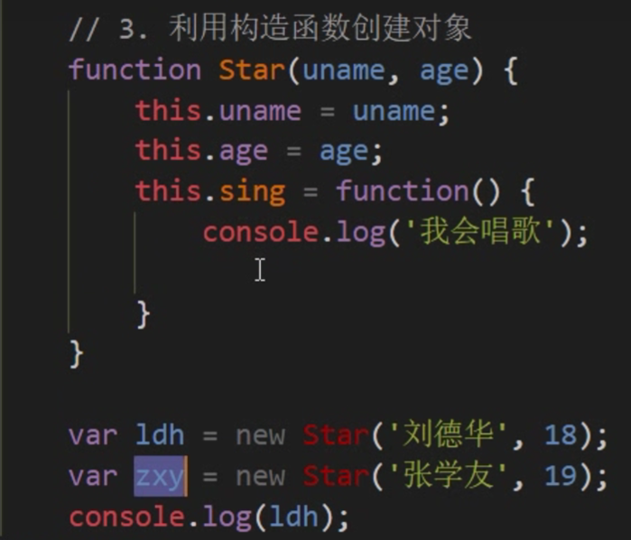 |
| 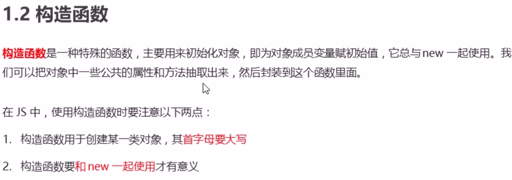 | 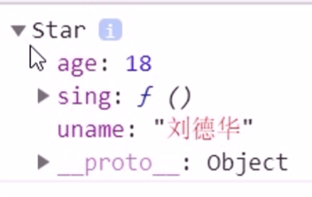 |
|  |                                                              |

# [25 实例成员和静态成员](https://www.bilibili.com/video/BV1Kt411w7MP?p=25&spm_id_from=pageDriver&vd_source=a7089a0e007e4167b4a61ef53acc6f7e)


# [26 构造函数原型对象 prototype](https://www.bilibili.com/video/BV1Kt411w7MP?p=26&spm_id_from=pageDriver&vd_source=a7089a0e007e4167b4a61ef53acc6f7e)


> 我们希望所有的对象使用同一个函数，这样就比较节省内存，那么我们要怎样做呢？


|  | 修改后：<br/> |
| ------------------------------------------------------------ | ------------------------------------------------------------ |
| console.dir(Star)<br/> |  |

# [27 对象原型 __ proto __](https://www.bilibili.com/video/BV1Kt411w7MP?p=27&spm_id_from=pageDriver&vd_source=a7089a0e007e4167b4a61ef53acc6f7e)

|  | 疑问：sing这个方法是定义在Star这个构造函数的原型对象身上, 为什么ldh实例对象可以使用这个方法呢？<br>解答：<br> |
| ------------------------------------------------------------ | ------------------------------------------------------------ |
| console.log(ldh)<br>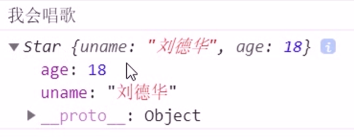 | <br>输出：true<br> |

# [28 原型constructor构造函数](https://www.bilibili.com/video/BV1Kt411w7MP?p=28&spm_id_from=pageDriver&vd_source=a7089a0e007e4167b4a61ef53acc6f7e)

| console.log(Star.prototype)<br>console.log(ldh.\__proto__) | 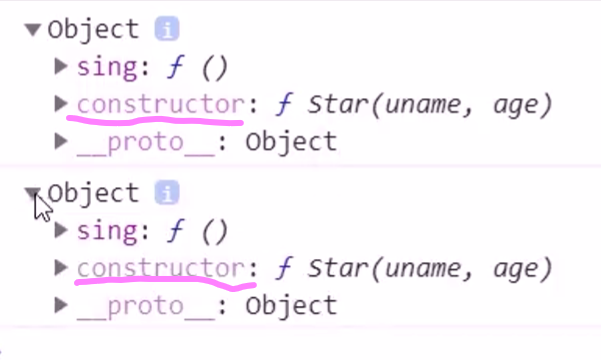 |
| ---------------------------------------------------------- | ------------------------------------------------------------ |

constructor主要用于记录该对象引用于哪个构造函数，它可以让原型对象重新指向原来的构造函数

很多情况下，我们需要手动的利用constructor这个属性指回原来的构造函数

| 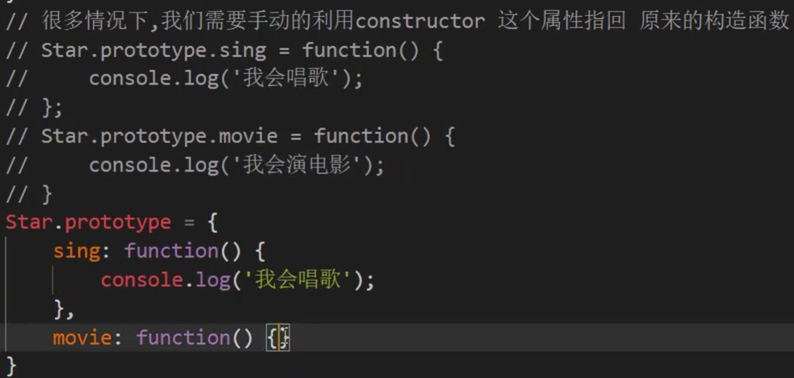 | 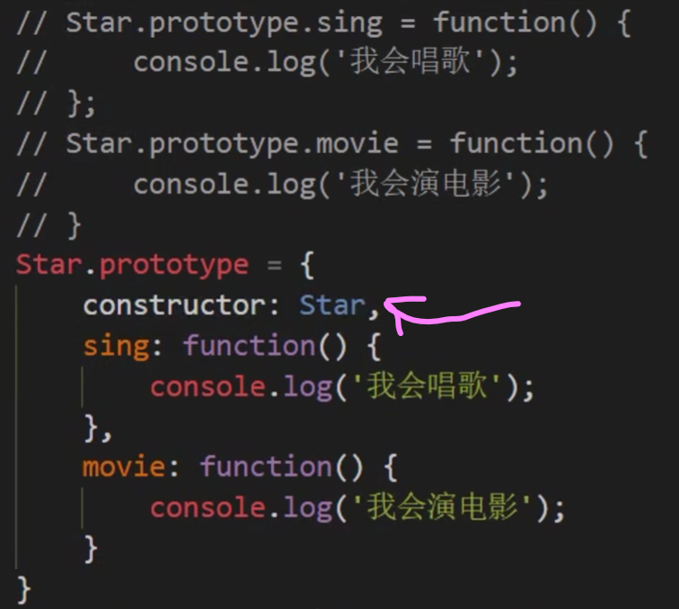 |
| ------------------------------------------------------------ | ------------------------------------------------------------ |

# [29 构造函数，实例和原型对象三者之间的关系](https://www.bilibili.com/video/BV1Kt411w7MP?p=29&spm_id_from=pageDriver&vd_source=a7089a0e007e4167b4a61ef53acc6f7e)


# [30 原型链](https://www.bilibili.com/video/BV1Kt411w7MP?p=30&spm_id_from=pageDriver&vd_source=a7089a0e007e4167b4a61ef53acc6f7e)

- Star原型对象prototype也是一个对象

- 只要是对象，就有__ proto__原型的存在

- | console.log(Star.prototype)<br> | 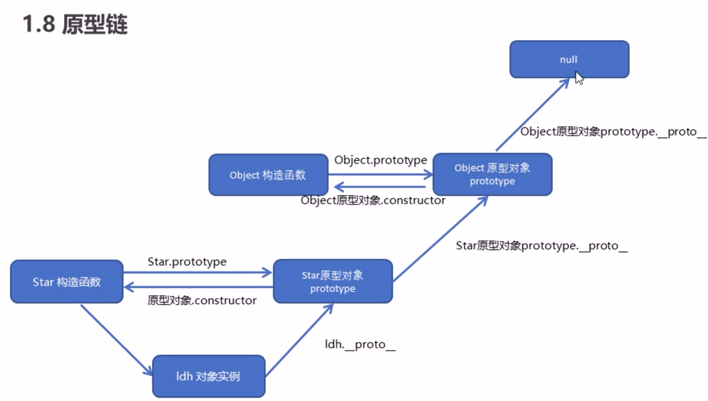 |
  | ------------------------------------------------------------ | ------------------------------------------------------------ |

# [31 对象成员查找规则](https://www.bilibili.com/video/BV1Kt411w7MP?p=31&spm_id_from=pageDriver&vd_source=a7089a0e007e4167b4a61ef53acc6f7e)


# [32 原型对象this指向](https://www.bilibili.com/video/BV1Kt411w7MP?p=32&spm_id_from=pageDriver&vd_source=a7089a0e007e4167b4a61ef53acc6f7e)

> **构造函数里面的this**和**原型对象函数里面的this**指向的都是实例对象

# [33 利用原型对象扩展内置对象方法](https://www.bilibili.com/video/BV1Kt411w7MP?p=33&spm_id_from=pageDriver&vd_source=a7089a0e007e4167b4a61ef53acc6f7e)


# [34 call方法的作用](https://www.bilibili.com/video/BV1Kt411w7MP?p=34&spm_id_from=pageDriver&vd_source=a7089a0e007e4167b4a61ef53acc6f7e)

> ES6之前并没有给我们提供extends继承，我们可以通过“**构造函数+原型对象**”模拟实现继承，称为“**组合继承**”


# [35 利用父构造函数继承属性??利用构造函数继承父类型属性](https://www.bilibili.com/video/BV1Kt411w7MP?p=35&spm_id_from=pageDriver&vd_source=a7089a0e007e4167b4a61ef53acc6f7e)

|  | 子构造函数怎么样才能把父构造函数这两个属性拿过来使用？<br>把父构造函数调用过来就可以了<br> |
| ------------------------------------------------------------ | ------------------------------------------------------------ |

 # [36 利用原型对象继承方法（上）](https://www.bilibili.com/video/BV1Kt411w7MP?p=36&spm_id_from=pageDriver&vd_source=a7089a0e007e4167b4a61ef53acc6f7e)

- 一些共有的属性写到构造函数里面就可以了

- 一些共有的方法呢？写到原型对象上

|  |  |
| :----------------------------------------------------------- | ------------------------------------------------------------ |
| 这样的写法money方法是没有继承到的.<br/>借用父构造函数继承实际意义上并不是真正的继承，<br/>只是this的指向发生了改变，父构造函数原型上的属性和方法 子类得不到 | 把父构造函数的原型对象 给 子构造函数的原型对象:<br/>这样做不好，因为子构造函数的原型对象上会有一些自己专门的方法<br>直接赋值。如果修改了子原型对象，父原型对象也会跟着一起变化<br>所以继承方法不能简单的通过这种原型对象上的复制来实现 |

# [37 利用原型对象继承方法（下）](https://www.bilibili.com/video/BV1Kt411w7MP?p=37&spm_id_from=pageDriver&vd_source=a7089a0e007e4167b4a61ef53acc6f7e)

```
Son.prototype = Father.prototype
```

上面的处理不妥：如果修改了子原型对象，父原型对象也会跟着一起变化


用下面这行代码替换上面的处理： 实例化父构造函数

 ```javascript
Son.prototype = new Father(); 
 ```

Father实例对象和Father原型对象在两个不同的内存地址


这样做以后，son的prototype里面就没有son的constructor了

解决：如果利用对象的形式修改了原型对象，别忘了利用constructor指回原来的构造函数

```js
Son.prototype.constructor = Son;
```

#   [38 类的本质](https://www.bilibili.com/video/BV1Kt411w7MP?p=38&spm_id_from=pageDriver&vd_source=a7089a0e007e4167b4a61ef53acc6f7e)

| 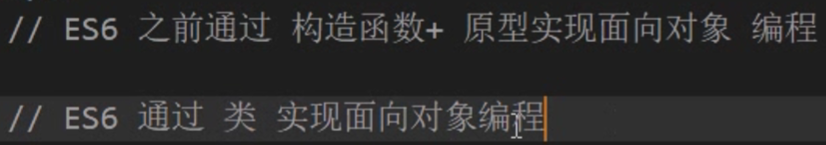<br>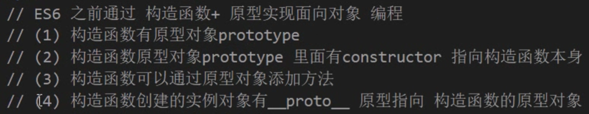 | <br>输出值：function<br/>说明类的本质其实还是一个函数<br/>我们也可以简单的认为：类就是构造函数的另外一种写法 |
| ------------------------------------------------------------ | ------------------------------------------------------------ |
| 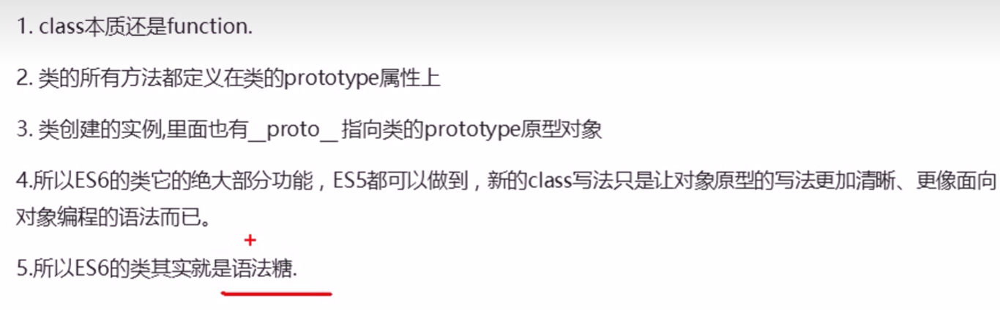 | 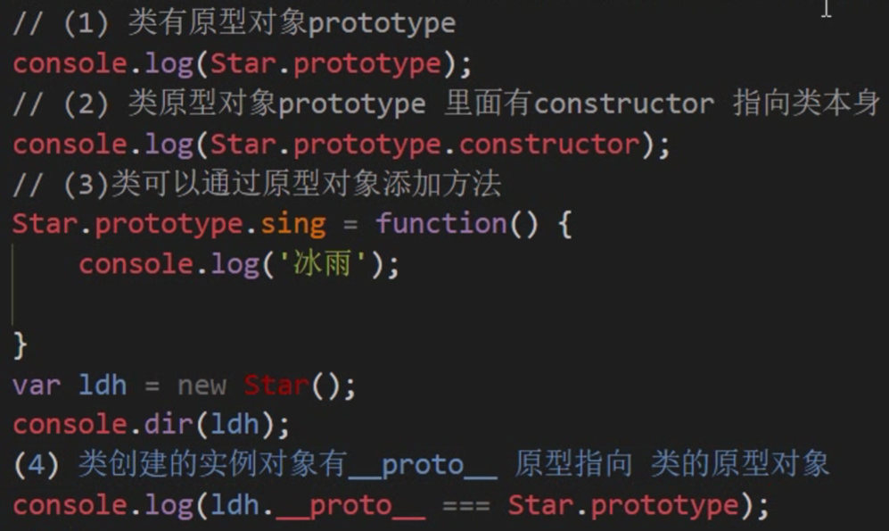 |

# 39 迭代（遍历数组）forEach

# 40 筛选数组filter方法

# 41 数组方法 some（）

**如果查询数组中唯一的元素，用some方法更合适，因为它找到这个元素，就不在进行循环，效率更高**

# 42 渲染页面数据

# 43 根据价格筛选商品

# 44

# 45

# 46 some和forEach区别

# 47 trim方法去除字符串两侧空格

# 48 Object.defineProperty方法 上

# 50 函数进阶导读


# 51 函数的定义方式

# 52 函数的调用方式


# 53 函数内部的this指向


# 54 call方法及其应用


# 55 apply方法及其应用

有解构赋值以后改成：

```javascript
Math.max(...arr); // 也可以
```

# 56 bind方法基本使用


！！！bind方法不会调用这个函数！！！


# 57 bind方法应用


# 58 bind应用面向对象tab栏（还没看）（没看懂 重新看！！先看完前面的tab）


# 59 call apply bind总结


# 60 什么是严格模式以及如何开启严格模块


# 61 严格模式的变化


# 62 高阶函数


# 74 浅拷贝


 

# 75 深拷贝


为什么要把数组放在上面？ 因为数组也属于Object


# 119 创建set数据结构


# 120利用set数据结构做数组去重

```javascript
const s3 = new Set(["a","a","b","b"]);
```


# 121 set对象实例方法


# 122 遍历set


