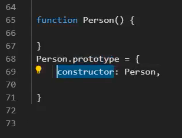
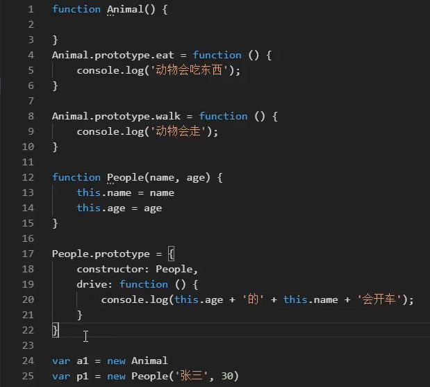

https://www.bilibili.com/video/BV1YP4y1n72d?spm_id_from=333.337.search-card.all.click




# 继承



怎么样把两个构造函数继承在一起？

 ```javascript
 People.prototype = Object.create(Animal.prototype);[49min处up主并没有意识到这个错误！！！！]
 Peolpe.prototype.constructor = People;
 ```

https://developer.mozilla.org/zh-CN/docs/Web/JavaScript/Reference/Global_Objects/Object/create

如果你希望能继承到多个对象，则可以使用混入的方式。

# 多态

https://www.cnblogs.com/aliwa/p/6440945.html


