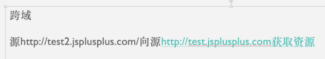
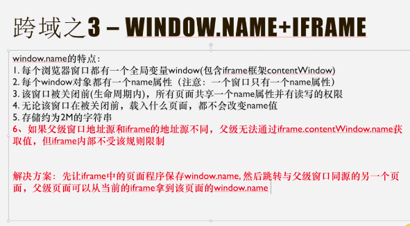
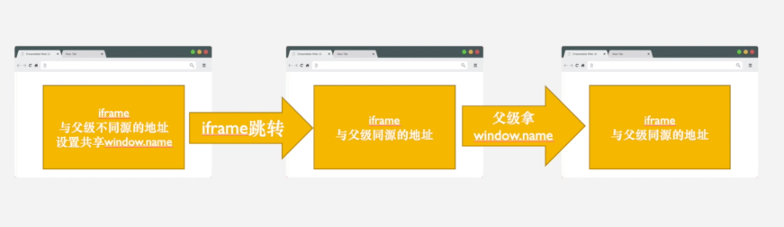

 在浏览器端，并不是所有能够发送请求的属性都受同源政策的影响

不受同源策略限制的项：

1、页面的超链接

2、重定向页面

3、表单的提交

4、资源引入script src/link href/img src/iframe src

**跨域会导致什么问题？**

# 一 使用JSONP（json with padding）解决同源限制问题

JSONP：**利用script标签的src属性不受同源策略限制**。实际上就是绕过浏览器同源政策的限制，向非同源服务器端发送请求。

JSONP不属于Ajax请求，但它可以模拟Ajax请求

1. 将不同源的服务器端请求地址写在script标签的src属性中

   ```javascript
   <script src="https://cdn.bootcss.com/jquery/3.3.1/jquery.min.js"></script>
   ```

   - 在我们的意识当中，script标签就是用来加载外部javascript文件的，请求地址必须以xx.js结尾
   - 但实际上，这是一个误区， 请求地址可以是任意形式的
   - 关键点：不管请求地址长什么样子，但是它必须返回合法的javascript代码，因为script标签在加载完请求地址中的内容后，要将内容作为javascript代码来执行

2. 服务端响应数据必须是一个函数的调用，真正要发送给客户端的数据需要作为函数调用的参数

   ```javascript
   const data = 'fn({name: 'zhangsan', age: 20})';
   // 在服务器端，这个响应内容必须是字符串，在字符串当中包裹函数调用的代码
   // 在服务器端代码中，返回函数调用代码的同时，还要将客户端真正需要的数据写在函数调用实参的地方。因为函数在客户端被执行的时候，客户端就可以通过形参来对应这个数据了
   res.send(data);
   ```

前端：

后端：

虽然现在请求能够发送，也能够获取到服务器端响应的数据，但是请求是在页面加载的过程当中被发送的，也就是说，请求是在我访问html文件的时候就被立即发送了，我是希望这个请求能够在我想发送的时候再发送，比如点击按钮的时候再发送这个请求。这样的需求要如何实现？

- 只需要在想发送请求的时候使用javascript代码动态创建script标签，然后将script标签追加到页面当中。请求是在script标签被追加到页面时发送的。


要在内容加载完成之后把script标签从body内部给它删除掉


到有道云笔记第36节了

##### 为什么JSONP只能解决get跨域？

> JSONP解决方案中的请求属于get请求，因为他是通过script标签的src属性发送的请求，它传递的参数也是get请求参数

疑问：

- 为什么通过script标签的src属性发送的请求是get请求，而不是post请求？

- - script, link, img 等等标签引入外部资源，都是 get 请求的，那么就决定了 jsonp 一定是 get 的

- 那如果发送的是post请求，并且也想实现跨域，应该怎么做？

- - 需要在服务器增加Access-Control-Allow-Origin和Access-Control-Allow-Headers头(这是请求头还是响应头？？响应头把！！！！)

- 那有支持post请求的script吗？

# 二 设置基础域名document.hash + iframe

https://ke.qq.com/user/index/index.html#/plan/cid=2837895&term_id=102948532 买的课程

https://ke.qq.com/webcourse/2837895/102948532#taid=10038670013451655&vid=5285890788270022970


## 2.1 iframe基础知识：

当iframe加载完毕了以后（记住：iframe引入了一个页面以后，它是有加载的过程的。并不是iframe加载，是iframe里面引入的页面加载），




## 2.2 iframe解决跨域方法1: 服务器中转请求

源 http://test2.jsplusplus.com

向源http://test.jsplusplus.com获取资源

* 同源策略是针对客户端浏览器的，对服务器无效。
* 不仅仅是客户端可以发起请求，服务器端也可以向另外一台服务器发起请求。   

  

要实现！！不然听着都是空的！！！

## 2.3 iframe解决跨域方法2: 设置基础域名+IFRAME


document.domain = 'jsplusplus.com' // 设置基础域名

 


为什么要把基础域名设置对一样，感觉不设置也能处理跨域问题！！！！！

==如果不把基础域名设置成一样，那么在第一张图中的第14行就会报错了==

## 2.4 iframe解决跨域方法3: Window.name + iframe



解决方案没看懂



绕晕了

test2.jsplusplus.com/window_name/==demo1==.html

通过window.location跳转至 test2.jsplusplus.com/window_name/==demo2==.html

同一个窗口，不同的页面是共享一个window.name的


# 五 cors 跨域资源共享

cross origin resources sharing

http://www.ruanyifeng.com/blog/2016/04/cors.html

CORS是一个W3C标准，全称是"跨域资源共享"（Cross-origin resource sharing）。

它允许浏览器向跨源服务器，发出[`XMLHttpRequest`](http://www.ruanyifeng.com/blog/2012/09/xmlhttprequest_level_2.html)请求，从而克服了AJAX只能[同源](http://www.ruanyifeng.com/blog/2016/04/same-origin-policy.html)使用的限制。

## 5.1 简介

CORS需要浏览器和服务器同时支持。目前，所有浏览器都支持该功能，IE浏览器不能低于IE10。

整个CORS通信过程，都是浏览器自动完成，不需要用户参与。==对于开发者来说，CORS通信与同源的AJAX通信没有差别，代码完全一样==。浏览器一旦发现AJAX请求跨源，就会自动添加一些附加的头信息，有时还会多出一次附加的请求，但用户不会有感觉。

因此，实现CORS通信的关键是服务器。只要服务器实现了CORS接口，就可以跨源通信。

## 5.2 两种请求

浏览器将==CORS请求==分成两类：

* 简单请求（simple request）

* 非简单请求（not-so-simple request）

只要同时满足以下两大条件，就属于简单请求。

（1) 请求方法是以下三种方法之一：

- HEAD
- GET
- POST

（2）HTTP的头信息不超出以下几种字段：

- Accept
- Accept-Language
- Content-Language
- Last-Event-ID
- Content-Type：只限于三个值`application/x-www-form-urlencoded`、`multipart/form-data`、`text/plain`

凡是不同时满足上面两个条件，就属于非简单请求。

浏览器对这两种请求的处理，是不一样的。

### 1.简单请求基本流程：

对于简单请求，浏览器直接发出CORS请求。具体来说，就是在头信息之中，增加一个`Origin`字段。

下面是一个例子，浏览器发现这次跨源AJAX请求是简单请求，就自动在头信息之中，添加一个`Origin`字段。

```http
GET /cors HTTP/1.1
Origin: http://api.bob.com
Host: api.alice.com
Accept-Language: en-US
Connection: keep-alive
User-Agent: Mozilla/5.0...
```

上面的头信息中，`Origin`字段用来说明，本次请求来自哪个源（协议 + 域名 + 端口）。服务器根据这个值，决定是否同意这次请求

如果`Origin`指定的源，不在许可范围内，服务器会返回一个正常的HTTP回应。浏览器发现，这个回应的头信息没有包含==Access-Control-Allow-Origin==字段（详见下文），就知道出错了，从而抛出一个错误，被`XMLHttpRequest`的`onerror`回调函数捕获。注意，这种错误无法通过状态码识别，因为HTTP回应的状态码有可能是200。

如果`Origin`指定的域名在许可范围内，服务器返回的响应，会多出几个头信息字段。

```http
Access-Control-Allow-Origin: http://api.bob.com
Access-Control-Allow-Credentials: true
Access-Control-Expose-Headers: FooBar
Content-Type: text/html; charset=utf-8
```

上面的头信息之中，有三个与CORS请求相关的字段，都以`Access-Control-`开头。

**（1）Access-Control-Allow-Origin**

该字段是必须的。它的值要么是请求时`Origin`字段的值，要么是一个`*`，表示接受任意域名的请求。

**（2）Access-Control-Allow-Credentials**

该字段可选。它的值是一个布尔值，表示是否允许发送Cookie。==默认情况下，Cookie不包括在CORS请求之中==。设为`true`，即表示服务器明确许可，Cookie可以包含在请求中，一起发给服务器。这个值也只能设为`true`，如果服务器不要浏览器发送Cookie，删除该字段即可。

**3）Access-Control-Expose-Headers**

该字段可选。CORS请求时，`XMLHttpRequest`对象的`getResponseHeader()`方法只能拿到6个基本字段：`Cache-Control`、`Content-Language`、`Content-Type`、`Expires`、`Last-Modified`、`Pragma`。如果想拿到其他字段，就必须在`Access-Control-Expose-Headers`里面指定。上面的例子指定，`getResponseHeader('FooBar')`可以返回`FooBar`字段的值。

### 2.withCredentials 属性

上面说到，==CORS请求默认不发送Cookie和HTTP认证信息==。如果要把Cookie发到服务器，一方面要服务器同意，指定`Access-Control-Allow-Credentials`字段。

> ```http
> Access-Control-Allow-Credentials: true
> ```

另一方面，开发者必须在AJAX请求中打开`withCredentials`属性。

> ```javascript
> var xhr = new XMLHttpRequest();
> xhr.withCredentials = true;
> ```

否则，即使服务器同意发送Cookie，浏览器也不会发送。或者，服务器要求设置Cookie，浏览器也不会处理。

但是，如果省略`withCredentials`设置，有的浏览器还是会一起发送Cookie。这时，可以显式关闭`withCredentials`。

> ```javascript
> xhr.withCredentials = false;
> ```

**需要注意的是，==如果要发送Cookie，`Access-Control-Allow-Origin`就不能设为星号，必须指定明确的、与请求网页一致的域名==**

同时，Cookie依然遵循同源政策，只有用服务器域名设置的Cookie才会上传，其他域名的Cookie并不会上传，且（跨源）原网页代码中的`document.cookie`也无法读取服务器域名下的Cookie。？？？？？？？？？？？？？？？？？？？？？

### 3.非简单请求预检请求

非简单请求是那种对服务器有特殊要求的请求，比如请求方法是`PUT`或`DELETE`，或者`Content-Type`字段的类型是`application/json`。

Content-Type值：

1. Application/x-www-form-urlencoded
2. Multipart/form-data
3. Text/plain
4. Application/json

非简单请求的CORS请求，会在正式通信之前，增加一次HTTP查询请求，称为"预检"请求（preflight）。

浏览器先询问服务器，当前网页所在的域名是否在服务器的许可名单之中，以及可以使用哪些HTTP动词和头信息字段。只有得到肯定答复，浏览器才会发出正式的`XMLHttpRequest`请求，否则就报错。

下面是一段浏览器的JavaScript脚本。

> ```javascript
> var url = 'http://api.alice.com/cors';
> var xhr = new XMLHttpRequest();
> xhr.open('PUT', url, true);
> xhr.setRequestHeader('X-Custom-Header', 'value');
> xhr.send();
> ```

上面代码中，HTTP请求的方法是`PUT`，并且发送一个自定义头信息`X-Custom-Header`

浏览器发现，这是一个非简单请求，就自动发出一个"预检"请求，要求服务器确认可以这样请求。下面是这个"预检"请求的HTTP头信息。

```http
OPTIONS /cors HTTP/1.1
Origin: http://api.bob.com
Access-Control-Request-Method: PUT
Access-Control-Request-Headers: X-Custom-Header
Host: api.alice.com
Accept-Language: en-US
Connection: keep-alive
User-Agent: Mozilla/5.0...
```

=="预检"请求用的请求方法是`OPTIONS`==，表示这个请求是用来询问的。头信息里面，关键字段是`Origin`，表示请求来自哪个源。

除了`Origin`字段，"预检"请求的头信息包括两个特殊字段。

**（1）Access-Control-Request-Method**

该字段是必须的，用来列出浏览器的CORS请求会用到哪些HTTP方法，上例是`PUT`。

**（2）Access-Control-Request-Headers**

该字段是一个逗号分隔的字符串，指定浏览器CORS请求会额外发送的头信息字段，上例是`X-Custom-Header`。

### 4.预检请求的回应

服务器收到"预检"请求以后，检查了`Origin`、`Access-Control-Request-Method`和`Access-Control-Request-Headers`字段以后，确认允许跨源请求，就可以做出回应。

```http
HTTP/1.1 200 OK
Date: Mon, 01 Dec 2008 01:15:39 GMT
Server: Apache/2.0.61 (Unix)
Access-Control-Allow-Origin: http://api.bob.com
Access-Control-Allow-Methods: GET, POST, PUT
Access-Control-Allow-Headers: X-Custom-Header
Content-Type: text/html; charset=utf-8
Content-Encoding: gzip
Content-Length: 0
Keep-Alive: timeout=2, max=100
Connection: Keep-Alive
Content-Type: text/plain
```

上面的HTTP回应中，关键的是`Access-Control-Allow-Origin`字段，表示`http://api.bob.com`可以请求数据。该字段也可以设为星号，表示同意任意跨源请求。

> ```http
> Access-Control-Allow-Origin: *
> ```

如果服务器否定了"预检"请求，会返回一个正常的HTTP回应，但是没有任何CORS相关的头信息字段。这时，浏览器就会认定，服务器不同意预检请求，因此触发一个错误，被`XMLHttpRequest`对象的`onerror`回调函数捕获。控制台会打印出如下的报错信息。

```bash
XMLHttpRequest cannot load http://api.alice.com.
Origin http://api.bob.com is not allowed by Access-Control-Allow-Origin.
```

跟CORS相关的头信息字段有哪些？


服务器回应的其他CORS相关字段如下。

> ```http
> Access-Control-Allow-Methods: GET, POST, PUT
> Access-Control-Allow-Headers: X-Custom-Header
> Access-Control-Allow-Credentials: true
> Access-Control-Max-Age: 1728000
> ```

**（1）Access-Control-Allow-Methods**

该字段必需，它的值是逗号分隔的一个字符串，表明服务器支持的所有跨域请求的方法。注意，返回的是所有支持的方法，而不单是浏览器请求的那个方法。这是为了避免多次"预检"请求。

**（2）Access-Control-Allow-Headers**

如果浏览器请求包括`Access-Control-Request-Headers`字段，则`Access-Control-Allow-Headers`字段是必需的。它也是一个逗号分隔的字符串，表明服务器支持的所有头信息字段，不限于浏览器在"预检"中请求的字段。

**（3）Access-Control-Allow-Credentials**

该字段与简单请求时的含义相同。

**（4）Access-Control-Max-Age**

该字段可选，用来指定本次预检请求的有效期，单位为秒。上面结果中，有效期是20天（1728000秒），即允许缓存该条回应1728000秒（即20天），在此期间，不用发出另一条预检请求。

### 5.浏览器的正常请求和回应


