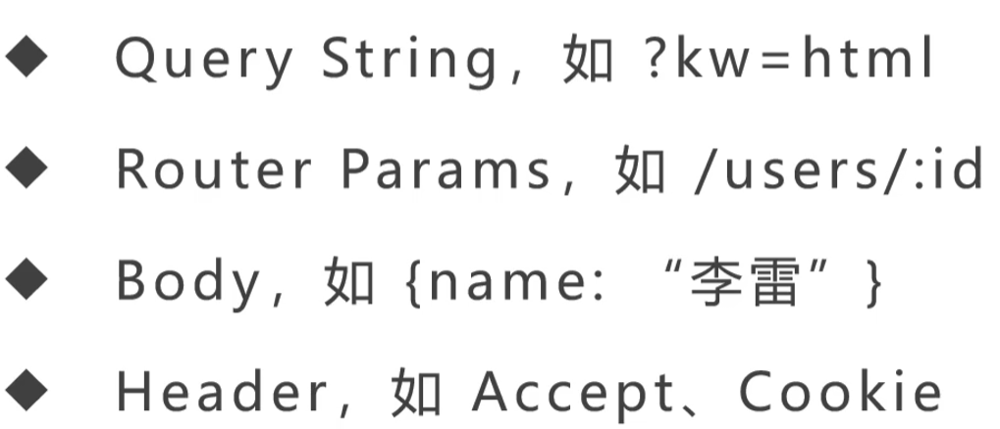
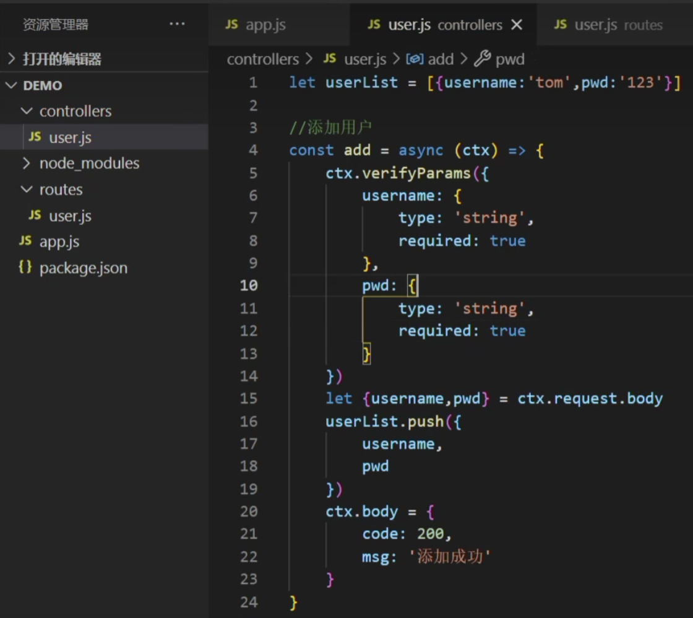

https://www.bilibili.com/video/BV1v5411T7Ez/?spm_id_from=333.337.search-card.all.click&vd_source=a7089a0e007e4167b4a61ef53acc6f7e

# 1.课程介绍


# 2.Node.js是什么

https://nodejs.org/en/learn/getting-started/introduction-to-nodejs

- Node.js 是一个开源、跨平台的 JavaScript 运行时环境
- Node.js 在浏览器外部运行 V8 JavaScript 引擎，这是 Google Chrome 的核心。这使得 Node.js 具有非常高的性能
- **NodeJS并不是一门语言，而是一个Javascript运行时**
- **在传统的前端开发中，Javascript只能运行在浏览器上面，如果想要让Javascript和其他的编程语言一样，那就需要为Javascript提供一个运行环境，就类似于JRE为Java语言提供了一个运行环境一样，NodeJs为Javascript提供了一个运行时环境**


NodeJS的特性：

- 非阻塞IO模型
  - input + output = IO
  - 常见IO设备：显示器，打印机
  - IO操作：数据库的读写，磁盘的读写，网络的传输
  - 阻塞IO：指在进行IO操作时，进程处于一种休眠的状态，等待IO完成后再进入下一次的操作
  - NodeJs使用了非阻塞IO模型之后，必然会导致另外一个问题：就是IO操作结束后，是如何通知主进程的
- 事件驱动

# 3.Node.js到底好在哪里？

- ==Node在处理高并发方面有独特的优势==
- Node是单线程
  - 因为node基于javascript语言，js在设计之初就是运行了一个简单的脚本，不希望它占用很多系统资源，所以就设计成了单线程，因为js引擎的关系，node默认是单线程的
  - 一个NodeJs的应用，无法利用多核资源
  - NodeJs采用的是事件驱动和异步IO的方式，实现了一个单线程高并发的运行环境
  - 单线程意味着同一时间只能做一件事情
  - ==NodeJS其实只是关于’JS的部分‘执行是单线程的，IO操作显然是由其他线程来完成的==
  - JS执行线程是单线程的，把需要做的IO交给底层来完成，自己马上返回去做别的事情，然后底层在指定的时通过事件驱动进行回调就可以了
  - node会先通过**node-bindings**调用c++代码，然后通过c++代码封装一个叫请求对象（包括需要执行的功能）的东西，交给底层去处理
- 一个异步IO的大致流程：
  - 用户通过JS代码，调用Node核心模块，将参数和回调函数传入到核心模块中，node核心模块会将传入的参数和回调函数封装成一个请求对象，然后将这个请求对象推入到==IO线程池==中等待执行，此时javascript发起的异步调用结束，javascript的线程呢还会继续进行后续的操作
  - 当IO操作完成后，会取出之前封装在请求对象中的回调函数，执行这个回调函数，告诉JS主线程执行的结果
- Node的另一个功能：本地代码的构建
  - webpack是用Node写的


- Node在处理高并发方面与Java相比有哪些独特的优势？
- 

# 4.Node.js的安装

# 5.编写第一个Node.js程序


# 6.npm

npm怎么查看全局安装了哪些包？

- 使用**npm root -g查看全局包安装路径**
- npm 查看全局安装过的包命令：`npm list -g --depth 0`

| 命令      |       解释       |
| --------- | :--------------: |
| npm list  |  显示安装过的包  |
| -g        | 指全局安装过的包 |
| --depth 0 | 限制输出模块层级 |

# 7.nodemon 热部署

https://www.bilibili.com/video/BV1v5411T7Ez?p=7&vd_source=a7089a0e007e4167b4a61ef53acc6f7e

```json
node index.js
--->
// 安装nodemon 因为nodemon需要在全局使用，所以进行全局安装
cnpm i -g nodemon
// 使用nodemon
nodemon index.js
```

# 8.Node中的模块化

https://www.bilibili.com/video/BV1v5411T7Ez?p=8&spm_id_from=pageDriver&vd_source=a7089a0e007e4167b4a61ef53acc6f7e

向外抛出：module.exports = xxx具体的方法名

引入：require('文件的相对路径')

# 9.系统模块

Node中的三大模块：

- 全局模块：随时随地都可以访问，不需要引入
- 核心模块：不需要单独下载，可以直接使用require()引入的模块
  - path模块
  - fs模块
  - http模块
- 自定义模块：自己封装的模块，可以直接使用require()引入的模块

# [10. path模块](https://www.bilibili.com/video/BV1v5411T7Ez?p=10&vd_source=a7089a0e007e4167b4a61ef53acc6f7e)

- 路径相关
  - 
- 文件相关
  - 
- 路径解析
  - 

## 10.1 path.resolve()

- 将路径或路径片段的序列解析为绝对路径

- 给定的路径序列从右到左处理，每个后续的 `path` 会被追加到前面，直到构建绝对路径。例如，给定路径段的顺序：`/foo`、`/bar`、`baz`，调用 `path.resolve('/foo', '/bar', 'baz')` 将返回 `/bar/baz`，因为 `'baz'` 不是绝对路径，但 `'/bar' + '/' + 'baz'` 是。

- 如果在处理完所有给定的 `path` 片段之后，还没有生成绝对路径，则使用当前工作目录。

- 生成的路径被规范化，并删除尾部斜杠（除非路径解析为根目录）。

- 零长度的 `path` 片段被忽略。

- 如果没有传入 `path` 片段，则 `path.resolve()` 将返回当前工作目录的绝对路径。

- ```javascript
  path.resolve('/foo/bar', './baz');
  // Returns: '/foo/bar/baz'
  
  path.resolve('/foo/bar', '/tmp/file/');
  // Returns: '/tmp/file'
  
  path.resolve('wwwroot', 'static_files/png/', '../gif/image.gif');
  // If the current working directory is /home/myself/node,
  // this returns '/home/myself/node/wwwroot/static_files/gif/image.gif' 
  ```

## 10.2 path.dirname()

返回 `path` 的目录名

```javascript
path.dirname('/foo/bar/baz/asdf/quux');
// Returns: '/foo/bar/baz/asdf' 
```

# 11. fs模块 文件系统


# 12. buffer模块

# 13. events模块

# 14. http模块

# 15. get请求

# 16. post请求

# 17. Koa简介

- Koa2是NodeJs Web Server框架
- 通过async/await语法高效编写Web Server
- 中间件机制，能合理拆分业务代码

# 18.安装Koa

- 初始化：
  - mkdir koa-app
  - cd koa-app
  - npm init -y

- 安装：npm install koa --save
  - ==--save: 代表生产环境安装==
  - 简写：cnpm i koa -S


- npm init -y和npm init有什么区别？
  - npm init -y会直接生成package.json文件
  - npm init 会逐步询问，然后生成package.json文件

# 19.使用脚手架搭建Koa应用程序

https://www.bilibili.com/video/BV1v5411T7Ez?p=19&spm_id_from=pageDriver&vd_source=a7089a0e007e4167b4a61ef53acc6f7e

```
npm i -g koa-generator
koa2 --version
koa2 myApp
```

# 20.路由简介

- 路由：决定了不同URL是如何被不同的执行的
- 在Koa中，路由的本质是中间件


- 如果没有路由，会怎么样
  - 所有请求都做了相同的事情
  - 所有请求都会返回相同的结果
- 路由存在的意义
  - 处理不同的URL
  - 处理不同的http方法
  - 解析URL上的参数

# 21.Koa中间件 middleware

- 如何理解Koa中间件？

  - 在Koa中，中间件（middleware）是一个在请求与响应之间运行的函数。它们可以对请求进行处理、修改响应，甚至可以决定是否将请求传递给下一个中间件。Koa的中间件机制使得它的扩展性和灵活性非常强大

- 为什么叫中间件？

  - "中间件"这个名字来源于它们在请求处理过程中的位置。一个HTTP请求从客户端到服务器，再到响应返回给客户端，中间件就像一个个“中间”环节，它们可以在这些环节之间进行处理操作

-  Koa中间件的特性

  - **洋葱模型（Onion Model）**：Koa的中间件机制是基于“洋葱模型”的。每个中间件函数都会在控制权传递给下一个中间件之前执行一些操作（如日志记录、认证），然后调用`await next()`将控制权交给下一个中间件。处理完成后，控制权会返回到当前中间件，继续执行后续操作
  - **异步函数**：Koa使用现代的async/await语法，这使得编写异步中间件变得非常简洁和清晰

- 中间件示例

  - ```javascript
    const Koa = require('koa');
    const app = new Koa();
    
    // 第一个中间件：日志记录
    // 它在处理请求前记录开始时间，然后调用`await next()`将控制权传递给下一个中间件。请求处理完成后，它计算处理时间并记录日志。
    app.use(async (ctx, next) => {
      const start = Date.now();
      await next();
      const ms = Date.now() - start;
      console.log(`${ctx.method} ${ctx.url} - ${ms}ms`);
    });
    
    // 第二个中间件：处理响应
    app.use(async (ctx, next) => {
      ctx.body = 'Hello Koa';
      await next();
    });
    
    // 第三个中间件：修改响应
    app.use(async (ctx, next) => {
      ctx.body += ' with Middleware';
      await next();
    });
    
    // 启动服务器
    app.listen(3000, () => {
      console.log('Server running on http://localhost:3000');
    });
    ```

- 总结：==Koa的中间件提供了灵活且强大的请求处理机制，通过洋葱模型和异步函数，你可以轻松地控制请求的流转和处理过程==。这也是为什么Koa在Web开发中具有广泛应用的原因之一

- 

- Koa中间件常见面试题

  - **Koa 与 Express 的中间件有什么不同？**
    -  \- Koa 的中间件基于 `async/await` 和 ES6 Generator，而 Express 的中间件基于回调函数。这使得 Koa 中间件在处理异步操作时更加直观和简洁。Koa 中没有内置的中间件，所有的功能都需要通过第三方中间件实现，而 Express 提供了很多内置的中间件


# 22.自己编写一个Koa路由中间件


# 23.使用koa-router实现路由

```javascript
const Router = require('koa-router');
const router = new Router();

// 路由定义
router.get('/', (ctx, next) => {
    ctx.body = 'Hello Koa!';
});

router.post('/data', (ctx, next) => {
    ctx.body = {
      message: 'Data received',
      data: ctx.request.body, // ctx.request.body是啥？
    };
});
module.exports = router;
```

# 24.RESTful是什么

# 25.RESTful统一接口的限制

# 26.RESTful API简介

# 27.RESTful API设计最佳实践

# 28.控制器简介

https://www.bilibili.com/video/BV1v5411T7Ez?p=28&spm_id_from=pageDriver&vd_source=a7089a0e007e4167b4a61ef53acc6f7e

- 什么是控制器
  - 拿到路由分配的任务，并执行
- 为什么要使用控制器
  - 获取http请求参数
    - 
  - 处理业务逻辑
  - 发送http响应
    - 


# 29.获取http请求参数

https://www.bilibili.com/video/BV1v5411T7Ez/?p=29&spm_id_from=pageDriver&vd_source=a7089a0e007e4167b4a61ef53acc6f7e

# 30.发送http响应

https://www.bilibili.com/video/BV1v5411T7Ez?p=30&vd_source=a7089a0e007e4167b4a61ef53acc6f7e


# 31.错误处理简介

https://www.bilibili.com/video/BV1v5411T7Ez?p=31&spm_id_from=pageDriver&vd_source=a7089a0e007e4167b4a61ef53acc6f7e

# 32.Koa自带的错误处理机制

https://www.bilibili.com/video/BV1v5411T7Ez/?p=32&spm_id_from=pageDriver&vd_source=a7089a0e007e4167b4a61ef53acc6f7e


# 33.自己编写一个错误处理中间件

https://www.bilibili.com/video/BV1v5411T7Ez/?p=33&spm_id_from=pageDriver&vd_source=a7089a0e007e4167b4a61ef53acc6f7e


# [34.使用koa-json-error处理错误](https://www.bilibili.com/video/BV1v5411T7Ez/?p=34&spm_id_from=pageDriver&vd_source=a7089a0e007e4167b4a61ef53acc6f7e)

```
cnpm i koa-json-error --save // 安装
```


# [35.使用koa-parameter校验参数](https://www.bilibili.com/video/BV1v5411T7Ez/?p=35&spm_id_from=pageDriver&vd_source=a7089a0e007e4167b4a61ef53acc6f7e)

```
cnpm i koa-parameter --save // 安装
```




# [36.NoSQL数据库介绍](https://www.bilibili.com/video/BV1v5411T7Ez?p=36&vd_source=a7089a0e007e4167b4a61ef53acc6f7e)

- NoSQL：
- 
- 

# [37.MongoDB介绍与安装](https://www.bilibili.com/video/BV1v5411T7Ez?p=37&vd_source=a7089a0e007e4167b4a61ef53acc6f7e)


## 为什么要用MongoDB


## MongoDB下载

https://www.mongodb.com/download-center/community

下载4.4.29版本 

下载过高版本会有问题

## 相关命令

```
mongo
show dbs
```

# [38.MongoDBCompass让数据清晰可见](https://www.bilibili.com/video/BV1v5411T7Ez?p=38&vd_source=a7089a0e007e4167b4a61ef53acc6f7e)

# [39.使用mongoose连接数据库](https://www.bilibili.com/video/BV1v5411T7Ez?p=39&spm_id_from=pageDriver&vd_source=a7089a0e007e4167b4a61ef53acc6f7e)

```
cnpm i mongoose --save
```

# [40.设计用户模块的schema](https://www.bilibili.com/video/BV1v5411T7Ez?p=40&spm_id_from=pageDriver&vd_source=a7089a0e007e4167b4a61ef53acc6f7e)

```javascript
const mongoose = require("mongoose");
const Schema = mongoose.Schema;

// 系统用户模型对象
const userSchema = new Schema({
    username: String,
    pwd: String,
});

// 对应数据库里面的集合
const User = mongoose.model("users", userSchema);

module.exports = {
    User,
};
```

# [41.用mongoDB实现用户的增删改查](https://www.bilibili.com/video/BV1v5411T7Ez/?p=41&spm_id_from=pageDriver&vd_source=a7089a0e007e4167b4a61ef53acc6f7e)

```javascript
const router = require('koa-router')()
const { User } = require('../models')
router.prefix('/users')

// 添加系统用户
router.post('/add', async (ctx) => {
  // let { username, pwd } = ctx.request.query;
  // post请求不能用query接收参数，要用body接收参数
  let { username, pwd } = ctx.request.body;
  // User.create是一个异步的操作
  // 注意：不加await的话，请求会出现Not Found的结果
  await User.create({ username, pwd }).then(rel => {
    if (rel) {
      ctx.body = {
        code: 200,
        msg: '添加成功',
        data: rel
      }
    } else {
      ctx.body = {
        code: 300,
        msg: '添加失败',
      }
    }
  }).catch(err => {
    ctx.body = {
      code: 400,
      msg: '添加时出现异常',
    }
    console.log(err)
  })
})

// 修改系统用户
router.post('/update', async (ctx) => {
  let params = ctx.request.body;
  await User.updateOne({
    _id: params._id
  }, {
    username: params.username,
    pwd: params.pwd
  }).then(rel => {
    ctx.body = {
      result: rel
    }
  }).catch(err => {
    ctx.body = {
      code: 400,
      msg: '修改时出现异常',
    }
  })
})

// 删除系统用户
router.post('/del', async (ctx) => {
  let { _id } = ctx.request.body;
  await User.findOneAndDelete({ _id }).then(rel => {
    ctx.body = {
      result: rel
    }
  }).catch(err => {
    ctx.body = {
      code: 400,
      msg: '删除时出现异常',
    }
    console.log(err)
  })
})

// 查询所有系统用户
router.get('/find', async (ctx) => {
  await User.find().then(rel => {
    ctx.body = {
      result: rel
    }
  }).catch(err => {
    ctx.body = {
      code: 400,
      msg: '查询时出现异常',
    }
    console.log(err)
  })
})

// 查询单个系统用户
router.get('/find:id', async (ctx) => {
  await User.findOne({
    _id: ctx.params.id
  }).then(rel => {
    ctx.body = {
      result: rel
    }
  }).catch(err => {
    ctx.body = {
      code: 400,
      msg: '查询时出现异常',
    }
    console.log(err)
  })
})

module.exports = router

```

# [42.封装业务逻辑层](https://www.bilibili.com/video/BV1v5411T7Ez/?p=43&spm_id_from=pageDriver&vd_source=a7089a0e007e4167b4a61ef53acc6f7e)

增加controller业务逻辑层，主要是为了简化routes层

```javascript
// Koa\jianshu\controller\user.js
const { User } = require('../models')

// 添加系统用户
const userAdd = async (ctx) => {
    // let { username, pwd } = ctx.request.query;
    // post请求不能用query接收参数，要用body接收参数
    // User.create是一个异步的操作
    // 注意：不加await的话，请求会出现Not Found的结果
    let { username, pwd } = ctx.request.body;
    await User.create({ username, pwd }).then(rel => {
        if (rel) {
            ctx.body = {
                code: 200,
                msg: '添加成功',
                data: rel
            }
        } else {
            ctx.body = {
                code: 300,
                msg: '添加失败',
            }
        }
    }).catch(err => {
        ctx.body = {
            code: 400,
            msg: '添加时出现异常',
        }
        console.log(err)
    })
}

// 修改系统用户
const userUpdate = async (ctx) => {
    let params = ctx.request.body;
    await User.updateOne({
        _id: params._id
    }, {
        username: params.username,
        pwd: params.pwd
    }).then(rel => {
        ctx.body = {
            result: rel
        }
    }).catch(err => {
        ctx.body = {
            code: 400,
            msg: '修改时出现异常',
        }
    })
}

// 删除系统用户
const userDel = async (ctx) => {
    let { _id } = ctx.request.body;
    await User.findOneAndDelete({ _id }).then(rel => {
        ctx.body = {
            result: rel
        }
    }).catch(err => {
        ctx.body = {
            code: 400,
            msg: '删除时出现异常',
        }
        console.log(err)
    })
}

// 查询所有系统用户
const userFind = async (ctx) => {
    await User.find().then(rel => {
        ctx.body = {
            result: rel
        }
    }).catch(err => {
        ctx.body = {
            code: 400,
            msg: '查询时出现异常',
        }
        console.log(err)
    })
}

// 查询单个系统用户
const userFindOne = async (ctx) => {
    await User.findOne({
        _id: ctx.params.id
    }).then(rel => {
        ctx.body = {
            result: rel
        }
    }).catch(err => {
        ctx.body = {
            code: 400,
            msg: '查询时出现异常',
        }
        console.log(err)
    })
}

module.exports = {
    userAdd,
    userUpdate,
    userDel,
    userFind,
    userFindOne
}
```

```javascript
// Koa\jianshu\routes\users.js
const router = require('koa-router')()
const UserController = require('../controller/user')
router.prefix('/users')

// 添加系统用户
router.post('/add', UserController.userAdd)

// 修改系统用户
router.post('/update', UserController.userUpdate)

// 删除系统用户
router.post('/del', UserController.userDel)

// 查询所有系统用户
router.get('/find', UserController.userFind)

// 查询单个系统用户
router.get('/find:id', UserController.userFindOne)

module.exports = router
```

# [43.封装CRUD的方法](https://www.bilibili.com/video/BV1v5411T7Ez/?p=43&spm_id_from=pageDriver&vd_source=a7089a0e007e4167b4a61ef53acc6f7e)

- create
- read 读取
- update
- delete

# 44.使用Vue Cli创建Vue.js项目

# 45.配置Element UI组件库

# [46.使用axios发送异步请求](https://www.bilibili.com/video/BV1v5411T7Ez/?p=46&spm_id_from=pageDriver&vd_source=a7089a0e007e4167b4a61ef53acc6f7e)


# 47.axios的进一步封装

# 48.规划前端的目录结构

# 49.后台系统界面设计

# 50.前端路由设计

# 51.什么是JWT

# 52.在Koa框架中使用JWT

# 53.后台系统的登录界面设计

# 54.系统用户登录接口设计

# 55.使用koa-jwt中间件

# 56.用户登录验证的接口设计

# 57.修改密码接口设计

# 58.使用Koa-multer模块实现上传

# 59.生成图片链接地址

# 60.ElementUI上传组件的使用

# 61.图片上传成功的缩略图

# 62.个人资料的接口设计

# 63.个人资料的界面设计

# 64.完善修改个人资料的功能

# 65.发布文章的接口设计

# 66.分页查询所有文章的接口设计

# 67.修改文章的接口设计

# 68.删除文章的接口设计

# 69.统计文章阅读量的接口设计

# 70.发布文章的页面设计

# 71.文章列表页面设计

# 72.编辑文章页面设计

# 73.文章评论的接口设计

# 74.前台查询评论的接口设计

# 75.后台评论查询的接口设计

# 76.后台查询的页面设计

# 77.关注作者的接口设计

# 78.粉丝取关的接口设计

# 79.查询粉丝的接口设计

# 80.粉丝列表页面设计

# 81.选购域名与服务器

# 82.增强服务器安全等级

# 83.搭建生产环境

# 84.部署项目发布上线

# 85.总结与回顾

