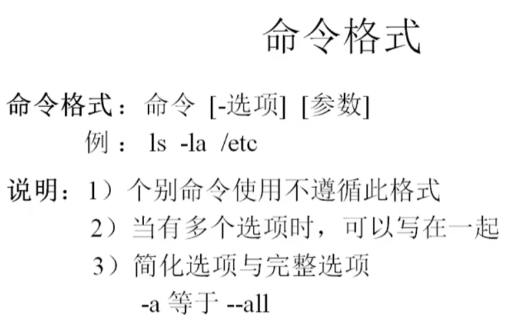
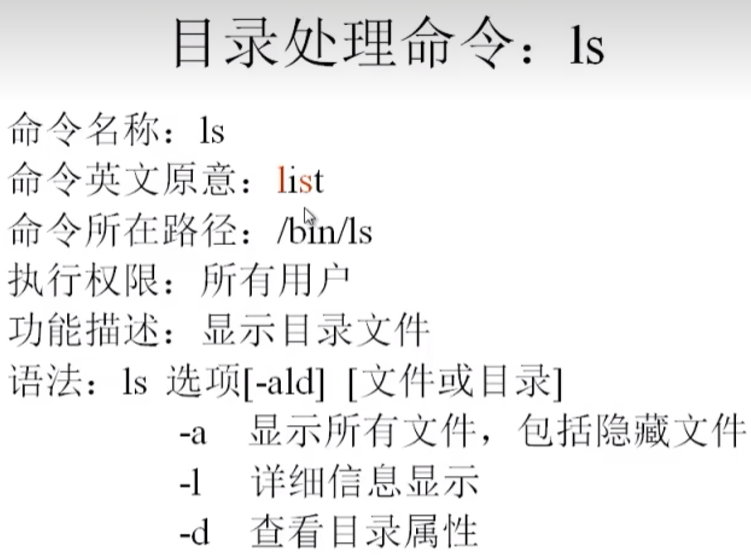
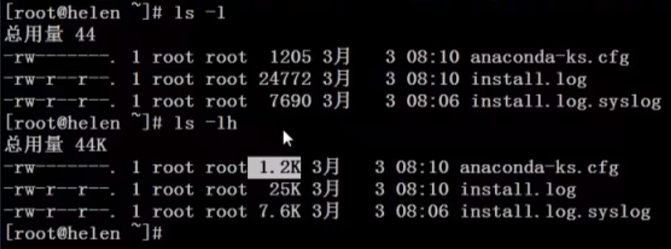
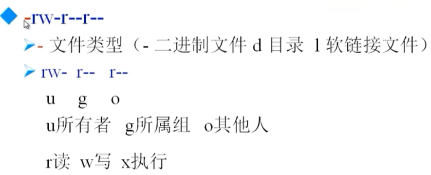

# 4.1 文件处理命令

## [4.1.1 命令格式与目录处理命令ls](https://www.bilibili.com/video/BV1mW411i7Qf?spm_id_from=333.788.videopod.episodes&vd_source=a7089a0e007e4167b4a61ef53acc6f7e&p=12)

|  |  |
| ------------------------------------------------------------ | ------------------------------------------------------------ |
|  |  |
|                                                              | read write excute                                            |

## [4.1.2 目录处理命令](https://www.bilibili.com/video/BV1mW411i7Qf?spm_id_from=333.788.player.switch&vd_source=a7089a0e007e4167b4a61ef53acc6f7e&p=13)

## 4.1.3 文件处理命令

## 4.1.4 链接命令

# 4.2 权限管理命令

# 4.3 文件搜索命令

# 4.4 帮助命令

# 4.5 用户命令管理

# 4.6 压缩解压命令

# 4.7 网络命令

# 4.8 关机重启命令

## 