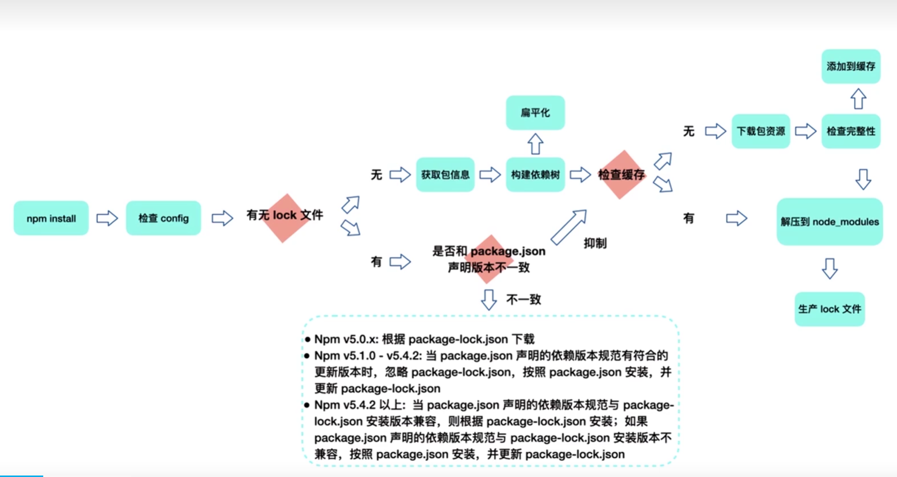
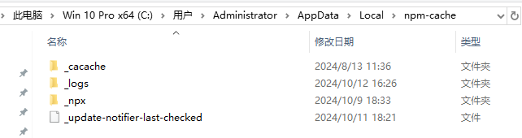
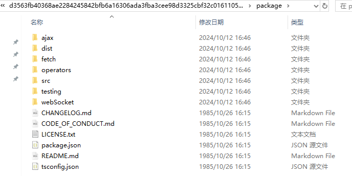

# 1. [npm安装机制及企业级部署私服原理](https://www.bilibili.com/video/BV1rP411f7Wn?p=2&spm_id_from=pageDriver&vd_source=a7089a0e007e4167b4a61ef53acc6f7e)



注意npm不同版本的不同处理情况

同一个项目团队，应保证npm版本的一致

# 1. npm缓存机制

对于一个依赖包的同一版本进行本地化缓存是当代依赖包管理工具的一个常见设计

```shell
npm config get cache
# 它会显示当前 npm 缓存所在的目录
```

`C:\Users\Administrator\AppData\Local\npm-cache`

`npm-cache`目录结构：



```bash
npm cache clean --force
# 清除_cacache中的文件
```

`_cacache`目录结构：


- content-v2：二进制文件
  - 要使二进制文件可读，需将文件后缀改成`tgz`，然后进行解压。得到的结果是npm包资源
  - `.tgz`是`tar.gz`的缩写，表示一个`tar`压缩包，使用`gzip`进行了压缩
- index-v5：content-v2里文件索引
- tmp


`content-v2`解压后得到的结果如下：




- 当npm install执行时，通过[Pacote](#7.-Pacote库)把相应的包解压在对应的node_modules下面
  - npm在下载依赖时，先下载到缓存当中，再解压到项目中的node_modules下
- Pacote依赖[npm-registry-fetch](#8.-npm-registry-fetch库)来下载包，npm-registry-fetch可以通过设置cache属性，在给定的路径下根据[IETF RFC 7234](#9.-IETF-RFC-7234)生成缓存数据
- 在每次安装资源时，[npm根据package-lock.json中存储的integrity，version，name信息生成一个唯一的key](#10.-npm根据package-lock.json中存储的integrity，version，name信息生成一个唯一的key)。这个key能对应到`index-v5`目录下的缓存记录。如果发现有缓存资源，就会找到tar包的hash，再次通过Pacote把对应的二进制文件解压到相应的项目node_modules下面


# 2. 删除node_modules和lockfiles，再重新install，这样操作是否存在风险

删除 `node_modules` 和 lockfiles（如 `package-lock.json` 或 `yarn.lock`）并重新安装依赖是解决依赖问题或修复奇怪错误的常见做法，但确实存在一些潜在风险。以下是这种操作可能带来的风险及其影响：

### 潜在风险

#### 1. **依赖版本的变更**
   - **风险**：如果删除了 lockfiles，重新安装时 `npm` 或 `yarn` 会根据 `package.json` 中的版本范围解析最新版本的依赖，而不是之前具体锁定的版本。使用符号如 `^` 或 `~` 时，会导致安装不同版本的依赖包。
   - **影响**：某些库的新版本可能会引入不兼容的更改或 bug，导致项目无法正常工作。

#### 2. **子依赖（transitive dependencies）的变化**
   - **风险**：子依赖包的版本也是通过 lockfile 锁定的。如果删除了 lockfile，这些子依赖会重新解析，可能会发生变化，导致子依赖版本不一致。
   - **影响**：项目的功能或行为可能会受到子依赖版本变化的影响，尤其是在依赖链很长时。

#### 3. **开发环境的一致性问题**
   - **风险**：不同开发者或 CI 环境如果没有 lockfile，会安装不同版本的依赖，从而导致不同环境下的依赖包不一致。
   - **影响**：代码在不同环境下运行可能产生不一致的结果，导致难以复现的错误。

#### 4. **耗时操作**
   - **风险**：删除 `node_modules` 和 lockfiles 后重新安装依赖，尤其是对于大型项目，会花费较多时间。
   - **影响**：安装依赖过程较慢，影响开发效率，特别是在频繁进行此操作时。

### 解决方案和风险缓解

#### 1. **保留 lockfiles**
   保留 lockfiles 只是删除 `node_modules` 目录。这种方式会根据 lockfiles 中锁定的版本重新安装依赖，避免版本变化的风险。

   ```bash
   rm -rf node_modules
   npm install # 或 yarn install
   ```

### 总结
删除 `node_modules` 并重新安装依赖通常是解决依赖问题的有效方式，但删除 lockfiles 可能导致依赖版本变化，从而引发不兼容问题或 bug。如果没有特别的原因，不建议轻易删除 lockfiles。保留 lockfiles 重新安装依赖是更安全的做法。

# 3. 把所有依赖都安装到dependencies，不区分devDependencies会有问题吗

将所有依赖都安装到 `dependencies` 而不区分 `devDependencies`，在某些情况下可能会导致以下问题：

### 1. **生产环境安装不必要的包**

- **风险**：`dependencies` 中的所有包在生产环境中都会被安装。如果把开发工具、测试框架等放入 `dependencies`，这些包也会在生产环境安装。
  
- **影响**：
  - **资源浪费**：生产环境不需要这些工具，但会浪费磁盘空间、带宽、安装时间。
  - **性能影响**：某些开发依赖会增加系统的开销，导致运行时性能下降。
  - **安全风险**：某些开发依赖可能带有安全漏洞，不应暴露在生产环境中。

### 2. **部署复杂性增加**

- **风险**：开发依赖有时可能要求额外的系统权限或库（如构建工具），如果这些依赖不区分放入 `dependencies`，生产环境可能需要安装额外的工具或处理复杂的依赖问题。

- **影响**：
  - **镜像臃肿**：部署时的 Docker 镜像、服务器体积会增大，带来不必要的复杂性。
  - **安装时间增加**：安装开发工具需要更多时间和资源，使得部署流程变得冗长。

### 3. **违反最佳实践**

- **风险**：`npm` 和 `yarn` 等工具提供 `devDependencies` 的原因是为了优化不同环境下的依赖管理。如果不区分依赖类型，会破坏工具的这些优化机制。

- **影响**：
  - **优化失效**：工具如 `npm install --production` 或 `yarn install --production` 会跳过 `devDependencies`，从而加快生产环境的安装过程。所有依赖都放在 `dependencies` 后，这种优化将无法生效。

### 4. **维护和团队协作困难**

- **风险**：开发者在阅读项目时无法快速区分哪些是开发依赖，哪些是生产依赖，影响代码维护。

- **影响**：
  - **降低可读性**：`devDependencies` 让团队清楚哪些工具只在开发过程中使用，删除这层区分可能导致混乱。
  - **调试复杂性**：开发者在解决依赖问题时需要处理更大的依赖树，增加了调试难度。

### 建议

- **开发工具、测试工具放在 `devDependencies` 中**：如 `eslint`、`webpack`、`jest` 这些工具只在开发时使用，应该放在 `devDependencies`
- **生产依赖放在 `dependencies` 中**：生产环境所需的库（如 React、Express、数据库驱动等）应该放在 `dependencies` 中。

### 总结
将所有依赖放在 `dependencies` 中可能导致生产环境的安装包冗余、部署复杂性增加、性能下降和安全隐患等问题。建议合理区分 `dependencies` 和 `devDependencies`，遵循最佳实践。

# 4. 应用依赖了公共库A和公共库B，同时公共库A也依赖了公共库B，那么公共库B会被多次安装或重复打包吗

在现代的包管理工具（如 `npm`、`yarn`）中，如果应用依赖了公共库 A 和公共库 B，同时公共库 A 也依赖了公共库 B，通常情况下 **公共库 B 不会被多次安装或重复打包**。这是因为包管理工具会通过**依赖树的优化**机制来避免重复安装相同的依赖包。

### 具体原理分析

1. **依赖树优化**：
   当你使用 `npm` 或 `yarn` 安装依赖时，包管理工具会根据你的 `package.json` 文件解析依赖树，并且会尽量将相同版本的依赖合并，放置在最顶层的 `node_modules` 目录中。也就是说，假如应用和库 A 都依赖库 B 的同一个版本，包管理工具会将库 B 安装到顶层 `node_modules`，使得库 A 和你的应用共用这一个库 B。

   - **示例**：
     - 应用依赖：
       ```json
       {
         "dependencies": {
           "A": "^1.0.0",
           "B": "^1.0.0"
         }
       }
       ```
     - 假设库 A 的 `package.json` 也依赖库 B 版本 `^1.0.0`，那么 `npm` 或 `yarn` 会将库 B 安装在应用的顶层 `node_modules` 中，而不会多次安装。

2. **不同版本的情况**：
   如果应用依赖的库 B 和库 A 依赖的库 B 是**不同版本**，包管理工具则会根据版本的差异分别安装不同的版本。例如：
   
   - 应用依赖库 B 版本 `1.0.0`，但库 A 依赖的是库 B 版本 `2.0.0`。
   - 在这种情况下，`npm` 或 `yarn` 会将库 B 1.0.0 安装在顶层 `node_modules` 中，同时会在库 A 的 `node_modules` 目录下再安装库 B 的 2.0.0 版本。

   - **依赖结构示例**：
     ```
     node_modules/
     ├── A/
     │   └── node_modules/
     │       └── B@2.0.0
     └── B@1.0.0
     ```

### 打包时的处理

打包工具（如 Webpack、Rollup）也会进行类似的依赖处理：

1. **依赖去重**：大多数打包工具会检测依赖树中的重复包，并且只打包一次相同版本的依赖。这样能够避免重复打包同一个库，减少打包文件的大小。
   
2. **不同版本的依赖**：如果依赖树中存在不同版本的库（如上面提到的库 B 1.0.0 和 2.0.0），打包工具会将这些版本分别打包进去，因为它们在运行时是不同的。

### 总结

- **相同版本的依赖**：只会安装或打包一次。
- **不同版本的依赖**：会根据版本差异分别安装或打包，避免冲突。
  

因此，公共库 B **不会被多次安装或重复打包**，除非它的不同版本被不同的依赖库要求。包管理工具和打包工具会自动优化依赖树，确保项目的依赖不会冗余。

# 5. 一个项目中，既有人用npm，也有人用Yarn，这会引发什么问题？

在一个项目中，既有人使用 `npm`，也有人使用 `Yarn` 来管理依赖，可能会引发以下问题：

### 1. **`lock` 文件冲突**

- **问题描述**：
  `npm` 和 `Yarn` 都使用各自的锁定文件来确保依赖版本的稳定性：
  - `npm` 生成 `package-lock.json` 文件。
  - `Yarn` 生成 `yarn.lock` 文件。

  如果团队中有人使用 `npm`，有人使用 `Yarn`，两者会各自生成或更新自己的锁定文件。这个过程中，可能导致版本控制系统（如 Git）中锁定文件的冲突问题。

- **影响**：
  - 版本锁定不一致：项目的依赖版本无法统一，导致开发环境和生产环境可能安装不同版本的依赖。
  - 锁定文件更新冲突：每次提交代码时，开发人员可能会发现锁定文件被不断修改，导致频繁的冲突处理。

### 2. **依赖版本不一致**

- **问题描述**：
  即使 `npm` 和 `Yarn` 都会解析 `package.json` 中的依赖，但两者的依赖解析算法略有不同。因此，同一个 `package.json` 文件通过 `npm` 和 `Yarn` 安装依赖时，生成的 `node_modules` 可能略有不同。

- **影响**：
  - **开发一致性问题**：开发者使用不同的包管理工具时，可能会遇到依赖版本差异，导致某些人能够正常开发，而另一些人遇到依赖问题。
  - **构建和部署不一致**：如果开发和生产环境使用不同的包管理工具（例如开发时使用 `Yarn`，而生产环境使用 `npm`），可能会导致生产环境中依赖不一致，进而出现无法预料的错误。

### 3. **命令不一致**

- **问题描述**：
  `npm` 和 `Yarn` 的命令行工具有些命令是不完全一致的。例如：
  - `npm install` 对应 `yarn install`。
  - `npm ci` 没有直接对应的 `Yarn` 命令（虽然 `yarn install --frozen-lockfile` 能类似处理，但效果略有不同）。

- **影响**：
  - **沟通不便**：团队成员之间沟通时需要注意命令的不同，不同工具的使用者需要翻译对应命令。
  - **文档复杂性增加**：项目的开发文档中需要包含两套命令的用法，增加了维护难度。

### 4. **跨工具共享缓存问题**

- **问题描述**：
  `npm` 和 `Yarn` 各自管理自己的缓存文件（`npm` 使用 `~/.npm`，而 `Yarn` 使用 `~/.yarn`）。使用不同工具的开发者不会共享相同的缓存，因此每次安装依赖时可能会导致重复下载。

- **影响**：
  - **效率降低**：同样的依赖会被两次下载和缓存，浪费时间和网络资源。
  - **一致性问题**：由于缓存管理方式不同，可能在某些情况下导致依赖版本不一致。

### 5. **Yarn 和 npm 工作区的差异**

- **问题描述**：
  如果项目使用了工作区（`workspace`）特性，`npm` 和 `Yarn` 对工作区的支持有所不同。`npm` 从 v7 版本开始支持 `workspaces`，而 `Yarn` 的 `workspaces` 功能更成熟，但两者的行为和配置方式不完全一致。

- **影响**：
  - **工作区管理冲突**：如果团队成员混用这两种工具管理工作区，可能导致依赖解析问题，甚至打破工作区的依赖隔离。

### 6. **新增依赖时的差异**

- **问题描述**：
  添加依赖时，`npm` 和 `Yarn` 处理依赖的方式有所不同：
  - `npm` 通过 `npm install` 自动更新 `package-lock.json` 文件，并可能重新解析依赖树。
  - `Yarn` 在添加新依赖时会更新 `yarn.lock` 文件。

  如果一个开发者用 `npm` 安装了一个依赖，另一个开发者用 `Yarn` 来安装另一依赖，两个锁定文件可能会互相覆盖和冲突。

### 解决方案

为了避免这些问题，建议团队统一使用一个包管理工具。以下是几种解决方案：

1. **团队统一使用 `npm` 或 `Yarn`**：
   - 在项目的 `README` 文档中明确规定使用 `npm` 或 `Yarn` 作为依赖管理工具，并写清楚安装步骤。
   
2. **强制约束工具**：
   - **使用 `.npmrc` 或 `.yarnrc` 文件**：可以在项目中使用 `.npmrc` 或 `.yarnrc` 文件，强制指定使用的包管理工具。
   - **使用 `preinstall` 钩子**：在 `package.json` 中的 `scripts` 配置 `preinstall` 钩子，检测并提示使用正确的包管理工具。

   ```json
   "scripts": {
     "preinstall": "if [ -e yarn.lock ]; then echo 'Please use Yarn to install dependencies' && exit 1; fi"
   }
   ```

3. **删除一个锁定文件**：
   - 保留 `yarn.lock` 或 `package-lock.json` 中的一个，删除另一个，确保团队成员都使用相同的工具进行依赖管理。

### 总结

在一个项目中混用 `npm` 和 `Yarn` 可能导致锁定文件冲突、依赖版本不一致、部署不一致等问题。为了避免这些问题，最好在团队中统一使用一个包管理工具，并通过文档和自动化工具确保一致性。

# 6. 我们是否应该提交lockfiles文件到项目仓库呢

是的，**通常应该将 `lockfiles` 文件（如 `package-lock.json` 或 `yarn.lock`）提交到项目的版本控制系统中**。这是为了确保依赖的版本一致性，以及稳定的开发和生产环境。具体原因如下：

### 1. **版本一致性**

`lockfiles` 文件记录了依赖树的具体版本，包括直接依赖和所有子依赖的精确版本。即使 `package.json` 文件中声明了较宽泛的版本范围（如 `"^1.0.0"`），实际安装的版本可能不同，尤其是在不同时间或不同环境中执行安装时。

- **解决的问题**：如果没有 `lockfiles` 文件，不同开发者或 CI/CD 环境下安装的依赖版本可能会不一致，导致一些难以预料的 bug 或兼容性问题。

### 2. **确定性的安装**

`lockfiles` 文件能够确保在不同的机器上运行 `npm install` 或 `yarn install` 时，安装的依赖版本是完全一致的，而不仅仅是满足版本范围的最新版本。

- **解决的问题**：防止在不同环境中出现由于依赖版本差异而导致的运行问题，确保开发、测试和生产环境的一致性。

### 3. **加速依赖安装**

当提交了 `lockfiles` 文件后，`npm` 或 `yarn` 在安装依赖时，不需要再解析 `package.json` 中的版本范围并寻找最新匹配的版本。它们会直接按照 `lockfiles` 文件中的内容安装依赖。

- **解决的问题**：减少解析和下载的时间，加速依赖安装过程，特别是在 CI/CD 环境中可以显著提高构建速度。

### 4. **安全性修复**

一些依赖的子依赖可能在后续版本中被修复了安全漏洞。如果有 `lockfiles` 文件，你可以通过依赖升级工具（如 `npm audit fix` 或 `yarn upgrade`）在锁定文件中精准升级那些存在问题的依赖，而不需要冒险重新解析整个依赖树。

- **解决的问题**：锁定了版本的安全性修复可以更加可控，不会影响到不相关的依赖。

### 什么时候不需要提交 `lockfiles` 文件？

1. **库或框架开发**：
   对于那些需要被他人引用和使用的库或框架，`lockfiles` 通常不提交到仓库中。原因是库开发者应该允许用户选择使用自己的依赖版本，而不是强制依赖特定的版本。

   - **例子**：如果你在开发一个 npm 包或第三方库，最终用户会基于自己的项目 `package.json` 安装依赖，所以 `lockfiles` 对最终用户的环境无效。

2. **依赖版本敏感的项目**：
   如果项目的依赖管理策略是动态获取最新的依赖版本，并且对锁定具体版本没有特别要求，可以选择不提交锁定文件，但这种做法风险较高，尤其是对生产环境有稳定性要求的项目。

### 总结

在绝大多数情况下，特别是应用开发、团队协作项目和生产环境部署中，**提交 `lockfiles` 文件是最佳实践**，能够确保依赖版本的一致性、确定性以及安全性。同时，若项目是开发库或框架，则可以考虑不提交 `lockfiles`，以避免强制下游用户使用特定的依赖版本。

# 7. Pacote库

**Pacote** 是一个用于处理 `npm` 包的 Node.js 库，负责处理与 npm 包相关的多种操作。它在 `npm` 工具的内部被用作处理包的下载、提取和缓存等操作，属于 npm 的核心模块之一。

### Pacote 的核心功能：
1. **下载 npm 包**：Pacote 能够从 npm 注册表或者其他来源（例如 Git 仓库）下载包文件。
2. **提取 npm 包**：Pacote 支持从 `.tgz` 文件或者压缩的包中提取文件。
3. **包缓存**：Pacote 可以管理下载的包文件，并在本地进行缓存，这样可以减少重复下载和提升效率。
4. **验证包完整性**：Pacote 能验证包的完整性，通过检查包的哈希值或签名来确保文件没有损坏。
5. **支持多种来源**：Pacote 支持多种包来源，包括 npm 仓库、Git 仓库、文件系统等。

### Pacote 的典型使用场景：
- **npm CLI**：Pacote 是 `npm` 的内部库，负责处理 `npm install` 命令时的包下载和解压等任务。
- **包管理工具的底层库**：一些构建在 npm 之上的工具也可能依赖 Pacote 来处理包管理相关的操作。

### Pacote 和 npm 的关系：
Pacote 是 `npm` 包管理系统的一个重要组成部分，专门负责与包的获取、解压、验证等交互操作。它处理与网络、缓存、文件系统相关的任务，这些功能对于 npm 工具的高效运行至关重要。

### 如何使用 Pacote？
你可以在 Node.js 项目中直接使用 Pacote 库来下载或提取包：

```bash
npm install pacote
```

然后在代码中调用：

```javascript
const pacote = require('pacote');

// 下载并提取包
pacote.extract('lodash@latest', './output-folder').then(() => {
  console.log('包已成功提取');
});
```

### 总结：
Pacote 是 npm 包管理系统中的一个底层工具，负责包的下载、缓存和解压等操作。它确保了 npm 工具能够高效、可靠地处理包的获取和管理。

# 8. npm-registry-fetch库

**`npm-registry-fetch`** 是一个 Node.js 库，用于从 `npm` 注册表中获取包和相关信息。它是 `npm` 工具内部使用的模块之一，负责与 `npm` 注册表进行通信，并处理 HTTP 请求，来下载包、获取元数据等操作。

### `npm-registry-fetch` 的功能：
1. **从 npm 注册表获取包信息**：可以获取包的元数据，例如版本、依赖项等。
2. **处理包下载**：可以直接从 `npm` 注册表中下载包文件。
3. **处理认证和权限**：它能够处理认证信息（如 token、用户凭证）来访问私有 npm 仓库。
4. **处理缓存**：该库也具备缓存处理能力，优化请求速度，避免不必要的网络请求。
5. **自动管理 npm 配置**：它可以自动使用用户的 `.npmrc` 配置文件中的信息，如代理、缓存路径、注册表地址等。

### 典型使用场景：
- **npm CLI**：`npm-registry-fetch` 是 `npm` 命令行工具内部使用的库，用于与 `npm` 注册表进行交互，执行如 `npm install`、`npm info` 等操作时会用到它。
- **构建自定义包管理工具**：如果你需要自己编写工具来与 `npm` 注册表进行通信，可以使用 `npm-registry-fetch` 来发送请求、获取包信息等。

### 基本使用方式：
你可以在 Node.js 项目中直接使用它来与 npm 注册表交互：

1. 安装 `npm-registry-fetch`：
   ```bash
   npm install npm-registry-fetch
   ```

2. 在代码中使用：
   ```javascript
   const fetch = require('npm-registry-fetch');
   
   // 获取包的元数据
   fetch.json('/lodash').then(data => {
     console.log(data);
   });
   ```

3. 下载包文件：
   ```javascript
   fetch('lodash/-/lodash-4.17.21.tgz').then(res => {
     res.body.pipe(fs.createWriteStream('lodash.tgz'));
   });
   ```

### 支持的功能：
- **支持自定义请求**：你可以通过传递选项自定义请求头、认证、缓存等参数。
- **支持不同的响应格式**：可以返回 JSON 或者流式数据。
- **处理重定向和错误**：自动处理 HTTP 重定向、错误等场景。

### 常用选项：
- **auth**：用于传递认证信息（如 token）。
- **registry**：指定要请求的 npm 注册表 URL。
- **cache**：指定缓存目录，用于加快请求速度。
- **headers**：自定义 HTTP 请求头。

### 例子：
获取 `lodash` 包的元数据：
```javascript
const fetch = require('npm-registry-fetch');

fetch.json('/lodash').then(pkg => {
  console.log(pkg.name);    // lodash
  console.log(pkg.version); // 最新版本号
});
```

### 总结：
`npm-registry-fetch` 是一个强大的工具库，主要用于与 npm 注册表进行交互。它简化了从 npm 注册表获取包信息、下载包、处理认证和缓存的流程，是 npm CLI 的核心模块之一，也是开发自定义 npm 工具时的理想选择。

# 9. IETF RFC 7234

**IETF RFC 7234** 是一份名为 **"Hypertext Transfer Protocol (HTTP/1.1): Caching"** 的文档，它定义了 **HTTP/1.1** 协议中的缓存机制。该文档发布于 **2014年6月**，是互联网工程任务组（IETF）关于 **HTTP 缓存标准**的官方规定之一。

### RFC 7234 的核心内容：
RFC 7234 描述了 HTTP 缓存代理如何存储和重用响应，解释了缓存相关的 HTTP 标头（如 `Cache-Control`、`Expires`、`ETag` 等），并提供了如何实现缓存行为的详细规范。

### 主要内容：
1. **缓存概念**：
   - HTTP 缓存的目的是减少客户端和服务器之间的网络流量，提高响应速度。
   - 代理缓存、网关、浏览器缓存等角色可以通过缓存减少服务器负载和网络延迟。

2. **缓存标头**：
   - **Cache-Control**：用于指定缓存策略，支持多个指令，如 `no-cache`、`max-age`、`must-revalidate` 等。它是控制缓存行为的核心标头。
     - 示例：`Cache-Control: max-age=3600`（缓存 1 小时）
   - **Expires**：表示响应过期的时间点。
     - 示例：`Expires: Fri, 01 Jan 2025 00:00:00 GMT`（到期时间）
   - **ETag**：实体标签，用于比较服务器和客户端之间资源的版本是否一致。
     - 示例：`ETag: "abc123"`
   - **Last-Modified**：表示资源上次修改的时间，用于判断缓存是否过时。
     - 示例：`Last-Modified: Wed, 21 Oct 2020 07:28:00 GMT`

3. **缓存策略**：
   - **新鲜度**：RFC 7234 引入了“新鲜度”的概念，指缓存内容在一段时间内是否有效。通过 `Cache-Control` 的 `max-age` 指令或 `Expires` 标头来控制新鲜度。
   - **验证**：在缓存新鲜度过期后，缓存需要通过与源服务器通信来验证资源是否已经更新。
   - **私有与共享缓存**：标头 `Cache-Control: private` 表示缓存内容仅供特定用户使用，而 `public` 则表示可以共享。

4. **缓存的再验证**：
   - 当缓存过期或不确定是否更新时，缓存代理会使用 `ETag` 或 `Last-Modified` 来重新验证资源的状态，确保缓存内容是最新的。

5. **强制重新加载**：
   - 客户端可以通过发送 `Cache-Control: no-cache` 或 `Pragma: no-cache` 来强制绕过缓存，确保从服务器获取最新的资源。

### RFC 7234 的重要性：
- **性能提升**：合理配置缓存策略能够显著提升 Web 应用的性能，减少服务器负载和带宽消耗。
- **一致性和可靠性**：通过缓存验证机制，客户端可以在获取最新资源的同时，减少不必要的服务器请求。
- **控制缓存行为**：开发者可以通过 HTTP 标头精细控制不同类型缓存的行为，确保缓存内容在合适的时间失效或更新。

### 相关文档：
RFC 7234 是 **HTTP/1.1** 协议的缓存部分，与其他 RFC 文档（如 RFC 7230 至 7235）共同组成了 HTTP/1.1 的核心规范。

### 总结：
RFC 7234 规范了 HTTP 的缓存行为，定义了 HTTP 请求和响应中的缓存控制标头及其作用。它帮助开发者在设计和实现 HTTP 缓存时遵循统一的标准，从而提高应用的性能、降低延迟并减轻服务器负担。

# 10. npm根据package-lock.json中存储的integrity，version，name信息生成一个唯一的key

`npm` 会根据 `package-lock.json` 文件中的 `integrity`、`version` 和 `name` 信息生成唯一的 key，用于缓存管理时确保正确的包被缓存和提取。具体场景是在 **依赖包的下载和缓存过程** 中，`npm` 会利用这些信息来计算一个唯一的哈希值，以确保缓存的准确性和一致性。

### 生成唯一 key 的场景：
1. **依赖包的安装过程**：
   当你运行 `npm install` 时，`npm` 会读取 `package-lock.json` 中的 `integrity`（包的完整性哈希）、`version`（包的版本号）和 `name`（包的名称）信息，并基于这些字段生成一个唯一的缓存 key。
   
   - `integrity`：确保包文件的完整性，通常是 SHA-512 的哈希值。
   - `version`：确保使用的确切版本。
   - `name`：确保与正确的包名匹配。

   生成这个 key 后，`npm` 会检查缓存中是否已经存在该 key 对应的包。如果存在，它将直接从缓存中提取包文件，而不需要从远程仓库下载。

2. **依赖包的缓存机制**：
   `npm` 使用 **内容可寻址存储** 来管理缓存，即通过包内容生成唯一的 key。这意味着即使两个项目中使用相同的依赖包，只要它们的 `name`、`version` 和 `integrity` 相同，`npm` 就会使用相同的缓存条目，而不必重复下载包文件。

   **缓存 key 生成的依据**：
   - **name**：包的名称，如 `lodash`。
   - **version**：包的版本，如 `4.17.21`。
   - **integrity**：用来验证包的完整性，确保下载的包未被篡改。
   
   例如：
   ```json
   "dependencies": {
     "lodash": {
       "version": "4.17.21",
       "resolved": "https://registry.npmjs.org/lodash/-/lodash-4.17.21.tgz",
       "integrity": "sha512-v2kDEKFJw12345abc...",
       ...
     }
   }
   ```

3. **缓存的命中和校验**：
   当 `npm install` 运行时，它会计算这些字段的哈希值，生成一个唯一的 key，并使用该 key 查找缓存。如果缓存命中，并且 `integrity` 校验通过，`npm` 就会从缓存中读取包文件，否则它会从远程仓库重新下载该包并更新缓存。

4. **锁定依赖版本**：
   `package-lock.json` 文件中的 `version` 和 `integrity` 确保了项目的依赖是固定的，即使项目使用不同的环境或团队成员在不同机器上运行 `npm install`，也会安装相同的版本和文件内容。

### 总结：
当你执行 `npm install` 时，`npm` 会根据 `package-lock.json` 文件中的 `name`、`version` 和 `integrity` 信息生成一个唯一的缓存 key。这个 key 用于确保正确的包文件被下载、校验并存储在缓存中，从而提高安装速度并保证依赖的一致性。

# 11. package-lock.json文件是什么时候生成的

`package-lock.json` 文件是在你运行 `npm install` 命令时自动生成的。具体来说，它会在以下情况下创建或更新：

### 生成或更新时机：

1. **首次运行 `npm install`**：
   - 当你首次在一个项目中运行 `npm install`，并且项目根目录下没有 `package-lock.json` 文件时，`npm` 会创建一个新的 `package-lock.json` 文件。

2. **安装新依赖**：
   - 当你添加新依赖包（例如，通过 `npm install <package-name>` 命令）时，`npm` 会更新 `package-lock.json` 文件，以包括新添加的依赖及其版本信息。

3. **更新依赖**：
   - 当你更新现有依赖（例如，通过 `npm update <package-name>` 命令）时，`npm` 会相应地更新 `package-lock.json` 文件，以反映新版本的信息。

4. **直接修改 `package.json`**：
   - 如果你手动编辑 `package.json` 文件，添加或更改依赖项，并在接下来的 `npm install` 中运行时，`npm` 会检测到这些变化并更新 `package-lock.json` 文件。

5. **`npm ci` 命令**：
   - 运行 `npm ci` 命令时，`npm` 会使用 `package-lock.json` 文件的内容来安装依赖，并确保安装的依赖版本与锁文件中的版本完全一致。虽然这个命令不会生成 `package-lock.json`，但它会检查该文件的完整性。

### `package-lock.json` 的作用：
- **确保一致性**：通过锁定依赖版本，`package-lock.json` 确保在不同环境或不同开发者的机器上运行 `npm install` 时，安装的依赖版本一致。
- **加快安装速度**：锁文件提供了依赖树的完整信息，使得 `npm install` 可以更快地解析依赖，而不需要每次都与远程注册表进行交互。
- **记录具体依赖**：它详细记录了每个依赖的具体版本及其依赖关系，包括所有的嵌套依赖，便于项目的维护和排查问题。

### 总结：
`package-lock.json` 文件在首次运行 `npm install` 时生成，并在添加、更新或手动修改 `package.json` 之后进行更新。它的主要目的是确保依赖的一致性，加快安装速度，并记录具体的依赖关系。

# [12. 自定义npm init](https://www.bilibili.com/video/BV1rP411f7Wn/?p=2&spm_id_from=pageDriver&vd_source=a7089a0e007e4167b4a61ef53acc6f7e)

9min处

npm init：调用shell脚本输出一个初始化的package.json文件

要自定义npm init命令，就是写一个Node脚本而已

# 13. 利用npm link，高效率在本地调试以验证包的可用性

10min处

假如我开发一个组件库，某个组件开发完成后，如何验证该组件能在我的业务项目中正常运行呢？

常见思路：

- 在组件库开发中，设计examples目录或者一个playground，启动一个开发服务，以验证组件的运行情况
- 发布一个不安全的包版本供业务项目使用（不行）
- 手动赋值粘贴组件并打包产出到业务项目的node_modules中进行验证


如何高效率在本地调试以验证包的可用性？

- 使用npm link，将模块链接到对应的业务项目中运行


npm link的本质就是软链接，主要做了两件事：

1. 为目标npm模块（npm-package1）创建软链接，将其链接到全局node模块安装路径/usr/local/lib/node_modules中
2. 为目标npm模块（npm-package1）的可执行bin文件创建软链接，将其链接到全局node命令安装路径/usr/local/bin中

# 14. npm link的使用

`npm link` 是一个非常有用的命令，通常用于在本地开发过程中实现包的链接和共享。它的主要用途包括：

### 1. 本地开发

- **开发本地包**：
  - 当你在开发一个本地 npm 包时，`npm link` 允许你将该包链接到另一个本地项目中，而不必将其发布到 npm 注册表。这样，你可以在本地项目中直接引用和测试该包的最新版本。

### 2. 共享和测试

- **跨项目共享**：
  - 通过 `npm link`，你可以在多个本地项目之间共享相同的依赖包，这在开发和测试多个项目时特别有用。

### 3. 提高效率

- **即时更新**：
  - 由于链接是指向本地包的，因此对该包的更改会立即反映到所有使用该链接的项目中。这使得开发、调试和测试变得更加高效。

### 使用步骤

使用 `npm link` 的基本步骤如下：

1. **在要链接的包目录中运行**：
   ```bash
   cd /path/to/your/local-package
   npm link
   ```
   这会在全局 npm 包目录中创建一个符号链接，指向你的本地包。

2. **在目标项目中链接**：
   ```bash
   cd /path/to/your/project
   npm link your-local-package-name
   ```
   这会在目标项目的 `node_modules` 目录中创建一个指向你的本地包的符号链接。

### 示例场景

- **开发组件库**：
  - 当你开发一个组件库，并希望在一个应用程序中进行测试时，`npm link` 可以让你在不发布的情况下，方便地在应用中使用该组件库。

- **调试依赖**：
  - 如果你在调试一个项目中的依赖包，可以通过 `npm link` 将本地开发的依赖包链接到主项目中，方便测试和调试。

### 注意事项

- **依赖问题**：
  - 使用 `npm link` 时要注意可能出现的依赖问题，因为目标项目的依赖可能与本地包的依赖不同。

- **链接的清理**：
  - 当不再需要链接时，可以使用 `npm unlink` 命令清除链接，或者在本地包目录中运行 `npm unlink` 来移除全局链接。

### 总结

`npm link` 是一个用于在本地开发和测试 npm 包的工具，使得开发者能够快速共享和测试不同项目间的依赖包。通过这种方式，开发者可以更加高效地进行开发和调试。

# 15. npx的作用

13：15处

在传统npm模式下，如果我们需要使用eslint，需运行以下命令：

```bash
npm install eslint --save-dev
./node_modules/.bin/eslint --init
./node_modules/.bin/eslint yourfiles.js
```

而使用npx就简单多了

```bash
npx eslint --init
npx eslint yourfile.js
```

为什么npx操作起来如此便捷呢？

- npx可以直接执行node_modules/.bin文件夹下的文件
- npx可以自动去node_modules/.bin路径和环境变量$PATH里面检查命令是否存在


`npx` 是 Node.js 生态系统中的一个命令行工具，随 npm 5.2.0 版本一起引入。它的主要作用是帮助用户在不需要全局安装的情况下执行 npm 包中的命令。以下是 `npx` 的一些关键点和它解决的问题：

### 1. **执行本地包命令**
`npx` 允许用户直接执行本地安装在项目中的 npm 包中的命令，而不需要先将其全局安装。这样可以避免版本冲突和不必要的全局依赖。

### 2. **简化命令行操作**
使用 `npx`，用户可以更方便地运行临时命令。例如，你可以使用 `npx create-react-app my-app` 来创建一个新的 React 应用，而不需要先全局安装 `create-react-app`。这减少了全局包的管理负担。

### 3. **避免全局安装**
全局安装 npm 包可能会导致版本冲突，特别是在不同项目需要不同版本的同一工具时。`npx` 通过使用本地版本或临时下载的版本来解决这个问题，确保每个项目使用其所需的工具版本。

### 4. **临时执行工具**
`npx` 可以从 npm 仓库中下载并执行未安装的包。例如，你可以运行 `npx cowsay "Hello, World!"`，这将临时下载并运行 `cowsay` 包，而无需安装它。

### 5. **简化脚本执行**
在项目中，开发者可以使用 `npx` 执行项目中的脚本或工具，而不需要关心这些工具是否已全局安装。例如，`npx jest` 可以直接运行项目中的 Jest 测试，而不需要手动配置环境。

### 总结
`npx` 的出现旨在简化 npm 包的使用和管理，提升开发效率，避免全局安装带来的麻烦，确保在不同项目之间能够方便地切换和使用特定版本的工具。


