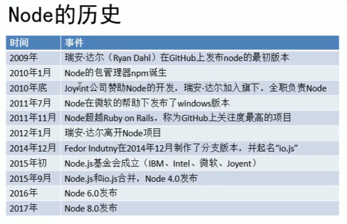
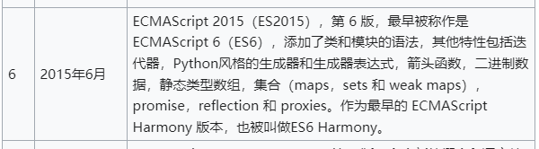
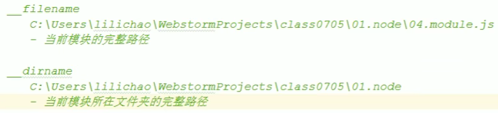
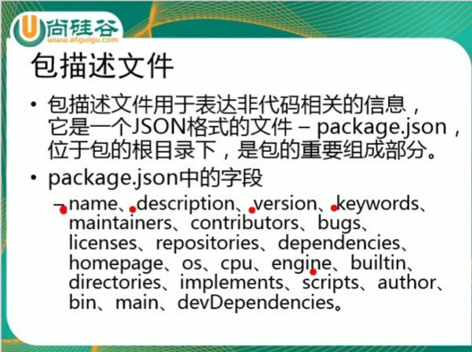

https://www.bilibili.com/video/BV1bs411E7pD?t=3

# 00 调试Node后端代码的方法

在浏览器或者 VS Code 中调试 Node.js 后端代码通常需要借助于调试工具和适当的配置。以下是一般步骤和建议：

### 在浏览器中调试 Node.js 后端代码：

1. **使用 Chrome DevTools**：
   - 启动 Node.js 应用程序时，通过在命令行中添加 `--inspect` 参数，例如：
     ```
     node --inspect index.js
     ```
   - 这将启动一个调试器服务器，并在控制台输出类似于 `Debugger listening on ws://127.0.0.1:9229/...` 的信息。
   - 在 Chrome 浏览器中输入 `chrome://inspect`，然后点击 "Configure..." 来添加远程连接或直接检测到的设备和服务。
   - 点击 "Inspect" 按钮可以打开 Chrome DevTools，并允许你在 Node.js 代码中设置断点、查看变量值等。

2. **其他浏览器工具**：
   - Firefox 和 Edge 也提供类似的远程调试功能，需要使用它们的开发者工具来设置和连接到 Node.js 调试器。

### 在 VS Code 中调试 Node.js 后端代码：

1. **使用内置调试功能**：
   - 在 VS Code 中打开你的 Node.js 项目。
   - 点击左侧的调试图标 (Debug) 或者使用快捷键 `Ctrl+Shift+D` 打开调试面板。
   - 点击 "create a launch.json file" 链接并选择 Node.js 环境。
   - 这会在项目根目录下创建一个 `launch.json` 文件，并且默认配置了 Node.js 的调试设置。
   - 在 `launch.json` 中可以设置调试器的配置，例如指定要调试的入口文件和启动参数。

2. **配置断点和调试**：
   - 在代码中点击行号区域，可以设置断点，或者在调试面板中手动添加。
   - 然后点击调试面板的绿色启动按钮 (Start Debugging) 或使用快捷键 `F5` 启动调试会话。
   - 在调试会话中，可以逐步执行代码、查看变量值和调用堆栈等信息，帮助定位和修复问题。

### 注意事项：
- 确保你的 Node.js 版本支持调试功能，通常推荐使用较新的 LTS 版本。
- 确保端口没有被防火墙或其他软件阻止访问，以便远程调试工具可以连接到 Node.js 调试器。
- 在调试过程中，可以通过控制台输出或日志语句来辅助理解代码执行流程和状态。

通过这些工具和方法，你可以在浏览器或 VS Code 中有效地调试 Node.js 后端代码，提高开发效率和代码质量。

# 01 命令行窗口

# 02 进程和线程

**进程：负责为程序的运行提供必备的环境。**进程就相当于工厂中的车间

**线程：是计算机中最小的计算单位，负责执行进程中的程序。**线程就相当于工厂中的工人

单线程

多线程

**js是单线程的**

# 03 node简介

* nodejs是一个能够在服务器端运行JS的开放源代码，跨平台==JS运行环境==。
* node采用Google开发的V8引擎运行代码，使用==**事件驱动**==，==**非阻塞**==和==**异步I/O模型**==等技术来提高性能，可优化应用程序的传输量和规模。
* I——表示向磁盘中写入数据
* O——表示从磁盘中读取数据
* 
* **Node是单线程**

# 04 使用node执行js文件

Node处理请求时是单线程，但是在后台拥有一个I/O线程池

# 05 node整合webStorm

# 06 模块化简介

https://www.ruanyifeng.com/blog/2015/11/ecmascript-specification.html

https://262.ecma-international.org/6.0/



[ECMAScript](https://zh.wikipedia.org/wiki/ECMAScript)标准的缺陷：

* ES5没有模块系统

* 标准库较少

* 没有标准接口

* 缺乏管理系统

  

**CommonJS规范：CommonJS规范的提出，主要是为了弥补当前Javascript没有标准的缺陷。CommonJS规范为JS指定了一个美好的愿景，希望JS能够在任何地方运行。**

CommonJS对模块的定义十分简单：

* 模块引用——require( )
* 模块定义
* 模块标识——就是模块的名字，也就是传递给require( )方法的参数。它必须是符合驼峰命名法的字符串，或者是以.或者..开头的相对路径或者绝对路径。


**模块化**：

* 在Node中，一个js文件就是一个模块

* 在Node中，通过require( )函数来引入外部的模块, require( )可以传递一个文件的路径作为参数，node将会自动根据该路径来引入外部模块。如果使用相对路径，必须使用.或者..开头。

* 使用require( )引入模块以后，该函数会返回一个对象，这个对象代表的是引入的模块。

* ```js
  var md = require("./02.module.js")
  ```

* 在node中，每一个js文件中的js代码都是独立运行在一个函数中，而不是全局作用域。所以一个模块中的变量在其他函数中无法访问。

* **向外部暴露属性或方法：通过exports。只需要将需要暴露给外部的变量或方法设置为exports的属性即可。**如下面代码所示：

* ```js
  exports.x = "jjdgjgajgja";
  exports.y = "djlkqhjdgjgd";
  exports.fn = function () {
  };
  ```

# 07 模块化详解

模块分为两大类：

1. ==核心模块：由node引擎提供的模块==，核心模块的标识就是模块的名字
2. ==文件模块：由用户自己创建的模块==，文件模块的标识就是文件的路径

**在node中有一个全局对象叫global，它的作用和网页中的window类似。**


在node中，每一个js文件中的js代码都是独立运行在一个函数中，而不是全局作用域。所以一个模块中的变量在其他函数中无法访问。

* 为什么每一个js文件中的js代码都是独立运行在一个函数里的？如何证明？

* 打印arguments && 打印arguments.callee

* arguments：伪数组，用来封装函数的实参的。全局里面没有arguments。

* ```js
  console.log(arguments.callee + "");
  // 结果：
  function (exports, require, module, __filename, __dirname) {
    // ...
  }
  ```

* 当node在执行模块中的代码时，它会首先在代码的最顶部加如下代码：

  ```javascript
  function (exports, require, module, __filename, __dirname) {
  ```

* 五个参数：

  * exports对象：用来将变量或属性暴露到外部

  * require函数：用来引入外部的模块

  * module：代表的是当前模块本身。exports就是module的属性。既可以使用exports导出，也可以使用module.exports导出。

  * __filename：当前模块的完整路径

  * __dirname：当前模块所在文件夹的完整路径

    

# 08 exports和module.exports

```js
// 正确
module.exports.name = 'aaa';
module.exports.age = 18;

// 正确
exports.name = 'aaa';
exports.age = 18;

// 正确
module.exports = {
	name: 'aaa',
	age: 18
}

// 错误
exports = {
	name: 'aaa',
	age: 18
}
```

```js
var module = {};
module.exports = {};
var exports = module.exports;
exports.name = '孙悟空';
console.log(module.exports.name); // 孙悟空


var module = {};
module.exports = {};
var exports = module.exports;
exports = new Object();
exports.name = '孙悟空';
console.log(module.exports.name); // undefined
```

# 09 包简介

CommonJs的包规范由包结构和包描述文件两个部分组成：

* 包结构：用于组织包中的各种文件
* 包描述文件：描述包的相关信息，以供外部读取分析

包实际上就是一个压缩文件，解压以后还原为目录。符合规范的目录，应该包含如下文件：

* **package.json**：描述文件（必须）
  * package.json中的字段：name, description,version, keywords, maintainers, contributors, bugs, licenses, repositories, ==dependencies==, homepage, os, cpu, engine, builtin, directories, implements, scripts, author, bin, main, ==devDependencies==.
* bin：可执行二进制文件
* lib：js代码
* doc：文档
* test：单元测试
* 

# 10 npm简介

* Node Package Manager
* CommonJS包规范是理论，NPM是其中一种实践。
* 对于Node而言，NPM帮助其完成了第三方模块的发布，安装和依赖。借助NPM，Node与第三方模块之间形成了很好的一个生态系统。

```
npm -v;查看npm的版本
npm version; // 查看所有模块的版本
npm; // 帮助说明
npm search 包名; // 搜索包
npm init; // 创建package.json
npm install 包名; // 在当前目录安装包
npm install 包名 -g; // 全局模式安装包
npm remove / r 包名; // 删除安装包
npm install 包名 --save; // 安装包并添加到依赖中（dependencies）
```

# 11 配置cnpm

```
npm install -g cnpm --registry==https://registry.npm.taobao.org
```

# 12 node搜索包的流程

# 13 Buffer缓冲区

Buffer的结构和数组很像，操作的方法也和数组类似。

JS里面原生的数组性能相对来说比较差。

数组中不能存储二进制文件，而Buffer就是专门用来存储**二进制数据**。

* Buffer的元素为16进制的两位数

  * ```javascript
    var str = "Hello";
    // 将一个字符串保存到buffer中
    var buf = Buffer.from(str);
    console.log(buf); // => <Buffer 48 65 6c 6c 6f>
    ```

  * 计算机里面所有的二进制数据都会以十六进制的形式去显示, 为什么？？？

    * 因为二进制太长了

  * Buffer中存储的都是二进制数据，但是在显示时都是以十六进制的形式显示的。

  * 为什么要转换成二进制？

    * 因为数据最终要发送给客户端，数据在传输的时候都是二进制传输。

* buffer中的一个元素占用内存中的一个字节

* 实际上Buffer的内存不是通过JavaScript分配的，而是在底层通过C++申请的

* 也就是我们可以直接通过Buffer来创建内存中的空间

* buffer中的每一个元素的范围是从00~ff（0~255）（00000000~11111111）

  * 计算机中 1个0 或 1个1 称为1位（bit）；
  * 8bit = 1byte（字节）
  * 字节是传输数据时候的最小单位
  * 1024byte = 1kb（千字节）
  * 1024kb = 1mb（兆字节）
  * 1024mb = 1gb
  * 1024gb = 1tb


创建一个指定大小的buffer:

```js
var buf2 = new Buffer(1024);
// buffer的所有构造函数都不推荐使用

var buf3 = Buffer.alloc(1024);
```

* Buffer的大小一旦确定就不能修改。Buffer实际上是对底层内存的直接操作。

* buffer 只要在控制台或页面中输出一定是十进制。

* buffer转字符串：

  * ```js
    buffer.toString();
    ```

# 14 同步文件写入


# 15 异步的文件写入

* 异步方法不可能有返回值，只要有返回值肯定是同步方法。  
* 异步调用的方法，结果都是通过回调函数返回的。


