https://www.bilibili.com/video/BV1uM4y1r7Qt/?spm_id_from=333.337.search-card.all.click&vd_source=a7089a0e007e4167b4a61ef53acc6f7e

# 46 课程介绍

# 47 事件循环概念

## 1.浏览器中的事件循环

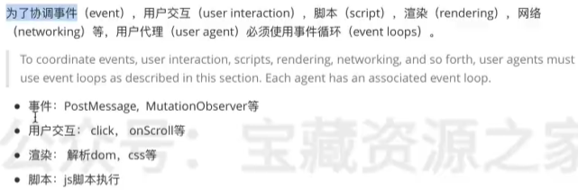

## 2.NodeJS中的事件循环

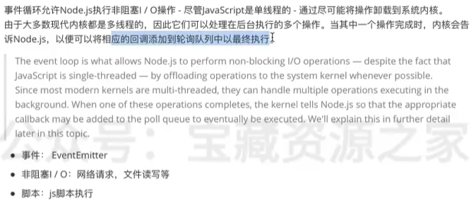

事件循环：在浏览器或者nodejs环境中，运行时对js脚本的调度方式就叫做事件循环。

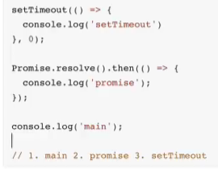

# 48 浏览器事件循环——任务队列

## 1.Javascript为什么是单线程的？


7min54s处

感觉讲的不怎么好

# [1. 课程概述](https://www.bilibili.com/video/BV1sA41137qw/?spm_id_from=333.337.search-card.all.click&vd_source=a7089a0e007e4167b4a61ef53acc6f7e)

NodeJS的架构和运行过程

NodeJS异步IO和事件驱动

NodeJS单线程

# [2. NodeJS架构](https://www.bilibili.com/video/BV1sA41137qw/?p=2&spm_id_from=pageDriver&vd_source=a7089a0e007e4167b4a61ef53acc6f7e)

|  | 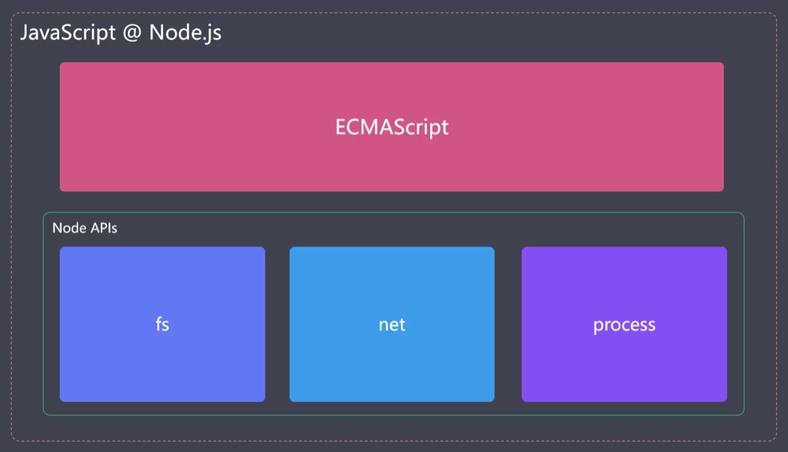 |
| ------------------------------------------------------------ | ------------------------------------------------------------ |


| 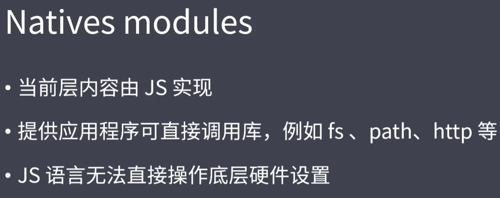 | 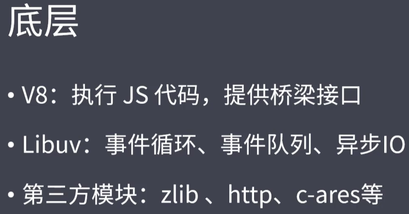 |
| ------------------------------------------------------------ | ------------------------------------------------------------ |
| JS语言无法直接操作底层硬件设备，因此NodeJS核心模块与硬件设备之间如果想要通信，需要一个桥梁——**Builtin modules** “胶水层”。<br/>在Node C/C++ Bindings这一层当中，除了内置的模块之外，还有第三方模块来充当桥梁 |                                                              |

# [3. 为什么是NodeJS](https://www.bilibili.com/video/BV1sA41137qw/?p=3&spm_id_from=pageDriver&vd_source=a7089a0e007e4167b4a61ef53acc6f7e)

NodeJS在诞生之出是为了实现高性能的Web服务器

经历长时间的发展之后，NodeJS慢慢演化为一门服务端“语言”。使得JavaScript实现了在浏览器之外的平台去进行工作的场景。

强调：此处使用了一个并不严谨的说法，把NodeJS叫做了语言。但前提是我们都明白，它是一个平台或者说运行时


> IO是计算机操作过程中最缓慢的环节

RAM：Random Access Memory 随机存取存储器 是一种计算机硬件设备，主要用于存储当前正在使用的数据和代码。它是计算机的主要内存类型之一，具有高速读写能力。

RAM的特点：

- 随机存取。与硬盘不同，RAM可以在相同时间内访问存储在任何位置的数据，这就是“随机存取”的意思。相比之下，硬盘等其他存储设备是“顺序存取”的，数据存取时间取决于数据的位置

访问RAM设备的IO时间消耗为纳秒级别

而在磁盘和网络中访问数据的时间消耗是毫秒级别

Reactor模式：

- 单线程完成多线程工作
- 实现异步IO，事件驱动

> NodeJS更适用于IO密集型高并发请求

与IO密集型与之对应的是CPU密集型

# [4. NodeJS异步IO](https://www.bilibili.com/video/BV1sA41137qw/?p=4&spm_id_from=pageDriver&vd_source=a7089a0e007e4167b4a61ef53acc6f7e)

在NodeJS中，IO操作可以同时进行

```js
const fs = require('fs');

// 同时读取两个文件
fs.readFile('file1.txt', 'utf8', (err, data1) => {
    if (err) throw err;
    console.log('File 1:', data1);
});

fs.readFile('file2.txt', 'utf8', (err, data2) => {
    if (err) throw err;
    console.log('File 2:', data2);
});
```

Node.js 提供了大量的异步 I/O 函数，例如 `fs.readFile` 和 `fs.writeFile`。这些函数在发起 I/O 操作后，立即返回，允许程序继续执行其他任务。当 I/O 操作完成时，会调用指定的回调函数

在这个例子中，`readFile` 和 `writeFile` 的操作是异步的，可以同时进行。**Node.js 不会等待 `file1.txt` 的读取完成后再读取 `file2.txt`，而是同时发起这两个 I/O 操作**

为更好地管理异步操作，尤其是当需要等待多个 I/O 操作的结果时，可以使用 `Promise` 或 `async/await`。这使得代码更清晰，并且更易于处理多个并发的 I/O 操作

```js
const fs = require('fs').promises;

async function readFiles() {
    try {
        const [data1, data2] = await Promise.all([
            fs.readFile('file1.txt', 'utf8'),
            fs.readFile('file2.txt', 'utf8')
        ]);

        console.log('File 1:', data1);
        console.log('File 2:', data2);
    } catch (err) {
        console.error(err);
    }
}

readFiles();
```

为什么要使用异步IO？异步IO能带来什么好处？

下图中的任务指的是IO任务：


对于操作系统来说，IO分为：

- 阻塞IO
- 非阻塞IO

当采用非阻塞IO后，CPU的时间片就可以被拿出来，然后去处理其他的事务。这对性能是有所提升的。但这种操作也同样存在一些问题：

因为立即返回的并不是业务层真正期望得到的实际数据，而仅仅是当前的xx状态。操作系统为了获取完整的数据，会让应用程序**重复调用IO操作，判断IO是否结束**

常见的轮询技术：read，select，poll，kqueue，event ports

虽然轮询技术能够去确定IO是否完成，然后将IO产出的数据返回回去。但是对代码而言，它还是同步的效果。因为在轮询的过程中，程序仍然是在等待着IO的结果。所以**期望实现无需主动判断的非阻塞IO**。


期望的IO：代码直接去发起非阻塞的调用，但是也无需通过遍历或者唤醒的方式来轮询的判断当前的IO是否结束。而是可以在调用发起之后直接去进行下一个任务的处理，然后等待IO的结果处理完成之后，再去通过某种信号或者说回调的方式将数据再传回给当前的代码进行使用。

此时`libuv库`就该出场了。把libuv库看作是几种不同的异步IO实现方式的抽象封装层


# [5. 事件驱动架构](https://www.bilibili.com/video/BV1sA41137qw/?p=5&spm_id_from=pageDriver&vd_source=a7089a0e007e4167b4a61ef53acc6f7e)

> 事件驱动架构是软件开发中的通用模式

为了方便理解，与发布订阅模式，观察者模式进行类比

共同的特征：主体发布消息，其他实例接收消息


# [6. NodeJS单线程](https://www.bilibili.com/video/BV1sA41137qw/?p=6&spm_id_from=pageDriver&vd_source=a7089a0e007e4167b4a61ef53acc6f7e)

NodeJS的重要特点：异步IO，事件驱动，事件循环

NodeJS：使用JS实现高效可伸缩的高性能Web服务

在我们的认知中，常见的Web服务都是由多线程或者多进程来实现的。那**单线程如何实现高并发**呢？NodeJS的单线程是否存在一些缺点呢？

> **NodeJS主线程是单线程**，而不是说NodeJS只有单线程

NodeJS平台下的JS代码最终都是由V8来执行的，而在V8当中，是只有一个主线程来执行JS代码，所以，这也就是我们平日里所说的单线程。

但是在libuv库当中，它是存在着一个线程池的。默认情况下，里面有四个线程。

可以去将Node程序的异步请求分为**网络IO**，**非网络IO**以及**非IO的异步操作**

针对于网络IO操作来说，libuv库就会去调用当前平台的相对应的IO接口去进行处理

而另外的两种异步操作，就会去使用线程池当中的线程来完成处理


通过一段代码，来演示一下 **单线程在处理CPU密集型问题时所存在的一些阻塞的现象**


# CPU密集型问题

CPU 密集型问题是指那些主要消耗 CPU 资源，而非 I/O 资源的计算任务。这类任务通常涉及大量的计算、处理和数据操作，而不是等待外部资源（如文件、数据库、网络）的输入或输出。

### CPU 密集型问题的特点

1. **大量的计算操作**：CPU 密集型任务通常需要进行大量的数学运算、数据处理或复杂的算法。例如，加密解密、图像处理、大量数据的排序或筛选等。

2. **较少的 I/O 操作**：与 I/O 密集型任务（如文件读写、网络请求）不同，CPU 密集型任务很少需要等待外部资源。因此，CPU 密集型任务更多依赖于处理器的计算能力。

3. **CPU 利用率高**：这类任务会导致 CPU 长时间处于高负载状态，可能导致多核 CPU 的多个核心同时被占用。

### CPU 密集型任务的例子

- **图像处理**：例如，照片编辑软件中的滤镜应用或图像渲染。
- **加密和解密**：例如，使用复杂算法对数据进行加密或解密。
- **科学计算**：例如，模拟物理系统、天气预测、DNA 分析等。
- **大型数据分析**：例如，对海量数据进行复杂的分析或机器学习模型训练。
- **视频编码和解码**：例如，视频格式转换或实时视频处理。

### 应对 CPU 密集型问题的策略

1. **并行计算**：在多核处理器上，可以使用多线程、多进程或并行计算库来将任务分解为多个子任务，并在不同的 CPU 核心上同时执行，以加快处理速度。

2. **使用 GPU**：某些 CPU 密集型任务，特别是涉及大规模并行计算的任务（如深度学习、图像处理），可以通过使用 GPU（图形处理单元）来加速。GPU 适合处理大量并行计算的任务。

3. **优化算法**：通过改进算法，提高计算效率，减少 CPU 负载。例如，使用更高效的排序算法或减少不必要的计算步骤。

4. **分布式计算**：将任务分散到多个计算机（集群）上，以分担计算负担。这种方法通常用于超级计算和大型数据处理任务。

### 在 Node.js 中的处理

Node.js 的单线程特性使得它更适合处理 I/O 密集型任务，而不适合处理重度 CPU 密集型任务。为了有效处理 CPU 密集型任务，通常会使用如下策略：

- **Worker Threads**：Node.js 提供了 `worker_threads` 模块，允许在多个线程中并行运行 JavaScript 代码，这对于 CPU 密集型任务非常有用。

- **Child Processes**：可以通过 `child_process` 模块生成子进程，来将 CPU 密集型任务移出主线程，避免阻塞事件循环。

总之，CPU 密集型问题主要考验计算资源的处理能力，通常需要通过并行计算、算法优化或硬件加速等方式来提高处理效率。

# [7. NodeJS应用场景](https://www.bilibili.com/video/BV1sA41137qw/?p=6&spm_id_from=pageDriver&vd_source=a7089a0e007e4167b4a61ef53acc6f7e)

根据特点来反推应用场景

NodeJS特点：非阻塞异步IO，单线程，事件驱动，事件循环

应用场景：

- IO密集型高并发请求
- 操作数据库提供API服务
- 实时聊天应用程序

# [8. NodeJS实现API服务](https://www.bilibili.com/video/BV1sA41137qw/?p=8&spm_id_from=pageDriver&vd_source=a7089a0e007e4167b4a61ef53acc6f7e)

`tsc --init`命令可以生成`tsconfig.json`文件

`npm i @types/express -D`

|  |  |
| ------------------------------------------------------------ | ------------------------------------------------------------ |

# ts-node包

`ts-node` 是一个 TypeScript 执行引擎，用于在 Node.js 环境中直接运行 TypeScript 代码。它允许开发者无需预先将 TypeScript 编译为 JavaScript，而是可以即时执行 `.ts` 文件。这对于开发、调试和快速原型开发非常有用。

### `ts-node` 的主要功能和作用

1. **直接执行 TypeScript 代码**：
   你可以使用 `ts-node` 直接运行 TypeScript 文件，而不需要手动将其编译为 JavaScript。例如：

   ```bash
   ts-node script.ts
   ```

   这会即时编译并执行 `script.ts` 文件。

2. **支持 REPL（交互式解释器）**：
   `ts-node` 提供了一个交互式 TypeScript 解释器，类似于 Node.js 的 REPL（Read-Eval-Print Loop）。在命令行中运行 `ts-node` 后，可以直接输入 TypeScript 代码并立即看到结果：

   ```bash
   ts-node
   ```

3. **集成 TypeScript 编译器选项**：
   `ts-node` 支持 TypeScript 的所有编译选项，允许你通过 `tsconfig.json` 文件或命令行参数自定义编译过程。例如，可以指定编译目标、模块解析策略等。

4. **简化开发环境**：
   在开发环境中，`ts-node` 简化了开发流程，你可以在调试、测试过程中直接使用 TypeScript，而不需要每次修改代码后手动编译。

5. **测试集成**：
   许多测试框架（如 Mocha）可以与 `ts-node` 集成，允许你直接用 TypeScript 编写和运行测试用例，而无需提前编译。

   例如，使用 `Mocha` 运行 TypeScript 测试文件：
   ```bash
   mocha --require ts-node/register test/**/*.ts
   ```

### 典型用法

1. **直接运行 TypeScript 文件**：
   ```bash
   ts-node app.ts
   ```

2. **使用 `ts-node` 执行脚本**：
   在 `package.json` 中配置一个脚本，使用 `ts-node` 运行 TypeScript 文件：
   ```json
   {
     "scripts": {
       "start": "ts-node app.ts"
     }
   }
   ```

3. **REPL 模式**：
   运行 `ts-node` 启动交互式 TypeScript 解释器：
   ```bash
   ts-node
   ```

4. **集成编译选项**：
   通过指定 `tsconfig.json` 文件中的选项配置编译行为，`ts-node` 会自动读取并应用这些配置。

### 小结

`ts-node` 是开发 TypeScript 应用程序的一个非常有用的工具，它简化了开发和调试流程，减少了在开发过程中手动编译 TypeScript 代码的需求。在开发环境中，`ts-node` 能够让你快速迭代并即时看到 TypeScript 代码的运行效果。

# [9. NodeJS全局对象](https://www.bilibili.com/video/BV1sA41137qw?p=9&vd_source=a7089a0e007e4167b4a61ef53acc6f7e)

> NodeJS中全局对象是global。global的根本作用就是作为全局变量的宿主。

|  |  |
| ------------------------------------------------------------ | ------------------------------------------------------------ |


# [10. 全局变量-process-1](https://www.bilibili.com/video/BV1sA41137qw?p=10&spm_id_from=pageDriver&vd_source=a7089a0e007e4167b4a61ef53acc6f7e)

- 获取进程信息
  - 帮助获取当前正在执行脚本的一些信息：例如当前进程在工作的时候，对CPU或内存会产生一定的消耗。利用process所提供的一些属性和方法就可以得到这些数据
- 执行进行操作
  - 监听进程在执行的过程中所存在的一些内置的事件；
  - 创建一些子进程，然后让两者进行通信，从而来完成更多的操作

`内存相关`：

```javascript
console.log(process.memoryUsage());
// 输出值：
{
  rss: 35123200, // 当前的常驻内存。本机是有内存条的，但是这个内存条的所有空间并不是完全交给我们的应用程序去使用的。所以有一个常驻内存的概念
  heapTotal: 4079616, // 当前脚本在刚开始执行时所申请的总的内存大小
  heapUsed: 3176280, // 当前脚本在执行过程中实际使用的内存大小
  external: 1097184, // 存放或表示底层C或C++的核心模块所占据的空间大小
  arrayBuffers: 10519 // 代表一片独立的空间，不占据v8所占用的内存。（缓冲区的大小）
}
```

`内存相关`：

```js
Buffer.alloc(1001);
console.log(process.memoryUsage());
```

`CPU相关`：

```js
console.log(process.cpuUsage());
// 输出值：
{ user: 15000, system: 31000 }
```

`当前运行目录：`

```js
// 返回NodeJS进程当前工作目录
console.log(process.cwd())
```

`node版本：`

```
console.log(process.version)
```

`更多的版本信息,如v8版本，libuv版本等：`

```js
console.log(process.versions)
// 输出如下
```

```
{
  node: '14.18.2',
  v8: '8.4.371.23-node.85',
  uv: '1.42.0',
  zlib: '1.2.11',
  brotli: '1.0.9',
  ares: '1.18.1',
  modules: '83',
  nghttp2: '1.42.0',
  napi: '8',
  llhttp: '2.1.4',
  openssl: '1.1.1l',
  cldr: '39.0',
  icu: '69.1',
  tz: '2021a',
  unicode: '13.0'
}
```

`cpu架构：`

```js
console.log(process.arch) // 输出：x64
```

`用户环境：`

```js
console.log(process.env) // 返回包含用户环境信息的对象
console.log(process.env.NODE_ENV) // 生产环境 or 开发环境
console.log(process.env.PATH) // 本机配置的系统环境变量
console.log(process.env.USERPROFILE) // 用户管理员目录 MAC:HOME
console.log(process.platform) // 返回当前的操作系统。
// 输出：win32
```

`运行状态：启动参数，PID，运行时间`

```js
console.log(process.argv) // 返回一个数组，包含了启动node进程时的命令行参数
// 输出 [
//  'C:\\Program Files\\nodejs\\node.exe',
//  'E:\\TechDocument\\Node\\Node code\\process.js'
// ]
console.log(process.argv0)
console.log(process.execArgv)
console.log(process.pid) // 返回当前进程的进程号
console.log(process.ppid)
console.log(process.uptime()) // 程序运行的时间
```

# [11. 全局变量-process-2](https://www.bilibili.com/video/BV1sA41137qw/?p=11&spm_id_from=pageDriver&vd_source=621212910e87e7f002ade9ffe06be4be)

| 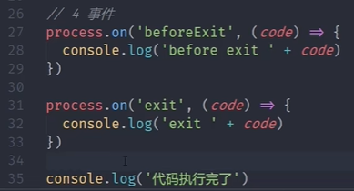 | 注意：<br>exit事件的回调函数里面只能写一些同步的代码,<br>不能写异步代码。<br>beforeExit事件的回调函数里面能写异步的代码 |
| ------------------------------------------------------------ | ------------------------------------------------------------ |

```js
process.exit()
```

| 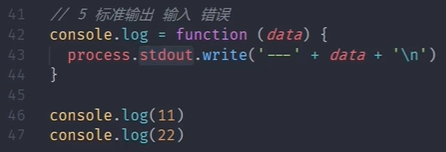 | 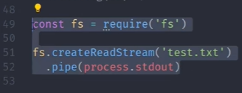 |
| ------------------------------------------------------------ | ------------------------------------------------------------ |
| 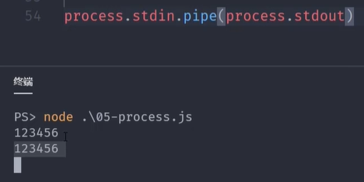 | 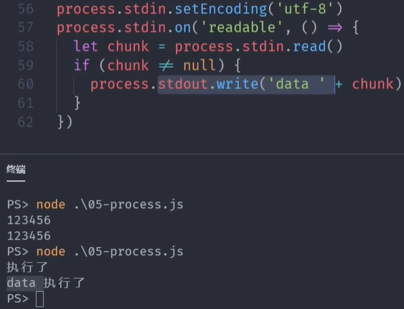 |


```js
// 专门捕捉异步代码错误
process.on('uncaughtException', (err) => {
    console.log('发生错误', err)
})
```

# [12. 核心模块-path-1](https://www.bilibili.com/video/BV1sA41137qw/?p=12&spm_id_from=pageDriver&vd_source=621212910e87e7f002ade9ffe06be4be)

|  |  |
| ------------------------------------------------------------ | ------------------------------------------------------------ |
| 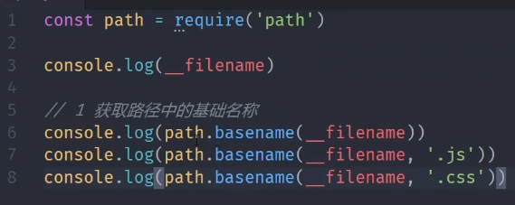 | 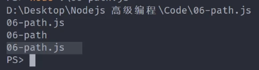 |
| 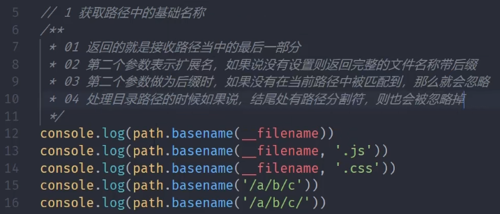 | 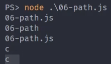 |
| 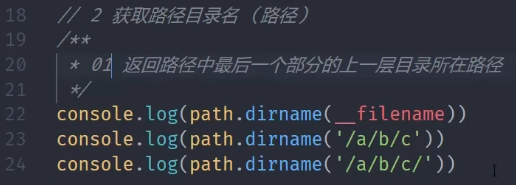 | 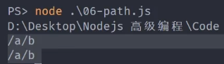 |
| 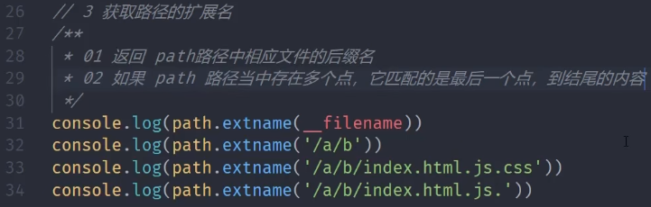 | 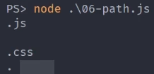 |

# [13. 核心模块-path-2](https://www.bilibili.com/video/BV1sA41137qw?p=13&vd_source=a7089a0e007e4167b4a61ef53acc6f7e)

| path.parse()<br>解析路径       | 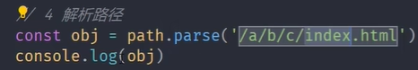 | 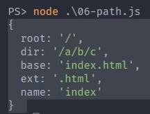 |
| ------------------------------ | ------------------------------------------------------------ | ------------------------------------------------------------ |
|                                | 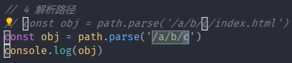 | 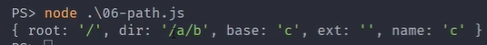 |
|                                | 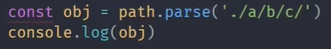 | 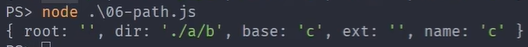 |
| path.format()<br>序列化路径    | 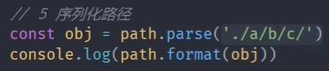 | 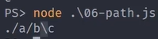 |
| pa/+++th.isAbsolute()          | 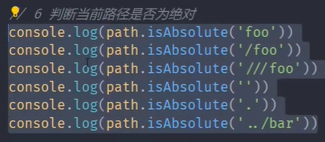 | 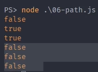 |
| path.join()<br>拼接路径        | 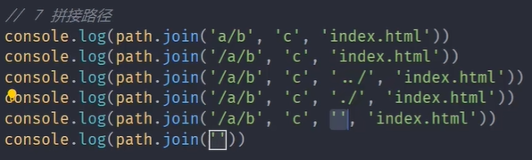 | 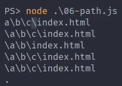 |
| path.normalize()<br>规范化路径 |  |  |
| path.resolve()<br>绝对路径     | 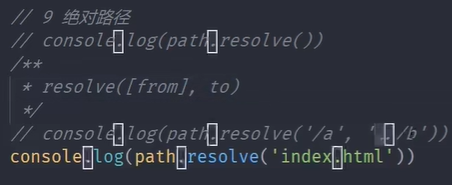 | 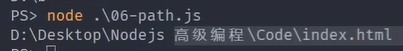 |

# [14. 全局变量值之Buffer](https://www.bilibili.com/video/BV1sA41137qw?p=14&spm_id_from=pageDriver&vd_source=a7089a0e007e4167b4a61ef53acc6f7e)

> Buffer让JavaScript可以操作二进制
>

Buffer是什么？在哪？做什么？

二进制数据，流操作，Buffer

- IO行为操作的就是二进制数据
- Node中Buffer是一片内存空间。Node平台下的JS代码最终都是由v8引擎来执行完成的。因此，按道理来说，所有的内存消耗应该都是属于v8的堆内存。而这个Buffer是v8之外的一片空间，它的大小不占据v8堆内存的大小。
- 注意：Buffer的空间申请不是由Node来完成的，但是在使用层面上，它的空间分配又是由编写的JS代码来控制的。因此，在空间回收的时候，还是由v8的GC来管理

| 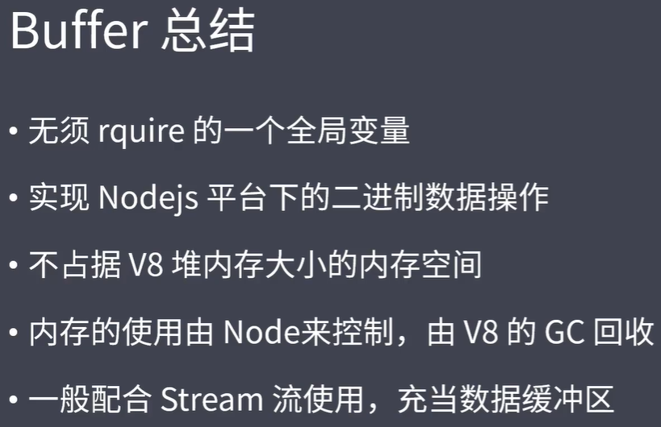 | 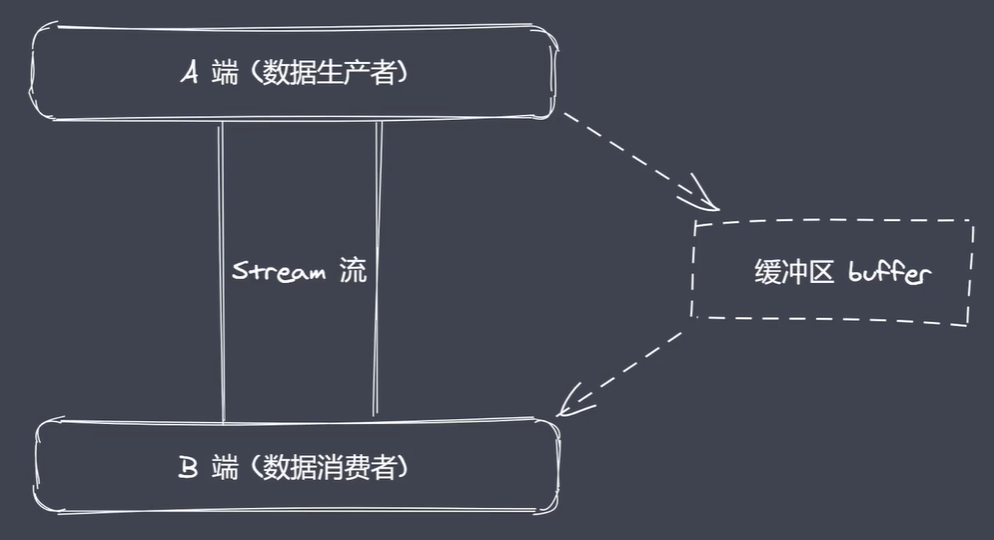 |
| ------------------------------------------------------------ | ------------------------------------------------------------ |

# [15. 创建Buffer](https://www.bilibili.com/video/BV1sA41137qw?p=15&spm_id_from=pageDriver&vd_source=a7089a0e007e4167b4a61ef53acc6f7e)

Buffer是NodeJS的内置类

| 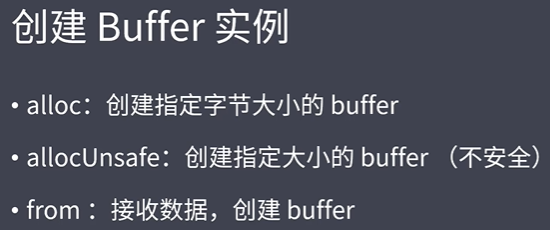 |                                                              |
| :----------------------------------------------------------- | ------------------------------------------------------------ |
| 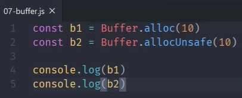 | 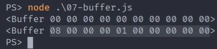 |
| 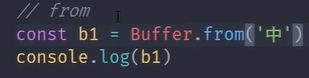 | 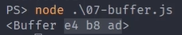 |
| 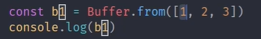 | 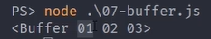 |
| 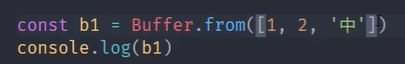 | 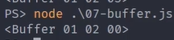 |
| 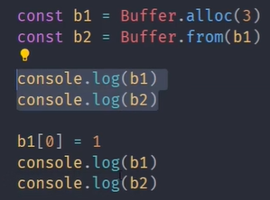 | 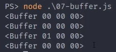 |

# [16. Buffer实例方法](https://www.bilibili.com/video/BV1sA41137qw?p=16&spm_id_from=pageDriver&vd_source=a7089a0e007e4167b4a61ef53acc6f7e)


| fill()     | 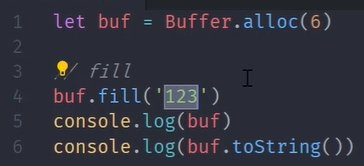 | 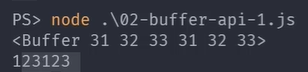 |
| ---------- | ------------------------------------------------------------ | ------------------------------------------------------------ |
|            | 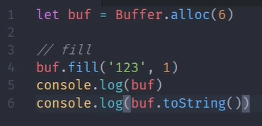 | 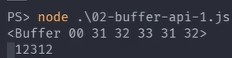 |
|            |  |  |
|            |  |  |
| write()    | 与fill类似，区别是fill会反复写入数据<br>write不会反复写入数据 |                                                              |
| toString() |  |  |
|            |  |  |
| slice()    |  |  |
|            |  |  |
|            |  |  |
| indexOf()  |  |  |
| copy()     |  |  |

# [17. Buffer静态对象](https://www.bilibili.com/video/BV1sA41137qw?p=17&spm_id_from=pageDriver&vd_source=a7089a0e007e4167b4a61ef53acc6f7e)


|  |  |
| ------------------------------------------------------------ | ------------------------------------------------------------ |
|  |  |
|  | true                                                         |

# [18. Buffer-split实现](https://www.bilibili.com/video/BV1sA41137qw?p=18&spm_id_from=pageDriver&vd_source=a7089a0e007e4167b4a61ef53acc6f7e)

还没看

# [19. 核心模块值FS](https://www.bilibili.com/video/BV1sA41137qw?p=19&spm_id_from=pageDriver&vd_source=a7089a0e007e4167b4a61ef53acc6f7e)


# 20. 文件操作API

# 21. md转html实现

# 22. 文件打开与关闭

# [29. 模块化历程](https://www.bilibili.com/video/BV1sA41137qw?p=29&spm_id_from=pageDriver&vd_source=a7089a0e007e4167b4a61ef53acc6f7e)

前端开发为什么需要模块化？


# [30. CommonJS规范](https://www.bilibili.com/video/BV1sA41137qw?p=30&spm_id_from=pageDriver&vd_source=a7089a0e007e4167b4a61ef53acc6f7e)

由于浏览器平台本身所具备的一些特点，例如：数据一般都是通过网络来进行传输的，而且还存在单线程阻塞的加载方式。因此CommonJS规范不能适用浏览器平台。

CommonJS规范主要应用于NodeJS

CommonJS是语言层面上的规范，类似于ECMAScript，而模块化只是这个规范当中的一部分

|  |  |
| ------------------------------------------------------------ | ------------------------------------------------------------ |

module.exports与exports有什么区别？

**不能直接给exports重新赋值，重复赋值会切断exports和module.exports的联系**

|  |  |
| ------------------------------------------------------------ | ------------------------------------------------------------ |


# [31. NodeJS与CommonJS](https://www.bilibili.com/video/BV1sA41137qw/?p=31&spm_id_from=pageDriver&vd_source=a7089a0e007e4167b4a61ef53acc6f7e)


# [32. 模块分类及加载流程](https://www.bilibili.com/video/BV1sA41137qw/?p=32&spm_id_from=pageDriver&vd_source=a7089a0e007e4167b4a61ef53acc6f7e)

模块分类:

- 内置模块（核心模块）：在Node源码编译时写入到二进制文件中 
- 文件模块：代码运行时，动态加载

|  |  |
| ------------------------------------------------------------ | ------------------------------------------------------------ |
|  |  |
|  |  |

使用require时文件定位的流程：


### 总结
Node.js 在使用 `require` 时，按照核心模块 > 文件或目录 > 文件扩展名 > 目录索引 > `node_modules` 目录的顺序进行文件定位。这个流程使得 Node.js 能够灵活地加载不同类型的模块，并且能够在复杂的项目结构中找到正确的文件。

# [33. 模块加载源码分析](https://www.bilibili.com/video/BV1sA41137qw/?p=33&spm_id_from=pageDriver&vd_source=a7089a0e007e4167b4a61ef53acc6f7e)

ctrl+shift+D

# [34. VM模块使用](https://www.bilibili.com/video/BV1sA41137qw/?p=34&spm_id_from=pageDriver&vd_source=a7089a0e007e4167b4a61ef53acc6f7e)

VM模块是一个内置核心模块

NodeJS中，底层require实现用到了VM模块

VM模块的核心作用：创建一个运行代码的沙箱环境

看如何通过VM把a模块中的内容放在b模块中执行

考虑：怎么样能去把读出来的字符串，让它像JS一样运行起来

```txt
// test.txt
var age = 18;
```


```js
const fs = require('fs');
const vm = require('vm');

let age = 33;
// 不传'utf-8'时，默认返回的是Buffer
let content = fs.readFileSync('test.txt', 'utf-8');
console.log('content1:', content);

// eval：用于将字符串作为代码执行
// eval不合适，因为作用域不独立
// eval(content);
// console.log('content2:', age);

// 使用 new Function 创建的函数不会访问创建它的上下文中的变量
// 所有的变量都必须通过参数传入
// let fn = new Function('age', "return age + 1");
// console.log(fn(age));

vm.runInThisContext(content);
// console.log('age1:', age);

// vm.runInThisContext("age += 10");
// console.log('age2:', age);
```

# [35. 模块加载模拟实现-1](https://www.bilibili.com/video/BV1sA41137qw/?p=35&spm_id_from=pageDriver&vd_source=a7089a0e007e4167b4a61ef53acc6f7e)

核心逻辑：

- 路径分析：确定目标模块的绝对路径
- 缓存优先
- 文件定位
- 编译执行

```js
// v.js
const name = 'lg';
module.exports = name;
```

# [36. 模块加载模拟实现-2](https://www.bilibili.com/video/BV1sA41137qw/?p=36&spm_id_from=pageDriver&vd_source=a7089a0e007e4167b4a61ef53acc6f7e)

# [37. 事件模块](https://www.bilibili.com/video/BV1sA41137qw?p=37&spm_id_from=pageDriver&vd_source=a7089a0e007e4167b4a61ef53acc6f7e)


2min处

# 38. 发布订阅

# 39. EventEmitter源码调试

# 40. EventEmitter模拟

# [41. 浏览器中的事件环](https://www.bilibili.com/video/BV1sA41137qw?p=41&vd_source=a7089a0e007e4167b4a61ef53acc6f7e)

EventLoop

|  |  |
| ------------------------------------------------------------ | ------------------------------------------------------------ |
| 输出：s1,p1,p2,s2,p3,p4                                      | 输出：p1, s1,p2,p3,s2,s3                                     |

# [42. NodeJS中的事件环](https://www.bilibili.com/video/BV1sA41137qw?p=42&spm_id_from=pageDriver&vd_source=a7089a0e007e4167b4a61ef53acc6f7e)

|  |  |
| :----------------------------------------------------------: | :----------------------------------------------------------: |
|  |  |
| 注意：微任务的执行是有两个时机的。第一个时机：在所有的同步代码执行完成之后。第二个时机：在完成队列切换之前 |         输出：start，end，tick，p1，s1，setimmediate         |
|  |  |

**nextTick属于微任务，但是它的优先级高于promise**

主要关注三个队列：**timer ，poll， check**

# ! 42. nextTick

在 Node.js 中，`process.nextTick()` 是一个异步操作调度函数，用来在当前事件循环的"tick"（也可以理解为一个阶段）结束后立即执行一个回调函数，而不等到下一轮的事件循环。它比定时器（如 `setTimeout` 或 `setImmediate`）更早执行。

### 主要特点
- **优先级高**：`process.nextTick()` 在同一轮事件循环的所有其他 I/O 任务、定时器以及微任务之前执行，具有非常高的优先级。
- **异步性**：虽然 `process.nextTick()` 是异步的，但它是在当前事件循环的结束时立即执行，不会等到下一轮事件循环。

### `process.nextTick()` 的工作原理
`process.nextTick()` 其实是微任务队列的一部分。Node.js 中的事件循环有多个阶段，每个阶段都有相应的回调队列（如 I/O 回调、定时器回调等）。当一个阶段的任务执行完后，事件循环会检查 `process.nextTick` 队列中的回调，并且会在进入下一个阶段前执行这些回调。

#### 执行顺序：
1. 当 Node.js 执行一段同步代码时，遇到 `process.nextTick()`，它会将回调函数加入到 "nextTick 队列" 中。
2. 当事件循环的一个阶段完成后，会优先执行 "nextTick 队列" 中的回调函数。
3. 完成所有 `nextTick` 的回调后，事件循环进入下一个阶段，处理其他异步操作。

### 用法示例
```javascript
console.log("start");

process.nextTick(() => {
  console.log("nextTick callback");
});

console.log("end");
```
输出结果：
```
start
end
nextTick callback
```
分析：
- `process.nextTick()` 的回调是在当前事件循环的最后执行的，而不会等到下一轮事件循环。即使在 `console.log("end")` 之后调用，它也会在所有同步代码执行完后立即运行。

### `process.nextTick()` 的应用场景
1. **递归调用优化**：在递归或循环调用时，如果没有使用 `process.nextTick()`，可能会导致栈溢出。通过 `nextTick()` 可以打破同步调用链，让递归执行变得异步，避免栈的无限增长。

   示例：
   ```javascript
   function recursive(n) {
     if (n === 0) return;
     console.log(n);
     process.nextTick(() => recursive(n - 1));  // 让递归变为异步
   }
   recursive(5);
   ```

2. **异步回调**：在某些场景下，开发者可能希望确保某些代码在当前的同步操作之后，但又不需要等到下一轮事件循环。`process.nextTick()` 可以用于这个场景。

### 与其他异步操作的比较
1. **`setTimeout` 和 `setImmediate`**：
   - `setTimeout()` 和 `setImmediate()` 都是异步操作，但它们的回调会在下一轮事件循环的特定阶段执行，而 `process.nextTick()` 的回调总是优先于这些。
   
   示例对比：
   ```javascript
   console.log("start");
   
   setTimeout(() => {
     console.log("setTimeout callback");
   }, 0);
   
   setImmediate(() => {
     console.log("setImmediate callback");
   });
   
   process.nextTick(() => {
     console.log("nextTick callback");
   });
   
   console.log("end");
   ```

   输出结果：
   ```
   start
   end
   nextTick callback
   setTimeout callback
   setImmediate callback
   ```

   - `nextTick` 回调比 `setTimeout` 和 `setImmediate` 都早执行，因为它是在事件循环的一个阶段完成后，立即执行的。
   
2. **微任务（Promise）**：
   - 在现代 JavaScript 中，`Promise` 的回调（即微任务）和 `process.nextTick()` 都属于微任务队列。
   - 在 Node.js 中，`process.nextTick()` 的回调优先于 `Promise` 的回调执行。

   示例：
   ```javascript
   Promise.resolve().then(() => {
     console.log("Promise callback");
   });
   
   process.nextTick(() => {
     console.log("nextTick callback");
   });
   ```

   输出结果：
   ```
   nextTick callback
   Promise callback
   ```

   说明：`process.nextTick()` 总是在 `Promise` 回调之前执行。

### 注意事项
- **无限递归可能导致“饿死”其他异步任务**：如果 `process.nextTick()` 中持续添加新的回调，它们会阻塞事件循环的其他阶段，导致其他异步任务如 I/O 操作、计时器等无法得到执行。

  示例：
  ```javascript
  function endlessLoop() {
    process.nextTick(endlessLoop);  // 无限递归
  }
  endlessLoop();
  ```

  上述代码会不断地执行 `nextTick` 回调，导致程序的其他异步任务（如定时器、I/O 回调）都无法执行，程序陷入“饿死”状态。

### 总结
- `process.nextTick()` 是一个强大的工具，适合在事件循环的某个阶段结束后立即执行代码。
- 它优先于其他异步操作，如 `setTimeout()`、`setImmediate()`，甚至 `Promise`。
- 使用时需要谨慎，避免不必要的阻塞和递归，影响事件循环的正常进行。

# ! 42. setImmediate

在 Node.js 中，`setImmediate()` 是一个异步调度函数，用于在**当前事件循环完成后**，尽快执行一个回调函数。它的设计目标是在当前事件循环的 I/O 阶段完成之后，立即执行回调。

### 工作原理

`setImmediate()` 的回调是在事件循环的 **check 阶段** 执行的。Node.js 的事件循环有多个阶段，每个阶段会处理不同类型的回调。`setImmediate()` 的回调被放在**check 阶段**，即 I/O 操作完成之后，会执行 `setImmediate()` 注册的所有回调函数。

相比之下，`process.nextTick()` 是在当前阶段结束后，马上执行回调，而 `setImmediate()` 则是等待当前所有 I/O 事件处理完毕，进入 `check` 阶段时执行。

### 执行顺序与 `setTimeout(fn, 0)` 的对比

`setImmediate()` 和 `setTimeout(fn, 0)` 都是将回调推迟到事件循环的下一次迭代中执行，但它们的执行顺序有细微的差别：

- **`setImmediate()`**：回调会在 I/O 阶段之后的 `check` 阶段执行，意味着它是尽可能地快，但必须等待当前的 I/O 事件完成。
- **`setTimeout(fn, 0)`**：回调会在 **timer 阶段** 执行，通常要等至少 1 毫秒的延迟。

由于事件循环的不同阶段，`setImmediate()` 比 `setTimeout(fn, 0)` 更有可能在下一个迭代中优先执行。

### 用法示例

```javascript
console.log("start");

setImmediate(() => {
  console.log("setImmediate callback");
});

setTimeout(() => {
  console.log("setTimeout callback");
}, 0);

console.log("end");
```

**输出结果：**
```
start
end
setImmediate callback
setTimeout callback
```

**解释：**
1. `console.log("start")` 和 `console.log("end")` 是同步执行的，因此它们首先输出。
2. 然后，`setImmediate()` 和 `setTimeout()` 都被注册为异步操作，等待事件循环的相应阶段执行。
3. 在大多数情况下，`setImmediate()` 会比 `setTimeout(fn, 0)` 先执行，因为它跳过了最小的定时器延迟，在 I/O 阶段完成后立即执行。

### 事件循环中的 `setImmediate()`

Node.js 事件循环的流程大致如下：

1. **timers 阶段**：执行已过期的 `setTimeout` 和 `setInterval` 回调。
2. **I/O callbacks 阶段**：执行一些延迟的 I/O 回调，如 TCP 错误等。
3. **idle, prepare 阶段**：系统内部使用，通常忽略。
4. **poll 阶段**：检索新的 I/O 事件，执行 I/O 相关的回调函数（文件、网络等）。
5. **check 阶段**：执行 `setImmediate()` 的回调函数。
6. **close 阶段**：执行 `close` 事件相关的回调。

因此，`setImmediate()` 是在 poll 阶段之后的 check 阶段执行，而 `setTimeout()` 是在 timers 阶段执行。

### 与 `process.nextTick()` 的区别

- **`process.nextTick()`**：是属于微任务队列，会在当前操作结束后立即执行，不会等待事件循环进入下一个阶段。它的优先级比 `setImmediate()` 更高。
- **`setImmediate()`**：属于异步任务队列，它的回调会在 I/O 操作完成后、进入 check 阶段时执行。

#### 执行顺序对比

```javascript
console.log("start");

process.nextTick(() => {
  console.log("nextTick callback");
});

setImmediate(() => {
  console.log("setImmediate callback");
});

console.log("end");
```

**输出结果：**
```
start
end
nextTick callback
setImmediate callback
```

**解释**：
1. `process.nextTick()` 在当前操作结束后立即执行，优先级比 `setImmediate()` 高。
2. `setImmediate()` 在事件循环的 check 阶段执行，因此在 `process.nextTick()` 之后。

### `setImmediate()` 的应用场景

`setImmediate()` 适合用于以下场景：

1. **I/O 完成后的操作**：它经常用于在 I/O 操作完成后，立即执行一些后续任务。例如，在读取文件、处理网络请求后，使用 `setImmediate()` 执行相应的回调。

   示例：
   ```javascript
   const fs = require('fs');

   fs.readFile('example.txt', (err, data) => {
     if (err) throw err;

     // I/O 操作完成后立即执行
     setImmediate(() => {
       console.log("File read complete, performing next task.");
     });
   });
   ```

2. **防止阻塞事件循环**：在某些需要执行大量计算的同步任务中，使用 `setImmediate()` 可以将任务分割成多个小的异步任务，这样可以避免阻塞事件循环，保证其他异步任务如 I/O 操作也能及时处理。

   示例：
   ```javascript
   function heavyComputation() {
     let count = 0;
     for (let i = 0; i < 1e9; i++) {
       count += i;
     }
     console.log(count);
   }

   setImmediate(heavyComputation);
   console.log("This will be printed first, even though heavy computation is set.");
   ```

3. **跨事件循环的调度**：`setImmediate()` 能确保回调在当前事件循环的 poll 阶段后执行，适合在某些复杂的异步逻辑中进行跨事件循环的调度。

### 注意事项

- **嵌套的 `setImmediate()`**：如果 `setImmediate()` 中调用另一个 `setImmediate()`，这些回调会在同一轮事件循环中被顺序执行，因为所有 `setImmediate()` 的回调都在同一个 `check` 阶段执行。
  
  示例：
  ```javascript
  setImmediate(() => {
    console.log("First Immediate");
  
    setImmediate(() => {
      console.log("Second Immediate");
    });
  });
  ```

  **输出结果**：
  ```
  First Immediate
  Second Immediate
  ```

  两个 `setImmediate()` 回调会按顺序执行。

### 总结

- **`setImmediate()`**：在 Node.js 的事件循环的 check 阶段执行，主要用于在当前 I/O 操作完成后尽快执行某个回调函数。
- **与 `setTimeout()`**：尽管两者都用于异步调度，但 `setImmediate()` 更适合 I/O 之后的立即操作，通常比 `setTimeout(fn, 0)` 执行得更早。
- **与 `process.nextTick()`**：`process.nextTick()` 的优先级更高，适合用于在当前阶段结束后立即执行，而 `setImmediate()` 则用于跨越事件循环的不同阶段。

# [43. Node事件环理解](https://www.bilibili.com/video/BV1sA41137qw?p=43&spm_id_from=pageDriver&vd_source=a7089a0e007e4167b4a61ef53acc6f7e)

|  | 预测输出：start,end,p2,s1,t1,p1,s2,t2,p3<br />注意：好像node版本不一样，输出会不一样<br /> |
| ------------------------------------------------------------ | ------------------------------------------------------------ |

# [44. NodeJS与浏览器事件环区别](https://www.bilibili.com/video/BV1sA41137qw?p=44&spm_id_from=pageDriver&vd_source=a7089a0e007e4167b4a61ef53acc6f7e)

|  |  |
| ------------------------------------------------------------ | ------------------------------------------------------------ |
|  |  |

NodeJS的事件循环和浏览器的事件循环机制有什么区别？

# [45. NodeJS事件环常见问题](https://www.bilibili.com/video/BV1sA41137qw?p=45&spm_id_from=pageDriver&vd_source=a7089a0e007e4167b4a61ef53acc6f7e)

setTimeout和setImmediate的执行先后顺序不稳定？

他们的执行顺序主要取决于**代码运行的上下文**和**事件循环的当前阶段**

- setTimeout的回调会在Timers阶段执行
- setImmediate的回调会在Check阶段执行

当setTimeout和setImmediate同时在主模块中调用时，执行顺序不稳定。因为这取决于事件循环的进展。

- 如果Timers阶段结束后立即进入Check阶段，setImmediate会优先执行
- 如果事件循环还未进入Timers阶段，则会?????????????????????????????


