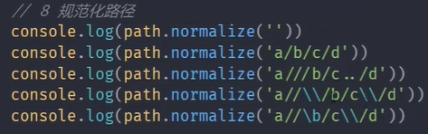
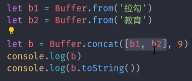

https://www.bilibili.com/video/BV1uM4y1r7Qt/?spm_id_from=333.337.search-card.all.click&vd_source=a7089a0e007e4167b4a61ef53acc6f7e

# 46 课程介绍

# 47 事件循环概念

## 1.浏览器中的事件循环


## 2.NodeJS中的事件循环


事件循环：在浏览器或者nodejs环境中，运行时对js脚本的调度方式就叫做事件循环。


# 48 浏览器事件循环——任务队列

## 1.Javascript为什么是单线程的？


7min54s处

感觉讲的不怎么好

# [1. 课程概述](https://www.bilibili.com/video/BV1sA41137qw/?spm_id_from=333.337.search-card.all.click&vd_source=a7089a0e007e4167b4a61ef53acc6f7e)

NodeJS的架构和运行过程

NodeJS异步IO和事件驱动

NodeJS单线程

# [2. NodeJS架构](https://www.bilibili.com/video/BV1sA41137qw/?p=2&spm_id_from=pageDriver&vd_source=a7089a0e007e4167b4a61ef53acc6f7e)

|  |  |
| ------------------------------------------------------------ | ------------------------------------------------------------ |


|  |  |
| ------------------------------------------------------------ | ------------------------------------------------------------ |
| JS语言无法直接操作底层硬件设备，因此NodeJS核心模块与硬件设备之间如果想要通信，需要一个桥梁——**Builtin modules** “胶水层”。<br/>在Node C/C++ Bindings这一层当中，除了内置的模块之外，还有第三方模块来充当桥梁 |                                                              |

# [3. 为什么是NodeJS](https://www.bilibili.com/video/BV1sA41137qw/?p=3&spm_id_from=pageDriver&vd_source=a7089a0e007e4167b4a61ef53acc6f7e)

NodeJS在诞生之出是为了实现高性能的Web服务器

经历长时间的发展之后，NodeJS慢慢演化为一门服务端“语言”。使得JavaScript实现了在浏览器之外的平台去进行工作的场景。

强调：此处使用了一个并不严谨的说法，把NodeJS叫做了语言。但前提是我们都明白，它是一个平台或者说运行时


> IO是计算机操作过程中最缓慢的环节

RAM：Random Access Memory 随机存取存储器 是一种计算机硬件设备，主要用于存储当前正在使用的数据和代码。它是计算机的主要内存类型之一，具有高速读写能力。

RAM的特点：

- 随机存取。与硬盘不同，RAM可以在相同时间内访问存储在任何位置的数据，这就是“随机存取”的意思。相比之下，硬盘等其他存储设备是“顺序存取”的，数据存取时间取决于数据的位置

访问RAM设备的IO时间消耗为纳秒级别

而在磁盘和网络中访问数据的时间消耗是毫秒级别

Reactor模式：

- 单线程完成多线程工作
- 实现异步IO，事件驱动

> NodeJS更适用于IO密集型高并发请求

与IO密集型与之对应的是CPU密集型

# [4. NodeJS异步IO](https://www.bilibili.com/video/BV1sA41137qw/?p=4&spm_id_from=pageDriver&vd_source=a7089a0e007e4167b4a61ef53acc6f7e)

在NodeJS中，IO操作可以同时进行

```js
const fs = require('fs');

// 同时读取两个文件
fs.readFile('file1.txt', 'utf8', (err, data1) => {
    if (err) throw err;
    console.log('File 1:', data1);
});

fs.readFile('file2.txt', 'utf8', (err, data2) => {
    if (err) throw err;
    console.log('File 2:', data2);
});
```

Node.js 提供了大量的异步 I/O 函数，例如 `fs.readFile` 和 `fs.writeFile`。这些函数在发起 I/O 操作后，立即返回，允许程序继续执行其他任务。当 I/O 操作完成时，会调用指定的回调函数

在这个例子中，`readFile` 和 `writeFile` 的操作是异步的，可以同时进行。**Node.js 不会等待 `file1.txt` 的读取完成后再读取 `file2.txt`，而是同时发起这两个 I/O 操作**

为更好地管理异步操作，尤其是当需要等待多个 I/O 操作的结果时，可以使用 `Promise` 或 `async/await`。这使得代码更清晰，并且更易于处理多个并发的 I/O 操作

```js
const fs = require('fs').promises;

async function readFiles() {
    try {
        const [data1, data2] = await Promise.all([
            fs.readFile('file1.txt', 'utf8'),
            fs.readFile('file2.txt', 'utf8')
        ]);

        console.log('File 1:', data1);
        console.log('File 2:', data2);
    } catch (err) {
        console.error(err);
    }
}

readFiles();
```

为什么要使用异步IO？异步IO能带来什么好处？

下图中的任务指的是IO任务：


对于操作系统来说，IO分为：

- 阻塞IO
- 非阻塞IO

当采用非阻塞IO后，CPU的时间片就可以被拿出来，然后去处理其他的事务。这对性能是有所提升的。但这种操作也同样存在一些问题：

因为立即返回的并不是业务层真正期望得到的实际数据，而仅仅是当前的xx状态。操作系统为了获取完整的数据，会让应用程序**重复调用IO操作，判断IO是否结束**

常见的轮询技术：read，select，poll，kqueue，event ports

虽然轮询技术能够去确定IO是否完成，然后将IO产出的数据返回回去。但是对代码而言，它还是同步的效果。因为在轮询的过程中，程序仍然是在等待着IO的结果。所以**期望实现无需主动判断的非阻塞IO**。


期望的IO：代码直接去发起非阻塞的调用，但是也无需通过遍历或者唤醒的方式来轮询的判断当前的IO是否结束。而是可以在调用发起之后直接去进行下一个任务的处理，然后等待IO的结果处理完成之后，再去通过某种信号或者说回调的方式将数据再传回给当前的代码进行使用。

此时`libuv库`就该出场了。把libuv库看作是几种不同的异步IO实现方式的抽象封装层


# [5. 事件驱动架构](https://www.bilibili.com/video/BV1sA41137qw/?p=5&spm_id_from=pageDriver&vd_source=a7089a0e007e4167b4a61ef53acc6f7e)

> 事件驱动架构是软件开发中的通用模式

为了方便理解，与发布订阅模式，观察者模式进行类比

共同的特征：主体发布消息，其他实例接收消息


# [6. NodeJS单线程](https://www.bilibili.com/video/BV1sA41137qw/?p=6&spm_id_from=pageDriver&vd_source=a7089a0e007e4167b4a61ef53acc6f7e)

NodeJS的重要特点：异步IO，事件驱动，事件循环

NodeJS：使用JS实现高效可伸缩的高性能Web服务

在我们的认知中，常见的Web服务都是由多线程或者多进程来实现的。那**单线程如何实现高并发**呢？NodeJS的单线程是否存在一些缺点呢？

> **NodeJS主线程是单线程**，而不是说NodeJS只有单线程

NodeJS平台下的JS代码最终都是由V8来执行的，而在V8当中，是只有一个主线程来执行JS代码，所以，这也就是我们平日里所说的单线程。

但是在libuv库当中，它是存在着一个线程池的。默认情况下，里面有四个线程。

可以去将Node程序的异步请求分为**网络IO**，**非网络IO**以及**非IO的异步操作**

针对于网络IO操作来说，libuv库就会去调用当前平台的相对应的IO接口去进行处理

而另外的两种异步操作，就会去使用线程池当中的线程来完成处理


通过一段代码，来演示一下 **单线程在处理CPU密集型问题时所存在的一些阻塞的现象**


# CPU密集型问题

CPU 密集型问题是指那些主要消耗 CPU 资源，而非 I/O 资源的计算任务。这类任务通常涉及大量的计算、处理和数据操作，而不是等待外部资源（如文件、数据库、网络）的输入或输出。

### CPU 密集型问题的特点

1. **大量的计算操作**：CPU 密集型任务通常需要进行大量的数学运算、数据处理或复杂的算法。例如，加密解密、图像处理、大量数据的排序或筛选等。

2. **较少的 I/O 操作**：与 I/O 密集型任务（如文件读写、网络请求）不同，CPU 密集型任务很少需要等待外部资源。因此，CPU 密集型任务更多依赖于处理器的计算能力。

3. **CPU 利用率高**：这类任务会导致 CPU 长时间处于高负载状态，可能导致多核 CPU 的多个核心同时被占用。

### CPU 密集型任务的例子

- **图像处理**：例如，照片编辑软件中的滤镜应用或图像渲染。
- **加密和解密**：例如，使用复杂算法对数据进行加密或解密。
- **科学计算**：例如，模拟物理系统、天气预测、DNA 分析等。
- **大型数据分析**：例如，对海量数据进行复杂的分析或机器学习模型训练。
- **视频编码和解码**：例如，视频格式转换或实时视频处理。

### 应对 CPU 密集型问题的策略

1. **并行计算**：在多核处理器上，可以使用多线程、多进程或并行计算库来将任务分解为多个子任务，并在不同的 CPU 核心上同时执行，以加快处理速度。

2. **使用 GPU**：某些 CPU 密集型任务，特别是涉及大规模并行计算的任务（如深度学习、图像处理），可以通过使用 GPU（图形处理单元）来加速。GPU 适合处理大量并行计算的任务。

3. **优化算法**：通过改进算法，提高计算效率，减少 CPU 负载。例如，使用更高效的排序算法或减少不必要的计算步骤。

4. **分布式计算**：将任务分散到多个计算机（集群）上，以分担计算负担。这种方法通常用于超级计算和大型数据处理任务。

### 在 Node.js 中的处理

Node.js 的单线程特性使得它更适合处理 I/O 密集型任务，而不适合处理重度 CPU 密集型任务。为了有效处理 CPU 密集型任务，通常会使用如下策略：

- **Worker Threads**：Node.js 提供了 `worker_threads` 模块，允许在多个线程中并行运行 JavaScript 代码，这对于 CPU 密集型任务非常有用。

- **Child Processes**：可以通过 `child_process` 模块生成子进程，来将 CPU 密集型任务移出主线程，避免阻塞事件循环。

总之，CPU 密集型问题主要考验计算资源的处理能力，通常需要通过并行计算、算法优化或硬件加速等方式来提高处理效率。

# [7. NodeJS应用场景](https://www.bilibili.com/video/BV1sA41137qw/?p=6&spm_id_from=pageDriver&vd_source=a7089a0e007e4167b4a61ef53acc6f7e)

根据特点来反推应用场景

NodeJS特点：非阻塞异步IO，单线程，事件驱动，事件循环

应用场景：

- IO密集型高并发请求
- 操作数据库提供API服务
- 实时聊天应用程序

# [8. NodeJS实现API服务](https://www.bilibili.com/video/BV1sA41137qw/?p=8&spm_id_from=pageDriver&vd_source=a7089a0e007e4167b4a61ef53acc6f7e)

`tsc --init`命令可以生成`tsconfig.json`文件

`npm i @types/express -D`

|  |  |
| ------------------------------------------------------------ | ------------------------------------------------------------ |

# ts-node包

`ts-node` 是一个 TypeScript 执行引擎，用于在 Node.js 环境中直接运行 TypeScript 代码。它允许开发者无需预先将 TypeScript 编译为 JavaScript，而是可以即时执行 `.ts` 文件。这对于开发、调试和快速原型开发非常有用。

### `ts-node` 的主要功能和作用

1. **直接执行 TypeScript 代码**：
   你可以使用 `ts-node` 直接运行 TypeScript 文件，而不需要手动将其编译为 JavaScript。例如：

   ```bash
   ts-node script.ts
   ```

   这会即时编译并执行 `script.ts` 文件。

2. **支持 REPL（交互式解释器）**：
   `ts-node` 提供了一个交互式 TypeScript 解释器，类似于 Node.js 的 REPL（Read-Eval-Print Loop）。在命令行中运行 `ts-node` 后，可以直接输入 TypeScript 代码并立即看到结果：

   ```bash
   ts-node
   ```

3. **集成 TypeScript 编译器选项**：
   `ts-node` 支持 TypeScript 的所有编译选项，允许你通过 `tsconfig.json` 文件或命令行参数自定义编译过程。例如，可以指定编译目标、模块解析策略等。

4. **简化开发环境**：
   在开发环境中，`ts-node` 简化了开发流程，你可以在调试、测试过程中直接使用 TypeScript，而不需要每次修改代码后手动编译。

5. **测试集成**：
   许多测试框架（如 Mocha）可以与 `ts-node` 集成，允许你直接用 TypeScript 编写和运行测试用例，而无需提前编译。

   例如，使用 `Mocha` 运行 TypeScript 测试文件：
   ```bash
   mocha --require ts-node/register test/**/*.ts
   ```

### 典型用法

1. **直接运行 TypeScript 文件**：
   ```bash
   ts-node app.ts
   ```

2. **使用 `ts-node` 执行脚本**：
   在 `package.json` 中配置一个脚本，使用 `ts-node` 运行 TypeScript 文件：
   ```json
   {
     "scripts": {
       "start": "ts-node app.ts"
     }
   }
   ```

3. **REPL 模式**：
   运行 `ts-node` 启动交互式 TypeScript 解释器：
   ```bash
   ts-node
   ```

4. **集成编译选项**：
   通过指定 `tsconfig.json` 文件中的选项配置编译行为，`ts-node` 会自动读取并应用这些配置。

### 小结

`ts-node` 是开发 TypeScript 应用程序的一个非常有用的工具，它简化了开发和调试流程，减少了在开发过程中手动编译 TypeScript 代码的需求。在开发环境中，`ts-node` 能够让你快速迭代并即时看到 TypeScript 代码的运行效果。

# [9. NodeJS全局对象](https://www.bilibili.com/video/BV1sA41137qw?p=9&vd_source=a7089a0e007e4167b4a61ef53acc6f7e)

> NodeJS中全局对象是global。global的根本作用就是作为全局变量的宿主。

|  |  |
| ------------------------------------------------------------ | ------------------------------------------------------------ |


# [10. 全局变量-process-1](https://www.bilibili.com/video/BV1sA41137qw?p=10&spm_id_from=pageDriver&vd_source=a7089a0e007e4167b4a61ef53acc6f7e)

- 获取进程信息
  - 帮助获取当前正在执行脚本的一些信息：例如当前进程在工作的时候，对CPU或内存会产生一定的消耗。利用process所提供的一些属性和方法就可以得到这些数据
- 执行进行操作
  - 监听进程在执行的过程中所存在的一些内置的事件；
  - 创建一些子进程，然后让两者进行通信，从而来完成更多的操作

`内存相关`：

```javascript
console.log(process.memoryUsage());
// 输出值：
{
  rss: 35123200, // 当前的常驻内存。本机是有内存条的，但是这个内存条的所有空间并不是完全交给我们的应用程序去使用的。所以有一个常驻内存的概念
  heapTotal: 4079616, // 当前脚本在刚开始执行时所申请的总的内存大小
  heapUsed: 3176280, // 当前脚本在执行过程中实际使用的内存大小
  external: 1097184, // 存放或表示底层C或C++的核心模块所占据的空间大小
  arrayBuffers: 10519 // 代表一片独立的空间，不占据v8所占用的内存。（缓冲区的大小）
}
```

`内存相关`：

```js
Buffer.alloc(1001);
console.log(process.memoryUsage());
```

`CPU相关`：

```js
console.log(process.cpuUsage());
// 输出值：
{ user: 15000, system: 31000 }
```

`当前运行目录：`

```
console.log(process.cwd())
```

`node版本：`

```
console.log(process.version)
```

`更多的版本信息,如v8版本，libuv版本等：`

```
console.log(process.versions)
```

`cpu架构：`

```js
console.log(process.arch) // 输出：x64
```

`用户环境：`

```js
console.log(process.env)
console.log(process.env.NODE_ENV) // 生产环境 or 开发环境
console.log(process.env.PATH) // 本机配置的系统环境变量
console.log(process.env.USERPROFILE) // 用户管理员目录 MAC:HOME
console.log(process.platform) // 输出：win32
// 输出
```

`运行状态：启动参数，PID，运行时间`

```js
console.log(process.argv)
console.log(process.argv0)
console.log(process.execArgv)
console.log(process.pid)
console.log(process.ppid)
console.log(process.uptime()) // 程序运行的时间
```

# [11. 全局变量-process-2](https://www.bilibili.com/video/BV1sA41137qw/?p=11&spm_id_from=pageDriver&vd_source=621212910e87e7f002ade9ffe06be4be)

|  | 注意：<br>exit事件的回调函数里面只能写一些同步的代码,<br>不能写异步代码。<br>beforeExit事件的回调函数里面能写异步的代码 |
| ------------------------------------------------------------ | ------------------------------------------------------------ |

```js
process.exit()
```

|  |  |
| ------------------------------------------------------------ | ------------------------------------------------------------ |
|  |  |

# [12. 核心模块-path-1](https://www.bilibili.com/video/BV1sA41137qw/?p=12&spm_id_from=pageDriver&vd_source=621212910e87e7f002ade9ffe06be4be)

|  |  |
| ------------------------------------------------------------ | ------------------------------------------------------------ |
|  |  |
|  |  |
|  |  |
|  |  |

# [13. 核心模块-path-2](https://www.bilibili.com/video/BV1sA41137qw?p=13&vd_source=a7089a0e007e4167b4a61ef53acc6f7e)

| path.parse()<br>解析路径       |  |  |
| ------------------------------ | ------------------------------------------------------------ | ------------------------------------------------------------ |
|                                |  |  |
|                                |  |  |
| path.format()<br>序列化路径    |  |  |
| pa/+++th.isAbsolute()          |  |  |
| path.join()<br>拼接路径        |  |  |
| path.normalize()<br>规范化路径 |  |  |
| path.resolve()<br>绝对路径     |  |  |

# [14. 全局变量值之Buffer](https://www.bilibili.com/video/BV1sA41137qw?p=14&spm_id_from=pageDriver&vd_source=a7089a0e007e4167b4a61ef53acc6f7e)

> Buffer让JavaScript可以操作二进制
>

Buffer是什么？在哪？做什么？

二进制数据，流操作，Buffer

- IO行为操作的就是二进制数据
- Node中Buffer是一片内存空间。Node平台下的JS代码最终都是由v8引擎来执行完成的。因此，按道理来说，所有的内存消耗应该都是属于v8的堆内存。而这个Buffer是v8之外的一片空间，它的大小不占据v8堆内存的大小。
- 注意：Buffer的空间申请不是由Node来完成的，但是在使用层面上，它的空间分配又是由编写的JS代码来控制的。因此，在空间回收的时候，还是由v8的GC来管理

|  |  |
| ------------------------------------------------------------ | ------------------------------------------------------------ |

# [15. 创建Buffer](https://www.bilibili.com/video/BV1sA41137qw?p=15&spm_id_from=pageDriver&vd_source=a7089a0e007e4167b4a61ef53acc6f7e)

Buffer是NodeJS的内置类

|  |                                                              |
| :----------------------------------------------------------- | ------------------------------------------------------------ |
|  |  |
|  |  |
|  |  |
|  |  |
|  |  |

# [16. Buffer实例方法](https://www.bilibili.com/video/BV1sA41137qw?p=16&spm_id_from=pageDriver&vd_source=a7089a0e007e4167b4a61ef53acc6f7e)


| fill()     |  |  |
| ---------- | ------------------------------------------------------------ | ------------------------------------------------------------ |
|            |  |  |
|            |  |  |
|            |  |  |
| write()    | 与fill类似，区别是fill会反复写入数据<br>write不会反复写入数据 |                                                              |
| toString() |  |  |
|            |  |  |
| slice()    |  |  |
|            |  |  |
|            |  |  |
| indexOf()  |  |  |
| copy()     |  |  |

# [17. Buffer静态对象](https://www.bilibili.com/video/BV1sA41137qw?p=17&spm_id_from=pageDriver&vd_source=a7089a0e007e4167b4a61ef53acc6f7e)


|  |  |
| ------------------------------------------------------------ | ------------------------------------------------------------ |
|  |  |
|  | true                                                         |

# [18. Buffer-split实现](https://www.bilibili.com/video/BV1sA41137qw?p=18&spm_id_from=pageDriver&vd_source=a7089a0e007e4167b4a61ef53acc6f7e)

还没看

# [19. 核心模块值FS](https://www.bilibili.com/video/BV1sA41137qw?p=19&spm_id_from=pageDriver&vd_source=a7089a0e007e4167b4a61ef53acc6f7e)


# 20. 文件操作API

# 21. md转html实现

# 22. 文件打开与关闭


