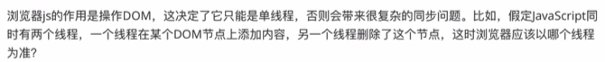

https://www.bilibili.com/video/BV1uM4y1r7Qt/?spm_id_from=333.337.search-card.all.click&vd_source=a7089a0e007e4167b4a61ef53acc6f7e

# 46 课程介绍

# 47 事件循环概念

## 1.浏览器中的事件循环

## 2.NodeJS中的事件循环

事件循环：在浏览器或者nodejs环境中，运行时对js脚本的调度方式就叫做事件循环。

# 48 浏览器事件循环——任务队列

## 1.Javascript为什么是单线程的？

7min54s处

感觉讲的不怎么好

