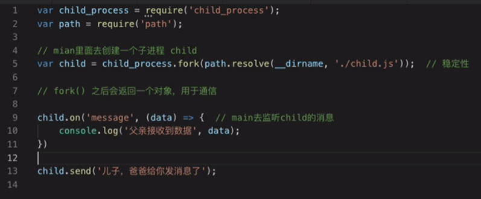

> node如何管理进程的调度？主线程和子线程如何交互的？

# JS-Node-单进程-多进程-单线程-多线程

JavaScript 在浏览器环境和 Node.js 环境中运行时的表现略有不同，但总体来说，它是 **单进程、单线程** 的语言。

### 单线程
JavaScript 的执行是单线程的，这意味着它在一个时间点只能执行一个任务。单线程意味着所有代码都是在一个主线程中依次运行的，这种模型有助于避免复杂的同步问题，如数据竞争和死锁。

- 在 **浏览器环境** 下，JavaScript 的主线程同时负责处理用户交互（如点击事件）、DOM 渲染、脚本执行等。
- 在 **Node.js 环境** 下，JavaScript 也遵循单线程模型，但通过事件循环机制和**异步 [I/O](#-4-3-常见i/o操作)** 来实现高效的任务处理。

### 单进程
JavaScript 运行在单个进程中，尤其是在浏览器里，所有代码共享同一个主线程、同一个内存空间。Node.js 也是单进程的，默认情况下运行在单个主进程中，但通过 `child_process` 模块或[集群模式（`cluster`）](#4-3-cluster模块开启多进程)可以创建多个子进程来分担任务。

### 异步与多线程模型的补充
尽管 JavaScript 是单线程的，但现代浏览器和 Node.js 提供了多种机制来让 JavaScript 代码“看起来”是并行执行的。以下是一些机制：

1. **异步回调**：JavaScript 通过事件循环和回调机制来处理异步任务，使得长时间运行的操作（如 I/O、网络请求）不会阻塞主线程。

2. **Promise 和 async/await**：Promise 是管理异步操作的常见方式，而 `async/await` 是语法糖，简化了异步代码的书写。

3. **Web Workers（多线程）**：在浏览器中，可以使用 Web Workers 来创建独立的线程执行一些任务（如数据处理），这些线程不能访问 DOM，通常用于执行耗时的计算，以避免阻塞主线程。

4. **Node.js Worker Threads**：Node.js 提供 `worker_threads` 模块，可以在多线程环境中执行计算密集型任务，同样不会阻塞主线程。

总的来说，虽然 JavaScript 本身是单进程、单线程的，但通过事件循环、异步操作和多线程的辅助机制，JavaScript 仍然可以处理并发任务。

# [4-1 多进程与多线程介绍](https://www.bilibili.com/video/BV1uM4y1r7Qt?spm_id_from=333.788.videopod.episodes&vd_source=a7089a0e007e4167b4a61ef53acc6f7e&p=57)

## 为什么要使用多进程

JS是一门单线程语言

Node.js 使用多进程（或子进程）机制的主要原因在于它的 **单线程事件循环模型** 在处理 **CPU 密集型任务** 或者**多核利用**时的局限性。通过使用多进程，Node.js 可以提高性能、扩展性和容错能力，尤其在以下场景中具有优势：

### 1. **利用多核 CPU**
Node.js 是单线程运行的，这意味着默认情况下它只能使用一个 CPU 核心。如果你的服务器有多个 CPU 核心，单线程模型无法充分利用硬件资源。而通过创建多个子进程或者使用 **集群（Cluster）模式**，Node.js 可以在多个 CPU 核心上运行多个进程，从而并行处理任务，提高吞吐量。

- **Cluster 模式**：通过 `cluster` 模块，Node.js 可以轻松启动多个进程（通常称为 "worker"），每个 worker 是主进程的一个副本，监听相同的端口。当有请求进来时，Node.js 会将请求分发给不同的 worker，从而在多核服务器上并行处理请求。

### 2. **避免阻塞主线程**
Node.js 是单线程的，所有 I/O 操作（如文件读取、网络请求）是非阻塞的，但 CPU 密集型操作（如复杂的计算或加密操作）会阻塞事件循环，导致无法响应其他请求。如果主线程被阻塞，整个应用都会陷入“假死”状态。

通过多进程，CPU 密集型任务可以在子进程中执行，不会阻塞主线程的事件循环。例如：
- 在主线程中处理网络请求、数据库查询等 I/O 密集型任务。
- 将复杂的计算任务（如加密、图像处理）分配给子进程，避免对主线程的影响。

### 3. **更好的错误隔离**
在单个进程中运行所有代码意味着，如果某个代码块崩溃（如发生未捕获的异常），可能会导致整个进程崩溃。使用多进程可以提高容错能力，因为某个子进程崩溃不会影响主进程和其他子进程。你可以通过检测到崩溃后重启子进程，保持应用稳定运行。

### 4. **任务并行化**
Node.js 可以使用 `child_process` 模块创建独立的子进程来处理特定任务。子进程可以通过消息传递与主进程通信，执行一些耗时的任务，从而达到并行处理任务的效果。典型应用场景包括：
- 视频/音频文件的处理（如压缩、编码）。
- 数据库的大量计算或查询操作。
- 各种批处理任务。

### 5. **横向扩展应用**
对于高流量的应用，多进程架构允许 Node.js 实现水平扩展，处理大量并发连接。多个进程可以均匀地分配请求，从而最大限度地提高应用的可扩展性和响应能力。

### 6. **集成外部系统**
Node.js 的多进程机制不仅仅用于分担工作负载，还可以用于与外部系统交互。你可以使用 `child_process.spawn()` 来调用其他语言的程序或脚本，例如 Python、C++ 或 Java，执行一些 Node.js 不擅长处理的任务（如硬件交互、复杂算法）。

### 例子：使用 `child_process` 创建子进程
```js
const { spawn } = require('child_process');

// 启动一个新的子进程来执行 `ls` 命令
const child = spawn('ls', ['-lh', '/usr']);

child.stdout.on('data', (data) => {
  console.log(`子进程输出: ${data}`);
});

child.stderr.on('data', (data) => {
  console.error(`子进程错误: ${data}`);
});

child.on('close', (code) => {
  console.log(`子进程退出，退出码: ${code}`);
});
```

### 总结
Node.js 使用多进程机制，主要是为了**充分利用多核 CPU**、**避免 CPU 密集型任务阻塞事件循环**、**提高容错能力**、**实现任务并行化**，以及**横向扩展应用**。这些特性补足了 Node.js 单线程模型的不足，使其能够在高并发环境中有效运行。

## 多进程和多线程介绍

- 谷歌浏览器
  - 进程：一个tab就是一个进程
  - 线程：一个tab又由多个线程组成，渲染线程，js执行线程，垃圾回收，service worker等
- node服务
  - 进程：监听某一个端口的http服务
  - 线程：http服务由多个线程组成，比如：

# [4-2 如何选择进程和线程](https://www.bilibili.com/video/BV1uM4y1r7Qt?spm_id_from=333.788.player.switch&vd_source=a7089a0e007e4167b4a61ef53acc6f7e&p=58)


# [4-3 cluster模块开启多进程](https://www.bilibili.com/video/BV1uM4y1r7Qt?spm_id_from=333.788.player.switch&vd_source=a7089a0e007e4167b4a61ef53acc6f7e&p=59)

- cluster模块是一个内置模块，用于创建多个**子进程**来并行处理任务，从而充分利用多核CPU的能力
  - 多个子进程可以共享同一个端口，实现**负载均衡**和高并发处理
  - 每个子进程都是独立的NodeJS进程，拥有自己的内存空间和资源，但可以通过IPC(进程间通信)与主进程(master)通信
- NodeJS的单线程特性在处理CPU密集型任务时可能会成为瓶颈，而cluster模块提供了一种方式来克服这一限制

```js
const cluster = require('cluster');
const numCPUs = require('os').cpus().length;
const http = require('http'); // 获取CPU核数

if (cluster.isMaster) { // 如果是主进程
  // Fork workers.
  for (let i = 0; i < numCPUs; i++) {
    cluster.fork(); // 创建子进程。注意：是创建子进程，不是创建子线程
    // 如果需要创建子线程，需使用Node的worker_threads模块
  }
} else {
  // Workers can share any TCP connection
  http.createServer((req, res) => {
    res.writeHead(200);
    res.end('Hello World\n');
  }).listen(8000);
}
```

# ! 4-3 CPU核数和进程数是什么关系

- **CPU核数**表示处理器中独立工作的核心数量。**每个核心能够独立执行一个线程**，这意味着**CPU的核数决定了系统同时可以运行的线程数量**
- 对于多核CPU，每个核心相当于一个独立的小处理器，能够并行处理不同的任务
- 某些CPU支持超线程（如Intel的Hyper-Threading），这使得每个核心可以处理多个线程。比如一个4核8线程的CPU，表面上可以像8核一样同时运行8个线程

# ! 4-3 为什么 NodeJS的单线程特性在处理CPU密集型任务时可能会成为瓶颈

虽然NodeJS的**非阻塞I/O**和**异步特性**使其非常适合处理大量并发I/O操作（例如网络请求，文件读写），但在处理CPU密集型任务时，单线程特性可能成为瓶颈，原因如下：

- NodeJS是单线程的，所有JS代码都在这个线程上执行。如果一个CPU密集型任务（如复杂的计算，数据加密，图像处理等）需要大量的CPU资源，NodeJS就会长时间占用这个唯一的线程，导致其他任务（如处理I/O操作，HTTP请求等）无法得到及时响应。这就会引起阻塞，让整个应用的响应速度下降

# ! 4-3 NodeJS中涉及到的几类线程

虽然NodeJS的**JS执行环境是单线程的**，但它的底层实现实际上是**多线程**的

NodeJS**底层使用了多线程**来处理I/O操作等繁重任务

说NodeJS底层是多线程的，这是因为它依赖于**libuv库**和其他原生模块来处理底层的异步任务和I/O操作，而这些操作是通过多线程完成的

## 1. 主线程

- NodeJS的JS代码运行在主线程上，称为**事件循环**的线程
- 事件循环负责调度JS代码的执行，处理异步回调，执行I/O操作，计时器等。事件循环本质上是单线程的，即每个NodeJS进程只有一个主线程在运行JS代码

## 2. Libuv线程池

- libuv是一个支持事件驱动和异步I/O的跨平台C库
- libuv线程池默认包含四个线程（可通过`UV_THREADPOOL_SIZE`）环境变量调整大小，最大为128个线程
- 线程池用于处理一些可能会阻塞事件循环的异步操作，如：
  - 文件系统操作
  - 加密操作（`crypto.pbkdf2`,`zlib`）
  - DNS查找（`dns.lookup`）

## 3. V8内部线程

- NodeJS依赖V8引擎来解释和执行JS代码，V8内部也使用了多线程机制，主要用于：
  - 垃圾回收：垃圾回收在V8引擎中是一个后台线程运行的过程，不会阻塞主线程的JS执行
  - JIT（Just In Time）编译：V8会在后台编译部分JS代码来提升执行效率，这也由独立的线程负责
- 后台线程运行是什么意思？？？

## 4. 异步I/O操作线程

- NodeJS的大多数异步I/O操作并不依赖线程池，而是由操作系统提供的异步I/O机制（如epoll，kqueue等）直接支持                

## 5. Worker Threads（工作线程） 

​                                                                                                                                                                                                                                                                                                                                                                                                                                                                                                                                                                                                                                                                                                                                                                                                                                                                                                                                                                                                                                                                                                                                                                                                                                                                                                                                                                                                                                                                                                                                                                                                                                                                                                                                                                                                                                                                                                                                                                                                                                                                                                                                                                                                                                                                                                                                                                                                                                                                                                                                                                                                                                                                                                                                                                                                                                                                                                                                                                                                                                                                                                                                                                                                                                                                                                                                                                                                                                                                                                                                                                                                                                                                                                                                                                                                                                                                                                                                                                         

# ! 4-3 常见I/O操作

I/O操作（输入/输出操作）是指计算机系统中与外部设备或其他系统进行数据交互的过程。I/O操作通常涉及数据的读写和通信，因此通常是阻塞型的，容易成为性能瓶颈，尤其是在大量的I/O操作时。因此，NodeJS采用了**异步非阻塞**的方式来处理I/O操作，以提高性能

常见的I/O操作包括以下几类：

|                                                 |                                                              |
| ----------------------------------------------- | ------------------------------------------------------------ |
| 文件系统操作（File System I/O）                 | 读取文件：`fs.readFile()`<br />写入文件：`fs.writeFile()`<br />修改文件：`fs.appendFile()` |
| 网络I/O                                         | HTTP请求：`http.get()`<br />WebSocket通信<br />TCP/UDP套接字通信：使用`net`模块进行低级的网络通信，如TCP，UDP协议下的数据传输<br />DNS查询：`dns.lookup()`，用于域名解析 |
| 数据库操作（Database I/O）                      |                                                              |
| 标准输入/输出（Standard Input/Output）          | 与命令行，终端等交互的操作，读取用户输入或向屏幕输出数据<br />标准输入：`stdin` 从终端读取用户的输入<br />标准输出：`stdout` 将输出数据显示到终端<br />标准错误：`stderr`用于输出错误信息 |
| 进程间通信（Inter-Process Communication， IPC） |                                                              |
| 加密操作（Cryptographic I/O）                   |                                                              |
| 外部设备I/O（Peripheral I/O）                   |                                                              |

# [4-4 多进程与单进程性能对比](https://www.bilibili.com/video/BV1uM4y1r7Qt?spm_id_from=333.788.player.switch&vd_source=a7089a0e007e4167b4a61ef53acc6f7e&p=60)

ab是apache自带的压力测试工具。mac上自带apache

`ab -n1000 -c20 '192.168.31.25:8000/'`

- n请求数量
- c并发数

# [4-5 NodeJS调试方法](https://www.bilibili.com/video/BV1uM4y1r7Qt/?spm_id_from=333.788.player.switch&vd_source=a7089a0e007e4167b4a61ef53acc6f7e&p=61)

launch.json


# [4-6 process的使用](https://www.bilibili.com/video/BV1uM4y1r7Qt?spm_id_from=333.788.player.switch&vd_source=a7089a0e007e4167b4a61ef53acc6f7e&p=62)

process是Node的一个全局对象，提供当前Node进程的信息，它可以在脚本的任意位置使用，不必通过require命令加载

# [4-7 child_process的使用1](https://www.bilibili.com/video/BV1uM4y1r7Qt?spm_id_from=333.788.player.switch&vd_source=a7089a0e007e4167b4a61ef53acc6f7e&p=63)

`child_process`是NodeJS中用于创建**子进程**的模块，NodeJS中的`cluster`就是基于它来封装的

## exec()

```js
const exec = require('child_process').exec;
// ls在大多数UNIX/Linux系统上有效，但如果在Windows系统上运行代码，
// ls可能找不到，导致命令执行失败
// Windows的等效命令是dir
exec('dir', (err, stdout, stderr) => {
  if(err){
    console.log('stderr:', stderr);
  }
  // 输出乱码的原因
  //  windows的cmd.exe默认使用的是GBK编码
  //  而NodeJS默认使用UTF-8编码来处理stdout和stderr
  // 解决：用wsl控制台即可
  console.log('stdout:', stdout);
  // 输出：houduan.js  process.js  vm.js   websocket.ts  事件循环2.js
  // index.html  test.txt  websocket.js  事件循环.js
})


// 另一个等同写法：
const child = exec('dir');
child.stdout.on('data', (data) => {
  console.log('data:', data);
})

child.stderr.on('data', (err) => {
  console.log('err:', err);
})

```

`exec`：异步的

`execSync`：exec的同步版本

## execFile()

execFile方法直接执行特定的程序shell，参数作为数组传入，不会被bash解释，因此具有**较高安全性**

```js
const { execFile } = require('child_process');
execFile('ls', ['-c'], (err, stdout, stderr) => {
    console.log('stdout', stdout)
})
```

## spawn()

spawn方法创建一个子进程来执行特定命令shell，用法与execFile方法类似，但是没有回调函数，只能通过监听事件，来获取运行结果。它属于异步执行，适用于子进程长时间运行的情况

```js
const { spawn } = require('child_process');

var child = spawn('ls', ['-c']);

child.stdout.on('data', function(data){
    console.log('data:', data.toString('utf8'))
})

child.on('close', function(code){
    console.log('closing code:' + code)
})
```

spawn返回的结果是 Buffer，需要转换为utf8

# [4-8 child_process的使用2](https://www.bilibili.com/video/BV1uM4y1r7Qt?spm_id_from=333.788.player.switch&vd_source=a7089a0e007e4167b4a61ef53acc6f7e&p=64)

`child_process.fork` 是 Node.js 中用于创建子进程的一个方法，它专门用于运行单独的 Node.js 脚本。与 `spawn` 和 `exec` 不同，`fork` 创建的子进程与父进程之间会自动建立一个通信通道，便于进行数据传递

`fork('./child.js')`相当于`spawn('node', ['./child.js'])`

### **方法签名**

```javascript
const { fork } = require('child_process');
const child = fork(modulePath[, args][, options]);
```

### **参数说明**

1. **`modulePath`** *(string, 必需)*
   - 要执行的模块路径（通常是一个 JavaScript 文件的路径）。
   - 路径可以是绝对路径或相对于当前工作目录的相对路径。
   - 注意：这个路径指向的是一个可以被 Node.js 运行的 JavaScript 文件。
2. **`args`** *(array, 可选)*
   - 传递给子进程的命令行参数数组，类似于命令行中的 `process.argv`。
3. **`options`** *(object, 可选)*
   - 控制子进程的配置，常见字段包括：
     - **`cwd`** *(string)*：指定子进程的当前工作目录。
     - **`env`** *(object)*：设置子进程的环境变量（默认继承父进程的环境变量 `process.env`）。
     - **`execPath`** *(string)*：指定 Node.js 可执行文件的路径（默认使用当前 Node.js）。
     - **`execArgv`** *(array)*：传递给 Node.js 可执行文件的参数（如 `--inspect`、`--max-old-space-size`）。
     - **`silent`** *(boolean)*：如果为 `true`，子进程的 `stdin`、`stdout` 和 `stderr` 会被重定向到父进程中可用的管道（`child.stdin` 等）。
     - **`stdio`** *(array | string)*：配置子进程的标准输入/输出行为。

------

### **返回值**

`fork` 方法返回一个 `ChildProcess` 对象，它具有以下特性：

- 提供事件和方法用于与子进程交互。
- 通过通信通道可以发送和接收消息。

------

### **使用示例**

#### 1. **创建子进程并与其通信**

`fork` 的常见场景是主进程与子进程之间传递消息。

**主进程代码：`parent.js`**

```javascript
const { fork } = require('child_process');

// 创建子进程
const child = fork('./child.js');

// 向子进程发送消息
child.send({ greeting: 'Hello, child process!' });

// 接收子进程的消息
child.on('message', (msg) => {
  console.log('Message from child:', msg);
});
```

**子进程代码：`child.js`**

```javascript
process.on('message', (msg) => {
  console.log('Message from parent:', msg);

  // 回复主进程
  process.send({ reply: 'Hello, parent process!' });
});
```

**运行效果：**

- 主进程会向子进程发送 `Hello, child process!`。
- 子进程会接收消息并回复 `Hello, parent process!`。

------

#### 2. **传递命令行参数**

可以通过 `args` 参数为子进程传递额外的命令行参数。

**主进程代码：`parent.js`**

```javascript
const { fork } = require('child_process');

// 传递命令行参数
const child = fork('./child.js', ['arg1', 'arg2']);
```

**子进程代码：`child.js`**

```javascript
console.log('Arguments:', process.argv.slice(2));
```

**运行效果：**

- 子进程会输出 `Arguments: ['arg1', 'arg2']`。

------

#### 3. **设置环境变量**

可以通过 `options.env` 为子进程设置独立的环境变量。

**主进程代码：`parent.js`**

```javascript
const { fork } = require('child_process');

// 设置环境变量
const child = fork('./child.js', [], { env: { MY_VAR: '123' } });
```

**子进程代码：`child.js`**

```javascript
console.log('Environment Variable:', process.env.MY_VAR);
```

**运行效果：**

- 子进程会输出 `Environment Variable: 123`。

------

### **常见应用场景**

1. **并行处理任务**
   - 使用多个子进程来执行 CPU 密集型任务，如图像处理、视频转码或加密运算。
   - 每个子进程可以独立运行而不会阻塞主进程。
2. **任务分解**
   - 主进程负责管理任务，将子任务分配给多个子进程处理，并通过通信通道收集结果。
3. **实现进程守护**
   - 使用 `fork` 创建一个子进程运行主要服务，主进程负责监控子进程并在其退出或崩溃时重启。
4. **隔离运行环境**
   - 子进程可以运行不同的模块或在独立的环境中运行任务（例如，测试某些代码）。

------

### **注意事项**

1. **IPC 通信性能**

   - `fork` 会通过 IPC（进程间通信）通道传递消息，适合传递较小的对象。如果数据量较大，可能会导致性能下降。

2. **资源占用**

   - 每个子进程都会分配独立的内存空间，因此创建过多子进程可能会耗尽系统资源。

3. **错误处理**

   - 始终为子进程添加错误处理逻辑，避免未捕获的错误导致崩溃：

     ```javascript
     child.on('error', (err) => {
       console.error('Child process encountered an error:', err);
     });
     ```

4. **不同于线程**

   - 子进程是独立的进程，不与主进程共享内存。与多线程的工作方式不同。

------

### **总结**

`child_process.fork` 是 Node.js 中专为运行独立 Node.js 脚本而设计的 API，适合任务分解、并行处理和进程管理等场景。通过其内置的通信通道，主进程和子进程之间可以轻松实现消息传递和数据交互，是开发复杂系统时的有力工具

| main.js                                                      | child.js                                                     |
| ------------------------------------------------------------ | ------------------------------------------------------------ |
|  |  |

# [4-9 cluster属性介绍](https://www.bilibili.com/video/BV1uM4y1r7Qt?spm_id_from=333.788.player.switch&vd_source=a7089a0e007e4167b4a61ef53acc6f7e&p=65)

https://nodejs.org/api/child_process.html

https://nodejs.org/docs/latest/api/cluster.html

```js
const cluster = require('cluster');
const numCPUs = require('os').cpus().length;
const http = require('http'); // 获取CPU核数

if (cluster.isMaster) { // 如果是主进程
  // Fork workers.
  for (let i = 0; i < numCPUs; i++) {
    cluster.fork(); // 创建子进程。注意：是创建子进程，不是创建子线程
    // 如果需要创建子线程，需使用Node的worker_threads模块
  }
} else {
  // Workers can share any TCP connection
  http.createServer((req, res) => {
    res.writeHead(200);
    res.end('Hello World\n');
  }).listen(8000);
}
```

# [4-10 cluster方法介绍](https://www.bilibili.com/video/BV1uM4y1r7Qt?spm_id_from=333.788.player.switch&vd_source=a7089a0e007e4167b4a61ef53acc6f7e&p=66)


# work_threads

Node.js 的 `worker_threads` 模块允许你在不同的线程中运行 JavaScript 代码，从而实现并行处理。这个模块在处理 CPU 密集型任务时特别有用，可以有效利用多核 CPU 的性能，避免主线程被阻塞。

以下是关于如何使用 `worker_threads` 的详细说明，包括基本用法和示例。

### 1. 安装 Node.js

确保你安装了 Node.js 版本 10.5.0 或更高版本，因为 `worker_threads` 在这些版本中可用。

### 2. 基本用法

使用 `worker_threads` 模块主要涉及以下几个步骤：

- **导入模块**：使用 `require` 导入 `worker_threads` 模块。
- **创建 Worker**：使用 `Worker` 类创建一个新的工作线程。
- **发送和接收消息**：使用 `postMessage` 和 `on('message')` 方法在主线程和工作线程之间进行通信。

### 3. 示例代码

下面是一个简单的示例，展示如何使用 `worker_threads` 模块进行基本的多线程处理。

#### 示例 1：使用 worker_threads

```javascript
// main.js
const { Worker, isMainThread, parentPort } = require('worker_threads');

if (isMainThread) {
    // 主线程代码
    console.log('主线程启动');

    // 创建一个新的 Worker 线程
    const worker = new Worker(__filename);

    // 监听 Worker 发送的消息
    worker.on('message', (message) => {
        console.log(`收到来自 Worker 的消息: ${message}`);
    });

    // 向 Worker 发送消息
    worker.postMessage('Hello, Worker!');
} else {
    // Worker 线程代码
    parentPort.on('message', (message) => {
        console.log(`Worker 收到消息: ${message}`);
        
        // 向主线程发送消息
        parentPort.postMessage('Hello, Main Thread!');
    });
}
```

#### 运行示例

1. 将上述代码保存为 `main.js` 文件。
2. 在终端中运行以下命令：

   ```bash
   node main.js
   ```

#### 输出示例

```
主线程启动
Worker 收到消息: Hello, Worker!
收到来自 Worker 的消息: Hello, Main Thread!
```

### 4. 详细解释

- **`isMainThread`**：这是一个布尔值，用于判断当前代码是否在主线程中。如果在主线程中，则值为 `true`，否则为 `false`。这允许你在同一个文件中区分主线程和工作线程的代码。
  
- **`new Worker(__filename)`**：创建一个新的 Worker 线程，`__filename` 是当前模块的文件名。这样做会使 Worker 执行当前模块的代码。
  
- **`parentPort`**：这是一个对象，用于在主线程和 Worker 之间发送和接收消息。使用 `parentPort.on('message', ...)` 来监听来自主线程的消息，使用 `parentPort.postMessage(...)` 来发送消息回主线程。

### 5. 处理异常

在 Worker 线程中，可以使用 `try...catch` 语句来捕获和处理异常。主线程可以通过监听 `error` 事件来捕获 Worker 中的错误。

#### 示例 2：处理异常

```javascript
// main.js
const { Worker, isMainThread, parentPort } = require('worker_threads');

if (isMainThread) {
    const worker = new Worker(__filename);

    worker.on('message', (message) => {
        console.log(`收到来自 Worker 的消息: ${message}`);
    });

    worker.on('error', (error) => {
        console.error(`Worker 发生错误: ${error}`);
    });

    worker.postMessage('Start');
} else {
    parentPort.on('message', (message) => {
        if (message === 'Start') {
            throw new Error('Worker 发生错误');
        }
    });
}
```

#### 运行示例

运行这个代码会导致 Worker 中抛出一个错误，主线程会捕获并输出错误信息。

### 6. 共享内存

`worker_threads` 还支持共享内存。可以使用 `SharedArrayBuffer` 和 `TypedArray` 来创建共享的内存区域，以便在多个 Worker 之间共享数据。这通常用于性能优化，尤其是当数据量大时。

### 总结

`worker_threads` 模块为 Node.js 提供了强大的多线程处理能力，特别适合处理 CPU 密集型任务。通过合理使用 Worker 线程，可以提升应用的性能和响应能力。如果有特定的使用场景或其他问题，请随时告诉我！


