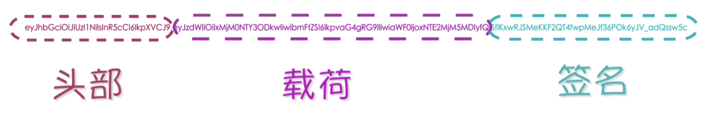

# 一 cookie

在http协议中有这样一项规则：

- 客户端和服务器端的沟通是无状态性的

- 即：服务器端不关心客户端是谁，服务器端只关心请求，只要请求来了，服务器端就会对请求作出响应，响应一旦结束，这次沟通也就随之结束了。当同一个客户端再向服务器端发送请求时，服务端并不知道客户端已经来过一次了，这就是无状态性。

- 这种特性在早期的网站应用中是没有问题的，因为早期的网站应用只是在页面当中展示一些文字，图片等数据，浏览网站的人并不会和网站发生交互

- 但是现代网站应用的需求是五花八门的：比如用户在电商网站中购物时，需要用户进行登录才能购买商品，如果用户不进行登录，是不能购买商品的。这个需求很合理。

- 在http协议中规定客户端和服务器端的沟通是无状态性的，谁也不认识谁，既然这样的话，如何才能实现登录功能呢？如何才能让服务端识别客户端的身份呢？

- - cookie：用来实现服务器端与客户端身份识别的一种技术

- 如何进行身份识别呢？

- - 点那个客户端第一次访问服务器端的时候，服务器端检测到当前这个客户端我并不认识，这个时候服务端在对客户端作出响应的同时还可以给客户端发一个小卡片（可以理解为服务端发给客户端的身份证，有了这个身份证，客户端就能证明是谁）
  - 此时在客户端的浏览器中就有了这个身份证了
  - 当客户端再一次访问服务器端，这个身份证（也就是cookie）会随着请求被自动发送到服务器端，服务器端拿到这个身份证，服务器端就知道客户端是谁了

# 二 视频学习Session和Cookie

https://www.bilibili.com/video/BV1s4411z7zq?from=search&seid=8082226497218378131

## 1.Cookie简介——是一种进行网络会话状态跟踪的技术

`情景`：没有登录，但是购物车里面有东西。

==**问题**：关掉当前页面， 然后重新打开京东，这时候购物车里面有没有东西？==

**答案**：有

==**问题**：重启电脑，再打开京东， 购物车里面有没有东西？==

**答案**：有。**说明这个数据不仅存放在客户端，而且是存放在客户端的硬盘上 ，不是放在内存里面的。**

==**问题**：如果换一台电脑，再打开京东，这个时候购物车里面有没有东西？==

**答案**：没有

* 会话由一组请求与响应组成
* 同类请求：资源路径相同的请求，资源名称可以不一样

 ## 2.火狐浏览器下查看和操作Cookie

## 3.服务端生成Cookie

上述情景，cookie写到了浏览器的缓存，为什么没写到硬盘呢？怎么写到硬盘呢？

==setMaxAge==

回答：设置Cookie的有效期。这个值为一个整型值，单位为秒。

* 该值大于0，表示将Cookie存放到客户端的硬盘
* 该值小于0，与不设置效果相同，会将Cookie存放到浏览器的缓存。
* 该值等于0，表示Cookie一生成，马上失效。

cookie有哪些属性：

* setMaxAge有效期
* setComment：specifies a comment that describes a cookie's purpose
* setDomain: specifies the domain within which this cookie should be presented
* setPath: specifies a path for the cookie to which the client should return the cookie
* setSecure: indicates to the browser whether the cookie should only be sent using a secure protocol,such as HTTPS or SSL(向浏览器指示cookie是否应该仅使用安全协议发送，如HTTPS或SSL) 
* 名称
* setValue: 内容
* setVersion:

## 4.服务端获取并解析Cookie

## 5.Cookie的禁用

## 6.Session——三个域属性空间的对比（这一节应该最后看）

## 8.Session的基本用法 12min处

Session和Cookie都是**会话**跟踪技术

 **会话：**当用户打开浏览器，从发出第一次请求开始，一直到最终关闭浏览器，就表示一次会话的完成。（作为用户来说能感知到的）

==**Session和Cookie的区别：**==

* Session：将会话状态保存在了服务器端。
* Cookie：将会话状态保存在了客户端

==**Session和Cookie的相同点：**==

* 两者都是由服务器生成

* getSession: Returns the current session associated with the request, or if the request does not have a session, creates one.
* getSession(boolean create): Returns the current HttpSession associated with this request or, if there is no current session and create is true, return a new session

## 9.Session的工作原理（面试重点）16min处

在服务器中系统会为每个会话维护一个Session。

不同的会话，对应不同的Session。

==那么系统是如何识别各个Session对象的？==

==即是如何做到在同一会话过程中，一直使用的是同一个Session对象呢？==

两个浏览器，是两个窗口，是两次会话，所以session对象不一样。

在创建session时，服务器在底层会创建一个key为jsessionid的cookie对象。

在前面学习cookie的时候，没记得里面有jsessionid这个东西呀？？？？

==jsessionid这个东西有个前提，就是我们要使用getSession（）方法。才能生成32位长度的字符串和session对象。==

## 10.Session的失效

## 11.Cookie禁用后的Session

从用户角度来说，什么叫一次会话？

打开浏览器，在里面操作，然后关闭浏览器。

但是对于服务器来说，

客户端第一次访问我（服务端），会话开始了，Session失效的时候会话才结束。并不是说客户端把浏览器关了，会话就结束了。

## 12.Cookie禁用后重定向跳转时Session的跟踪

## 13.Cookie禁用后非重定向跳转时Session的跟踪（要看！还没看）

# 3.JWT

https://www.bilibili.com/video/BV1134y1g7VC/?spm_id_from=333.337.search-card.all.click&vd_source=a7089a0e007e4167b4a61ef53acc6f7e

## 3.1 什么是JWT及其特点

JSON Web Token

- JWT是一种用于在网络应用之间安全传递信息的开放标准，通常JWT用于身份验证和非敏感数据的传递
- 设计JWT的主要目标：在不需要服务器端存储状态的情况下，安全地传递**非敏感信息**给受信任的实体
- ‘
- 解码后：
- 

## 3.2 JWT的应用场景

## 3.3 与其他认证方式的对比

- API Key
- cookie session

