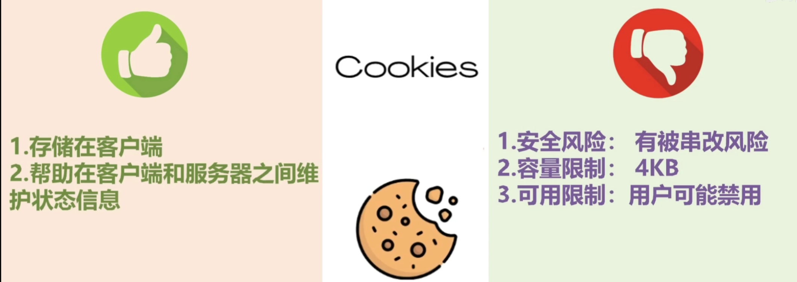
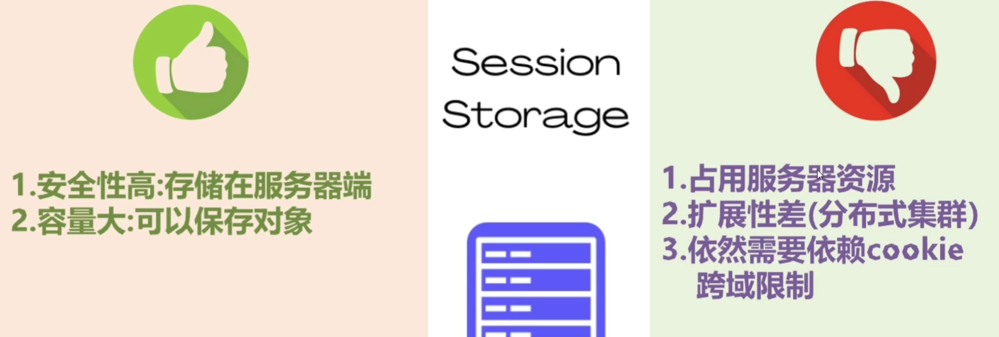

# 1. 如何用cookie保持登录状态

早期使用Cookie维护登录状态的方法主要包括生成会话ID（Session ID），将其存储在客户端的Cookie中，并在每次请求时验证该会话ID。下面是一个用Koa实现这一过程的示例，并详细解释其原理。

## 安装依赖

首先，安装Koa及其相关中间件：

```bash
npm install koa koa-router koa-bodyparser koa-cookie
```

## Koa服务器示例

```javascript
const Koa = require('koa');
const Router = require('koa-router');
const bodyParser = require('koa-bodyparser');
const cookie = require('koa-cookie').default;
const crypto = require('crypto');

const app = new Koa();
const router = new Router();

app.use(bodyParser());
app.use(cookie());

const users = { 'user1': 'password1' };  // 示例用户
const sessions = {};  // 存储会话信息

// 登录路由
router.post('/login', ctx => {
    const { username, password } = ctx.request.body;
    if (users[username] && users[username] === password) {
        const sessionId = crypto.randomBytes(16).toString('hex');
        sessions[sessionId] = username;
        ctx.cookies.set('sessionId', sessionId, { httpOnly: true });
        ctx.body = { message: 'Logged in' };
    } else {
        ctx.status = 401;
        ctx.body = { message: 'Invalid credentials' };
    }
});

// 受保护路由
router.get('/protected', ctx => {
    const sessionId = ctx.cookies.get('sessionId');
    if (sessionId && sessions[sessionId]) {
        ctx.body = { message: `Hello, ${sessions[sessionId]}` };
    } else {
        ctx.status = 401;
        ctx.body = { message: 'Not authenticated' };
    }
});

// 注销路由
router.post('/logout', ctx => {
    const sessionId = ctx.cookies.get('sessionId');
    if (sessionId) {
        delete sessions[sessionId];
        ctx.cookies.set('sessionId', null);
    }
    ctx.body = { message: 'Logged out' };
});

app.use(router.routes()).use(router.allowedMethods());

app.listen(3000, () => {
    console.log('Server running on port 3000');
});
```

## 原理解释

1. **用户登录**：
   - 用户在客户端提交用户名和密码。
   - 服务器验证用户凭据是否正确。
   - 如果验证成功，服务器生成一个唯一的会话ID，并将其与用户名关联存储在服务器的会话存储（这里是一个简单的对象`sessions`）。
   - 服务器通过`Set-Cookie`头将会话ID发送到客户端，并在客户端设置Cookie。

2. **客户端请求**：
   - 客户端每次向服务器发送请求时，浏览器会自动附带Cookie。
   - 服务器从请求的Cookie中读取会话ID，并在服务器的会话存储中查找该会话ID。
   - 如果会话ID存在且有效，服务器认为用户已登录，并处理请求。

3. **受保护的资源**：
   - 对受保护的资源进行请求时，服务器会检查请求中的会话ID。
   - 如果会话ID有效，服务器返回相应的资源。
   - 如果会话ID无效或不存在，服务器返回未认证的响应（如401状态码）。

4. **注销**：
   - 用户请求注销时，服务器删除会话存储中的会话ID，并清除客户端的Cookie。
   - 这样，客户端后续的请求将不会被视为已登录。

## 安全注意事项

- **使用HTTPS**：确保所有通信都是加密的，以防止会话ID被窃取。
- **设置HttpOnly属性**：防止客户端JavaScript访问Cookie，提高安全性。
- **使用Secure属性**：确保Cookie仅通过HTTPS传输（在生产环境中应启用）。
- **管理会话生命周期**：设置会话过期时间，定期清理过期会话。

## 总结

通过上述步骤和示例代码，可以看到如何在Koa框架中使用Cookie维护登录状态。这种方法在早期Web开发中非常常见，尽管现代应用中可能会使用更复杂的方案，如JWT（JSON Web Token）或OAuth来处理认证和授权。

# 2. 如何用session保持登录状态

# [0. Cookie，Session，Token的区别](https://www.bilibili.com/video/BV1ob4y1Y7Ep/?spm_id_from=333.880.my_history.page.click&vd_source=a7089a0e007e4167b4a61ef53acc6f7e)

# [0. Cookie，Session，Token的区别](https://www.bilibili.com/video/BV1at421G7YC/?spm_id_from=333.880.my_history.page.click&vd_source=a7089a0e007e4167b4a61ef53acc6f7e)





# 0. Cookie

在HTTP协议中有这样一项规则：

- 客户端和服务器端的沟通是无状态性的
- 即：服务器端不关心客户端是谁，服务器端只关心请求，只要请求来了，服务器端就会对请求作出响应，响应一旦结束，这次沟通也就随之结束。当同一个客户端再向服务器端发送请求时，服务端并不知道客户端已经来过一次了，这就是无状态性。
- 这种特性在早期的网站应用中是没有问题的，因为早期的网站应用只是在页面当中展示一些文字，图片等数据，浏览网站的人并不会和网站发生交互
- 但是现代网站应用的需求是五花八门的：比如用户在电商网站中购物时，需要用户进行登录才能购买商品，如果用户不进行登录，是不能购买商品的。这个需求很合理。
- 在http协议中规定客户端和服务器端的沟通是无状态性的，谁也不认识谁，既然这样的话，如何才能实现登录功能呢？如何才能让服务端识别客户端的身份呢？
  - cookie：用来实现服务器端与客户端身份识别的一种技术

- 如何进行身份识别呢？
  - 客户端第一次访问服务器端的时候，服务器端检测到当前这个客户端我并不认识，这个时候服务端在对客户端作出响应的同时还可以给客户端发一个小卡片（可以理解为服务端发给客户端的身份证，有了这个身份证，客户端就能证明是谁）
  - 此时在客户端的浏览器中就有了这个身份证了
  - 当客户端再一次访问服务器端，这个身份证（也就是cookie）会随着请求被自动发送到服务器端，服务器端拿到这个身份证，服务器端就知道客户端是谁了

- 在HTTP协议中，Cookie 是一种用于在客户端（通常是浏览器）和服务器之间存储和传递信息的机制。Cookie 最常见的用途包括会话管理、用户个性化设置、跟踪用户行为等。

## Cookie 的创建和传递

### 1. 服务器设置 Cookie

服务器通过在HTTP响应头中包含一个 `Set-Cookie` 头部来设置 Cookie。例如：

```http
HTTP/1.1 200 OK
Set-Cookie: sessionId=abc123; Expires=Wed, 21 Oct 2021 07:28:00 GMT; Path=/; Domain=example.com; Secure; HttpOnly; SameSite=Lax
```

- **sessionId=abc123**: Cookie 的名称和值。
- **Expires=Wed, 21 Oct 2021 07:28:00 GMT**: Cookie 的过期时间。
- **Path=/**: Cookie 的作用路径，表示该 Cookie 对哪个路径下的请求有效。
- **Domain=example.com**: Cookie 的作用域，表示该 Cookie 对哪个域名下的请求有效。
- **Secure**: 表示该 Cookie 仅在 HTTPS 连接下有效。
- **HttpOnly**: 表示该 Cookie 不能通过 JavaScript 访问，增强安全性。
- **SameSite=Lax**: 用于防止跨站请求伪造（CSRF）攻击。可选值包括 `Strict`, `Lax`, `None`。

### 2. 客户端存储和发送 Cookie

浏览器收到 `Set-Cookie` 头后，会将 Cookie 存储起来，并在后续对该服务器的请求中，通过 `Cookie` 头部发送回服务器。例如：

```http
GET /page HTTP/1.1
Host: example.com
Cookie: sessionId=abc123
```

## Cookie 的行为和属性

### 1. 过期时间和持久化

- **Session Cookie**：未设置 `Expires` 或 `Max-Age` 属性的 Cookie，称为会话 Cookie。它们在浏览器关闭时失效。
- **Persistent Cookie**：设置了 `Expires` 或 `Max-Age` 属性的 Cookie，称为持久化 Cookie。它们会在指定的时间到期前一直保存在浏览器中。

### 2. 作用域

- **Path**：指定 Cookie 的有效路径。仅当请求路径匹配该路径时，浏览器才会发送该 Cookie。
- **Domain**：指定 Cookie 的有效域。仅当请求的域匹配该域或其子域时，浏览器才会发送该 Cookie。

### 3. 安全性

- **Secure**：指定 Cookie 只能在 HTTPS 连接下发送，防止 Cookie 在不安全的 HTTP 连接中被窃取。
- **HttpOnly**：防止 JavaScript 通过 `document.cookie` 访问 Cookie，有助于防止 XSS 攻击。
- **SameSite**：防止跨站请求伪造（CSRF）攻击。
  - `Strict`：浏览器只会在相同站点请求时发送 Cookie。
  - `Lax`：浏览器在一些跨站请求（如通过链接访问网站）时也会发送 Cookie，但在 POST 请求中不会发送。
  - `None`：浏览器会在所有跨站请求中发送 Cookie，需要搭配 `Secure` 属性使用。

## 实际示例

假设你正在访问 `https://example.com`，并且服务器返回了以下响应头：

```http
HTTP/1.1 200 OK
Set-Cookie: userId=789xyz; Expires=Wed, 21 Oct 2021 07:28:00 GMT; Path=/; Domain=example.com; Secure; HttpOnly; SameSite=Lax
```

### 1. 浏览器存储 Cookie
浏览器会将 `userId=789xyz` 这个 Cookie 存储起来。

### 2. 发送 Cookie
在后续对 `example.com` 的请求中，浏览器会包含以下 Cookie 头：

```http
GET /dashboard HTTP/1.1
Host: example.com
Cookie: userId=789xyz
```

### 3. 作用域和安全性
- **Path**：由于设置了 `Path=/`，这个 Cookie 会在 `example.com` 域下的所有路径中发送。
- **Domain**：由于设置了 `Domain=example.com`，这个 Cookie 会在 `example.com` 及其子域（如 `sub.example.com`）中发送。
- **Secure**：由于设置了 `Secure`，这个 Cookie 只会在 HTTPS 连接中发送。
- **HttpOnly**：由于设置了 `HttpOnly`，这个 Cookie 无法通过 JavaScript 访问。
- **SameSite**：由于设置了 `SameSite=Lax`，这个 Cookie 在某些跨站请求中也会发送，但在某些情况下（如 POST 请求）不会发送。

## 安全性注意事项

- **防止 XSS 攻击**：使用 `HttpOnly` 属性防止 JavaScript 访问 Cookie。
- **防止 CSRF 攻击**：使用 `SameSite` 属性防止跨站请求伪造攻击。
- **传输安全**：使用 `Secure` 属性确保 Cookie 只在 HTTPS 连接中发送，防止 Cookie 在传输过程中被窃取。

通过理解和正确使用 Cookie 的这些行为和属性，可以有效地管理会话、用户状态和安全性。

# [1. Cookie简介](https://www.bilibili.com/video/BV1s4411z7zq/?from=search&seid=8082226497218378131&vd_source=a7089a0e007e4167b4a61ef53acc6f7e)

`情景`：没有登录，但是购物车里面有东西

- **关掉当前页面**， 然后重新打开京东，这时购物车里有没有东西？
  - 有

- **重启电脑**，再打开京东， 购物车里有没有东西？
  - 有
  - **说明这个数据不仅存放在客户端，而且是存放在客户端的硬盘上 ，不是放在内存里面的**。因为内存里面的数据一关机就没了

- 如果换一台电脑，再打开京东，这时购物车里有没有东西？

  - 没有
  - **说明这种没登陆的场景下，数据是存放在客户端的，没有存放在服务端**

  

- cookie:  是1993年由网景公司前雇员发明的一种**进行网络会话状态跟踪的技术**

* 会话：由**一组**请求与响应组成，这些请求与响应是围绕一件事情的，是需要进行会话状态跟踪的
* 然而HTTP协议是一种无状态协议（就是这一次的请求响应与下一次的请求响应之间没有任何关系）
  * 比如在淘宝的某个页面中，你进行了登录操作。当你跳转到商品页时，服务端如何知道你是已经登陆的状态？
* 于是就出现了Cookie（弥补HTTP协议的无状态缺陷），**cookie是http协议的一部分**


* Cookie：是由服务器生成，保存在客户端的一种信息载体
* Cookie中存放着用户访问该站点的会话状态信息
* Cookie由若干键值对构成


- 用户在提交第一次请求后，由服务器生成Cookie，并将其封装到响应头中，以响应的形式发送给客户端
- 客户端收到这个响应后，将Cookie保存到客户端
- 当客户端再次发送同类请求时，请求中会携带保存在客户端的Cookie数据，发送到服务端，由服务器对会话进行跟踪

* 同类请求：资源路径相同的请求，资源名称可以不一样

# [2. 火狐浏览器下查看和操作Cookie](https://www.bilibili.com/video/BV1s4411z7zq/?p=2&spm_id_from=pageDriver&vd_source=a7089a0e007e4167b4a61ef53acc6f7e)

不同的浏览器，其Cookie的保存位置以及查看方式是不同的，删除了某一浏览器下的Cookie，不会影响到其他浏览器中的Cookie

# 3. chrome浏览器下查看Cookie

在Google Chrome浏览器中分析Cookies可以通过以下步骤进行：

## 1. 打开开发者工具
- 使用快捷键 `Ctrl+Shift+I`（Windows/Linux）或 `Cmd+Option+I`（Mac）。
- 或者右键点击页面，然后选择“检查”或“Inspect”。

## 2. 访问Application标签
- 在开发者工具中，点击顶部的“Application”标签。

## 3. 查找并点击“Cookies”
- 在左侧的侧边栏中，找到并点击“Cookies”。你会看到当前页面下所有设置了Cookies的域名列表。

## 4. 查看Cookie
- 点击你感兴趣的域名，会显示该域名下所有的Cookies。
- 你会看到一个包含Cookie详细信息的表格，包括以下列：
  - **Name**：Cookie的名称。
  - **Value**：Cookie的值。
  - **Domain**：Cookie所属的域名。
  - **Path**：Cookie所在的路径。
  - **Expires/Max-Age**：Cookie的过期时间或最大存活时间。
  - **Size**：Cookie的大小。
  - **HttpOnly**：是否为HttpOnly Cookie。
  - **Secure**：是否为Secure Cookie。
  - **SameSite**：Cookie的SameSite属性值。

## 5. 编辑和删除Cookie
- **编辑Cookie**：
  - 双击某个Cookie的值可以进行编辑。修改后按Enter键确认。
  
- **删除Cookie**：
  - 右键点击某个Cookie，然后选择“Delete”来删除它。
  - 或者选中某个Cookie，然后按Delete键删除。

## 示例
假设你在浏览一个使用Cookies进行身份验证的网站，并想分析存储的Cookie。以下是具体操作步骤：

1. **打开开发者工具**：
   - 使用快捷键 `Ctrl+Shift+I` 打开开发者工具。

2. **访问Application标签**：
   - 点击顶部的“Application”标签。

3. **查找并点击“Cookies”**：
   - 在左侧的侧边栏中，找到并点击“Cookies”。你会看到当前页面下所有设置了Cookies的域名列表。

4. **查看Cookie**：
   - 点击你感兴趣的域名。会显示该域名下所有的Cookies。
   - 每个Cookie都会显示其名称、值、域名、路径、过期时间等信息。

5. **分析Cookie**：
   - 例如，找到一个名为 `authToken` 的Cookie，可以看到它的值（假设这是你的身份验证令牌）。
   - 检查这个Cookie的“Expires”列，以确定它什么时候过期。
   - 检查“Secure”和“HttpOnly”列，以确定这个Cookie是否设置了安全标志。

通过上述步骤，你可以方便地在Google Chrome浏览器中分析和管理Cookies，了解网站如何使用Cookies来存储和传递信息。

# [4. 服务端生成Cookie](https://www.bilibili.com/video/BV1s4411z7zq/?p=3&spm_id_from=pageDriver&vd_source=a7089a0e007e4167b4a61ef53acc6f7e)

https://zhuanlan.zhihu.com/p/537637117

## 4.1 node设置简单的cookie

```js
const http = require('http')
const server = http.createServer((req, res) => {
  res.setHeader('Set-Cookie', 'msg=hello;')
  res.end('hello')
})
// 使用 res.setHeader 方法，第一个参数是 Set-Cookie，第二个参数是 cookie 的值
server.listen(8000)
```

## 4.2 限制前端修改和访问cookie

可以设置 `httpOnly`

表示该 Cookie 不能通过 JavaScript 访问，增强安全性

防止 JavaScript 通过 `document.cookie` 访问 Cookie，有助于防止 XSS 攻击

```js
res.setHeader('Set-Cookie', 'msg=hello; httpOnly;')
```

## 4.3 设置过期时间

如果你需要给 `cookie` 某个值设置过期时间，可以设置 `expires`

比如我想设置1天后过期

```js
const cookieExpires = () => {
  const d = new Date() // 获取当前时间
  d.setTime(d.getTime() + (24 * 60 * 60 * 1000))
  return d.toGMTString()
}
// 省略部分代码
res.setHeader('Set-Cookie', `msg=hello; expires=${cookieExpires()};`)
```

## 4.4 登录信息

如果是登录信息，通常会这样写：

```js
const http = require('http')
const cookieExpires = () => {
  const d = new Date() // 获取当前时间
  d.setTime(d.getTime() + (24 * 60 * 60 * 1000))
  return d.toGMTString()
}
const server = http.createServer((req, res) => {
  res.setHeader('Set-Cookie', `token=xxxx; path=/; httpOnly; expires=${cookieExpires()}`)
  res.end('hello')
})
server.listen(8000)
```

~~上述情景，cookie写到了浏览器的缓存，为什么没写到硬盘呢？怎么写到硬盘呢？~~

~~==setMaxAge==~~

~~回答：设置Cookie的有效期。这个值为一个整型值，单位为秒。~~

* ~~该值大于0，表示将Cookie存放到客户端的硬盘~~
* ~~该值小于0，与不设置效果相同，会将Cookie存放到浏览器的缓存。~~
* ~~该值等于0，表示Cookie一生成，马上失效。~~

# 5. 服务端获取并解析Cookie

## [5.1 获取Cookie](https://zhuanlan.zhihu.com/p/537637117)

```js
const http = require('http')
const server = http.createServer((req, res) => {
  const cookieStr = req.headers.cookie // 获取 cookie
  console.log(cookieStr) // 在控制台输出 cookie
})
server.listen(8000)
```

## [5.2 解析Cookie](https://zhuanlan.zhihu.com/p/537637117)

通过上面的方法获取到的 `cookie` 是一个格式为 `key1=value1; key2=value2; key3=value3` 的字符串

```js
// 解析 cookie
let cookie = {}
const cookieStr = req.headers.cookie || ''
cookieStr.split(';').forEach(item => {
  if (!item) {
    return
  }
  const arr = item.split('=')
  const key = arr[0].trim()
  const val = arr[1].trim()
  cookie[key] = val
  res.end()
})
server.listen(8000)
```

# 6. Cookie的禁用

- 如果用户把cookie禁用了，那些token是不是就传递不了了？


在Google Chrome中禁用Cookie，可以按照以下步骤进行：

### 禁用所有Cookie

1. **打开设置**：
   - 点击右上角的三点菜单按钮，然后选择“设置”。

2. **进入隐私和安全**：
   - 在左侧的菜单中，点击“隐私和安全”。

3. **进入Cookies和其他网站数据**：
   - 点击“Cookies和其他网站数据”。

4. **禁用所有Cookie**：
   - 选择“阻止所有Cookie（不推荐）”。

### 禁用第三方Cookie

如果你只想禁用第三方Cookie，可以选择“阻止第三方Cookie”。

### 注意事项

- **影响网站功能**：禁用所有Cookie会影响许多网站的正常功能，如登录状态、购物车等功能可能无法使用。
- **隐私和安全**：禁用Cookie可以提高隐私保护，防止第三方跟踪，但也可能导致一些站点无法正确加载或使用。

### 仅禁用第三方Cookie

如果你只想禁用第三方Cookie，而保留第一方Cookie，可以选择以下选项：

1. **打开设置**：
   - 点击右上角的三点菜单按钮，然后选择“设置”。

2. **进入隐私和安全**：
   - 在左侧的菜单中，点击“隐私和安全”。

3. **进入Cookies和其他网站数据**：
   - 点击“Cookies和其他网站数据”。

4. **禁用第三方Cookie**：
   - 选择“阻止第三方Cookie”。

通过以上步骤，你可以在Google Chrome中禁用Cookie或仅禁用第三方Cookie，具体取决于你的需求。

# 7. Session——三个域属性空间的对比

# [8. Session的基本用法 ](https://www.bilibili.com/video/BV1s4411z7zq/?p=8&spm_id_from=pageDriver&vd_source=a7089a0e007e4167b4a61ef53acc6f7e)

- Session和Cookie都是**会话**跟踪技术


- **会话：**当用户打开浏览器，从发出第一次请求开始，一直到最终关闭浏览器，就表示一次会话的完成。（作为用户来说能感知到的）

- **Session和Cookie的区别：**

  * Session：将会话状态保存在了服务器端

  * Cookie：将会话状态保存在了客户端


- **Session和Cookie的相同点：**
  * 两者都是由服务器生成


# [9. Session的工作原理](https://www.bilibili.com/video/BV1s4411z7zq/?p=9&spm_id_from=pageDriver&vd_source=a7089a0e007e4167b4a61ef53acc6f7e)

- 在服务器中系统会为每个会话维护一个Session

- 不同的会话，对应不同的Session
- ==那么系统是如何识别各个Session对象的？==
- ==即是如何做到在同一会话过程中，一直使用的是同一个Session对象呢？==

- 两个浏览器，是两个窗口，是两次会话，所以session对象不一样。

- 在创建session时，服务器在底层会创建一个key为jsessionid的cookie对象。

- 在前面学习cookie的时候，没记得里面有jsessionid这个东西呀？？？？

- ==jsessionid这个东西有个前提，就是我们要使用getSession（）方法。才能生成32位长度的字符串和session对象。==

# 10. Session的失效

# 11. Cookie禁用后的Session

从用户角度来说，什么叫一次会话？

打开浏览器，在里面操作，然后关闭浏览器。

但是对于服务器来说，

客户端第一次访问我（服务端），会话开始了，Session失效的时候会话才结束。并不是说客户端把浏览器关了，会话就结束了。

# 12. Cookie禁用后重定向跳转时Session的跟踪

# 13. Cookie禁用后非重定向跳转时Session的跟踪

# 14. session和cookie的区别

Session和Cookie是用于在客户端和服务器之间传递信息的两种不同机制。它们的主要区别在于存储位置、生命周期、数据容量和安全性等方面。以下是详细解释：

## 存储位置

- **Cookie**：
  - 存储在客户端（浏览器）中。每个Cookie是一个小的文本文件，由浏览器管理。
  - 浏览器在每次发送请求时，会自动携带相关的Cookie发送给服务器。

- **Session**：
  - 存储在服务器端。服务器为每个会话生成一个唯一的会话ID，并将会话ID存储在客户端的Cookie中。
  - 客户端只保存会话ID，而实际的会话数据保存在服务器端。

## 生命周期

- **Cookie**：
  - Cookie可以设置过期时间（`Expires`或`Max-Age`属性）。持久性Cookie在过期前保留在客户端，而会话Cookie（不设置过期时间）会在浏览器关闭时删除。
  - 持久性Cookie可以跨浏览器会话（浏览器关闭和重新打开）保存。

- **Session**：
  - 会话通常在用户关闭浏览器或会话超时时（服务器设置的会话超时时间）失效。
  - 会话数据在服务器端存储，默认情况下会在会话超时后自动删除。

## 数据容量

- **Cookie**：
  - 每个Cookie的大小通常限制在4KB左右。浏览器对每个域名下的Cookie数量和总大小也有限制。
  - 由于容量限制，Cookie只能存储少量信息。

- **Session**：
  - 服务器端存储会话数据，因此不受客户端存储限制。服务器可以存储大量数据，具体取决于服务器的存储能力和配置。

## 安全性

- **Cookie**：
  - Cookie容易受到跨站脚本（XSS）攻击，如果攻击者能够注入恶意脚本，就可以读取Cookie中的信息。
  - 可以设置`HttpOnly`和`Secure`属性来提高安全性。`HttpOnly`属性使Cookie无法通过JavaScript访问，`Secure`属性使Cookie只能通过HTTPS传输。

- **Session**：
  - 会话ID存储在客户端的Cookie中，但实际数据保存在服务器端，增加了数据安全性。
  - 会话ID如果被窃取，攻击者可以伪装成用户进行操作。为了防止这种情况，应该使用HTTPS和其他安全措施（如频繁更新会话ID）。

## 适用场景

- **Cookie**：
  - 适用于需要在客户端存储少量信息的场景，如用户偏好设置、跟踪用户行为等。
  - 可用于跨页面和跨会话持久化数据，但要注意容量和安全性限制。

- **Session**：
  - 适用于需要在服务器端存储大量信息的场景，如用户认证和授权、临时数据存储等。
  - 由于数据存储在服务器端，适合对数据安全性要求较高的应用。

## 示例代码（Koa）

以下示例展示了如何在Koa中使用Session和Cookie：

**使用Session**：

```javascript
const Koa = require('koa');
const Router = require('koa-router');
const bodyParser = require('koa-bodyparser');
const session = require('koa-session');

const app = new Koa();
const router = new Router();

app.keys = ['your-session-secret'];
const sessionConfig = {
  key: 'koa:sess',
  maxAge: 86400000,
  httpOnly: true,
  signed: true
};

app.use(session(sessionConfig, app));
app.use(bodyParser());

router.post('/login', ctx => {
  const { username } = ctx.request.body;
  ctx.session.username = username;
  ctx.body = { message: 'Logged in' };
});

router.get('/profile', ctx => {
  if (ctx.session.username) {
    ctx.body = { message: `Hello, ${ctx.session.username}` };
  } else {
    ctx.status = 401;
    ctx.body = { message: 'Not authenticated' };
  }
});

app.use(router.routes()).use(router.allowedMethods());

app.listen(3000);
```

**使用Cookie**：

```javascript
const Koa = require('koa');
const Router = require('koa-router');
const bodyParser = require('koa-bodyparser');

const app = new Koa();
const router = new Router();

app.use(bodyParser());

router.post('/login', ctx => {
  const { username } = ctx.request.body;
  ctx.cookies.set('username', username, { httpOnly: true, maxAge: 86400000 });
  ctx.body = { message: 'Logged in' };
});

router.get('/profile', ctx => {
  const username = ctx.cookies.get('username');
  if (username) {
    ctx.body = { message: `Hello, ${username}` };
  } else {
    ctx.status = 401;
    ctx.body = { message: 'Not authenticated' };
  }
});

app.use(router.routes()).use(router.allowedMethods());

app.listen(3000);
```

## 参考资料

- [MDN Web Docs - HTTP Cookies](https://developer.mozilla.org/en-US/docs/Web/HTTP/Cookies)
- [OWASP - Session Management Cheat Sheet](https://cheatsheetseries.owasp.org/cheatsheets/Session_Management_Cheat_Sheet.html)
- [Koa.js 官方文档](https://koajs.com/)

通过理解Session和Cookie的区别，可以根据具体应用场景选择合适的方案来管理用户的登录状态和会话信息。

# 1. JWT——JSON Web Token

https://www.bilibili.com/video/BV1134y1g7VC/?spm_id_from=333.337.search-card.all.click&vd_source=a7089a0e007e4167b4a61ef53acc6f7e

## 1.1 什么是JWT及其特点


- JWT是一种用于在网络应用之间安全传递信息的开放标准，通常JWT用于身份验证和非敏感数据的传递
- 设计JWT的主要目标：在不需要服务器端存储状态的情况下，安全地传递**非敏感信息**给受信任的实体
- ‘
- 解码后：
- 

## 1.2 JWT的应用场景

## 1.3 与其他认证方式的对比

- API Key
- cookie session

# [2. JWT——JSON Web Token](https://www.bilibili.com/video/BV1tJ411B7yJ?p=1&vd_source=a7089a0e007e4167b4a61ef53acc6f7e)

一般用于用户认证（前后端分离的项目）

## [2.1 基于传统Token实现用户认证](https://www.bilibili.com/video/BV1tJ411B7yJ?p=2&spm_id_from=pageDriver&vd_source=a7089a0e007e4167b4a61ef53acc6f7e)

- 用户登录，服务端给客户端返回token，并将token保存在服务端（该token可使用uuid生成）
- 以后用户再来访问时，需要携带token，服务端获取token后，再去数据库中获取token进行校验

## [2.2 基于JWT实现用户认证](https://www.bilibili.com/video/BV1tJ411B7yJ?p=2&spm_id_from=pageDriver&vd_source=a7089a0e007e4167b4a61ef53acc6f7e)

- 用户登录，服务端给客户端返回token，服务端不保存token
- 以后用户再来访问时，需要携带token，服务端获取token后，再对token进行校验

- 优势：相较于传统的token，无需在服务端保存token

## [2.3 JWT实现原理](https://www.bilibili.com/video/BV1tJ411B7yJ?p=3&spm_id_from=pageDriver&vd_source=a7089a0e007e4167b4a61ef53acc6f7e)

https://jwt.io/

- 用户提交用户名和密码给服务端，如果登录成功，使用jwt创建一个token，并给用户返回


### 2.3.1 JWT第一段字符串

```javascript
let temp = JSON.stringify({
  "alg": "HS256",
  "typ": "JWT"
})
// temp: '{"alg":"HS256","typ":"JWT"}'
// 注意：btoa函数只能处理ASCII字符串，如果你需要编码的字符串包含非ASCII字符，需要先将字符串转换为UTF-8编码的字节，再进行Base64编码
// eyJhbGciOiJIUzI1NiIsInR5cCI6IkpXVCJ9
```

https://base64.us/


### 2.3.2 JWT第二段字符串

```javascript
let temp = JSON.stringify({
  "sub": "1234567890",
  "name": "John Doe",
  "iat": 1516239022
})
// temp: '{"sub":"1234567890","name":"John Doe","iat":1516239022}'
// eyJzdWIiOiIxMjM0NTY3ODkwIiwibmFtZSI6IkpvaG4gRG9lIiwiaWF0IjoxNTE2MjM5MDIyfQ==
```

### 2.3.3 JWT第三段字符串

- eyJhbGciOiJIUzI1NiIsInR5cCI6IkpXVCJ9
- eyJzdWIiOiIxMjM0NTY3ODkwIiwibmFtZSI6IkpvaG4gRG9lIiwiaWF0IjoxNTE2MjM5MDIyfQ==
- eyJhbGciOiJIUzI1NiIsInR5cCI6IkpXVCJ9eyJzdWIiOiIxMjM0NTY3ODkwIiwibmFtZSI6IkpvaG4gRG9lIiwiaWF0IjoxNTE2MjM5MDIyfQ==

- HS256加密——HMAC-SHA256
- SHA——Secure Hash Algorithm
- 


- 以后用户再来访问的时候，需要携带token，后端需要对token进行校验
  - 获取token
  - 
  - 22min处

# 3. HS256加密——HMAC-SHA256

- signing algorithm——签名算法
- signature——签名
- encryption——加密
- signatures are not encryptions
- signing jwt doesn't make the data unreadable, signatures only allow verification that the content of the jwt hasn't changed 
- what are jwt signatures?
  - 
  - 
- HMAC-SHA256：a symmetric keyed hashing algorithm(对称密钥哈希算法) that uses one secret key
- symmetric means two parties share the secret key
- the key is used for both generating the signature and validating the signatur

# 4. 代码实践

在JavaScript中，可以使用`crypto-js`库来对一段字符串进行HS256加密（实际上是进行HMAC-SHA256签名）。以下是具体步骤：

1. **安装`crypto-js`库**：

如果你使用Node.js环境，请先安装`crypto-js`库：

```bash
npm install crypto-js
```

2. **使用`crypto-js`进行HS256加密**：

以下是一个示例代码，展示如何使用`crypto-js`库对一段字符串进行HS256加密：

```javascript
// 引入crypto-js库
const CryptoJS = require('crypto-js');

// 要签名的字符串
const message = "Hello, world!";

// 签名密钥
const secretKey = 'your-256-bit-secret';

// 进行HMAC-SHA256签名
const hash = CryptoJS.HmacSHA256(message, secretKey);

// 转换为Base64字符串
const hashInBase64 = CryptoJS.enc.Base64.stringify(hash);

console.log('HMAC-SHA256加密后的Base64字符串:', hashInBase64);
```

### 解释
- `CryptoJS.HmacSHA256`：使用HMAC-SHA256算法对消息进行签名。
- `CryptoJS.enc.Base64.stringify`：将签名结果转换为Base64编码的字符串。

### 浏览器环境使用
如果你在浏览器环境中使用，可以直接引入`crypto-js`库：

```html
<!DOCTYPE html>
<html lang="en">
<head>
    <meta charset="UTF-8">
    <title>HS256 Encryption</title>
    <script src="https://cdnjs.cloudflare.com/ajax/libs/crypto-js/4.1.1/crypto-js.min.js"></script>
</head>
<body>
    <script>
        // 要签名的字符串
        const message = "Hello, world!";

        // 签名密钥
        const secretKey = 'your-256-bit-secret';

        // 进行HMAC-SHA256签名
        const hash = CryptoJS.HmacSHA256(message, secretKey);

        // 转换为Base64字符串
        const hashInBase64 = CryptoJS.enc.Base64.stringify(hash);

        console.log('HMAC-SHA256加密后的Base64字符串:', hashInBase64);
    </script>
</body>
</html>
```

通过以上代码，你可以在Node.js和浏览器环境中对字符串进行HS256加密（签名），并得到Base64编码的结果。

# [0.预备知识](https://app.pluralsight.com/ilx/video-courses/ae8db6a7-8781-4022-8fe5-3af32fa0caf0/db2d63cb-f9c9-4b29-b96a-e3c3497dc385/6ce4d3af-095c-4635-bdb2-44a94dc2f68e)

# 0. js-cookie库

`js-cookie` 是一个轻量级的 JavaScript 库，用于简化操作浏览器 Cookies。它提供了简单的方法来创建、读取和删除 Cookies，可以用于存储和管理用户的会话信息、偏好设置等数据。`js-cookie` 的 API 设计简洁直观，适合在前端项目中使用。

### 安装

可以通过 npm、yarn 或直接在 HTML 文件中引用 CDN 链接来安装 `js-cookie`。

#### 使用 npm 安装
```bash
npm install js-cookie
```

#### 使用 yarn 安装
```bash
yarn add js-cookie
```

#### 使用 CDN
```html
<script src="https://cdn.jsdelivr.net/npm/js-cookie@3.0.1/dist/js.cookie.min.js"></script>
```

### 基本用法

#### 导入库
```javascript
// 使用 ES6 模块导入
import Cookies from 'js-cookie';

// 或者使用 CommonJS 导入
const Cookies = require('js-cookie');
```

#### 设置 Cookie
```javascript
// 设置一个名为 'token' 的 Cookie，值为 'your_token_here'
Cookies.set('token', 'your_token_here');

// 设置一个带有过期时间的 Cookie，过期时间为 7 天
Cookies.set('token', 'your_token_here', { expires: 7 });

// 设置一个带有路径的 Cookie，路径为根路径
Cookies.set('token', 'your_token_here', { path: '/' });

// 设置一个带有 HttpOnly 和 Secure 标志的 Cookie（这些标志需要在服务器端设置）
Cookies.set('token', 'your_token_here', { secure: true });
```

#### 获取 Cookie
```javascript
// 获取名为 'token' 的 Cookie 的值
const token = Cookies.get('token');
console.log(token); // 输出：'your_token_here'
```

#### 删除 Cookie
```javascript
// 删除名为 'token' 的 Cookie
Cookies.remove('token');

// 删除名为 'token' 并且路径为根路径的 Cookie
Cookies.remove('token', { path: '/' });
```

### 示例：在 React 项目中使用 `js-cookie`

以下是一个在 React 项目中使用 `js-cookie` 管理认证 Token 的示例。

#### 安装 `js-cookie`
```bash
npm install js-cookie
```

#### 创建一个简单的认证管理器
```javascript
// src/auth.js
import Cookies from 'js-cookie';

const TOKEN_KEY = 'auth_token';

export const setToken = (token) => {
  Cookies.set(TOKEN_KEY, token, { expires: 7 });
};

export const getToken = () => {
  return Cookies.get(TOKEN_KEY);
};

export const removeToken = () => {
  Cookies.remove(TOKEN_KEY);
};
```

#### 在 React 组件中使用
```javascript
// src/App.js
import React, { useState, useEffect } from 'react';
import { setToken, getToken, removeToken } from './auth';

const App = () => {
  const [token, setTokenState] = useState(null);

  useEffect(() => {
    const token = getToken();
    setTokenState(token);
  }, []);

  const handleLogin = () => {
    const token = 'sample_token';
    setToken(token);
    setTokenState(token);
  };

  const handleLogout = () => {
    removeToken();
    setTokenState(null);
  };

  return (
    <div>
      <h1>{token ? 'Logged In' : 'Logged Out'}</h1>
      <button onClick={handleLogin}>Login</button>
      <button onClick={handleLogout}>Logout</button>
    </div>
  );
};

export default App;
```

通过 `js-cookie`，你可以轻松地在浏览器中管理 Cookie，提高代码的可读性和可维护性。


