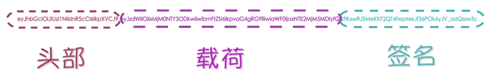

# [1. JWT——JSON Web Token](https://www.bilibili.com/video/BV1134y1g7VC/?spm_id_from=333.337.search-card.all.click&vd_source=a7089a0e007e4167b4a61ef53acc6f7e)

> 这是定义JWT的标准文档，详细描述了JWT的结构、编码、解码以及使用方法。你可以通过以下链接查看RFC 7519的正式文档：
>
> - [RFC 7519: JSON Web Token (JWT)](https://tools.ietf.org/html/rfc7519)
>
> 在这份文档中，你将找到关于JWT的规范和详细描述，包括它的头部、有效负载和签名部分的结构和格式。

## 1.1 什么是JWT及其特点


- JWT是一种用于在网络应用之间安全传递信息的开放标准，通常JWT用于身份验证和非敏感数据的传递
- 设计JWT的主要目标：在不需要服务器端存储状态的情况下，安全地传递**非敏感信息**给受信任的实体
  - 为什么强调非敏感的信息？
    - 因为我们常用的JWT中传递的信息并没有加密，这意味着任何人截取JWT之后，都能读取其中的内容
    - **注意：常见的JWT实现，它的头部和载荷是没有加密的，所以它的目的并不是想隐藏数据，它的目的是防止数据被篡改。这点是通过第三部分签名来实现的。**

‘

- 解码后：

- alg：algorithm

- |  |  |
  | ------------------------------------------------------------ | ------------------------------------------------------------ |

## [1.2 JWT的应用场景](https://www.bilibili.com/video/BV1UQ4y1W7MC/?spm_id_from=pageDriver&vd_source=a7089a0e007e4167b4a61ef53acc6f7e)

- 用户身份认证
- 密码重置和电子邮件验证

## 1.3 与其他认证方式的对比

- API Key？？
- cookie session
- 

# [2. JWT——JSON Web Token](https://www.bilibili.com/video/BV1tJ411B7yJ?p=1&vd_source=a7089a0e007e4167b4a61ef53acc6f7e)

- 一般用于用户认证（前后端分离的项目）


## [2.1 基于传统Token实现用户认证](https://www.bilibili.com/video/BV1tJ411B7yJ?p=2&spm_id_from=pageDriver&vd_source=a7089a0e007e4167b4a61ef53acc6f7e)

- 用户登录，服务端给客户端返回token，并将token保存在服务端（该token可使用uuid生成）
- 以后用户再来访问时，需要携带token，服务端获取token后，再去数据库中获取token进行校验

## [2.2 基于JWT实现用户认证](https://www.bilibili.com/video/BV1tJ411B7yJ?p=2&spm_id_from=pageDriver&vd_source=a7089a0e007e4167b4a61ef53acc6f7e)

- 用户登录，服务端给客户端返回token，服务端不保存token
- 以后用户再来访问时，需要携带token，服务端获取token后，再对token进行校验

- 优势：相较于传统的token，无需在服务端保存token

## [2.3 JWT实现原理](https://www.bilibili.com/video/BV1tJ411B7yJ?p=3&spm_id_from=pageDriver&vd_source=a7089a0e007e4167b4a61ef53acc6f7e)

https://jwt.io/

- 用户提交用户名和密码给服务端，如果登录成功，使用jwt创建一个token，并给用户返回


### 2.3.1 JWT第一段字符串

```javascript
let temp = JSON.stringify({
  "alg": "HS256",
  "typ": "JWT"
})
// temp: '{"alg":"HS256","typ":"JWT"}'
// 注意：btoa函数只能处理ASCII字符串，如果你需要编码的字符串包含非ASCII字符，需要先将字符串转换为UTF-8编码的字节，再进行Base64编码
// eyJhbGciOiJIUzI1NiIsInR5cCI6IkpXVCJ9
```

https://base64.us/


### 2.3.2 JWT第二段字符串

```javascript
let temp = JSON.stringify({
  "sub": "1234567890",
  "name": "John Doe",
  "iat": 1516239022
})
// temp: '{"sub":"1234567890","name":"John Doe","iat":1516239022}'
// eyJzdWIiOiIxMjM0NTY3ODkwIiwibmFtZSI6IkpvaG4gRG9lIiwiaWF0IjoxNTE2MjM5MDIyfQ==
```

### 2.3.3 JWT第三段字符串

- 第一段：eyJhbGciOiJIUzI1NiIsInR5cCI6IkpXVCJ9
- 第二段：eyJzdWIiOiIxMjM0NTY3ODkwIiwibmFtZSI6IkpvaG4gRG9lIiwiaWF0IjoxNTE2MjM5MDIyfQ==
- 第一段和第二段拼接：
  - eyJhbGciOiJIUzI1NiIsInR5cCI6IkpXVCJ9.eyJzdWIiOiIxMjM0NTY3ODkwIiwibmFtZSI6IkpvaG4gRG9lIiwiaWF0IjoxNTE2MjM5MDIyfQ==

- HS256加密——HMAC-SHA256
- SHA——Secure Hash Algorithm


- 以后用户再来访问的时候，需要携带token，后端需要对token进行校验
  - 获取token
  - 

> 注意：HS256不能反解。（即第三段不能反解）

- 22min处

# 3. 代码实践

在JavaScript中，可以使用`crypto-js`库来对一段字符串进行HS256加密（实际上是进行HMAC-SHA256签名）。以下是具体步骤：

1. **安装`crypto-js`库**：

如果你使用Node.js环境，请先安装`crypto-js`库：

```bash
npm install crypto-js
```

2. **使用`crypto-js`进行HS256加密**：

以下是一个示例代码，展示如何使用`crypto-js`库对一段字符串进行HS256加密：

```javascript
// 引入crypto-js库
const CryptoJS = require('crypto-js');

// 要签名的字符串
const message = "Hello, world!";

// 签名密钥
const secretKey = 'your-256-bit-secret';

// 进行HMAC-SHA256签名
const hash = CryptoJS.HmacSHA256(message, secretKey);

// 转换为Base64字符串
const hashInBase64 = CryptoJS.enc.Base64.stringify(hash);

console.log('HMAC-SHA256加密后的Base64字符串:', hashInBase64);
```

### 解释

- `CryptoJS.HmacSHA256`：使用HMAC-SHA256算法对消息进行签名。
- `CryptoJS.enc.Base64.stringify`：将签名结果转换为Base64编码的字符串。

### 浏览器环境使用

如果你在浏览器环境中使用，可以直接引入`crypto-js`库：

```html
<!DOCTYPE html>
<html lang="en">
<head>
    <meta charset="UTF-8">
    <title>HS256 Encryption</title>
    <script src="https://cdnjs.cloudflare.com/ajax/libs/crypto-js/4.1.1/crypto-js.min.js"></script>
</head>
<body>
    <script>
        // 要签名的字符串
        const message = "Hello, world!";

        // 签名密钥
        const secretKey = 'your-256-bit-secret';

        // 进行HMAC-SHA256签名
        const hash = CryptoJS.HmacSHA256(message, secretKey);

        // 转换为Base64字符串
        const hashInBase64 = CryptoJS.enc.Base64.stringify(hash);

        console.log('HMAC-SHA256加密后的Base64字符串:', hashInBase64);
    </script>
</body>
</html>
```

通过以上代码，你可以在Node.js和浏览器环境中对字符串进行HS256加密（签名），并得到Base64编码的结果。

# [4. 预备知识](https://app.pluralsight.com/ilx/video-courses/ae8db6a7-8781-4022-8fe5-3af32fa0caf0/db2d63cb-f9c9-4b29-b96a-e3c3497dc385/6ce4d3af-095c-4635-bdb2-44a94dc2f68e)

> courses on OAuth
>
> courses on OpenID Connect
>
> cources on API seucurity

- fundamental 基本原理
- affectionately 亲切地 挚爱地