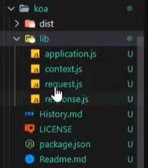

# Koa中间件的原理，如何手写一个中间件

Koa 是一个基于 Node.js 的轻量级 Web 框架，它的核心是基于中间件的机制。Koa 中间件机制的设计灵感来源于“洋葱模型”（onion model），即请求在中间件链条中从外层向内层流动，然后从内层返回外层。理解这个机制有助于理解 Koa 的工作原理。

### Koa 中间件的原理

Koa 中间件的基本形式是一个异步函数，接受两个参数：`ctx`（上下文对象）和 `next`（下一个中间件函数）。当一个中间件被执行时，它可以做三件事：

1. **处理请求**：可以直接处理请求，比如设置响应状态码或响应体。
2. **调用 `next()` 传递控制权**：调用 `await next()` 将控制权交给下一个中间件，等待下一个中间件执行完成后再继续执行当前中间件后续的代码。
3. **处理响应**：在 `next()` 之后的代码可以用于处理响应，通常是在所有后续中间件执行完毕后进行一些清理操作或修改响应。

### “洋葱模型”示例

假设有三个中间件：A、B、C，执行顺序如下：

1. A（上半部分）执行
2. B（上半部分）执行
3. C 执行（没有 `next()` 了）
4. B（下半部分）执行
5. A（下半部分）执行

这类似于“洋葱”一层层剥开和再包裹的过程。

```javascript
app.use(async (ctx, next) => {
  console.log('A - start');
  await next();
  console.log('A - end');
});

app.use(async (ctx, next) => {
  console.log('B - start');
  await next();
  console.log('B - end');
});

app.use(async ctx => {
  console.log('C');
  ctx.body = 'Hello Koa';
});
```

### 手写一个 Koa 中间件

我们来手写一个简单的 Koa 中间件。假设我们要实现一个记录请求时间的中间件。

```javascript
const Koa = require('koa');
const app = new Koa();

// 定义中间件
const requestTimeMiddleware = async (ctx, next) => {
  const start = Date.now(); // 请求开始时间
  await next(); // 传递控制权给下一个中间件
  const end = Date.now(); // 请求结束时间
  const duration = end - start; // 计算处理时间
  console.log(`${ctx.method} ${ctx.url} - ${duration}ms`); // 输出到控制台
  ctx.set('X-Response-Time', `${duration}ms`); // 将时间信息添加到响应头
};

// 使用中间件
app.use(requestTimeMiddleware);

// 添加一个简单的响应
app.use(ctx => {
  ctx.body = 'Hello Koa';
});

// 启动服务器
app.listen(3000, () => {
  console.log('Server is running on http://localhost:3000');
});
```

### 解释
1. **`requestTimeMiddleware` 中间件**：
   - 在请求处理之前记录开始时间。
   - 调用 `await next()` 将控制权传递给下一个中间件。
   - 等待下一个中间件完成后记录结束时间，计算出请求处理的总时长。
   - 打印请求方法、URL 和处理时长，并将其添加到响应头中。

2. **使用中间件**：`app.use(requestTimeMiddleware)` 将中间件注册到 Koa 实例中。

3. **处理请求**：第二个中间件负责处理请求并设置响应体。这个中间件通常是处理业务逻辑的地方。

### 总结

Koa 中间件的核心原理是基于“洋葱模型”的函数链式调用。每个中间件通过 `await next()` 来决定是否将控制权传递给下一个中间件，并在控制权返回后进行后续操作。手写一个中间件时，通常需要执行一些操作后再调用 `await next()`，然后处理响应相关的逻辑。

# Koa调用next就可调用下一个中间件，其原理是什么

Koa 中间件调用 `next()` 可以调用下一个中间件的原理，源自于 Koa 内部的中间件执行机制。这一机制基于一个函数队列，通过递归或迭代的方式依次调用每个中间件。

### 简化版的 Koa 中间件机制内部实现

以下是一个简化版的 Koa 实现，包括了中间件的注册和调用机制。

```javascript
class Koa {
  constructor() {
    this.middlewares = []; // 用于存储中间件的数组
  }

  // 注册中间件方法
  use(middleware) {
    this.middlewares.push(middleware); // 将中间件添加到队列
  }

  // 中间件执行器，使用递归方式
  compose(ctx) {
    const dispatch = (i) => {
      if (i >= this.middlewares.length) return Promise.resolve(); // 如果所有中间件执行完，返回一个已解决的Promise
      const middleware = this.middlewares[i]; // 获取当前中间件
      return Promise.resolve(middleware(ctx, () => dispatch(i + 1))); // 执行中间件，并传递下一个中间件的执行函数
    };
    return dispatch(0); // 从第一个中间件开始执行
  }

  // 模拟请求处理
  handleRequest(ctx) {
    this.compose(ctx).then(() => {
      console.log('All middlewares executed');
    });
  }
}

// 创建 Koa 实例
const app = new Koa();

// 注册中间件
app.use(async (ctx, next) => {
  console.log('Middleware 1 start');
  await next(); // 调用下一个中间件
  console.log('Middleware 1 end');
});

app.use(async (ctx, next) => {
  console.log('Middleware 2 start');
  await next(); // 调用下一个中间件
  console.log('Middleware 2 end');
});

app.use(async (ctx, next) => {
  console.log('Middleware 3 start');
  // 最后一个中间件不调用 next
  console.log('Middleware 3 end');
});

// 模拟请求的上下文对象
const ctx = {};

// 调用中间件处理请求
app.handleRequest(ctx);
```

### 解释

1. **`Koa` 类**：
   - **`middlewares` 数组**：用于存储注册的中间件函数。
   - **`use(middleware)` 方法**：用于注册中间件，将中间件函数添加到 `middlewares` 数组中。
   - **`compose(ctx)` 方法**：这是中间件的核心执行器，使用递归的方式执行中间件。`dispatch(i)` 函数根据当前的中间件索引 `i` 依次调用中间件，并将 `dispatch(i + 1)` 作为 `next()` 传递给中间件，形成链式调用。

2. **中间件执行**：
   - 当调用 `await next()` 时，控制权传递给下一个中间件，直到所有中间件执行完毕。
   - 执行完成后，控制权按顺序返回，每个中间件的后续代码（即 `await next()` 之后的部分）会依次执行。

3. **调用过程**：
   - 第一个中间件执行 `await next()` 后，将控制权传递给第二个中间件，第二个中间件同样调用 `await next()` 将控制权传递给第三个中间件。
   - 第三个中间件执行完毕后，控制权依次返回给第二个、然后是第一个中间件，最终完成整个中间件链的执行。

### 输出结果
运行上面的代码，输出结果如下：
```plaintext
Middleware 1 start
Middleware 2 start
Middleware 3 start
Middleware 3 end
Middleware 2 end
Middleware 1 end
All middlewares executed
```

### 总结

Koa 中间件的执行依赖于 `compose` 函数的递归调用。通过依次调用中间件并将 `next()` 函数传递给它们，Koa 实现了中间件的链式执行。当你在中间件中调用 `await next()` 时，实际上是调用了下一个中间件，控制权在每个中间件之间传递，从而形成了一个类似“洋葱”的执行模型。

# [Koa的上下文实现](https://www.bilibili.com/video/BV19M4y1G71B?p=1&vd_source=a7089a0e007e4167b4a61ef53acc6f7e)


|  |  |
| ------------------------------------------------------------ | ------------------------------------------------------------ |


怎么将req,res参数合并成一个——ctx？？？

ctx是koa自己封装的一个对象，内部包含了node中`http模块`中的原生`req`和`res`，但其内部也包含自己新封装的`request`和`response`

通过自己封装的`request`对象，可以访问到原生的`req`对象

|  |  |
| ------------------------------------------------------------ | ------------------------------------------------------------ |


- 每个应用创建的时候，使用的上下文应该是不同的
- 每次请求的上下文应该是一个独立的上下文


|  |  |
| ------------------------------------------------------------ | ------------------------------------------------------------ |

为什么context要创建两层？

- 第一层是为了保证每个应用之间不共享上下文
- 第二层是为了每次请求的时候都产生一个全新的上下文


|  |  |
| ------------------------------------------------------------ | ------------------------------------------------------------ |
|  |  |
|  |                                                              |

# [Koa中间件的实现原理](https://www.bilibili.com/video/BV19M4y1G71B?p=2&spm_id_from=pageDriver&vd_source=a7089a0e007e4167b4a61ef53acc6f7e)


# http.createServer

在`Node.js`中，`http.createServer`方法用于创建一个HTTP服务器，它可以监听指定的端口和主机名，处理传入的HTTP请求并发送响应。以下是使用`http.createServer`的基本用法示例：

```javascript
const http = require('http');

// 创建HTTP服务器
const server = http.createServer((req, res) => {
    // 设置响应头，状态码为200（OK），内容类型为text/plain
    res.writeHead(200, {'Content-Type': 'text/plain'});
    
    // 根据请求的URL处理不同的逻辑
    if (req.url === '/') {
        res.end('Hello, World!\n');
    } else if (req.url === '/about') {
        res.end('About page\n');
    } else {
        // 如果请求的路径不是预期的，则返回404
        res.writeHead(404, {'Content-Type': 'text/plain'});
        res.end('404 Not Found\n');
    }
});

// 服务器监听的端口号
const PORT = 3000;

// 启动服务器，监听指定端口
server.listen(PORT, () => {
    console.log(`Server running at http://localhost:${PORT}/`);
});
```

### 说明：
1. **引入`http`模块**：通过`require('http')`引入`Node.js`内置的`http`模块。
2. **创建服务器**：调用`http.createServer()`方法创建服务器。这个方法接收一个回调函数作为参数，该回调函数有两个参数`req`和`res`，分别代表HTTP请求和响应对象。
3. **处理请求**：在回调函数中，根据`req.url`来判断请求路径，并做出不同的响应。使用`res.writeHead()`设置HTTP响应头，使用`res.end()`结束响应并发送数据。
4. **启动服务器**：调用`server.listen(PORT, callback)`方法启动服务器，服务器会监听指定的端口`PORT`。当服务器成功启动时，回调函数会被执行。

### 示例运行：
运行这个脚本后，服务器会在`localhost`的`3000`端口监听。当你在浏览器中访问`http://localhost:3000/`时，页面会显示“Hello, World!”。访问`http://localhost:3000/about`时，显示“About page”。访问其他路径则会显示“404 Not Found”。

### 常见用法扩展：
1. **解析请求方法**：
   ```javascript
   if (req.method === 'GET') {
       // 处理GET请求
   } else if (req.method === 'POST') {
       // 处理POST请求
   }
   ```

2. **处理POST数据**：
   ```javascript
   if (req.method === 'POST') {
       let body = '';
       req.on('data', chunk => {
           body += chunk.toString(); // 将数据块转换为字符串并累加
       });
       req.on('end', () => {
           console.log(body); // 在这里处理POST数据
           res.end('Received POST data\n');
       });
   }
   ```

这个示例展示了在`Node.js`中如何使用`http.createServer`创建一个简单的HTTP服务器。根据实际需求，可以扩展和增强这个服务器以处理更多的HTTP请求和响应。