# [1. 课程介绍](https://www.bilibili.com/video/BV137411e7KA?from=search&seid=14305473709681939388)

核心：Promise是用来封装异步操作的！！！

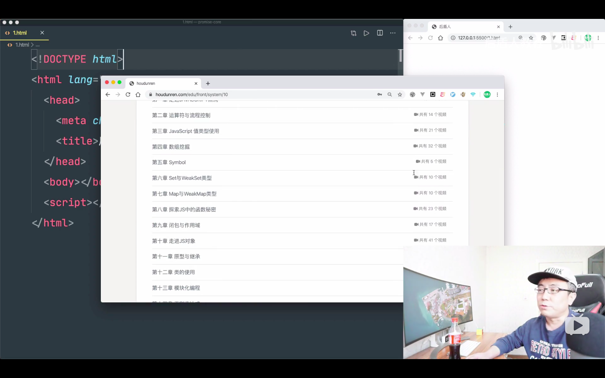

# [2. 声明Promise类并绑定This](https://www.bilibili.com/video/BV137411e7KA/?p=2&spm_id_from=pageDriver&vd_source=a7089a0e007e4167b4a61ef53acc6f7e)

# [3. 状态保护与执行者异步捕获](https://www.bilibili.com/video/BV137411e7KA/?p=3&spm_id_from=pageDriver&vd_source=a7089a0e007e4167b4a61ef53acc6f7e)

# [4. then的基础构建](https://www.bilibili.com/video/BV137411e7KA/?p=4&spm_id_from=pageDriver&vd_source=a7089a0e007e4167b4a61ef53acc6f7e)

# [5. 实现then的异步操作与异常捕获](https://www.bilibili.com/video/BV137411e7KA/?p=5&spm_id_from=pageDriver&vd_source=a7089a0e007e4167b4a61ef53acc6f7e)

# [6. Promise的PENDING状态处理](https://www.bilibili.com/video/BV137411e7KA/?p=6&spm_id_from=pageDriver&vd_source=a7089a0e007e4167b4a61ef53acc6f7e)

# [7. PENDING状态异常处理](https://www.bilibili.com/video/BV137411e7KA/?p=7&spm_id_from=pageDriver&vd_source=a7089a0e007e4167b4a61ef53acc6f7e)

# [8. PENDING的异步任务处理技巧](https://www.bilibili.com/video/BV137411e7KA/?p=8&spm_id_from=pageDriver&vd_source=a7089a0e007e4167b4a61ef53acc6f7e)

# [9. THEN链式操作原理分析](https://www.bilibili.com/video/BV137411e7KA/?p=9&spm_id_from=pageDriver&vd_source=a7089a0e007e4167b4a61ef53acc6f7e)

- then最终返回的是一个promise，所以promise状态一定要改变
- 如果之前的promise状态是拒绝的，并不会影响then新返回的promise的状态

# [10. 实现promise链式操作](https://www.bilibili.com/video/BV137411e7KA/?p=10&spm_id_from=pageDriver&vd_source=a7089a0e007e4167b4a61ef53acc6f7e)

# [11. Then增加promise异常处理](https://www.bilibili.com/video/BV137411e7KA/?p=11&spm_id_from=pageDriver&vd_source=a7089a0e007e4167b4a61ef53acc6f7e)

# [12. 实现Then的穿透传递](https://www.bilibili.com/video/BV137411e7KA/?p=12&spm_id_from=pageDriver&vd_source=a7089a0e007e4167b4a61ef53acc6f7e)

# [13. Then返回promise的处理](https://www.bilibili.com/video/BV137411e7KA/?p=13&spm_id_from=pageDriver&vd_source=a7089a0e007e4167b4a61ef53acc6f7e)

需要重新看一遍重新处理！！！

# 14. Then代码冗余优化

# 15. Promise返回类型约束

# 16. 实现Resolve和Reject

# 17. Promise的All方法实现

# 18. Promise的Race静态方法实现


# 02 函数对象

https://www.bilibili.com/video/av77292118

**区别实例对象与函数对象：**

- **函数对象：将函数作为对象使用时，简称为函数对象**

# 03 两种类型的回调函数（同步回调&异步回调）

**什么样的函数是回调函数？**

**要满足三个条件**

1. **你定义的（setTimeOut不是你定义的，就可以肯定不是回调函数）**
2. **回调函数不是我们来调用，但是最终会执行**

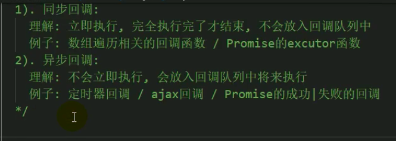

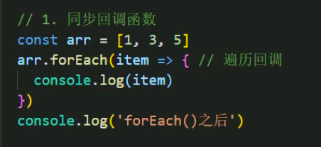

**forEach( )函数和回调函数是两个函数**

**forEach( )函数执行其实不代表回调函数执行，这是两码事**

// 运行结果 ：1 3 5 forEach（）之后 

// 所以可以得出上面的回调函数是同步回调函数

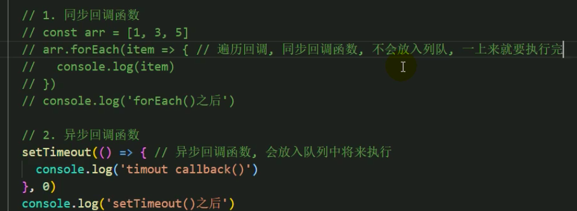

// 运行结果： setTimeout()之后  timeout callback()

 // 所以可以得出上面的回调函数是异步回调函数

# 04 Js的error处理

https://developer.mozilla.org/zh-CN/docs/Web/JavaScript/Reference/Global_Objects/Error


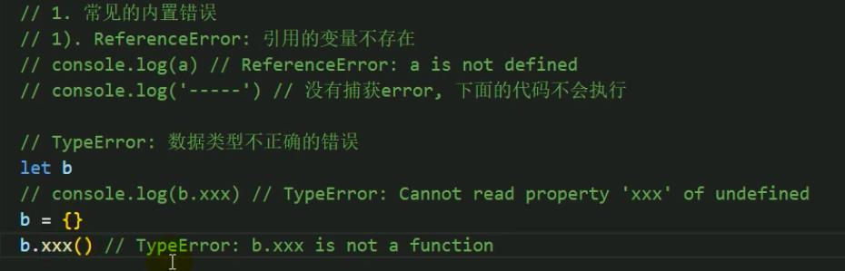

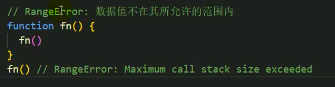

# 05 错误的处理（捕获&抛出）

 # 06 Promise的理解

1. **Promise是什么？what**

2. 1. **抽象表达（站在一个比较高的高度上面去看这个东西，去看这门技术 ）：Promise**是JS中进行异步编程的新的解决方案（旧的是谁？【纯回调形式】）

   2. **具体表达：**

   3. 1. **从语法上来说：Promise是一个构造函数（一旦是构造函数，一定是它的实例去做什么事情）**
      2. **从功能上来说：promise对象用来封装一个异步操作并可以获取其结果数据** 

3. **为什么要用Promise？why**

4. **如何使用Promise？how（语法）**

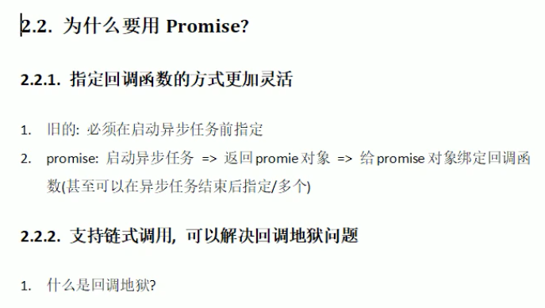

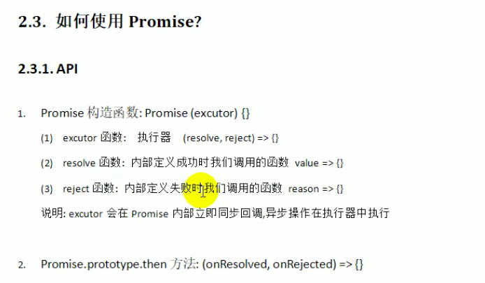

# 07 Promise的状态改变

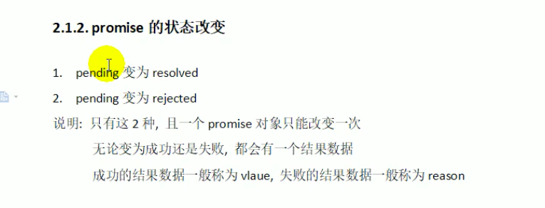

# 08 Promise的基本流程

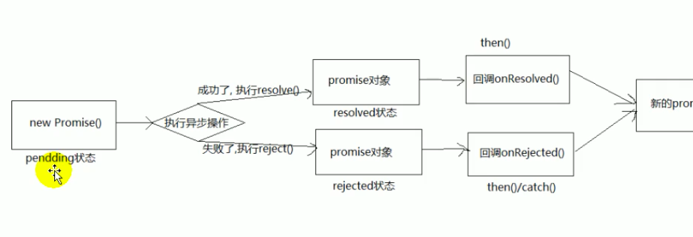

**new Promise()的时候要传一个参数**

**传一个什么类型的参数？是函数（在函数里面会启动异步任务），对象，还是数组？**

**而且 这个函数接收两个参数：resolve，reject**

# 09 Promise的基本使用

**执行器函数是同步回调** 

**执行器函数执行完， new Promise( )这个函数才结束**

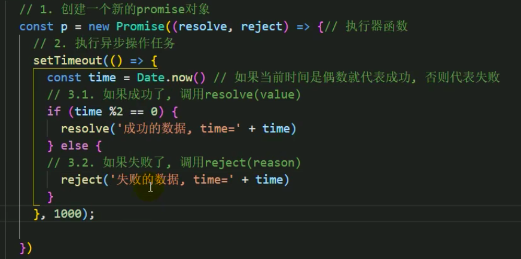

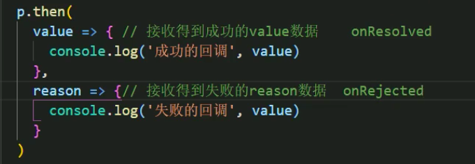

# 10 为什么要用Promise

**Promise是封装异步操作的，以前没有promise，但以前也可以用纯回调的形式去做**

## 10.1 指定回调函数的方式更加灵活

- 旧的：必须在启动异步任务前指定
- promise：启动异步任务-->返回promise对象-->给promise对象绑定回调函数（甚至可以在异步任务结束后指定/多个）

## 10.2 支持链式调用，可以解决回调地狱问题

## 10.3 以前的纯回调形式一

以前是怎么写异步的？以前是用纯回调的方式

下面代码是纯回调的形式：

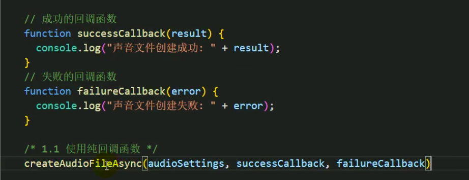

- **上述代码：异步的创建音频文件，创建音频文件要花一定的时间**
- **纯回调的形式：在你真正的去执行异步操作之前，就得指定回调函数**
-  **指定回调函数；后启动异步任务**

下面代码是Promise的形式：

**37行已经得到了promise对象，说明内部创建文件的操作已经开始了。只是没有完成。启动的操作很迅速。**

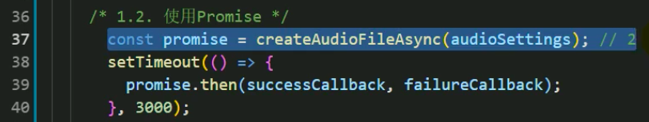

- **函数执行后返回一个promise对象**

- **异步操作在promise对象内部在执行（在执行器函数里面执行）**

- **函数内部在执行异步任务；此时此刻有指定回调函数接收成功或者失败的数据吗？****没有**

- **执行器函数是同步回调函数。**

- - **执行器函数执行完，new Promise这个函数才结束。如果现在已经得到一个Promise对象了，异步任务当然已经启动了，只是还没完成。**

- **问题：异步任务在37行执行完之后有没有执行，有没有启动起来？**

- **下面的代码是12行先打印还是26行先打印？****12行先打印    执行器函数是同步回调函数！！！！**


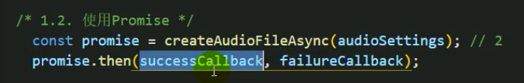

- **第一行代码已经得到了promise对象，说明内部创建文件的操作已经开始了，只是没有完成**
- **这个是在异步任务启动之后指定的回调函数，但是也是在异步任务成功之前指定的回调函数** 

- **能不能在异步任务有了结果之后再去指定回调函数？**  
- **【即假设我创建一个文件要两秒钟，但是我指定回调函数是3秒之后，请问我的回调函数能不能得到回调结果** 	**能****】**


**Promise的方式也有回调函数，但它相对于纯回调函数的优势在于：**

1. **Promise指定回调函数的方式更加灵活（灵活具体是指什么？****时间的问题****）**

2. 1. **纯回调的形式：必须在启动异步任务前指定回调函数（如果是先启动异步任务，接着指定回调函数，此时的回调已经得不到数据了，因为异步任务已经完成了）**

3. **Promise支持链式调用，可以解决回调地狱问题**

4. 1. **什么是回调地狱？？？**

   2. 1. **回调函数嵌套调用**
      2. **外部回调函数异步执行的结果是嵌套回调函数执行的条件**
      3. **回调地狱问题涉及到多个异步操作**

   3. **解决方法：Promise链式调用**

   4. **终极解决方法：async/await**

**回调地狱的代码：第二个异步任务是以第一个异步任务的结果为条件，第三个异步任务是以第二个异步任务的结果为条件**

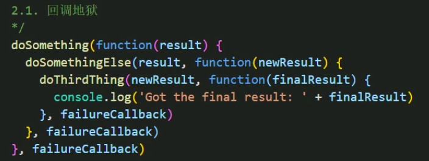

Promise解决回调地狱的代码：doSomething（）返回的是一个promise，一旦得到了一个promise，说明我得到了一个异步任务

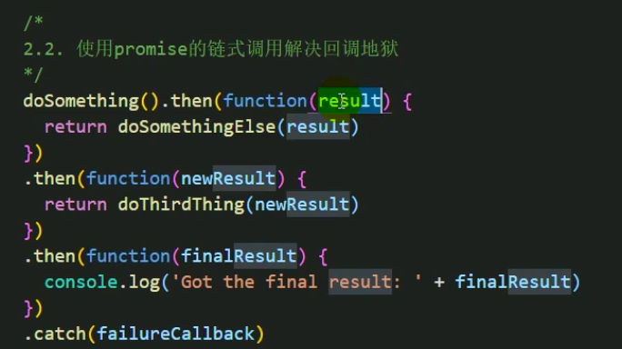

**async/await：没有回调函数了，从编码上来说，是纯粹的同步方式。**

**而promise还不是纯粹的同步的编码方式。**

**当然，async await最终是要编译的。**

**编译后的代码肯定是有回调函数的。**

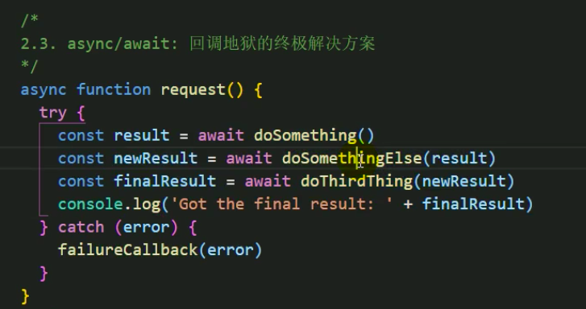

https://www.bilibili.com/video/BV1WP4y187Tu/?spm_id_from=333.337.search-card.all.click&vd_source=a7089a0e007e4167b4a61ef53acc6f7e

# 11 Promise的API说明

https://developer.mozilla.org/zh-CN/docs/Web/JavaScript/Reference/Global_Objects/Promise

https://developer.mozilla.org/zh-CN/docs/Web/JavaScript/Guide/Using_promises

- executor：执行器；

- - 什么时候要传一个执行器？

  - - new Promise的时候；

  - 执行器是什么类型？

  - - 执行器是函数类型；

  - 执行器函数接收两个参数（resolve，reject）

- all是实例对象的方法还是函数对象的方法？函数对象的方法

- then是谁的方法？then是实例对象调用

- then应该定义到哪？实例对象身上？原型对象上

- .then方法返回一个新的promise对象，这是promise链式调用的前提


- **Promise.all( )：函数对象的方法**

  ```js
  const promise1 = Promise.resolve(3);
  const promise2 = 42;
  const promise3 = new Promise(function(resolve, reject) {
    setTimeout(resolve, 100, 'foo');
  });
  
  Promise.all([promise1, promise2, promise3]).then(function(values) {
    console.log(values);
  });
  // expected output: Array [3, 42, "foo"]
  ```

- **then是谁的方法？then是由实例对象调用，所以.then( )是原型对象上的一个方法**

- **Promise.prototype.then( )：****then( ) 方法返回一个新的 promise对象——这是promise链式调用的前提。它最多需要有两个参数：Promise 的成功和失败情况的回调函数。**

- **Promise函数对象不能调用catch或then**

- **Promise.resolve(value)方法：返回一个以给定值解析后的**[**Promise**](https://developer.mozilla.org/zh-CN/docs/Web/JavaScript/Reference/Global_Objects/Promise) **实例****对象**

```js
// 产生一个成功值为1的promise对象
const promise2 = new Promise ((resolve,reject) => {
    resolve(1)
}) 
// 对上述代码的简写：产生一个成功值为123的promise对象（语法糖）
const promise1 = Promise.resolve(123);

promise1.then(function(value) {
  console.log(value);
  // expected output: 123
})

// 产生一个失败值为3的promise
const promise2 = Promise.reject(3);
```

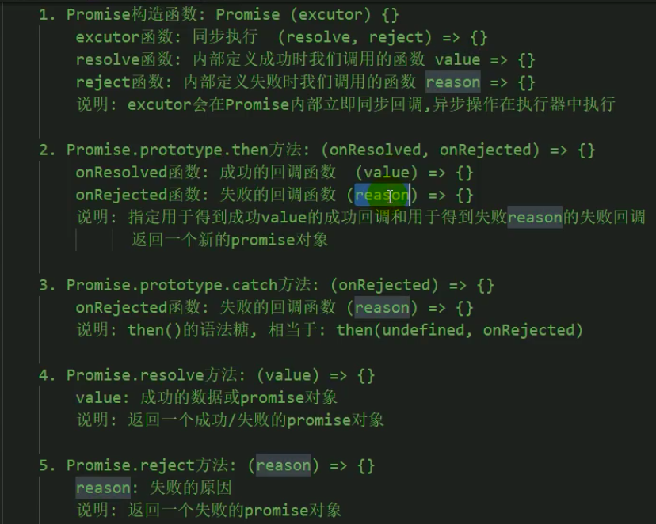

如果没有第四条或者第五条语法，其实我们也是可以通过new的方式来去产生成功的promise或者失败的promise对象，但是那种写法写代码更加麻烦一些，所以才设置了简洁语法

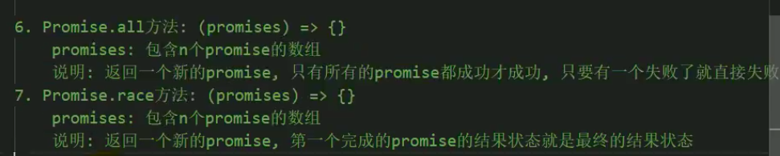

# ！35 async await

https://developer.mozilla.org/zh-CN/docs/Web/JavaScript/Reference/Statements/async_function 

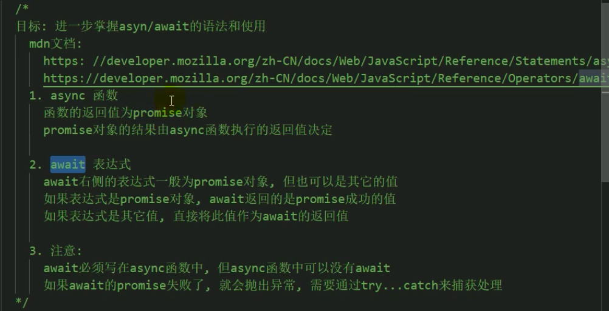

**async函数**

**await表达式**

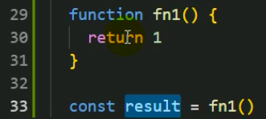

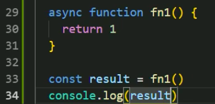

控制台输出结果：Promise { 1 }

浏览器输出结果：

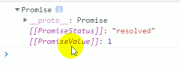

**async函数的返回值就是一个promise对象**

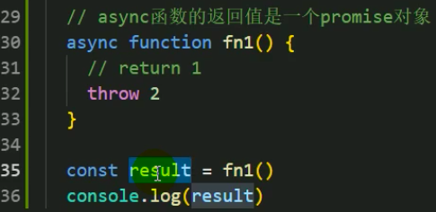

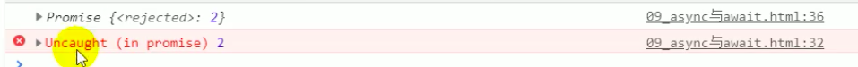

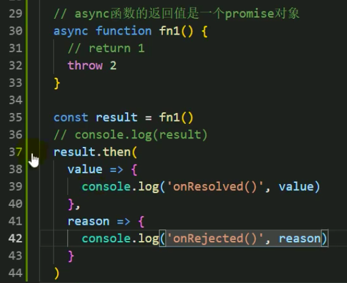


async函数返回的promise结果由函数执行的结果决定

**这里返回的都是一个立即成功或者立即失败的promise**

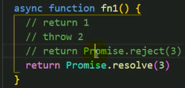

**能不能返回一个延迟成功或者延迟失败的呢？**

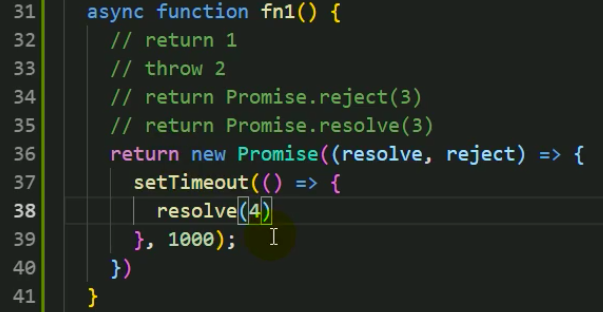

**await右边是一个表达式**

如果就这么写，那么下一步如果想要取到2那个结果，就需要.then才能取到，

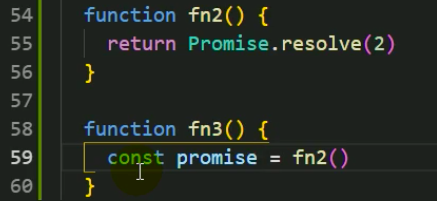

不想用.then去获取，想直接得到value值：在表达式左边加await

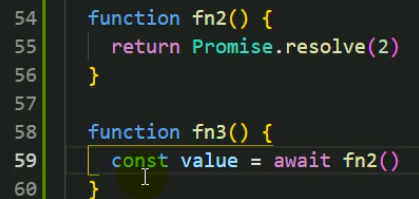

await必须写在async函数中，这里fn3应该是少了async

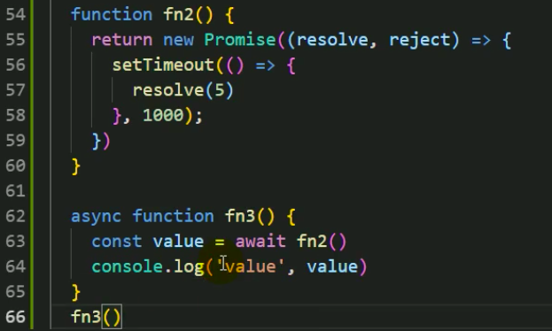

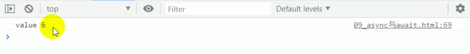

这个value 6哪里来的啊？？？还要看一下视频！！！


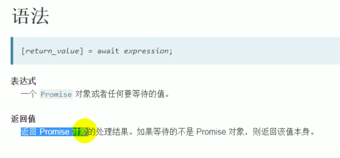


在async和await里面，想得到promise失败的结果，需要用try catch语法

await只能得到成功的结果

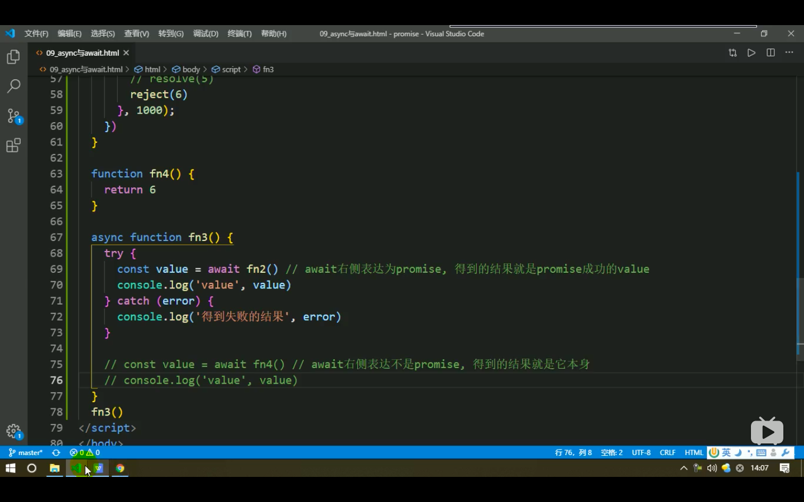


