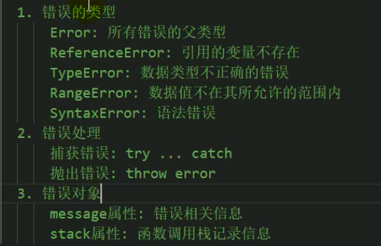

# [1. 课程介绍](https://www.bilibili.com/video/BV137411e7KA?from=search&seid=14305473709681939388)

核心：Promise是用来封装异步操作的！！！


# [2. 声明Promise类并绑定This](https://www.bilibili.com/video/BV137411e7KA/?p=2&spm_id_from=pageDriver&vd_source=a7089a0e007e4167b4a61ef53acc6f7e)

# [3. 状态保护与执行者异步捕获](https://www.bilibili.com/video/BV137411e7KA/?p=3&spm_id_from=pageDriver&vd_source=a7089a0e007e4167b4a61ef53acc6f7e)

# [4. then的基础构建](https://www.bilibili.com/video/BV137411e7KA/?p=4&spm_id_from=pageDriver&vd_source=a7089a0e007e4167b4a61ef53acc6f7e)

# [5. 实现then的异步操作与异常捕获](https://www.bilibili.com/video/BV137411e7KA/?p=5&spm_id_from=pageDriver&vd_source=a7089a0e007e4167b4a61ef53acc6f7e)

# [6. Promise的PENDING状态处理](https://www.bilibili.com/video/BV137411e7KA/?p=6&spm_id_from=pageDriver&vd_source=a7089a0e007e4167b4a61ef53acc6f7e)

# [7. PENDING状态异常处理](https://www.bilibili.com/video/BV137411e7KA/?p=7&spm_id_from=pageDriver&vd_source=a7089a0e007e4167b4a61ef53acc6f7e)

# [8. PENDING的异步任务处理技巧](https://www.bilibili.com/video/BV137411e7KA/?p=8&spm_id_from=pageDriver&vd_source=a7089a0e007e4167b4a61ef53acc6f7e)

# [9. THEN链式操作原理分析](https://www.bilibili.com/video/BV137411e7KA/?p=9&spm_id_from=pageDriver&vd_source=a7089a0e007e4167b4a61ef53acc6f7e)

- then最终返回的是一个promise，所以promise状态一定要改变
- 如果之前的promise状态是拒绝的，并不会影响then新返回的promise的状态

# [10. 实现promise链式操作](https://www.bilibili.com/video/BV137411e7KA/?p=10&spm_id_from=pageDriver&vd_source=a7089a0e007e4167b4a61ef53acc6f7e)

# [11. Then增加promise异常处理](https://www.bilibili.com/video/BV137411e7KA/?p=11&spm_id_from=pageDriver&vd_source=a7089a0e007e4167b4a61ef53acc6f7e)

# [12. 实现Then的穿透传递](https://www.bilibili.com/video/BV137411e7KA/?p=12&spm_id_from=pageDriver&vd_source=a7089a0e007e4167b4a61ef53acc6f7e)

# [13. Then返回promise的处理](https://www.bilibili.com/video/BV137411e7KA/?p=13&spm_id_from=pageDriver&vd_source=a7089a0e007e4167b4a61ef53acc6f7e)

需要重新看一遍重新处理！！！

# 14. Then代码冗余优化

# 15. Promise返回类型约束

# 16. 实现Resolve和Reject

# 17. Promise的All方法实现

# 18. Promise的Race静态方法实现

# [1 课程介绍](https://www.bilibili.com/video/av77292118)

# [2 函数对象与实例对象](https://www.bilibili.com/video/av77292118/?p=2&spm_id_from=pageDriver&vd_source=a7089a0e007e4167b4a61ef53acc6f7e)

区别实例对象与函数对象：

- 函数对象：将函数作为对象使用时，简称为函数对象
- 实例对象：new 函数产生的对象，简称为对象

# [3 两种类型的回调函数（同步回调&异步回调）](https://www.bilibili.com/video/av77292118/?p=3&spm_id_from=pageDriver&vd_source=a7089a0e007e4167b4a61ef53acc6f7e)

什么样的函数是回调函数？要满足三个条件

1. 你定义的（setTimeOut不是你定义的，就可以肯定不是回调函数）
2. 回调函数不是我们来调用，但是最终会执行

|  |  |
| ------------------------------------------------------------ | ------------------------------------------------------------ |

forEach( )函数和回调函数是两个函数

forEach( )函数执行其实不代表回调函数执行，这是两码事

运行结果 ：1 3 5 forEach（）之后 

/所以可以得出上面的回调函数是同步回调函数


 运行结果： setTimeout()之后  timeout callback()

 所以可以得出上面的回调函数是异步回调函数

# [4 Js的error处理](https://www.bilibili.com/video/av77292118/?p=4&spm_id_from=pageDriver&vd_source=a7089a0e007e4167b4a61ef53acc6f7e)

https://developer.mozilla.org/zh-CN/docs/Web/JavaScript/Reference/Global_Objects/Error

|  |  |
| ------------------------------------------------------------ | ------------------------------------------------------------ |


# 5 错误的处理（捕获&抛出）

 # [6. Promise的理解](https://www.bilibili.com/video/av77292118/?p=6&spm_id_from=pageDriver&vd_source=a7089a0e007e4167b4a61ef53acc6f7e)

## 1. Promise是什么

**抽象表达（站在一个比较高的高度上面去看这个东西，去看这门技术 ）**

- **Promise**是JS中进行异步编程的新的解决方案（旧的是谁？【纯回调形式】）

**具体表达：**

- **从语法上来说：Promise是一个构造函数（一旦是构造函数，一定是它的实例去做什么事情）**
- **从功能上来说：promise对象用来封装一个异步操作并可以获取其结果数据** 

## 2. 为什么要用Promise

## 3. 如何使用Promise


# [7 Promise的状态改变](https://www.bilibili.com/video/av77292118/?p=7&spm_id_from=pageDriver&vd_source=a7089a0e007e4167b4a61ef53acc6f7e)


# [8. Promise的基本运行流程](https://www.bilibili.com/video/av77292118/?p=8&spm_id_from=pageDriver&vd_source=a7089a0e007e4167b4a61ef53acc6f7e)


new Promise()的时候要传一个参数

传一个什么类型的参数？是函数（在函数里面会启动异步任务），对象，还是数组？

而且 这个函数接收两个参数：resolve，reject

# [9. Promise的基本使用](https://www.bilibili.com/video/av77292118/?p=9&spm_id_from=pageDriver&vd_source=a7089a0e007e4167b4a61ef53acc6f7e)

**执行器函数是同步回调** 

**执行器函数执行完， new Promise( )这个函数才结束**

|  |  |
| ------------------------------------------------------------ | ------------------------------------------------------------ |

# [10. 为什么要用Promise](https://www.bilibili.com/video/av77292118/?p=10&spm_id_from=pageDriver&vd_source=a7089a0e007e4167b4a61ef53acc6f7e)

**Promise是封装异步操作的，以前没有promise，但以前也可以用纯回调的形式去做**

## 1. 指定回调函数的方式更加灵活

- 旧的：必须在启动异步任务前指定
- promise：启动异步任务-->返回promise对象-->给promise对象绑定回调函数（甚至可以在异步任务结束后指定/多个）

## 2. 支持链式调用，可以解决回调地狱问题

## 3. 以前的纯回调形式一

以前是怎么写异步的？以前是用纯回调的方式

|                    以前用纯回调函数的方式                    |                     现在用promise的方式                      |
| :----------------------------------------------------------: | :----------------------------------------------------------: |
|  |  |
|   上述代码：异步的创建音频文件，创建音频文件要花一定的时间   | 37行已经得到了promise对象，说明内部创建文件的操作已经开始了。只是没有完成。启动的操作很迅速 |
| 纯回调的形式：在你真正的去执行异步操作之前，就得指定回调函数 |                函数执行后返回一个promise对象                 |
|                先指定回调函数；后启动异步任务                |   异步操作在promise对象内部在执行（在执行器函数里面执行）    |
|                                                              | 函数内部在执行异步任务；此时此刻有指定回调函数接收成功或者失败的数据吗？没有 |

- 执行器函数是同步回调函数
  - 执行器函数执行完，new Promise这个函数才结束。如果现在已经得到一个Promise对象了，异步任务当然已经启动了，只是还没完成
- 问题：异步任务在37行执行完之后有没有执行，有没有启动起来？


- 第一行代码已经得到了promise对象，说明内部创建文件的操作已经开始了，只是没有完成
- 这个是在异步任务启动之后指定的回调函数，但是也是在异步任务成功之前指定的回调函数

- 能不能在异步任务有了结果之后再去指定回调函数？  
  - 即假设创建一个文件要两秒钟，但是指定回调函数是3秒之后，请问回调函数能不能得到回调结果
  - 能


Promise的方式也有回调函数，但它相对于纯回调函数的优势在于：

- Promise指定回调函数的方式更加灵活（灵活具体是指什么？时间的问题）
  - 纯回调的形式：必须在启动异步任务前指定回调函数。如果是先启动异步任务，接着指定回调函数，此时的回调已经得不到数据了，因为异步任务已经完成了。

- Promise支持链式调用，可以解决回调地狱问题


什么是回调地狱？

1. 回调函数嵌套调用
2. 外部回调函数异步执行的结果是嵌套回调函数执行的条件
3. 回调地狱问题会涉及到多个异步操作


解决方法：Promise链式调用

终极解决方法：async/await


|                        回调地狱的代码                        |                  Promise解决回调地狱的代码                   |
| :----------------------------------------------------------: | :----------------------------------------------------------: |
| 第二个异步任务是以第一个异步任务的结果为条件，第三个异步任务是以第二个异步任务的结果为条件 | doSomething（）返回的是一个promise，一旦得到了一个promise，说明我得到了一个异步任务 |
|  |  |


async/await：没有回调函数了，从编码上来说，是纯粹的同步方式

而promise还不是纯粹的同步的编码方式

当然，async await最终是要编译的

编译后的代码肯定是有回调函数的


https://www.bilibili.com/video/BV1WP4y187Tu/?spm_id_from=333.337.search-card.all.click&vd_source=a7089a0e007e4167b4a61ef53acc6f7e

# [11. Promise的API说明](https://www.bilibili.com/video/av77292118/?p=11&spm_id_from=pageDriver&vd_source=a7089a0e007e4167b4a61ef53acc6f7e)

https://developer.mozilla.org/zh-CN/docs/Web/JavaScript/Reference/Global_Objects/Promise

https://developer.mozilla.org/zh-CN/docs/Web/JavaScript/Guide/Using_promises

- executor：执行器；
- 什么时候要传一个执行器
  - new Promise的时候
- 执行器是什么类型？  
  - 执行器是函数类型；
  - 执行器函数接收两个参数（resolve，reject）
- all是实例对象的方法还是函数对象的方法？函数对象的方法
- then是谁的方法？then是实例对象调用
- then应该定义到哪？实例对象身上？原型对象上
- then方法返回一个新的promise对象，这是promise链式调用的前提


- Promise.all( )：函数对象的方法

  ```js
  const promise1 = Promise.resolve(3);
  const promise2 = 42;
  const promise3 = new Promise(function(resolve, reject) {
    setTimeout(resolve, 100, 'foo');
  });
  
  Promise.all([promise1, promise2, promise3]).then(function(values) {
    console.log(values);
  });
  // expected output: Array [3, 42, "foo"]
  ```

- then是谁的方法？then是由实例对象调用，所以.then( )是原型对象上的一个方法

- Promise.prototype.then( )：then( ) 方法返回一个新的 promise对象——这是promise链式调用的前提。它最多需要有两个参数：Promise 的成功和失败情况的回调函数

- Promise函数对象不能调用catch或then

- Promise.resolve(value)方法：返回一个以给定值解析后的[Promise](https://developer.mozilla.org/zh-CN/docs/Web/JavaScript/Reference/Global_Objects/Promise) 实例对象

```js
// 产生一个成功值为1的promise对象
const promise2 = new Promise ((resolve,reject) => {
    resolve(1)
}) 
// 对上述代码的简写：产生一个成功值为123的promise对象（语法糖）
const promise1 = Promise.resolve(123);

promise1.then(function(value) {
  console.log(value);
  // expected output: 123
})

// 产生一个失败值为3的promise
const promise2 = Promise.reject(3);
```


如果没有第四条或者第五条语法，其实我们也是可以通过new的方式来去产生成功的promise或者失败的promise对象，但是那种写法写代码更加麻烦一些，所以才设置了简洁语法


# [12. Promise的API使用1](https://www.bilibili.com/video/av77292118/?p=12&spm_id_from=pageDriver&vd_source=a7089a0e007e4167b4a61ef53acc6f7e)

# [13. Promise的API使用2](https://www.bilibili.com/video/av77292118/?p=13&spm_id_from=pageDriver&vd_source=a7089a0e007e4167b4a61ef53acc6f7e)

# [14. Promise的几个关键问题](https://www.bilibili.com/video/av77292118/?p=14&spm_id_from=pageDriver&vd_source=a7089a0e007e4167b4a61ef53acc6f7e)

`如何改变promise的状态`

- resolve(value)
- reject(reason)
- **抛出异常，状态会变成rejected（通常这一点容易被忽略）**


`一个Promise指定多个成功/失败回调函数，都会调用吗？——都会被调用`

```js
let p = new Promise((resolve, reject) => {
    resolve(1);
})
p.then(value => {
    console.log('value:', value);
})
p.then(value => {
    console.log('value2:', value);
})


let p2 = new Promise((resolve, reject) => {
    reject(2);
})
p2.catch(reason => {
    console.log('reason:', reason);
})
p2.catch(reason => {
    console.log('reason2:', reason);
})

// 输出：
// value: 1
// value2: 1 
// reason: 2 
// reason2: 2
```


`.then是同步执行的。.then函数和.then的回调函数是两码事`


# 35 async await

https://developer.mozilla.org/zh-CN/docs/Web/JavaScript/Reference/Statements/async_function 


**async函数**

**await表达式**


控制台输出结果：Promise { 1 }

浏览器输出结果：


**async函数的返回值就是一个promise对象**


async函数返回的promise结果由函数执行的结果决定

**这里返回的都是一个立即成功或者立即失败的promise**


**能不能返回一个延迟成功或者延迟失败的呢？**


**await右边是一个表达式**

如果就这么写，那么下一步如果想要取到2那个结果，就需要.then才能取到，


不想用.then去获取，想直接得到value值：在表达式左边加await


await必须写在async函数中，这里fn3应该是少了async


这个value 6哪里来的啊？？？还要看一下视频！！！


在async和await里面，想得到promise失败的结果，需要用try catch语法

await只能得到成功的结果


