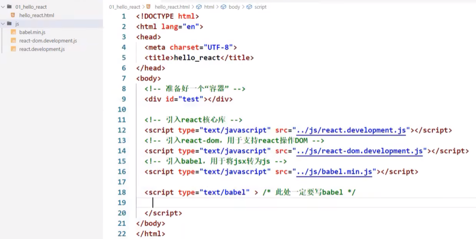
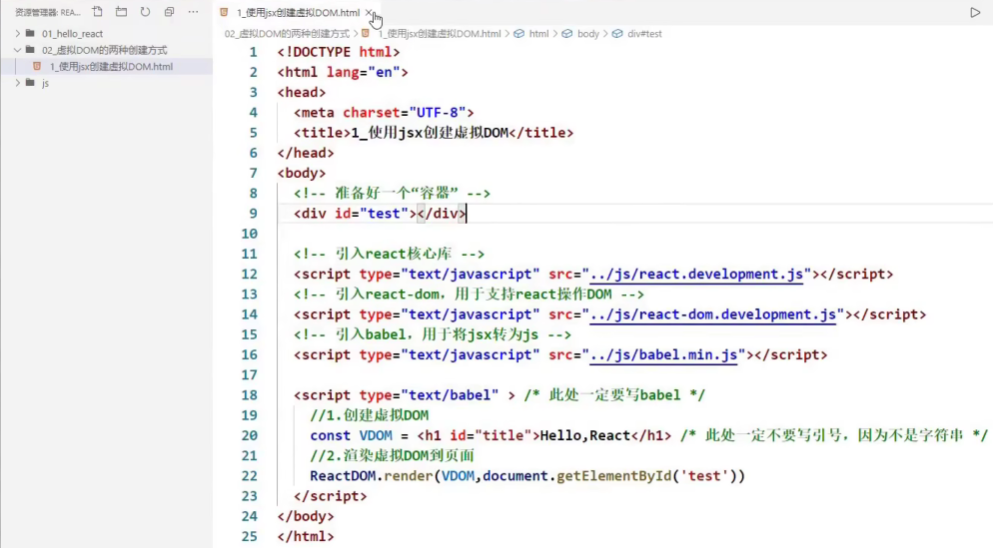
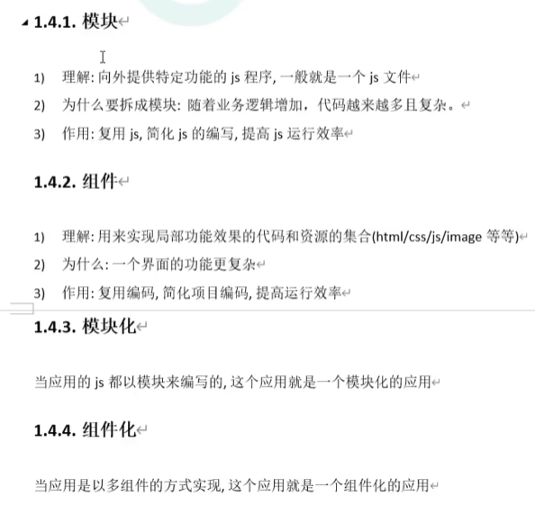

https://www.bilibili.com/video/BV1wy4y1D7JT?from=search&seid=1655099700202851743#

# 一 React简介


# 二 Hello React案例

 

React工具：https://fb.me/react-devtools

# 三 虚拟DOM的两种创建方式

- [ ] 为什么不用原生的js，非要用jsx？

- [ ] React官方为什么要出jsx语法？

  创建虚拟dom太繁琐了，有了jsx，编码人员可以更简单的创建虚拟dom

**1.使用jsx创建虚拟DOM：**



**2.用js创建虚拟DOM：**


# 五 JSX语法规则


# 六 jsx小练习


==**规律：如果给React传了一个数组，React会自动遍历该数组**==

什么是表达式？什么是语句？


# 七 组件与模块



# 八 开发者工具的安装

# 九 函数式组件

两种：

1. ==函数式组件==：适用于简单组件的定义

2. ==类式组件==：


```react
// 1.创建函数式组件
function demo () {
    return <h2>我是用函数定义的组件（适用于简单组件的定义）</h2>
}
// 2.渲染组件到页面
ReactDOM.render(demo, document.getElementById('test'));
```

报错：函数类型式不能作为react的节点的


```react
// 1.创建函数式组件
function demo () {
    return <h2>我是用函数定义的组件（适用于简单组件的定义）</h2>
}
// 2.渲染组件到页面
ReactDOM.render(<demo/>, document.getElementById('test'));

// 报错：
Warning:The tag <demo> is unrecognized in this browser.If you meant to render a React component, start its name with an uppercase letter
```


```react
<script type="text/babel">
    // 1.创建函数式组件
    function Demo () {
        console.log(this); // undefined 因为代码经过babel（将jsx转为js）的翻译，babel开启了严格模式。严格模式最大的特点就是：禁止自定义的函数里面的this指向window
        return <h2>我是用函数定义的组件（适用于简单组件的定义）</h2>
    }
    // 2.渲染组件到页面
    ReactDOM.render(<Demo/>,document.getElementById('test'));
</script>
```


# 十 复习类相关的基本知识


问题：speak方法放在了哪里？——Person类的原型对象上，供实例使用


